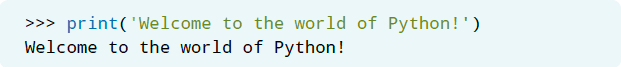

# Python是什么？

欢迎来到Python编程的世界！当你打开了这本书，你也就打开了使用代码来创建无限可能性的世界。Python是一门适合初学者的编程语言，通常来说它的语法结构和英语比较相似。

那么，你可以用Python来做什么呢？Python可以被用来指挥机器人的各种行为，也可以向人工智能（AI）助手发出各种命令。通过Python，你可以把一些像是提醒你每天遛狗，或是每周向社区发送电子通讯这类的日常工作进行自动化。你可以使用它来创建博客，构建Instagram这样的社交媒体应用，甚至可以制作出属于你自己的冒险游戏。除此之外，学习Python也是探索一些更高级概念的基础，它们包括：Web开发、应用程序接口（API）的数据集成、区块链技术、数据科学以及AI（例如：计算机视觉、机器学习和自然语言处理等等）。通过Python能够完成的事情是无止境的！

## 这本书的格式是怎样的？

这本书是为真正的初学者而写的。从来没有写过任何代码？没问题！本书将会从编程的基础知识开始，从而帮助你为Python奠定坚实的基础。

这本书里的章节是循序渐进的。如果你从未编写过任何Python代码，那么请按照书里各个章节的顺序来进行阅读。下面这个小节将会向你解释在之后的各个章节里会用到的内容。

### 语法

*语法*（*Syntax*）被用来表示编写代码时需要遵循的一组规则。在为新的概念引入语法时，那些你需要修改的单词会以斜体进行显示。

### 代码块

在书里，会通过*代码块*（*Code Blocks*）来向你展现代码示例。在代码块出现时，它会显示为：



> 如果想要打印中文问候语的话：
> ```Python
> >>> print('欢迎来到Python世界！')
> 欢迎来到Python世界！
> ```

我们非常欢迎你把代码块里编写的代码复制到代码编辑器里，从而对各个示例进行尝试。除此之外，你可能已经注意到了代码块里的某些单词是彩色的，这被称为*语法高亮*（*syntax highlighting*）。语法高亮是非常有用的一项功能，它可以帮你了解代码里的各个语法元素。

### 小测验

每一章里的小测验都可以帮助你加深那个部分的知识，从而能够让你充满信心地继续向后学习。小测验会以问题的样式来进行显示，会包含选择题、匹配题、以及填空题。你可以在附录《小测验答案》里找到所有小测验的答案。

### 项目

在学习完书里的一个章节之后，你将会通过项目来练习你所学到的知识。每个项目都需要你编写自己的Python程序。*程序*（*Program*）是指储存在文件里的、可以用来运行并完成一定任务的一些命令的集合。这些项目的存在是为了能够让你使用在当前以及之前各章里获得的知识。我们也为各个项目都提供了如何去完成它的非常详细的说明。你也可以在Wiley的网站上找到所有项目文件的代码，网址为：[www.wiley.com/go/bitesizepython](https://www.wiley.com/go/bitesizepython)。

非常欢迎你使用这本书里的项目来构建出更有用的Python程序。当你更深入地了解了如何去使用Python，你就会发现自己有了更多的意愿去做开发。把书里的项目作为蓝本，去实现你的想法把！
