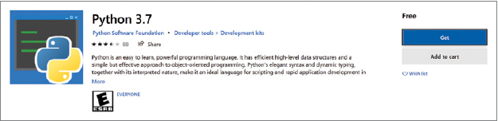
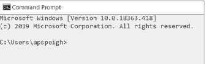
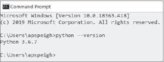
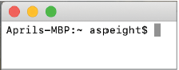
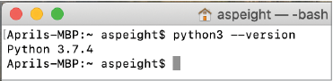

# 安装Python

你可能已经给自己打好了气：“Python听起来很酷，我已经准备好编写代码了！”但是，你首先需要安装Python的最新版本，才能在计算机上通过这门语言进行各种操作。准备好了吗？我们开始吧！

## 下载Python

下面的部分会基于你可能使用的不同操作系统平台，来介绍如何去下载Python。

### Windows平台

如果你使用的是运行Windows操作系统的计算机，那么就可以从Microsoft Store（微软应用商店）里下载Python。请在搜索栏里输入**Python**并选择这门语言的最新版本。

> 译者注：图是英文的，需要一台中文Windows电脑来重新截图。

在**概述**标签页里提供了有关这门语言的其他信息。如果你并不确定你的计算机是否满足安装Python的前提条件，请查看**系统要求**标签页里的内容。如果一切都很正常，请点击**获取**按钮开始下载。

下载完成后，请按照安装向导里的说明来安装Python。在安装向导开始的时候，请确保选中“**将Python 3.7添加到PATH**”（**Add Python 3.7 To PATH**）[^1]复选框（版本号会根据你选择的版本而有所不同）。

> [^1]: 译者注：安装向导的界面有可能是英文的，因此同时保留了中英文两个版本。

### Unix平台（macOS或是Linux）

如果你使用的是Mac或是运行Linux操作系统的计算机，那么你的计算机里可能已经安装了老版本的Python。当使用这些老版本的Python（Python 2.x或更早版本）来完成书里的练习时，你会遇到各种问题。因此，请访问[www.python.org](https://www.python.org/)来下载并安装Python的最新版本。

下载完成后，请按照安装向导里的说明来安装Python。

## 查看Python的版本

当成功安装Python之后，你可以通过*终端*（*terminal*）来查看它的版本信息。*终端*是一个可以用来和计算机进行交流的程序。在终端里，你可以输入*命令*（*Command*），也就是各种能够计算机遵循的操作。如果计算机不知道你输入的命令，它会以错误消息作为回应。

### Windows平台

在Windows平台上，你可以使用*命令提示符*（*Command Prompt*）窗口（它也是一个终端）来查看你所安装的Python的版本。你可以通过搜索命令提示符应用程序来打开终端。

*命令提示符*窗口在启动后会加载一些默认信息。在默认信息下方，你会看到一个以闪烁的线作为结尾的行字符。这个闪烁的线，也被称为*文本光标*（*text cursor*）。它被用来表示终端已准备就绪，可以接受输入的命令了。

要想查看已经安装的Python版本，请输入命令`python --version`[^2]并按回车键。

> [^2]: 译者注：原文为`python3 --version`，与图中的命令不符。同时按照前一节的安装流程，Windows里不会同时存在多个版本的Python，因此`python --version`才是正确的命令

如果显示出的Python安装版本是3.x或更高版本，那么你就可以开始编写代码了！

### Unix平台

在Mac或运行Linux的计算机上，搜索*终端*（*ternimal*）来打开终端窗口。

终端在启动后会加载一些默认信息。在默认信息下方，你会看到一个以`$`符号结尾的行。这个符号（也就是*文本光标*）被用来表示终端已经准备就绪，可以接受输入的命令了。

要想查看已经安装的Python版本，请输入命令`python3 --version`[^3]并按回车键。

[^3]: 译者注：原文为`python --version`，与图中的命令不符。同时按照前一节的安装流程，Unix里会同时存在多个版本的Python，因此`python3 --version`才是正确的命令

如果显示出的Python安装版本是3.x或更高版本，那么你就可以开始编写代码了！
