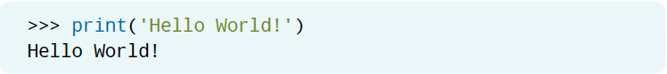

# IDLE

在用Python来编写代码时，你需要在一个会读取并运行Python的程序里，进行代码的编写和执行，而这个程序。在上一章里已经向你介绍过的终端就是这样一个程序。虽然你可以在终端里进行编码，但我们在之后的内容里会使用的是被称为*集成开发环境*（*integrated development environment*，IDE）的程序。IDE是一个功能强大的程序，它把各种有用的编码工具都整合到了一起，从而可以让你能够更高效地进行编码！虽然互联网上有许许多多的IDE可以下载，但我们将使用Python自带的IDE，它被称为：IDLE。

## 什么是IDLE？

你可以在被命名为*IDLE*的Python自带的IDE里编写和运行Python代码。不论是在Windows还是在Unix平台上，你都可以使用IDLE，这是因为这个IDE在各个平台上的工作原理都是基本相同的。

IDLE有一些很有用的可以在你编写代码时提供帮助的功能。

* 为代码提供语法高亮
* 自动补全
* 多窗口文本编辑器
* 智能缩进
* 调用提示
* 命令历史

这些功能可能对目前的你来说并不知道是什么意思。没关系，在后续章节里将会向你介绍每种功能的魔力。

## IDLE介面

乍一看，你可能会觉得IDLE还是有点像上一章里提到的终端。虽然不论是终端还是IDLE，你都可以在里面输入命令，但是IDLE的界面里还有一些其他功能，而这些功能在你尝试完成书里的练习时会有所帮助。


* **Python版本** Python的版本会显示在IDLE窗口的顶部。

* **Python Shell窗口** 这里是你键入、阅读以及运行Python代码的地方。Python Shell窗口也称为*解释器*（*interpreter*）。

* **文本光标** 文本光标通过不断地闪烁，来告诉你能不能在解释器里输入新的命令或是代码行。如果文本光标没有闪烁，那么你的计算机很有可能还没有完成你之前让它运行的命令。这种情况下，请先给IDLE一些时间来完成你之前的命令，再输入新的内容。

* **IDLE菜单** IDLE的菜单里有很多选项。当你尝试书里的练习时，就会发现IDLE的菜单会发生变化。IDLE里同时包含有Shell窗口和Editor窗口，而这些菜单项会根据你使用的窗口类型而发生改变。

## 在IDLE里运行代码

先让我们来简单的试试看IDLE吧！首先，看一看你的文本光标有没有闪烁。如果你的文本光标正在闪烁，那么就在解释器里键入`print('Hello World!')`，然后按回车键。



祝贺你！你刚刚编写并运行了你的第一行Python代码！所以，刚刚到底发生了什么？这其实是，你输入的代码告诉了Python，把被引号括起来的文本打印出来。接下来，试试看编写另一行相似的代码。但是，在新的这行代码里，请把`Hello World!`替换为另一句话。别忘了在句子的两边加上引号，不然当你按了回车键之后，解释器会返回一个错误信息。


> 如果想要打印中文的话：
> ```Python
> print('Python真棒！')
> Python真棒！
> ```

要运行Python代码，有两件非常重要的事情需要记住。第一，Python代码是从上到下运行的。也就是说，会优先运行出现在程序最上方的代码，因此最后最后一行代码会在最后被运行。

第二，Python语言是基于适当的缩进而组成的。在本书后面部分的代码示例里，你就会注意这种缩进。幸运的是，IDLE会自动为你提供缩进。但是，你自己也应该时刻知道你的代码应该缩进多少。在需要手动缩进代码时，可以使用空格键或者键盘上的制表符（Tab）键。

## 创建并运行文件

每当你在IDLE里按回车键时，解释器都会检查是否需要运行这行代码。但是，如果你编写的是一个包含各种逻辑的比较长的程序，那么这个装检测的步骤就现得有些多余了。通常来说，你会创建一个程序，在编写代码时修改它的逻辑，然后通过运行这个程序来进行测试。但是，如果你是在解释器里创建整个程序的话，那么要修改程序的一部分逻辑就非常不方便了。

好在你可以在IDLE里创建一个文件，并且只有当你去运行这个文件时才会执行它。你可以根据需要对这个程序进行任何修改，也可以把这个程序保存起来，从而方便以后来访问它。这也正是在解释器里直接进行编码和在IDLE里创建一个新文件（然后在解释器里运行）之间的重要区别。输入到解释器里的内容并不会被保存起来。所以，如果想要创建一个可以以后使用的程序，你需要在IDLE里创建一个新文件，并在关闭IDLE之前保存这个程序。

要在IDLE里创建一个新文件，请单击**文件**（**File**）菜单，然后单击**新文件**（**New File**）。要保存这个新文件，可以通过单击**文件**菜单，然后单击**另存为**（**Save As**）。弹出对话框后，你就可以把这个文件保存到计算机里一个你能记得的位置了，同时把这个文件命名为与文件里的程序相关的名称。需要注意在对话框里的**另存为类型**一定得是Python文件。这样做的好处是会使用Python的扩展名`.py`来保存文件。这个扩展名会告诉计算机它是一个Python文件，因此这个文件里的程序只能用Python编程语言来运行。为文件取好名字后，单击**保存**（**Save**）按钮。


要运行在文件里的程序，请单击屏幕顶部的**运行**（**Run**）菜单，然后选择**运行模块**（**Run Module**）。每次执行运行模块时，IDLE都会检查并确保文件被保存了。你也可以使用键盘快捷键**CTRL + S**或是**Command + S**[^1]来保存文件。接下来，让我们在IDLE里创建一个新文件从而练习这个过程吧！创建一个新文件并将它保存为**hello_world.py**文件。

> [^1]: 译者注：原文为：“你也可以使用键盘快捷键**CTRL + S**或是**Command + X**来保存文件”。在Mac电脑里，快捷键是**Command + S**.


在文件的第一行，输入**print('Hello World!')**，然后保存文件。


单击屏幕顶部的**运行**菜单，然后选择**运行模块**。这时，在你启动IDLE时就会打开的那个解释器窗口就会出现，并且运行在**hello_ world.py**文件里的代码。


如果你之前不小心关掉了解释器窗口，那么在选择**运行模块**后，将会打开一个全新的解释器窗口并且运行在文件里的程序。

这本书里的所有项目都会要求你创建一个全新的文件。如果在那时，你发现你忘记了如何在IDLE里创建并运行文件，可以返回到这一章来作为复习。

除了打印出一句话之外，我们还可以通过解释器和Python来完成更多的事情。现在，既然你已经了解了如何在IDLE里编写和运行Python代码，那么就让我们来释放出Python编码的魔力吧！
