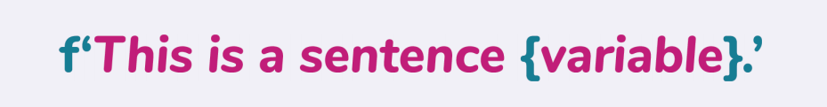

# 变量

你最喜欢的颜色是什么？如果你还能记得上一章的内容，那么你就知道可以通过`print()`来让IDLE输出任何你所希望的句子。要不要试试看怎么把你最喜欢的颜色在解释器里打印出来？


> 如果想要打印中文的话：
> ```Python
> print('蓝色')
> 蓝色
> ```

接下来，如果要你把最喜欢的颜色连续打印五次，应该怎么做呢？一种办法是创建五个包含你最喜欢的颜色的`print()`语句。虽然这样做也能够完成需求，但是这样一遍又一遍地键入自己最喜欢的颜色总会让你觉得会非常无聊，甚至还可能会一不小心把自己最喜欢的颜色拼错了。

那么，如果是要你把最喜欢的颜色打印20次甚至100次呢？当然了，不断地输入相同的代码行也是可以完成这个需求的，但是我们有另一种更好的方法可以在你的代码里重复使用相同的单词或是一段相同的短语。

## 什么是变量？

*变量*（*variable*）是一个用来代表某个值的名称，这个值可以是一个数字或者是一段文本（被称为*字符串*（*string*））。


在创建变量的时候，你需要选择一个唯一的、特定的、以及和值相关的名称，而且这个名称不能以数字或特殊字符作为开头。同时，这个名称也应该避免那些已经在Python中提供功能的的关键字。如果你要想知道Python的关键字有哪些的话，可以访问[docs.python.org/3/reference/lexical_analysis.html#keywords](https://docs.python.org/3/reference/lexical_analysis.html#keywords)。

下面的图里展示了一些你可以用来当做变量名的例子。变量名可以是一个单词，也可以包含下划线。你也可以创建一个除了第一个单词之外的每个单词首字母都大写的变量名，这种命名方法被称为*驼峰式命名法*（*camelCasing*）。


在为变量确定好名字后，你就可以为这个变量分配一个数字或是字符串来作为值了。如果你要为变量分配的值是字符串，那么就需要把这个字符串像在打印字符串的时候一样用引号包起来。引号对可以用双引号（`""`）也可以用单引号（`''`），只是不能混用。

刚才有提到你自己最喜欢的颜色，因此你也可以为它创建一个变量，然后把最喜欢的颜色作为值分配给这个变量。就像下面这样：


> 如果想要使用中文的话：
> ```Python
> >>> color = '蓝色'
> ```

如果想让变量名更清晰的表达它所包含的值的意思，你也可以把变量名改为`favourite_color`。如果创建的变量名包含多个单词的话，你可以通过下划线来把每个单词分开。


> 如果想要使用中文的话：
> ```Python
> >>> favorite_color = '蓝色'
> ```

现在，你已经知道了怎么把一个字符串分配给变量，那么怎么才能把数字分配给变量呢？原理在基本上是相同的，区别在于你并不总是需要用引号把数字包起来。要不要在数字的前后加上引号取决于你想怎么去处理这个数字。接下来，让我们用单纯的数字来作为例子，创建一个代表你年龄的变量。


那么，怎么去使用一个变量呢？随着你编码技术的提高，你会发现在一个程序里你需要编写很多行代码。通常来说，在你的程序里，你会需要重复地使用一些相同的值。而把这个值分配给（或存放到）一个变量名就能够让你在代码的不同地方重用这个值。当然，这还需要保证在所有的位置都是以相同的方式拼写这个变量名称，不然的话Python会认为你使用的是完全不同的另一个变量。

比如说，如果在你编写的程序代码里有多个位置都用到了你最喜欢的颜色，那么通过使用这个变量值就能够让你节省空间以及一些键入的时间。而每当你想要引用自己最喜欢的颜色时，就都可以用`favorite_color`变量来代表它。

### 小测验

下面哪个变量名称不能被用在Python中？

A. `mydogsname`
B. `!_best_friends`
C. `car`
D. `vacationCity`

## 打印变量

你可以通过`print()`语句来让Python告诉你变量的值。只不过这时并不是在`print()`语句里输入字符串，而是用变量名来代替字符串，再按回车键就行了。


> 如果使用的是中文的话：
> ```Python
> >>> print(favorite_color)
> 蓝色
> ```

解释器会记住你之前分配给`favorite_color`变量的颜色。想把你最喜欢的颜色打印20次甚至100次吗？把我们的`print()`语句改为`print(favorite_color * 20)`吧。这个语法会把变量打印的次数乘以20。


> 如果使用的是中文的话：
> ```Python
> >>> print(favorite_color * 20)
> 蓝色蓝色蓝色蓝色蓝色蓝色蓝色蓝色蓝色蓝色蓝色蓝色蓝色蓝色蓝色蓝色蓝色蓝色蓝色蓝色
> ```

我们不光能输出字符串，你还可以使用`print()`语句来打印数字。试着把你的年龄打印出来吧。


### 小测验

奈奥米（Naomi）正在创建一个包含她最喜欢的电影信息的Python程序。她希望能够存放电影名称、发行年份、评级和对电影的简要描述。她已经在程序里创建了下面这些变量:


> 如果使用的是中文的话：
> ```Python
> movie_title = 玩具总动员4
> year = 2019
> rating = '4/5'
> description = '胡迪为了让新来的玩具叉叉找到归属感，再度踏上冒险的旅程，在路上遇到了各种各样的难题和惊喜的故事。”
> ```

奈奥米想要打印出`movie_title`变量的值，但是那条赋值的语句是错误的。下面哪个选项能够正确地把电影标题*Toy Story 4*（*玩具总动员4*）分配给`movie_title`变量呢？

A. `movie_title = "玩具总动员" 4`
B. `movie_title = "玩具总动员4'`
C. `movie_title = '玩具总动员4'`
D. `movie_title = '玩具' '总动员' '4'`

当奈奥米尝试打印`description`变量时，她得到的是一个错误信息。那么`description`变量有什么问题呢？

A. 变量名拼写错误
B. 字符串过长
C. 没有错误
D. 字符串被一个单引号和一个双引号括起来

## 修改变量

你可以在代码里无限次的使用变量。但是，你应该怎样去修改一个变量的值呢？通过把值存放到变量的方法，你就能够更新一个变量的值。当你编写包含多行代码的程序时，修改变量值会非常方便!

假设你不再喜欢蓝色了，而是喜欢上了一种新的喜欢的颜色。你可以把这个新的颜色分配给`favourite_color`变量，从而修改`favourite_color`的值。


> 如果想要使用中文的话：
> ```Python
> >>> favorite_color = '粉色'
> ```

这时，如果你想要打印出`favourite_color`，那么在IDLE里会打印出的是它的新值。


> 如果使用的是中文的话：
> ```Python
> >>> print(favorite_color)
> 粉色
> ```

### 小测验

每年，哈里森（Harrison）都会环游世界去拜访他的朋友并且体验新的文化。他通过Python程序里的`current_location`变量来记录自己所在的地点。他现在在意大利，接下来会前往纽约。而由于哈里森到了一个新的地方，他想用新地点来更新`current_location`变量。


> 如果想要使用中文的话：
> ```Python
> current_location = '意大利'
> current_location = '纽约'
> ```

那么，如果这个时候哈里森想要打印`current_location`变量，那么什么地点会被输出呢？

A. `New York`
B. `Italy`
C. `New York`和`Italy`
D. `None`

> A. `纽约`
> B. `意大利`
> C. `纽约`和`意大利`
> D. `None`

## 项目：认识你的同学们

### 项目描述

在经历了一个漫长并且充满欢乐的暑假后，是时候回学校了！在开学的第一天，你的老师让同学们在教室里互相做自我介绍。

在这个夏天，你除了游泳和旅游，还开始学习了一种新的编程语言——Python！

而为了能够展示学到的新技能，你决定创建一个可以让同学们向班级做自我介绍的Python程序。

让我们开始吧！

### 步骤

#### 在IDLE里创建一个新文件

在开始编码之前，请打开IDLE并创建一个新文件。这个新文件的文件名是**introduction_app.py**。提醒一下，在文件名里添加`.py`扩展名可以让计算机知道你正在创建的是一个Python文件。

#### 决定提出的问题

关于你的新同学，你想知道些什么呢？想一些你感兴趣的问题吧！在这里，我们将会使用下面这些问题来作为例子:

* 你叫什么名字？
* 你最喜欢的颜色是什么？
* 你最喜欢吃什么？
* 你最喜欢的电视节目是什么？

#### 打印介绍和说明

当Python程序启动时，你会想要先问候你的同学。要做到这一点，可以把`print()`语句添加到程序的第一行，并且把问候语作为字符串插入就行了。


> 译者注：代码里的问候语是3个问题，但是根据上下文，应该是4个问题，所以代码应该是：
>
> ```Python
> print('Welcome back to school! Answer these 4 questions to introduce yourself!')
> ```
>
> 如果想要打印中文问候语的话：
> ```Python
> print('欢迎回到学校！请回答这4个问题来介绍自己吧！')
> ```

一定要向上面这样用引号把问候语括起来。[^1]

> [^1]: 译者注：原文是“用引号把问题括起来”，与上下文不符。

#### 创建变量

接下来，你需要把同学的回答存到一个变量里去，从而可以在之后打印出他们的答案。让我们先为问题——“你的名字是什么?”——创建一个变量吧。

我们可以使用`input()`语句来提出问题并且把答案存放到变量里。当你运行Python程序时，放置在`input()`语句里的问题将会显示在解释器窗口中。在问题的后面会出现一个不断闪烁的文本光标，用来提示你需要输入回复信息。

因此，我们可以在程序的下一行代码里创建一个变量名，然后把问题**你叫什么名字？**（**What is your name ?**）放在括号里。而因为我们的问题是一个字符串，所以一定要用引号把它括起来。


> 如果想要打印中文问题的话：
> ```Python
> name = input('你叫什么名字？ ')
> ```

发现了在问号之后有一个额外的空格吗？这是为了在问题和同学的答案之间隔开一点距离。

#### 测试你的代码

当编写一个新的Python程序时，你都应该在编写的过程中不断地测试你的程序，从而确保程序一切工作正常。越早测试代码，就越容易发现错误，也就更方便修复程序里的任何错误。

在运行程序之前，请在代码里添加一行`print()`语句，从而能够让解释器打印出`name`变量的值。


现在，保存你的程序并运行它吧！在解释器窗口，你会到首先看到打招呼的问候语，然后是`What is your name ?`（`你叫什么名字？`）的问题。看到在问题后面有一个闪烁的文本光标吗？如果能的话，就表明一切正常！那么请输入你的姓名并按回车键来回答这个问题吧。


> 译者注：代码里的问候语是3个问题，但是根据上下文，应该是4个问题，所以输出应该是：
>
> ```
> Welcome back to school! Answer these 4 questions to introduce yourself!
> What is your name? April
> April
> ```
>
> 如果打印的是中文交互的话：
> ```
> 欢迎回到学校！请回答这4个问题来介绍自己吧！
> 你叫什么名字？ April
> April
> ```

程序应该会通过打印出你的名字来对回车键操作进行响应！如果你在测试程序的时候收到了错误信息，请检查**introduce_app.py**文件，并确保你输入的所有代码都是正确的。

#### 添加更多的问题

当能够确认Python程序运行一切正常之后，你就可以重复“创建一个变量”步骤里的内容来添加其他的问题了。下面是用来创建其他变量的问题:

* 你最喜欢的颜色是什么？
* 你最喜欢吃什么？
* 你最喜欢的电视节目是什么？

请记得在添加新问题之后测试你的程序。当你完成了整个程序的之后，你的代码应该像下面这样:


> 译者注：代码里的问候语是3个问题，但是根据上下文，应该是4个问题，所以代码应该是：
>
> ```Python
> print('Welcome back to school! Answer these 4 questions to introduce yourself!')
> ```
>
> 如果想要中文交互的话：
> ```Python
> print('欢迎回到学校！请回答这4个问题来介绍自己吧！')
>
> name = input('你叫什么名字？ ')
> print(name)
>
> favorite_color = input('你最喜欢的颜色是什么？ ')
> print(favorite_color)
>
> favorite_food = input('你最喜欢吃什么？ ')
> print(favorite_food)
>
> favorite_tv_show = input('你最喜欢的电视节目是什么？ ')
> print(favorite_tv_show)
> ```

#### 输出结果

这个Python程序现在已经包含了你的所有问题。接下来，你还需要一个能够在程序里把同学的答案复述出来的消息。要做到这一点，你可以用*字符串格式化*（*string formatting*）来完成。你将会在第6章“字符串”里学习到更多关于字符串格式化的知识。不过，就目前来说，你只需知道字符串格式化是一种方便快捷的把变量值插入句子里的方法。



那么，在你的Python程序里的最后一条`print()`语句之后，敲入下面这段代码吧，记得要*完全*一样哦。如果在这个项目里，你用的是自己的问题和变量的话，那么就把变量名替换为你自己的变量吧。


> 如果想要中文交互的话：
> ```
> print(f"大家好，这是{name}！{name}最喜欢的颜色是{favorite_color}；{name}最喜欢吃{favorite_food}；{name}最喜欢的电视节目是{favorite_tv_show}。")
> ```

万事俱备，让我们保存并运行这个Python程序吧。在回答完在屏幕上出现的所有问题之后，解释器窗口应该像下面这样:


> 译者注：代码里的问候语是3个问题，但是根据上下文，应该是4个问题，所以输出第一行应该是：
>
> ```
> Welcome back to school! Answer these 4 questions to introduce yourself!
> ```
>
> 如果打印的是中文交互的话：
> ```
> 欢迎回到学校！请回答这4个问题来介绍自己吧！
> 你叫什么名字？ April
> April
> 你最喜欢的颜色是什么？ green
> green
> 你最喜欢吃什么？ pizza
> pizza
> 你最喜欢的电视节目是什么？ Steven Universe
> Steven Universe
> 大家好，这是April！April最喜欢的颜色是green；April最喜欢吃pizza；April最喜欢的电视节目是Steven Universe。
> ```
>
> 交互的回答也可以是中文，因此可以是
> ```
> 欢迎回到学校！请回答这4个问题来介绍自己吧！
> 你叫什么名字？ April
> April
> 你最喜欢的颜色是什么？ 绿色
> 绿色
> 你最喜欢吃什么？ 披萨
> 披萨
> 你最喜欢的电视节目是什么？ 小神龙俱乐部
> 小神龙俱乐部
> 大家好，这是April！April最喜欢的颜色是绿色；April最喜欢吃披萨；April最喜欢的电视节目是小神龙俱乐部。
> ```

如果你的程序也是这么输出的，那么恭喜你！你刚刚完成了你的第一个完整的Python应用程序！在关闭Python并且把你的程序分享给其他人之前，你还应当回到这个程序并添加一些有用的可以解释代码的注释，而且还要把用来测试程序的`print()`语句也注释掉。在Python中，可以用键盘上的`#`键来创建注释。Python程序里的注释不会在运行的时候被打印出来。

下面是**introduction_app.py**完整程序的例子：


> 译者注：代码里的问候语是3个问题，但是根据上下文，应该是4个问题。另外，根据上下文，有提到注释掉用来测试程序的`print()`语句。以及最后一个注释有问题，不应该是**Question 5**。所以代码应该是：
>
> ```Python
> # This app will ask classmates their name and a few questions about > themselves.
> # Afterward, the app will share the answers given by the classmates.
>
> # Greeting
> print('Welcome back to school! Answer these 4 questions to introduce > yourself!')
>
> # Question 1
> name = input('What is your name? ')
> # print(name)
>
> # Question 2
> favorite_color = input('What is your favorite color? ')
> # print(favorite_color)
>
> # Question 3
> favorite_food = input('What is your favorite food? ')
> # print(favorite_food)
>
> # Question 4
> favorite_tv_show = input('What is your favorite TV show? ')
> # print(favorite_tv_show)
>
> # Print outputs
> print(f"Everyone, meet {name}! {name}'s favorite color is {favorite_color}. {name}'s favorite food is {favorite_food}. {name}'s favorite TV show is {favorite_tv_show}.")
> ```
>
> 如果想要中文交互的话：
> ```Python
> # 这个程序会询问同学的名字以及一些关于他们的问题。
> # 然后，这个程序会把这些答案分享给班里的同学。
>
> # 问候
> print('欢迎回到学校！请回答这4个问题来介绍自己吧！')
>
> # 问题1
> name = input('你叫什么名字？')
> # print(name)
>
> # 问题2
> favorite_color = input('你最喜欢的颜色是什么？')
> # print(favorite_color)
>
> # 问题3
> favorite_food = input('你最喜欢吃什么？')
> # print(favorite_food)
>
> # 问题4
> favorite_tv_show = input('你最喜欢的电视节目是什么？')
> # print(favorite_tv_show)
>
> # 输出结果
> print(f"大家好，这是{name}！{name}最喜欢的颜色是{favorite_color}；{name}最喜欢吃{favorite_food}；{name}最喜欢的电视节目是{favorite_tv_show}。")
> ```
