# 数字

计算机，顾名思义，是被造出来执行数学运算的。作为计算机的一种编程语言，Python的一项核心功能就是执行计算！Python内置有一些功能，从而可以让它能够执行简单以及复杂的数学方程式。你还会发现在Python程序里数字的其它用途，例如：获得用户输入的数字、或是根据数字的值来确定程序应该采取的操作。

## 数值类型

在通过Python来求解数学方程式之前，你应该先了解两种数字类型：`int`（*整数*）和`float`（*浮点数*）。

### 整数

一个`int`（*integer*的缩写）就是一个不包含小数的整数。因此，整数可以是正数、负数或者是零。下面是一些整数的例子：


### 浮点数

一个`float`是指包含小数点的数字。和整数类似，浮点数也可以是正数、负数或零。下面是一些浮点数的例子：


对于任何数字，`type()`函数都会告诉你它是`int`还是`float`类型的。


让我们在IDLE里使用`type()`函数来查看下面这些数字的类型吧：

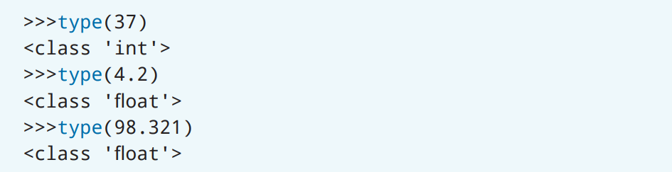

`type()`函数也可以在Python中用来知道任何一个对象的类型，我们将会在后面的章节里进一步地探讨它。

你还可以通过把数字从一种类型转换为另一种类型来改变它的数字类型。这个过程被称为*类型转换*（*type conversion*）。


要把`int`类型的数字转换为`float`类型的话，就应该把`int`的值传递到括号里。类似的，如果要把`float`类型的数字转换为`float`类型的话，就应该把`float`的值传递到括号里。让我们通过将两个浮点数的总和转换为`int`的示例来进行展示。

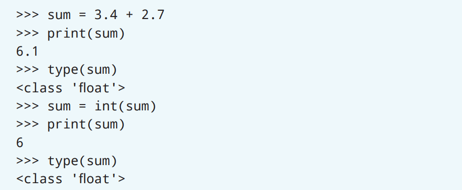

> 译者注：代码最后一行的输出应该是`<class 'int'>`而不是`<class 'float'>`：
> ```Python
> >>> sum = 3.4 + 2.7
> >>> print(sum)
> 6.1
> >>> type(sum)
> <class 'float'>
> >>> sum = int(sum)
> >>> print(sum)
> 6
> >>> type(sum)
> <class 'int'>
> ```

在上面这个例子里，`sum`变量被赋值为`3.4 + 2.7`。这个和是`6.1`，因为它包含小数，因此它是`float`类型。通过类型转换，你可以对这个变量进行重新赋值，从而把值转换为了`int`类型。之后，当你再去获取`sum`的类型时，你就会看到`sum`的类型已经转换为了`int`类型。除此之外，当你打印`sum`时，小数点和它后面的值也都消失了！

## 算术运算符

和计算器一样，你可以在Python中使用算术运算符来进行计算。通常来说，除非你希望按照特定的类型来输出结果，否则并不需要转换数字的类型。不管是什么数值类型，Python都会执行计算。但是，计算结果的类型可能会和你预期的不一样。在Python中使用算术运算符时，请牢记下面这些准则。

任何包含不同类型（`int`和`float`）的运算都会得到一个`float`类型的值。

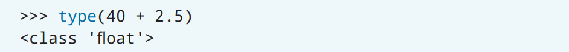

`int`类型之间的加法、减法或乘法运算会得到一个`int`类型的值。

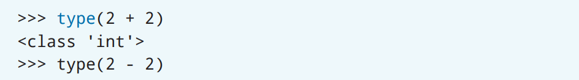

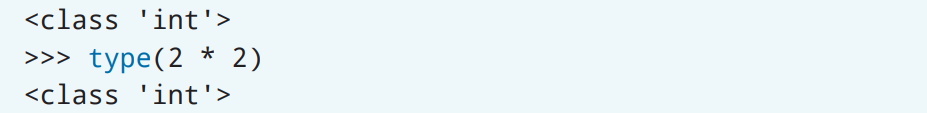

`int`类型之间的除法，会得到一个`float`类型的值。

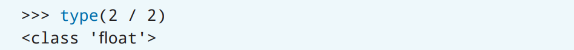

Python在处理同时使用`int`和`float`时是非常聪明的！`float`类型总是可以被用来表示任何`int`类型所能表示的值——但是反过来就不行了。因此，当Python不能确定数字类型时，它的类型就会自动变为`float`，这也就是为什么整数除法的结果类型是`float`类型的原因。

**运算顺序**

并不是所有的方程式都是一样的！如果我们尝试在一个方程式里使用多个数字和算术运算符的话，会发生什么呢？像代数那样，Python会遵循缩写为*PEMDAS*的运算顺序。[^1]

> [^1]: 译者注：中文地区一般以“先乘除再加减”作为口诀，但是并没有包含括号和指数

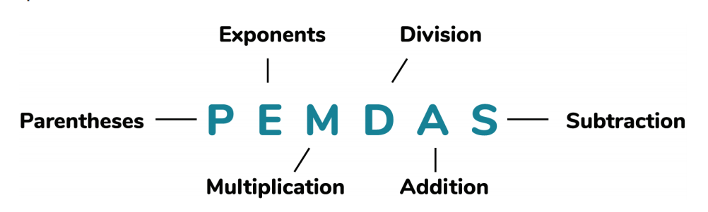

> * Parentheses，括号
> * Exponents，指数
> * Multiplication，乘；Division，除
> * Addition，加；Subtraction，减

当你让Python计算包含多余两个数值的方程式时，Python会根据PEMDAS规则来决定先计算哪些值。Python也会按照从左到右的顺序来进行计算，直到得到最终的计算结果。[^2]

> [^2]: 译者注：和代数一样，乘法和除法应该是相同的优先级；加法和减法也是相同的优先级。当出现相同优先级的计算时，应当从左往右进行计算。例如：`8/2*3`应该等于`4*3`也就是`12`；`8-2+3`应该等于`6+3`也就是`9`。

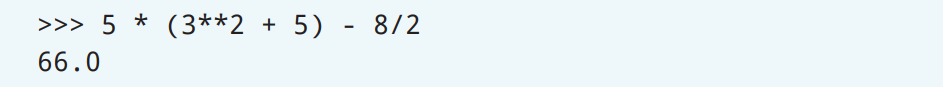

让我们完完整整地分解上面这个例子里的方程式。

1. 检查括号

   这个方程式里只有一对括号。在这对括号里，需要计算`3 ** 2 + 5`的值。而由于括号内包含了多个数学运算符，因此Python会使用PEMDAS来决定计算的优先顺序。`**`表示的是指数运算，因此Python会首先计算`3 ** 2`。接下来，Python会把计算结果`9`加上`5`。于是，在Python完成了括号内的计算之后，原始方程变成了`5 *（14）− 8 / 2`。

2. 检查指数

   这时的方程里已经没有其它的指数运算符了，因此Python不会再执行任何指数计算。

3. 检查乘法

   Python接下来会检查方程式里的乘法。方程式里有一个运算`5 *（14）`。在Python完成这个计算之后，方程式就变成了`70 − 8 / 2`。

4. 检查除法

   看看方程式里还剩下些什么，Python会去完成右侧的除法计算`8 / 2`。那么，方程式就变成了`70 - 4.0`。

5. 检查加法

   Python接下来会检查方程式里的加法。由于方程式里并没有加法，因此Python不会执行任何加法计算。

6. 检查减法

   最后，方程式里只剩下了减法。Python会计算`70 - 4.0`，结果也就是`66.0`。

> 原文的写法会让乘法除法，以及加减法有不同的优先级。如果可以，应该重写为：
>
> 3. 检查乘法和除法
>
>    Python接下来会从左向右的检查方程式里的乘法和除法。方程式里有一个乘法运算`5 *（14）`和除法运算`8 / 2`。先计算左边的乘法运算，这个计算之后，方程式就变成了`70 − 8 / 2`。接下来，Python会去完成右侧的除法计算`8 / 2`。最后，方程式就变成了`70 - 4.0`。
>
> 4. 检查加法和减法
>
>    Python接下来会从左向右的检查方程式里的加法和减法。由于方程式里并没有加法运算只剩下了一个减法运算，因此Python不会执行任何加法计算，而计算`70 - 4.0`的结果就是`66.0`。

你也可以使用变量来代替数字执行计算！

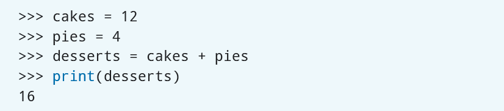

请先在纸上计算下面的小测验里的方程式，然后再把答案和在IDLE里键入方程式的结果进行比较。我们已经提供了每个方程式的Python语法。

### 小测验

1. $(2 \times 3) + 7^2$

   Python: `(2 * 3) + 7**2`

2. $72 \div 8$ [^3]

   Python: `72 / 8`

3. $3^3 \div 2 + 3^2$

   Python: `3**3 / 2 + 3**2`

4. $(5 + 10) + (9 \times 5) - 12$

   Python: `(5 + 10) + (9 * 5) - 12`

> [^3]: 译者注：原文除号用的是和代码一样的`/`。

## 项目: 采购科学博览会用品

### 项目描述

在今天的课堂上，亚历克斯（Alex）的科学老师宣布了即将举行的科学博览会。亚历克斯决定今年做一个关于音乐是如何影响植物生长的实验。放学后，她母亲带她到商店去采购所需的用品。但是，亚历克斯只有25美元来完成她的实验。环顾商店之后，她发现了一些花盆、花种包以及土壤袋。亚历克斯想用一个方程式来帮助她确定在预算范围内她可以购买每样商品的数量。这些商品的价格是：

* 花盆（个）：4美元
* 花种（包）：1美元
* 土壤（袋）：5美元

请使用变量和方程式来创建一个程序，这个程序将会被用来帮助亚历克斯了解25美元的预算可以购买多少商品。请注意，放进亚历克斯购物车里的商品都会再额外加收6％的销售税。

### 步骤

#### 打开 IDLE

在开始编码之前，请打开IDLE并创建一个新文件。请使用文件名**shopping_cart.py**来保存新文件。

#### 创建购物商品数量变量

为了能够让亚历克斯可以灵活地尝试每种商品的不同数量，你可以用`input()`语句来让亚历克斯输入不同商品的数量，这些数量会被分配给商品所对应的变量。而这些变量的值会在之后计算亚历克斯购物车里商品的总价格时被用到。

一件需要注意的事是，亚历克斯输入的值应该被存为整数，这样在把它们和程序里定义的其它数字值进行计算时会更方便。如果你没有把亚历克斯的输入转换为整数的话，那么这些值的默认类型会是`str`（*字符串*（*string*）的缩写）。

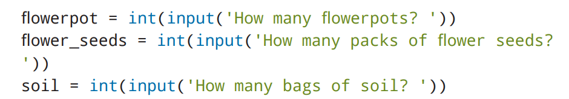

> 译者注：代码里的第二行代码的问号后应该有个空格，原文排版后丢失了
> ```Python
> flower_seeds = int(input('How many packs of flower seeds? '))
> ```
>
> 如果想要使用中文提问的话：
> ```Python
> flowerpot = int(input('打算买多少个花盆呢？ '))
> flower_seeds = int(input('打算买多少包花种呢？ '))
> soil = int(input('打算买多少袋土壤呢？ '))
> ```

#### 创建购物商品价格变量

接下来，我们还需要创建代表每个商品价格的变量，并且把价格分配给这些变量。

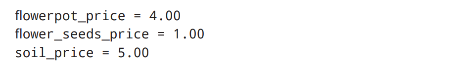

#### 创建消费税变量

由于亚历克斯购买的商品会有6％的消费税，因此你可以创建一个名为`tax_rate`的变量。可以用除法来要把税率从百分比转换为小数：$6 \div 100$，也就是`0.06`。


#### 计算商品价格

我们可以通过在前面步骤里创建的变量创建出一个用来计算亚历克斯购物车里所有商品的总价格的方程式。把每个商品的总价格加起来就可以得到所有商品的总价格了。

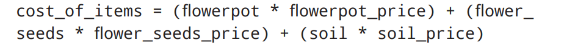

你可以通过打印`cost_of_items`变量来对程序进行测试。当你运行程序时，解释器会要求你输入花盆、花种包和土壤袋的数量。然后这个程序就会打印出所有商品的总价格了。


在测试完程序之后，你还需要在计算里把税率包括进去，才能得到亚历克斯购买商品的税后总价格。你可以把`cost_of_items`的值乘以`tax_rate`，再加上`cost_of_items`就能够得到亚历克斯购买商品的税后总价格了。

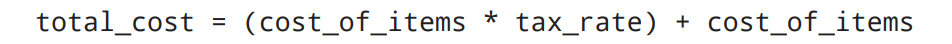

最后，打印出在亚历克斯购物车里的所有商品的税后总价格。


请再检查一遍代码来确保所有的计算都是正确的。如果都正确的话，你就可以保存这个程序，然后用不同数量的花盆、花种包和土壤袋来运行它了。

下面是**shopping_cart.py**完整程序的例子：

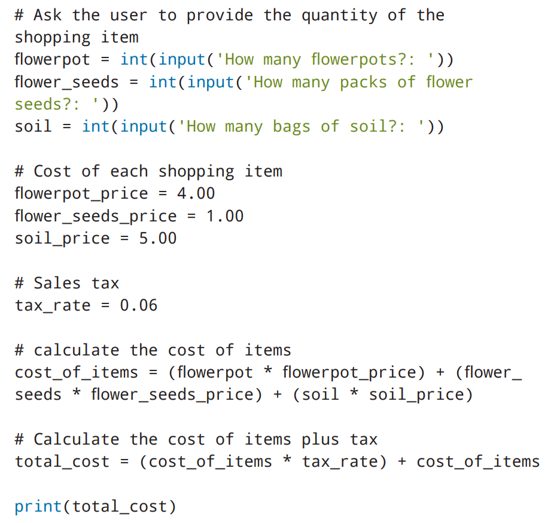

> 译者注：原文代码里的三个问题的问号后都多了一个冒号，感觉并不需要，而且和上下文不符
> ```Python
> flowerpot = int(input('How many flowerpots? '))
> flower_seeds = int(input('How many packs of flower seeds? '))
> soil = int(input('How many bags of soil? '))
> ```
>
> 如果想要使用中文提问的话：
> ```Python
> # 向用户询问购买商品的数量
> flowerpot = int(input('打算买多少个花盆呢？ '))
> flower_seeds = int(input('打算买多少包花种呢？ '))
> soil = int(input('打算买多少袋土壤呢？ '))
>
> # 每个商品的价格
> flowerpot_price = 4.00
> flower_seeds_price = 1.00
> soil_price = 5.00
>
> # 消费税
> tax_rate = 0.06
>
> # 计算总价格
> cost_of_items = (flowerpot * flowerpot_price) + (flower_
> seeds * flower_seeds_price) + (soil * soil_price)
>
> # 计算税后总价格
> total_cost = (cost_of_items * tax_rate) + cost_of_items
>
> print(total_cost)
> ```
