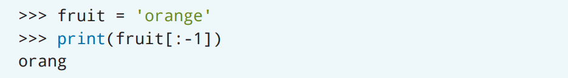

# 字符串

在你讲话的时候，你都会把单词组合成句子。如果我们想要在Python中使用单词和句子，就必须先创建一个*字符串*（*string*）。你可以将字符串当作变量值，也可以用它来打印出单词或短语。在Python中，你还可以对字符串进行操作！

## 创建字符串

在Python中，字符串是用来构建单词或句子的一组字符。字符串可以用单引号或双引号括起来。


在Python程序运行后，你可以用`print()`语句来查看字符串的值是什么的。


> 如果想要中文交互的话：
> ```Python
> >>> name = '月份'
> >>> print(name)
> 月份
> ```

如果你要输入的是很长的字符串，为了能够在程序里更容易地阅读它，我们可以把这个字符串分成多行（也被称为*换行*（*line break*））。在IDLE里，你可以在字符串前后使用三引号（`"""`）来创建一个多行的字符串。在IDLE里，你可以通过按Ctrl + J（Windows）或Control + J（Mac）组合键来开始一个新行。


> 如果想要中文交互的话：
> ```Python
> >>> story = """很久很久以前，
> 在一个遥远的银河系，有一名
> 热爱用Python编程胜过一切的程序员"""
> >>> print(story)
> 很久很久以前，
> 在一个遥远的银河系，有一名
> 热爱用Python编程胜过一切的程序员
> ```

## 转义字符

如果你编写的字符串里包含单引号，那么可以考虑用双引号来把字符串括起来。类似的，如果你编写的字符串里包含双引号，那么可以考虑用单引号括起来。


但是，如果要编写同时包含单引号和双引号的字符串应该怎么办呢？这种情况下，Python会要求你使用*转义字符*（*escape character*）来完成。通过转义字符，你在同一个字符串里同时使用单引号和和双引号。转义字符是由一个反斜杠和要使用的字符组成的。


如果想把字符串的一部分显示在新行里，那么可以使用`\n`转义字符来实现，这个转义字符用来在字符串里创建一个新行。


## 字符串方法

在Python程序运行时，你可以通过*字符串方法*（*string method*）来改变字符串的显示方式。字符串方法是字符串对象的一组内置功能，他们可以被用来执行与字符串相关的操作。字符串方法总是会创建一个新值，而绝对不会去修改原始字符串。

虽然Python中有60多个字符串方法，但是本书只会介绍那些会在小测验和项目里用到的字符串方法。如果你想要查看Python中所有的字符串方法，请访问[docs.python.org/3/library/stdtypes.html#string-methods](https://docs.python.org/3/library/stdtypes.html#string-methods)。

### `capitalize()`

`capitalize()`方法会把字符串里的第一个字符大写，这对于修改代名词（例如人名）的时候非常很有用。


### `title()`

`title()`方法会把字符串里的每个单词的首字符大写，这种方法可以被用来修改书籍或歌曲的标题。


### `strip()`

如果提供给你的字符串里包含了很多不必要的字符（例如`＃`，`$`，`％`等）或空格，`strip()`方法可以把你告诉它的字母从字符串里剔除掉。


只要把括号内的参数保留为空，就可以删除掉字符串前后多余的空格。[^1]

> [^1]: 译者注：原文是：“就可以删除掉字符串开头多余的空格。”，但是`strip`方法可以去除掉前后所有的空格。测试代码：`len('  abc  '.strip())`的结果是3。


### `lower()`

`lower()`方法会把字符串里的所有字符转换为小写。


### `upper()`

类似的，要把所有字符都转换为大写，可以使用`upper()`方法。


### `replace()`

`replace()`方法会把你选定的字符替换为其它的字符。选定的字符和替换字符被称为*参数*（*arguments*）。第一个参数是想要被替换的字符，第二个参数是用来进行替换的字符。


> 如果想要中文交互的话：
> ```Python
> >>> opinion = '学习Python很难！'
> >>> print(opinion.replace('难', '好玩'))
> 学习Python很好玩！
> ```

### `len()`

`len()`函数会计算并返回字符串里的字符总数。


### 小测验

哈维尔（Javier）整理了他最喜欢的50首各个时代的歌曲清单。但是，因为他是从互联网上复制粘贴的标题，因此标题的格式是各种各样的。有些标题是全部大写的，有些则是全部小写。哈维尔希望能够把清单里的名字重新统一格式，也就是让歌曲名字里的每个单词的第一个字母都是大写的。哈维尔应该用下面哪个字符串方法？

A. `capitalize()`
B. `upper()`
C. `replace()`
D. `title()`

## 串联

就像把数字加在一起那样，你也可以使用`+`运算符来把字符串组合起来。把几个字符串组合成一个字符串的操作被称为*串联*（*concatenation*）。


> 如果想要中文交互的话：
> ```Python
> >>> animal_first_half = '猴'
> >>> animal_second_half = '子'
> >>> print(animal_first_half + animal_second_half)
> 猴子
> ```

要注意的是，当你把两个字符串组合在一起时，Python并不会自动在它们中间加上空格。想在两个字符串之间添加空格的话，需要在代码里进行添加。


## 转换

Python并不允许把字符串和整数变量串联在一起。同样的，也不允许把字符串和浮点数串联在一起。

字符串的类型是`str`。你可以用`type()`函数来查看字符串变量的类型。


> 如果想要中文交互的话：
> ```Python
> >>> city = '成都'
> >>> print(type(city))
> <class 'str'>
> ```

可以看到，在IDLE里查看字符串变量的类型的话，会返回字符串的类型`str`。而如果你尝试把一个`str`变量和`int`变量相串联，那么Python就会提示错误，指出你只能串联两个`str`变量。


> 如果想要中文交互的话：
> ```Python
> >>> city = '成都'
> >>> state = '四川'
> >>> zip_code = 610000
> >>> location = city + ', ' state + ' ' + zip_code
> Traceback (most recent call last):
> File "<pyshell#67>", line 1, in <module>
> location = city + ‘, ‘ state + ‘ ‘ + zip_code
> TypeError: can only concatenate str (not "int") to str
> ```

但是，你可以通过转换来把一个`int`变量从`int`类型改变为`str`类型，这样就可以把它们串联在一起了。


> 如果想要中文交互的话：
> ```Python
> >>> city = '成都'
> >>> state = '四川'
> >>> zip_code = 610000
> >>> location = city + ', ' + state + ' ' + str(zip_
> code)
> >>> print(location)
> 成都, 四川 610000
> ```

对`float`或`int`类型的变量调用`str()`函数会把它们的值改变为`str`类型。但是，请记住，这种变化只适用于输出，而并不会修改变量原本的类型。

## 字符串格式化

当你已经为若干个变量分配了值，并且想要在新句子里能够使用这些变量的值。那么可以通过*格式化字符串*(*format strings*)以及`f`语法来完成。Python还提供了其他的方法来格式化字符串，但是，`f`语法是这些方法里最简单的语法。


通过`f`语法格式化字符串时，使用小写的`f`或是大写的`F`都可以。`f`语法会告诉Python，它后面紧跟的字符串会通过花括号来引用变量。在把变量嵌入到句子里的时候，要保证它和程序里你创建的变量名称是完全相同的。


> 原文`print()`语句排版有问题。应该是：
> ```Python
> >>> print(f'I have a pet {dog_breed}. Her name is {name}. She is {age}.')
> ```
>
> 如果想要中文交互的话：
> ```Python
> >>> dog_breed = '贵宾犬'
> >>> name = '萝拉'
> >>> age = 3
> >>> print(f'我有一只{dog_breed}宠物。它叫做{name}。它现在{age}岁了。')
> 我有一只贵宾犬宠物。它叫做萝拉。它现在3岁了。
> ```

当使用格式化字符串时，Python会自动将（`int`或`float`类型的）数字转换为字符串。

## 索引

你应该已经在在学校里学习了从数字`1`开始进行计数。然而，Python是从数字`0`开始进行计数的！字符串里的每个字符都被分配了一个位置，这个位置也被称为*索引*(*index*）。它被用来指示该字符在字符串里的位置。


在上面的这个例子里，字母`P`的索引是`0`，字母`n`的索引是`5`。虽然你可以通过在字符串里一个一个数字符来知道它们的位置，但是通常在Python中会用`find()`方法来节省查找时间。


`find()`方法会返回字符首次出现在字符串里的索引。你可以使用`find()`方法来查找一个或一组字符的索引。如果字符不在字符串里的话，Python会返回`-1`。


你可以通过方括号来获得位于特定索引处的字符。


你也可以使用负值来从字符串的末尾开始计算索引。当方括号里的值是负数的时候，Python会从最后一个字符（索引为`-1`）开始向前计数。


如果想要返回多个字符的话，那么可以通过切片来返回一定范围里的字符。切片会让你指定两个索引：（1）从哪里开始寻找字符和（2）从哪里停止寻找字符。


但是，切片操作有一点需要特别注意！Python是从第一个索引处开始的，但是在第二个索引处停止的时候并不会包含这里的字符。


要是想通过切片获得起始索引之后的所有字符，请把第二个索引留空。


类似的，你可以通过将第一个索引保留为空来获得停止索引之前的所有字符。


你也可以用负数来从字符串末尾进行切片操作。



你也可以在切片操作的时候同时使用正数和负数。比如，可以通过`[1：-1]`来获得字符串的第一个字符和最后一个字符之间的所有字符。在这种情况下使用负数索引的优势在于，你并不需知道字符串的长度就可以得到两个索引之间的所有字符。


## 项目: 疯狂填词生成器

### 项目描述

疯狂填词（Mad Libs）是一款要求玩家提供一系列单词，然后使用这些单词来创建故事的游戏。这些故事通常很蠢，这是因为玩家们并不知道他们选的单词会被用在哪里！让我们来创建一个疯狂填词生成器吧，这个程序会提示你提供名词、形容词、动词以及特定类型的单词。在完成所有要求后，生成器会把这些提供的单词插入到一个故事模板里来创作故事。

### 步骤

#### 打开IDLE

在开始编码之前，请打开IDLE并创建一个新文件。请使用文件名**mad_libs.py**来保存新文件。

#### 为单词创建提示

我们在这个项目的后面部分提供了生成器的故事模板。为了能够完整的生成故事，你需要输入六个不同的单词。生成器在启动时将会提示你提供下面六个单词：

1. 形容词
2. 户外运动的名称
3. 形容词
4. 朋友的名字
5. 动词 [^2]
6. 形容词

> [^2]: 译者注：原文直译为：以*ing*结尾的动词，或者也可以用“动名词”。

你可以为请求的每个单词创建一个变量来开始这个项目。这里需要注意的是，生成器需要三个不同的形容词来描述故事。因此，你需要为每个形容词分别创建一个单独的变量。你可以用`input()`函数来提示用户进行回应，并把结果存放到变量中。


> 如果想要使用中文提问的话：
> ```Python
> adjective1 = input('请输入一个形容词： ')
> game = input('请输入一个户外运动的名称： ')
> adjective2 = input('请输入另一个形容词： ')
> friend = input('请输入一个朋友的名字： ')
> verb = input('请输入一个动词： ')
> adjective3 = input('请再输入一个不同的形容词： ')
> ```

#### 格式化输入的单词

因为在生成器里并没有要求任何人必须以某种格式进行输入的逻辑，因此你可以使用字符串方法来改变这些单词在故事里的显示方式。

*朋友的名字*所对应的值应该是首字母大写的，而其它的单词都可以被全部被保存为小写。

于是你可以通过使用相对应的字符串方法来修改每个单词的输入。


> 如果想要使用中文提问的话：
> ```Python
> adjective1 = input('请输入一个形容词： ').lower()
> game = input('请输入一个户外运动的名称： ').lower()
> adjective2 = input('请输入另一个形容词： ').lower()
> friend = input('请输入一个朋友的名字： ').capitalize()
> verb = input('请输入一个动词： ').lower()
> adjective3 = input('请再输入一个不同的形容词： ').lower()
> ```

为了确保生成器能正常工作，你可以依次把每个变量都传递到`print()`语句里来测试生成器。在进行下一步之前，请先测试一下吧。

#### 创建故事模板

下面这个故事模板描述了在海滩上度过的一天。把这个故事模板复制到IDLE里，并存在`story`变量里吧。


> 如果想要使用中文故事的话：
> ```Python
> story = '那是一个在海滩的ADJECTIVE 1的夏日。我和我的朋友正在水边玩GAME。 随着ADJECTIVE 2的浪潮越来越近，我的朋友NAME OF A FRIEND大喊：“看！有一个水母在VERB ENDING IN ING！”当我们走近时，我们发现那只水母真的在VERB ENDING IN ING！NAME OF A FRIEND跑离了水面，逃到沙滩上。NAME OF A FRIEND非常害怕一只正在VERB ENDING IN ING的水母。而我们其余的人继续在水中玩GAME，因为VERB ENDING IN ING的水母是ADJECTIVE 3'
> ```

接下来，通过已经学习了的字符串格式化的`f`语法，来把全大写的单词都替换为变量吧。


> 如果想要使用中文故事的话：
> ```Python
> story = f'那是一个在海滩的{adjective1}夏日。我和我的朋友正在水边玩{game}。 随着{adjective2}浪潮越来越近，我的朋友{friend}大喊：“看！有只水母在{verb}！”当我们走近时，我们发现那只水母真的在{verb}！{friend}跑离了水面，逃到沙滩上。{friend}非常害怕一只正在{verb}的水母。而我们其余的人继续在水中玩{game}，因为{verb}的水母是{adjective3}'。
> ```

#### 玩游戏

是时候玩一玩这个游戏了！添加一条`print()`语句从而在解释器里打印出故事吧。检查你的代码，确保所有的代码看起来都是正确的。如果都是正确的话，就保存并运行这个程序吧。你应该会看到IDLE里显示出了一个非常蠢的故事！


> 如果使用中文交互的话：
> ```Python
> 请输入一个形容词： 懒懒的
> 请输入一个户外运动的名称： 网球
> 请输入另一个形容词： 美丽的
> 请输入一个朋友的名字： Eric
> 请输入一个动词： 唱歌
> 请再输入一个不同的形容词： 粘粘的
> 那是一个在海滩的懒懒的夏日。我和我的朋友正在水边玩网球。 随着美丽的的浪潮越来越近，我的朋友Eric大喊：“看！有只水母在唱歌！”当我们走近时，我们发现那只水母真的在唱歌！Eric跑离了水面，逃到沙滩上。Eric非常害怕一只正在唱歌的水母。而我们其余的人继续在水里玩网球，因为那只唱歌的水母是粘粘的
> ```

下面是这个项目的完整代码。随时发挥创造力并创建自己的疯狂填词生成器版本吧！


> 如果使用中文交互的话：
> ```Python
> # 用户输入的单词
> adjective1 = input('请输入一个形容词： ').lower()
> game = input('请输入一个户外运动的名称： ').lower()
> adjective2 = input('请输入另一个形容词： ').lower()
> friend = input('请输入一个朋友的名字： ').capitalize()
> verb = input('请输入一个动词： ').lower()
> adjective3 = input('请再输入一个不同的形容词： ').lower()
>
> # 故事模板
> story = f'那是一个在海滩的{adjective1}夏日。我和我的朋友正在水边玩{game}。 随着{adjective2}浪潮越来越近，我的朋友{friend}大喊：“看！有只水母在{verb}！”当我们走近时，我们发现那只水母真的在{verb}！{friend}跑离了水面，逃到沙滩上。{friend}非常害怕一只正在{verb}的水母。而我们其余的人继续在水中玩{game}，因为{verb}的水母是{adjective3}'。
>
> print(story)
> ```
