# 条件与控制流

在运行代码时，Python可以根据你添加到脚本里的逻辑做出决策。你添加的逻辑将能够让代码根据遇到的真假情况来决定怎么处理。在Python中，这种情况被称为*条件*（*condition*）。你的脚本可以包含一个或多个条件，并且这些条件都会包含一组操作。

## 比较运算符

你可能会对在数学里用来比较数字的短语比较熟悉，例如：“大于”、“小于”、以及“小于等于”等等。Python也包含相同的比较器，并且还提供了一些其他的比较器来帮助你在比较数字或字符串的时候使用。比较运算符是用来比较两个值的，当使用比较运算符时，Python将返回布尔值`True`或`False`，这两个返回值被用来表示比较的结果是真还是假。Python中的布尔值都是首字母大写的。

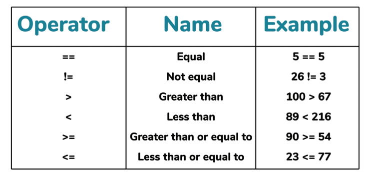

| 运算符 | 名称 | 例子 |
| --- | --- | --- |
| `==` | 等于 | `5 == 5` |
| `!=` | 不等于 | `26 != 3` |
| `>` | 大于 | `100 > 67` |
| `<` | 小于 | `89 < 216` |
| `>=` | 大于等于 | `90 >= 54` |
| `<=` | 小于等于 | `23 <= 77` |

比较器还可以被用来完成更复杂的包含数学方程式的比较。Python会在确定布尔值是`True`还是`False`之前，对比较器两端的方程式进行计算。

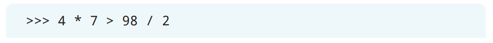

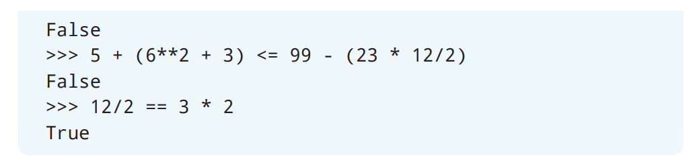

字符串也可以通过比较来检查他们的值是否相同。

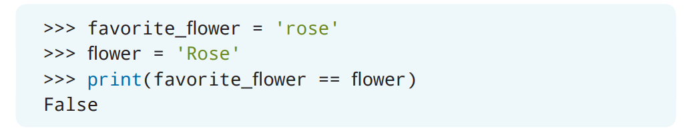

在上面这个例子里，虽然两个变量都分配给了相同类型的花朵，但分配给`favorite_flower`的字符串全是小写字母，而分配给`flower`的字符串是以大写`R`开头的。

### 逻辑运算符

然而比较可以进行的操作不止于此！还有三个可以被用来比较值的逻辑运算符。就像前面提到的比较器那样，逻辑运算符也会返回布尔值`True`或`False`。

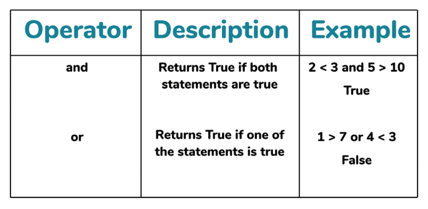

| 运算符 | 描述 | 例子 |
| --- | --- | --- |
| `and` | 当两条语句都为真时返回`True` | `2 < 3 and 5 > 10` |
| | | `True` |
| `or` | 当任何一条语句为真时返回`True` | `1 > 7 or 4 < 3` |
| | | `False` |
| `not` [^1] | 当语句为真时返回`False` | `not 2 < 3` |
| | | `False` |

> [^1]: 译者注：原文提到有3个逻辑运算符，但是表格里只有2个，所以补上`not`逻辑运算符

你可以使用逻辑运算符来判断两个或更多个表达式是否为真。

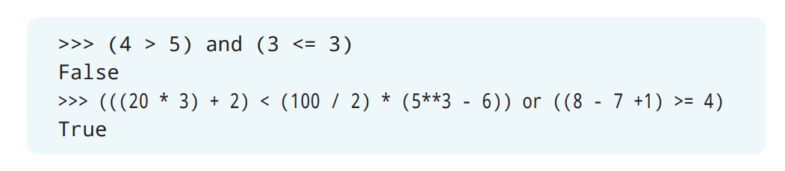

在第一个例子里，Python会比较两个不等式方程的布尔值，也就是`False`和`True`，而由于其中一个表达式的计算结果为`False`，因此最终结果为`False`；在第二个例子里，Python先会计算每个方程式的总和，然后再比较每个表达式的布尔值，也就是`True`或`False`[^2]，而由于其中一个表达式的计算结果为`True`，因此最终结果为`True`。

> [^2]: 译者注：原文这里有错误。原文是：“Python先会计算每个方程式的总和，然后再比较每个表达式的布尔值，也就是`False`或`False`，而由于两个表达式的计算结果均为`False`，因此结果为`True`”

逻辑运算符不仅可以用来比较数字，它们还可以被用来比较由字符串组成的条件。例如，你可以根据今天是不是星期二*并且*（*and*）你是否已经做完了作业，来决定能不能看动画片。你将会在后面的章节里进一步了解这部分内容！

## `if`语句

你可以让你的代码在满足了所有必需条件之后去执行一些特定的操作。就像在上一节里的例子那样，你只能在星期二并且已经完成作业的情况下才能看动画片。

你可以使用`if`语句来决定在满足条件的情况下会发生什么。*`if`语句*（*`if` statement*）会这样去评估：当某些条件满足了，那么就去执行特定的操作。


在看动画片的例子里，*如果*（*if*）你的作业完成了，你*才*（*then*）可以看动画片。你可以在Python中把这个条件逻辑转变为`if`语句。为了更方便为这段逻辑创建一个程序，请在IDLE里创建一个新文件，并使用文件名**cartoons.py**保存。

首先，创建一个名为`homework_complete`的变量，并且把这个变量分配为布尔值`True`。然后，创建一个名为`day_of_week`的变量，并且把星期几的值分配给这个变量。

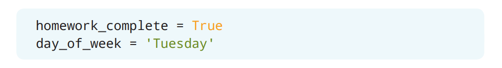

> 如果使用中文交互的话：
> ```Python
> homework_complete = True
> day_of_week = '星期二'
> ```

接下来，创建一条`if`语句来表明你能看动画片所必须满足的条件。在这条`if`语句里，会包含一个逻辑比较器，这个逻辑比较器会比较你的作业有没有完成，以及今天是不是星期二。

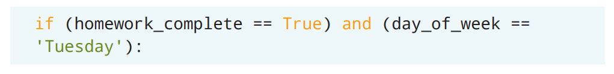

> 如果使用中文交互的话：
> ```Python
> if (homework_complete == True) and (day_of_week == '星期二'):
> ```

让我们用一条告诉你可以看动画片的`print()`语句来完成`if`语句。保存并运行程序来测试你的逻辑是否正确吧。下面是这个程序的完整代码：

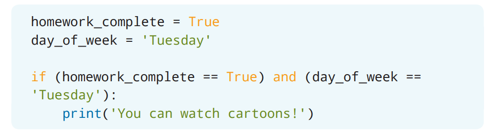

> 如果使用中文交互的话：
> ```Python
> homework_complete = True
> day_of_week = '星期二'
> if (homework_complete == True) and (day_of_week == '星期二'):
>     print('你可以看动画片！')
> ```

## `if`-`else`语句

那么当条件不满足时会发生什么呢？比如你还没有完成作业的情况。在你刚编写的程序里，还没有提供相应的逻辑来告诉Python当你还没有完成作业时应该怎么做。因此，如果将我们把`did_homework`分配的值更改为`False`，那么什么事情都不会发生。这时，你可以使用`if`-`else`语句（*`if`-`else` statement*）来为`if`语句提供一个额外的操作。

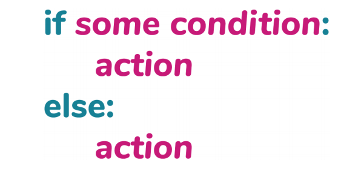

`if`-`else`语句首先会评估有没有满足`if`里的条件。如果满足条件，那么就会执行第一个操作。但是，如果不满足`if`条件，Python就会去查找`else`条件并采用这里的操作。

修改你的程序来反映出当你没有完成作业的时候应该怎么办吧。在`print()`语句之后，添加一个`else`条件，并且设置当你没有完成作业时应该打印出的内容。

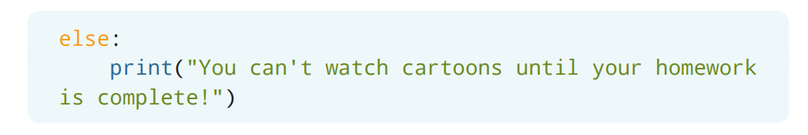

> 如果使用中文交互的话：
> ```Python
> else:
>     print('你得先完成作业才可以看动画片！')
> ```

要测试你的逻辑是否正常工作，可以把分配给`homework_complete`变量的值修改为`False`。保存并运行这个程序后，字符串`You can't watch cartoons until your homework is complete! `（`你得先完成作业才可以看动画片！`）应该被显示在解释器窗口中。

## `if`-`elif`-`else`语句

等等！你可能还遇到过这样一种情况，就是结果并不是“非此即彼”那么简单。比如说，星期六就非常适合放松身心，所以即使你还没有完成作业，周六也是可以看动画片的，因为你还有一整个周末的时间去完成它。

你可以通过添加更多的条件语句来让条件逻辑更加复杂！ *`if`-`elif`-`else`语句*（*`if`-`elif`-`else` statement*）可以让你为Python创建多个评估条件来执行不同的操作。`elif`表示的是“不然如果”（“else if”）[^3]。

> [^3]: 译者注：原文这里后面的内容不准确。原文是：“`elif`表示的是“不然如果”（“else if”），也就是“不然，做这些”或“或者，做这些””。后面部分的内容表述的是`else`的意思，并不是`elif`的意思。

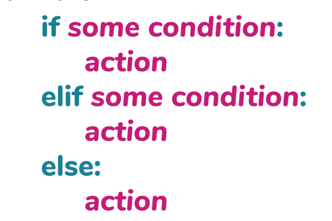

Python首先会从`if`语句开始来评估有没有满足指定的条件。如果不满足条件，那么Python将会检查`elif`里的条件。如果满足`elif`条件，那么Python就会执行在`elif`语句里定义的操作，并且不再继续评估`if`-`elif`-`else`语句。如果发现自己需要不止一个`elif`条件的话，也可以根据需要添加任意多条`elif`语句。但是，`if`-`elif`-`else`语句里的最终条件始终是`else`条件。

修改你的程序，在`if`和`else`语句之间添加一条`elif`语句。和你构建`if`条件的方式一样，`elif`也需要添加一个条件，用这个条件来检查`day_of_week`变量是不是等于`Saturday`（`星期六`）吧。如果是星期六的话，就用`print()`语句来打印出可以看动画片，同时提醒你需要在星期日晚上完成作业。

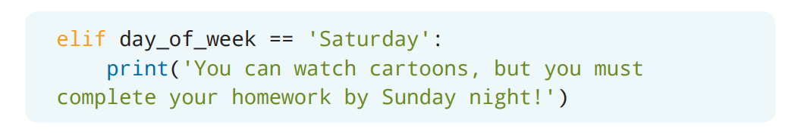

> 如果使用中文交互的话：
> ```Python
> elif day_of_week == '星期六':
>     print('你可以看动画片。但必须在星期日晚上完成作业哦！')
> ```

在测试程序前，请确保`homework_complete`变量的值是`False`，并且`Saturday`（`星期六`）已经被分配给了`day_of_week`变量。保存并且运行程序来检查你的逻辑吧。

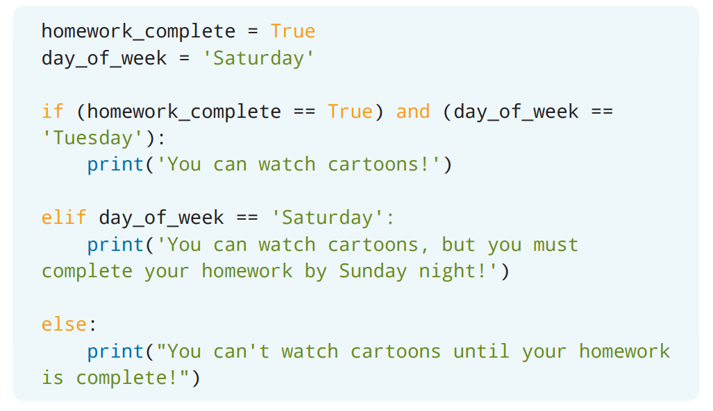

> 译者注：原文代码里的`homework_complete`不正确，应该为`False`
> ```Python
> homework_complete = False
> day_of_week = '星期六'
> ```
>
> 如果使用中文交互的话：
> ```Python
> homework_complete = False
> day_of_week = '星期六'
> if (homework_complete == True) and (day_of_week == '星期二'):
>     print('你可以看动画片！')
> elif day_of_week == '星期六':
>     print('你可以看动画片。但必须在星期日晚上完成作业哦！')
> else:
>     print('你得先完成作业才可以看动画片！')
> ```

Python会先查验`homework_complete`变量是不是`True`，以及`day_of_week`变量是不是`Tuesday`（`星期二`）。由于这个表达式的值为`False`，Python会去查验`elif`条件来检查`day_of_week`变量是不是`Saturday`（`星期六`）。而由于`Saturday`（`星期六`）已经被分配给了`day_of_week`变量，因此`You can watch cartoons, but you must complete your homework by Sunday night!`（`你可以看动画片。但必须在星期日晚上完成作业哦！`）会被打印出来。

如果想测试其他情况，可以把不同的星期几的值分配给`day_of_week`变量，并且改变有没有完成作业来修改程序。试着把每条`print()`语句都打印到解释器窗口吧！如果你觉得还想进一步锻炼自己的话，就为你的程序添加更多的`elif`语句吧。

## 项目：今天穿什么

### 项目描述

麦迪逊（Madison）想创建一个程序，这个程序可以根据天气情况来告诉她应该穿什么衣服。

1. 如果温度为80华氏度或更高，那么麦迪逊应该穿短裤，并且带上太阳镜。
2. 如果温度为60–79华氏度，那么麦迪逊应该穿轻薄的外套。
3. 如果温度为59华氏度或更低，那么麦迪逊应该穿外套，并且戴上帽子、手套和围巾。

用`if`-`elif`-`else`语句来构建条件逻辑从而帮助麦迪逊创建她的程序吧。

### 步骤

#### 打开IDLE

在开始编码之前，请打开IDLE并创建一个新文件。请使用文件名**what_to_wear.py**来保存新文件。

#### 了解逻辑

麦迪逊希望她的程序能在建议她穿什么衣服之前，考虑到三个不同的条件。每个条件都会包含一条`if`语句、一个整数、一个比较器和一个字符串。应该执行什么操作（麦迪逊应该穿什么）是基于温度的。因此，是否满足相应的条件将取决于当前的温度。

#### 创建温度变量

温度每天都会变化。因此，在程序启动的时候，你可以让程序要求麦迪逊提供当前的温度。创建一个名为`temperature`的变量，并且提示麦迪逊输入当前温度。

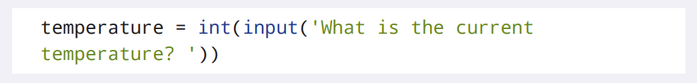

> 如果使用中文交互的话：
> ```Python
> temperature = int(input('现在的温度是多少？ '))
> ```

程序将会用分配给`temperature`变量的值和其他数值进行比较。因此，请确保把`temperature`变量转换为`int`类型。

#### 创建`if`语句

我们先从第一个条件开始，创建一条`if`语句吧[^4]，用来检测当前温度有没有到80华氏度或更高。如果满足条件，那么就把麦迪逊的穿衣建议存在一个名为`outfit`的变量里吧。

> [^4]: 译者注：原文这里是：“在`advice`变量前创建一条`if`语句”。`advice`变量是在后面部分引入的，因此这里删掉。

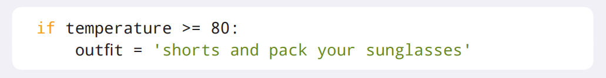

> 如果使用中文交互的话：
> ```Python
> if temperature >= 80:
>     outfit = '短裤并且带上太阳镜'
> ```

你可以测试程序来检查你的逻辑。在这个条件里添加一条`print()`语句来打印出服装建议吧。当出现提示时，输入80或更大的任何数值，相对应的穿衣建议就会被打印出来[^5]。

> [^5]: 译者注：原文这里是：“输出的`advice`变量会包含相对应的穿衣建议”。`advice`变量是在后面部分引入的，因此这里改掉了原文。

#### 添加`elif`语句

当你已经确定程序的初始逻辑是正确之后，那么就可以为第二个条件添加一条`elif`语句了。在程序里添加一条`elif`语句，用来检查当前温度是否在60到79华氏度之间吧。这个逻辑会需要你用逻辑运算符来比较两个表达式：第一个表达式会判断当前温度是不是小于或等于79华氏度；第二个表达式会判断当前温度是不是大于或等于60华氏度。如果满足条件，那么就把麦迪逊的穿衣建议存在`outfit`变量里吧。

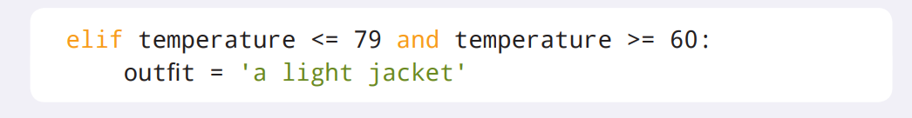

> 如果使用中文交互的话：
> ```Python
> elif temperature <= 79 and temperature >= 60:
>     outfit = '轻薄的外套'
> ```

你可以测试程序来检查你的逻辑。在这个条件里添加一条`print()`语句来打印出服装建议吧。当出现提示时，输入60到79之间的任何数值，相对应的穿衣建议就会被打印出来[^6]。

> [^6]: 译者注：原文这里是：“输出的`advice`变量会包含相对应的穿衣建议”。`advice`变量是在后面部分引入的，因此这里改掉了原文。

#### 添加`else`语句

现在只剩下一个条件需要被添加到这个程序里了！既然没有其他的条件了，因此你可以创建一条`else`语句，从而把麦迪逊的穿衣建议存在`outfit`变量里。

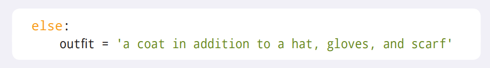

> 如果使用中文交互的话：
> ```Python
> else:
>     outfit = '外套，并且戴上帽子、手套和围巾'
> ```

你可以测试程序来检查你的逻辑。在这个条件里添加一条`print()`语句来打印出服装建议吧。当出现提示时，输入59或更低的任何数值，相对应的穿衣建议就会被打印出来[^7]。

> [^7]: 译者注：原文这里是：“输出的`advice`变量会包含相对应的穿衣建议”。`advice`变量是在后面部分引入的，因此这里改掉了原文。

#### 创建`advice`变量

除了可以在每个条件里都创建一个单独的`print()`语句，你还可以把不同条件下的`outfit`变量的值传递给一个统一的字符串。

在`if`-`elif`-`else`语句下面，创建一个名为`advice`的变量，它会通过字符串格式化来把`outfit`变量的值添加到：`'Today you should wear'`（`'今天应该穿'`）的字符串里。最后，在加上一条`print()`语句打印出`advice`变量就行了。

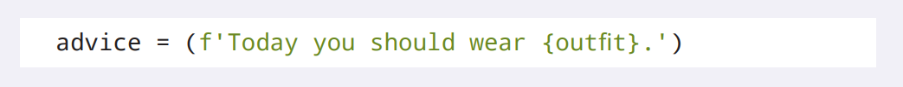

> 如果使用中文交互的话：
> ```Python
> advice = (f'今天应该穿{outfit}。')
> ```

在测试程序之前，请注释掉每个条件里的`print()`语句。现在，保存并运行这个程序来测试各个条件吧！

如果你要更多的挑战，那么就随意向程序里添加更多的条件逻辑吧。完整的程序可以在这里找到：

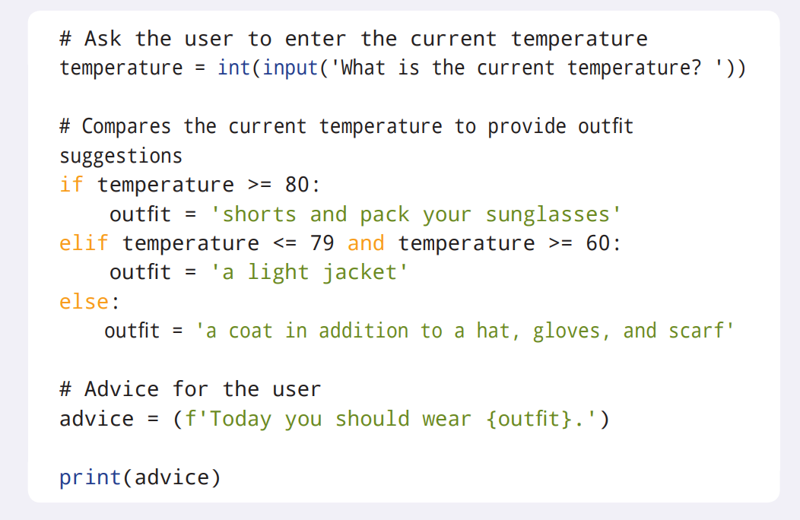

> 如果使用中文交互的话：
> ```Python
> # 要求用户输入现在的温度
> temperature = int(input('现在的温度是多少？ '))
>
> # 对现在的温度进行比较来决定穿什么
> suggestions
> if temperature >= 80:
>     outfit = '短裤并且带上太阳镜'
> elif temperature <= 79 and temperature >= 60:
>     outfit = '轻薄的外套'
> else:
>     outfit = '外套，并且戴上帽子、手套和围巾'
>
> # 给用户的建议
> advice = (f'今天应该穿{outfit}。')
>
> print(advice)
> ```
