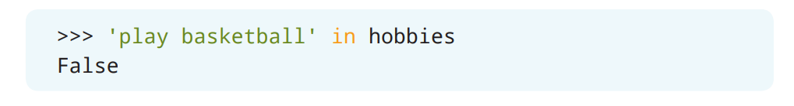
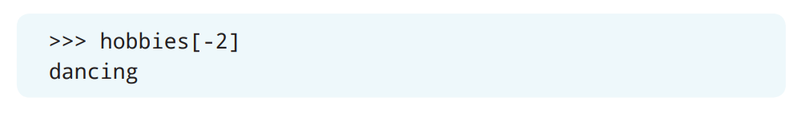
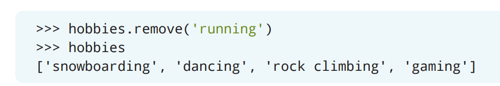
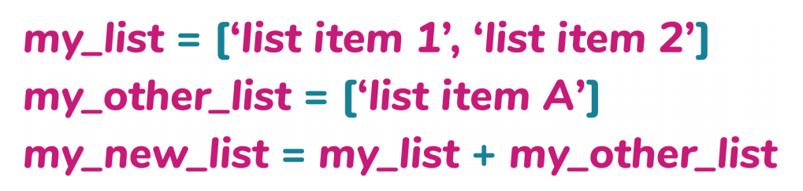

# 列表

如果让你在Python中列出所有的朋友，你可能会认为可以给每个朋友都创建一个变量，然后把他们的名字分配给这些变量。但是，你并不能在程序里很方便地使用所有的这些代表好友的变量，因为你必须要记住每个好友的变量名*并且*要一个一个的去分配他们的值。Python可以把相关的元素都组合到一个*列表*（*list*）里，而列表能够为你提供更方便的操作元素集合的体验。

## 创建列表[^1]

> [^1]: 译者注：原文第八章到第十一章的标题级别有问题，请编辑注意

列表是一个有序的，也可以被修改元素的多项集。因此，列表里的每个元素都有一个特定的位置。如果想要改变列表里的元素，就可以用这个位置信息来完成。你也可以在列表里包含重复的元素。


让我们创建一个由兴趣爱好组成的列表吧！先创建一个名为`hobbies`的变量，然后把你的兴趣爱好作为字符串一个一个地添加到列表里。


> 如果使用中文交互的话：
> ```Python
> >>> hobbies = ['游泳', '跳舞', '唱歌']
> ```

可以通过`print()`语句并且传入`hobbies`变量来输出出列表内容。Python会按照括号括起来的顺序打印出整个列表。


> 如果使用中文交互的话：
> ```Python
> >>> hobbies = ['游泳', '跳舞', '唱歌']
> >>> print(hobbies)
> ['游泳', '跳舞', '唱歌']
> ```

### 小测验

杰里德（Jared）想创建一个他最喜欢的超级英雄的清单。下面哪条语句展示了创建这个列表的正确语法？

A. `comic_books = ('Spiderman', 'Wonder Woman', 'Hulk', 'Batman')`
B. `comic_books = ['Spiderman' + 'Wonder Woman' + 'Hulk' + 'Batman']`
C. `comic_books = ['Spiderman', 'Wonder Woman', 'Hulk', 'Batman']`
D. `comic_books = 'Spiderman', 'Wonder Woman', 'Hulk', 'Batman'`

> 如果使用中文交互的话：
> A. `comic_books = ('蜘蛛侠', '神奇女侠', '绿巨人', '蝙蝠侠')`
> B. `comic_books = ['蜘蛛侠' + '神奇女侠' + '绿巨人' + '蝙蝠侠']`
> C. `comic_books = ['蜘蛛侠', '神奇女侠', '绿巨人', '蝙蝠侠']`
> D. `comic_books = '蜘蛛侠', '神奇女侠', '绿巨人', '蝙蝠侠'`

## 列表长度

你可以创建一个包含任意多元素的列表。然后使用`len()`函数来获得列表里有多少个元素。


例如，对于`hobbies`列表，我们可以使用`len()`函数来输出它的长度。


## 检查列表里是否存在某个元素

你可以使用`in`关键字来检索列表里的元素，从而确定列表里有没有包含这个元素。这个关键字会返回一个布尔值`True`或`False`。


例如，使用`in`关键字来检查`play basketball`（`打篮球`）元素是否在`hobbies`列表里。



> 如果使用中文交互的话：
> ```Python
> >>> '打篮球' in hobbies
> False
> ```

由于`play basketball`（`打篮球`）并不在`hobbies`列表里，因此会返回`False`。接下来，让我们用`in`关键字来检查`dancing`（`跳舞`）元素是否在`hobbies`列表里。


> 如果使用中文交互的话：
> ```Python
> >>> '跳舞' in hobbies
> True
> ```

由于`dancing`（`跳舞`）存在于`hobbies`列表里，因此会返回`True`。如果把列表元素的格式改变了会是什么情况呢？比如说，使用`in`关键字来检查`SINGING`元素是否在`hobbies`列表里。


结果会返回`False`，这是因为在`hobbies`列表里，`singing`元素的所有字符都是小写的，而这个例子里的字符串`SINGING`全部为大写字符。

## 获取元素的索引

索引是指元素在列表里的位置。可以用`index()`方法要获得元素的索引。


索引是从`0`开始的。让我们打印出`hobbies`列表里的`dancing`元素的索引吧。


> 如果使用中文交互的话：
> ```Python
> >>> hobbies.index('跳舞')
> 1
> ```

## 访问列表里的元素

如果你想访问特定位置的元素，可以用列表元素的索引来完成。


Python会在指定的索引处查找相应的元素，并且完成你在程序里所提供的任何操作。让我们从`hobbies`列表里打印出`dancing`元素吧。`dancing`元素的索引是`1`（请记住，Python从`0`开始计数的！）。


> 如果使用中文交互的话：
> ```Python
> >>> hobbies[1]
> '跳舞'
> ```

你可能还记得，在Python中还可以使用负数来作为索引，负数索引表示从列表的末尾开始计算位置。要通过负数索引来访问`dancing`元素，就需要从列表的最后一个元素（即`-1`）开始计数，并且使用相应的负数索引在`print()`语句打印出`dancing`元素。



> 如果使用中文交互的话：
> ```Python
> >>> hobbies[-2]
> '跳舞'
> ```

### 小测验

位于`books`列表的`[-2]`索引处的元素是什么？


A. `Matilda`
B. `Hatchet`
C. `Charlotte’s Web`
D. `A Wrinkle in Time`

> 如果使用中文交互的话：
> ```Python
> books = ["夏洛特的网", "別有洞天", "玛蒂尔达", "时间的皱折", "手斧男孩"]
> ```
>
> A. `玛蒂尔达`
> B. `手斧男孩`
> C. `夏洛特的网`
> D. `时间的皱折`

## 修改列表的元素值

通过索引，你还可以把列表里的元素替换为新元素。


把`hobbies`列表里的`swimming`（`游泳`）元素替换为`snowboarding`（`滑雪`）元素吧。`swimming`元素的索引是`0`，于是我们可以通过这个索引来替换元素，然后再打印出`hobbies`列表。


> 译者注：原文代码第二行中间缺少一个空格，应该是：
> ```Python
> >>> hobbies[0] = 'snowboarding'
> >>> hobbies
> ['snowboarding', 'dancing', 'singing']
> ```
>
> 如果使用中文交互的话：
> ```Python
> >>> hobbies[0] = '滑雪'
> >>> hobbies
> ['滑雪', '跳舞', '唱歌']
> ```

当列表被修改之后，`swimming`（`游泳`）元素就不再出现在列表里了，因为它被替换成了`snowboarding`（`滑雪`）。

于是你可以配合使用`index()`方法来替换掉列表里的元素。在下面的例子里，我们使用了`index()`方法来把`singing`（`唱歌`）元素替换成了`running`（`跑步`）元素：


> 如果使用中文交互的话：
> ```Python
> >>> hobbies[hobbies.index('唱歌')] = '跑步'
> >>> hobbies
> ['滑雪', '跳舞', '跑步']
> ```

可以看到，Python通过`index()`方法把`singing`（`唱歌`）元素替换成了`running`（`跑步`）元素。

## 向列表添加元素

你可以使用`append()`方法来把元素添加到列表的末尾。


让我们把新的爱好`gaming`（`打游戏`）添加到`hobbies`列表里，然后打印出列表吧。注意，当你添加新的元素时，如果你用的是`append()`方法，那么这些元素将始终被添加到列表的末尾。


> 如果使用中文交互的话：
> ```Python
> >>> hobbies.append('打游戏')
> >>> hobbies
> ['滑雪', '跳舞', '跑步', '打游戏']
> ```

## 向列表插入元素

你可以使用`insert()`方法来把元素插入到列表的指定索引处。


让我们把新的爱好`rock climbing`（`攀岩`）插入到`hobbies`列表里的`dancing`（`跳舞`）元素之后吧。这个操作需要用到`dancing`（`跳舞`）元素之后的那个索引，也就是`running`（`跑步`）元素的索引。我们可以通过`index()`方法来得到这个索引值。然后再打印出列表就能看到新的爱好了。


> 译者注：原文排版有问题，第二行代码和输出不应该在一行
> ```Python
> >>> hobbies.insert(hobbies.index('running'), 'rock climbing')
> >>> hobbies
> ['snowboarding', 'dancing', 'rock climbing', 'running', 'gaming']
> ```
>
> 如果使用中文交互的话：
> ```Python
> >>> hobbies.insert(hobbies.index('跑步'), '攀岩')
> >>> hobbies
> ['滑雪', '跳舞', '攀岩', '跑步', '打游戏']
> ```

可以看到`rock climbing`（`攀岩`）元素出现在了索引`2`的位置，这也就意味着`running`（`跑步`）元素的新索引是`3`。你可以通过`index()`方法来检查`running`（`跑步`）元素的索引。


> 如果使用中文交互的话：
> ```Python
> >>> hobbies.index('跑步')
> 3
> ```

## 从列表里删除元素

你可以使用`remove()`方法从列表里删除特定的元素。


让我们用`remove()`方法从列表里删除掉`running`（`跑步`）元素吧。这时，打印出的列表就不再包含`running`（`跑步`）元素了。



> 如果使用中文交互的话：
> ```Python
> >>> hobbies.remove('跑步')
> >>> hobbies
> ['滑雪', '跳舞', '攀岩', '打游戏']
> ```

## 删除指定索引处的元素

你可以使用`pop()`方法从列表里删除掉指定索引处的元素。如果没有提供索引值的话，Python会删除掉列表里的最后一个元素。


让我们从列表里删除索引为`1`的元素，然后打印出列表吧。


> 如果使用中文交互的话：
> ```Python
> >>> hobbies.pop(1)
> '跳舞'
> >>> hobbies
> ['滑雪', '攀岩', '打游戏']
> ```

## 清空列表

要清空整个列表，从而让列表里不再包含任何元素，可以使用`clear()`方法。


让我们使用`clear()`方法来清空掉`hobbies`列表里的所有元素，然后打印列表来确认列表为空吧。


你也可以通过把`hobbies`变量重新分配给空列表来清空列表。


### 小测验

克劳迪娅（Claudia）的生日快到了！她的父母要她准备一个包含三个生日礼物的列表。克劳迪娅在管理列表时遇到了麻烦。下面是克劳迪娅准备的礼物清单：


> 如果使用中文交互的话：
> ```Python
> >>> presents = ['篮球', '书', '相机', '耳机']
> ```

1. 克劳迪娅的列表似乎太长了。她可以通过哪个函数来得到列表的长度？

A. `len(presents)`
B. `total(presents)`
C. `presents(len)`
D. `total(presents())`

2. 由于克劳迪娅的列表太长了，她需要从`presents`列表里删除掉一个元素。因为在上次的生日她已经得到了一个篮球，所以她决定删掉篮球（basketball）。克劳迪娅可以使用哪个方法来删除掉她不再想要的元素？

A. `remove(presents(('basketball'))`
B. `presents.delete('basketball')`
C. `presents.remove('basketball')`
D. `presents.remove(basketball)`

> 如果使用中文交互的话：
> A. `remove(presents(('篮球'))`
> B. `presents.delete('篮球')`
> C. `presents.remove('篮球')`
> D. `presents.remove(篮球)`

3. 克劳迪娅想要具体得说明自己想要的生日礼物里相机的类型。她想指定想要的是宝丽来相机，而不是其他的相机。克劳迪娅可以使用哪个方法来把`camera`（`相机`）元素替换为`Polaroid camera`（`宝丽来相机`）？

A. `'camera' = 'Polaroid camera'`
B. `presents[1] = 'Polaroid camera'`
C. `presents('camera') = 'Polaroid camera'`
D. `presents[2] = 'Polaroid camera'`

> 如果使用中文交互的话：
> A. `'camera' = '宝丽来相机'`
> B. `presents[1] = '宝丽来相机'`
> C. `presents('camera') = '宝丽来相机'`
> D. `presents[2] = '宝丽来相机'`

## 连接

当你合并或*连接*（*concatenate*）列表时，会创建出一个新列表，这个新列表并不会重用那些用来组合它的列表。



你可以用`+`操作符来连接列表，并且把新列表分配给一个新的变量。


> 如果使用中文交互的话：
> ```Python
> >>> months = ['一月', '二月', '三月', '四月']
> >>> seasons = ['秋', '冬', '春', '夏']
> >>> months_and_seasons = months + seasons
> >>> months_and_seasons
> ['一月', '二月', '三月', '四月', '秋', '冬', '春', '夏']
> ```

可以看到，新的`months_and_seasons`列表里的元素会保持和原始列表相同的顺序。

## 延长

在合并两个列表的时候，并不总是都需要创建一个新列表！你还可以使用`extend()`方法来把一个列表添加到另一个列表的末尾。


还是用上面例子里的`months`和`seasons`列表，把`seasons`列表添加到`months`列表的末尾吧。这样，当你在打印`months`列表时，你就能发现`months`列表变长了，并且也包含了`seasons`列表里的元素。


> 如果使用中文交互的话：
> ```Python
> >>> months = ['一月', '二月', '三月', '四月']
> >>> seasons = ['秋', '冬', '春', '夏']
> >>> months.extend(seasons)
> >>> months
> ['一月', '二月', '三月', '四月', '秋', '冬', '春', '夏']
> ```

而且，在把`seasons`列表里的元素添加到了`months`列表里之后，`seasons`列表也会继续保持不变！可以通过打印`seasons`列表来证明这一点。


> 如果使用中文交互的话：
> ```Python
> >>> seasons
> ['秋', '冬', '春', '夏']
> ```

## 切片

前面有提到，你可以通过索引来访问列表里的元素。除此之外，你还可以通过一个或是两个元素的索引来对列表进行*切片*（*slice*）。列表的切片操作会返回指定范围内的所有元素。

创建一个新的叫做`rainbow`的列表，然后把彩虹的颜色存到这个列表里。


> 如果使用中文交互的话：
> ```Python
> >>> rainbow = ['红', '橙', '黄', '绿', '蓝', '靛', '紫']
> ```
> 译者注，这里的彩虹颜色名称翻译和《现代汉语词典》商务印书馆1978年版，462页是相同的。和民间彩虹的颜色定义“红橙黄绿青蓝紫”不同。

然后，你可以用`len()`函数来得到列表的长度。列表的长度可以帮助你确定列表里有多少个元素。


现在，你已经知道了`rainbow`列表的长度，这个长度信息可以在对列表进行切片操作时被用到。

要返回某个指定范围内的元素，可以在IDLE里把列表和相应的元素的索引组合起来。下面的例子会返回`rainbow`里的第二、第三和第四个元素：


> 如果使用中文交互的话：
> ```Python
> >>> rainbow[1:4]
> ['橙', '黄', '绿']
> ```

再提一次，在Python中，切片的范围会从你指定的起始索引开始，然后在你指定的停止索引之前结束。因此，上面这个例子里的的范围是从第二个元素`orange`（'橙'）的索引`1`开始，在第五个元素的索引`4`结束，所以只会打印出第四个元素`green`（'绿'）。

你还可以通过切片操作来返回指定索引之前或之后的所有元素。想要这样的结果，只需要把第一个索引或第二个索引留空就行了。


> 如果使用中文交互的话：
> ```Python
> >>> rainbow[3:]
> ['绿', '蓝', '靛', '紫']
> >>> rainbow[:5]
> ['红', '橙', '黄', '绿', '青']
> ```

这段代码的第一个例子，打印出了从索引`3`开始的所有元素；而在第二个例子里，打印出了索引`5`之前的所有元素。

对列表进行切片操作时也可以使用负数索引！在这种情况下，Python会从列表的最后一个元素开始，向前计数来返回指定的元素。


> 如果使用中文交互的话：
> ```Python
> >>> rainbow[-5:-2]
> ['黄', '绿', '蓝']
> ```

在这个例子里，Python会打印出从索引`-5`开始直到（但不包括）索引`-2`之间的所有元素。

### 小测验

劳尔（Raul）的宠物狗最近要生小狗了！他决定让他的朋友们以先到先得的方式收养还没出生的小狗。在小狗们出生之前，劳尔创建了一个列表来收集有兴趣领养小狗的朋友的名字。在小狗们出生之后，劳尔发现名单上有12个人，但是只有7只小狗。请打印出`options_interest`里可以收养小狗的好友列表。


A. `adoption_interest[:-4]`
B. `adoption_interest[1:7]`
C. `adoption_interest[7:]`
D. `adoption_interest[:7]`
