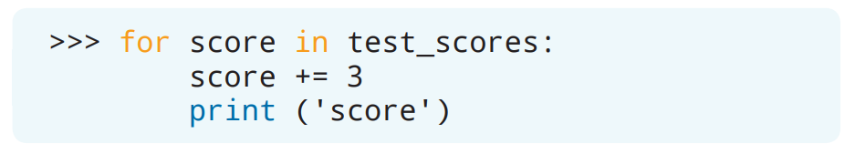

# `for`循环

计算机非常适合用来执行对人们来说非常无聊乏味的重复性操作。这也正是我们为什么会如此喜欢使用计算机编程的重要原因！在计算机编程里，*循环*（*loop*）就是被用来创建重复操作的，而其中的一种循环是 *`for`循环*（*`for` loop*）。

## 创建`for`循环

假设你需要逐行打印出字符串`Python`里的每个字母。于是你可以先创建一个变量，然后把字符串`Python`分配给这个变量。通过`print()`函数，你可以打印出变量的值。但是，这样做的结果是什么呢：


字符串`Python`的确被打印到了解释器里，但这并没有达到我们的目标：逐行打印出字符串里的每个字母。而这个目标，我们可以通过`for`循环来完成。


`for`循环可以在代码里重复相同的步骤。而这个重复的过程被称为*迭代*（*iterating*）。

## 迭代字符串

当你为字符串创建一个`for`循环时，Python会迭代字符串里的每个元素[^1]。在循环里，你可以指定要对每个元素执行的操作。让我们还是字符串`Python`来看看是怎么回事吧！

> [^1]: 译者注：对于字符串来说，元素就是字符

你在前面的内容里已经创建了一个存放字符串`Python`的`language`变量，我们将会使用这个变量来创建出一个`for`循环。首先，创建一条用来表示“对于`language`变量的每个元素”的`for`语句。


你可以为元素取任意的名称。但是，通常来说元素的名称会和变量名相关。

接下来，添加一个你希望程序对字符串`Python`里的每个元素（`item`）执行的操作吧。对于我们最初的目标来说，也就是打印出字符串`Python`里的每个字母（也就是*元素*）。在IDLE里，键入`print()`语句，并且按两次回车键来运行代码吧。


这段代码会从字符串`Python`里的第一个元素开始，完成想要执行的操作，也就是打印这个元素。然后，循环将会为字符串`Python`里的下一个元素重复相同的操作。循环会不断继续，直到打印出了字符串`Python`里的所有元素。

## 迭代列表

迭代不仅可以被用在字符串上，你还可以对列表进行迭代，从而对列表里的每个元素都执行相同的操作。创建一个名为`continents`（大陆）的列表吧，这个列表会包含地球上各个大陆。


> 如果使用中文交互的话：
> ```Python
> >>> continents = ['亚洲', '非洲', '北美洲', '南美洲', '南极洲', '欧洲', '大洋洲']
> ```
> 译者注：列表的最后一个元素按照名称叫做“澳洲”，但是容易于澳大利亚产生歧义，所以用大洋洲指代。

通过`for`循环，来逐行打印出`continents`列表里的每个元素吧。


> 如果使用中文交互的话：
> ```Python
> >>> for continent in continents:
>         print(continent)
>
>
> 亚洲
> 非洲
> 北美洲
> 南美洲
> 南极洲
> 欧洲
> 大洋洲
> ```

循环会从第一个元素`Asia`（`亚洲`）开始，把值输出到解释器里。然后循环重复并打印出下一个大陆的名称。这个循环过程会一直持续到`continents`列表里的所有元素都被打印出来为止。

## 创建`break`语句

要停止循环，可以在循环里添加一条 *`break`语句*（*`break` statement*，*中断语句*）。`break`语句会在循环迭代完所有元素之前停止循环的迭代。


`if`语句可以被用来决定循环是否需要被中断。如果满足`if`语句里的条件，那么循环将会停止迭代。相反的，如果没有满足`if`语句里的条件，那么循环就会继续进行，直到满足中断的条件为止。

要看看怎么使用这个语句，可以只打印出列表里的`Antarctica`（`南极洲`）和它之前的所有元素。基于前面的例子，重新创建一个`for`循环，并且也包含打印出元素的`print()`语句。在`for`循环内添加一条`if`语句，用来检查当前打印的元素是否等于字符串`Antarctica`（`南极洲`）[^2]。

> [^2]: 译者注：原文是：“用来检查下一个打印的元素是否等于字符串`Antarctica`（`南极洲`）”。并不对，应该是“当前打印的元素”


> 如果使用中文交互的话：
> ```Python
> >>> for continent in continents:
>         print(continent)
>         if continent == '南极洲':
>                 break
>
>
> 亚洲
> 非洲
> 北美洲
> 南美洲
> 南极洲
> ```

Python会从第一个元素`Asia`（`亚洲`）开始，把值输出到解释器里。然后，Python会检查循环里的当前元素是否等于字符串`Antarctica`（`南极洲`）。由于字符串`Asia`（`亚洲`）并不等于`Antarctica`（`南极洲`），因此Python会继续迭代`continents`列表，直到当前元素等于`Antarctica`（`南极洲`）为止。当Python遇到了`Antarctica`（`南极洲`）元素时，Python会先打印出这个元素，然后发现元素确实等于字符串`Antarctica`（`南极洲`），进而循环被中断。`continents`列表里的的其它元素将不会被循环也就不会被打印出来。

## 创建`continue`语句

但是，如果你只是希望在你的循环里停止当前的迭代，然后在新的地方继续迭代，该怎么办呢？你可以使用`continue`语句（继续语句）来告诉循环停止当前的迭代，然后从下一个元素继续迭代[^3]。

> [^3]: 译者注：这里原文有问题：“然后在指定的条件下继续迭代”，`continue`语句并没有这个功能。这是`if`语句和`continue`合用的结果。


尝试通过`if`语句和`continue`语句来让循环迭代`continents`列表里的每个元素，不过在`North America`（`北美洲`）停止，然后在`South America`（`南美洲`）继续迭代吧！首先，创建一个`for`循环来为`continents`列表里的元素创建迭代。添加一条`if`语句，用来检查当前元素是否等于字符串`North America`（`北美洲`）。如果元素等于`North America`（`北美洲`），那么循环就应该继续到下一个元素。否则`for`循环里应该打印出这个元素。


> 如果使用中文交互的话：
> ```Python
> >>> for continent in continents:
>         if continent == '北美洲':
>                 continue
>         print(continent)
>
>
> 亚洲
> 非洲
> 南美洲
> 南极洲
> 欧洲
> 大洋洲
> ```

Python会从第一个元素`Asia`（`亚洲`）开始，并且检查这个元素是否等于字符串`North America`（`北美洲`）。由于字符串`Asia`（`亚洲`）不等于字符串`North America`（`北美洲`），因此会打印出这个元素。循环继续迭代列表里的元素，直到这个元素等于字符串`North America`（`北美洲`）为止。当迭代到`North America`（`北美洲`）元素的时候，Python就会发现`North America`（`北美洲`）元素等于字符串`North America`（`北美洲`）。因此，循环将停止并且不会完成`continue`语句之后的`print()`操作。取而代之的是，Python会从下一个元素`South America`（`南美洲`）开始再次迭代，直到迭代完`continents`列表里的所有元素。

### 小测验

最近，因为评分系统出现了故障，存放在克莱因先生（Mr. Klein）的成绩簿里的考试成绩被降低了3分。克莱因先生可以使用哪个`for`循环来把所有的考试成绩都提高3分并且打印出新的考试成绩呢？

A.
B.
C.
D.

## 使用`range()`函数

有些时候，你会想要使用某个范围内的数字来进行多次迭代。`range()`函数为你提供一种可以在使用`for`循环时创建数字列表的方法。


`range()`函数包含了两个参数：*`start`*（*起始*）和 *`stop`*（*结束*）参数，它们被用来指定范围应该从何处开始以及何处作为结尾。`start`参数的默认值是`0`。不过，如果你想要一个特定的范围的话，就需要用`start, stop`语法。

让我们首先使用默认的`start`参数来创建一个范围。Python可以通过`for`循环和`range()`函数打印出从`0`到`10`的数字序列。在`range()`函数的括号里，应该设置的是范围应当结束（但不包括）的数字[^4]。

> [^4]: 译者注：这里原文有问题：“应该设置的是范围应当计数（但不包括）的数字”。


Python会从`0`开始并打印出值。Python会继续迭代范围里的每个元素，直到打印出所有`0`到`10`之间的数字为止。由于Python是从`0`开始计数的，因此总共会打印出`11`个值。

要指定特定范围，就需要在`range()`函数里同时输入`start`和`stop`参数。


第一个参数被用来确定范围应该从何处开始计数；第二个数字被用来确定应该在哪里停止计数。通过这个语法，可以使用`for`循环和`range()`函数打印出从`3`到`7`的数字序列。


`for`循环会从数字`3`开始，打印出每个值，但并不包括`8`。

你还可以通过告诉代码在循环的范围内跳过特定数量的数字来发挥出更多的创意。这个跳过或递增的过程可以通过*`step`*（*步数*）参数来完成。


第一个参数仍然被用来确定范围应该从何处开始计数；第二个数字也是被用来确定应该在哪里停止计数。然而，第三个参数会告诉代码，在范围内循环时，每一次计数应该增加多少。

通过这个语法，可以使用`for`循环和`range()`函数打印出从`10`到`100`以`10`递增的数字序列。


由于你希望范围会包括`100`，因此结束参数必须比`100`大`1`。Python会从数字`10`开始，打印出这个数字，然后把`x`变量的值加`10`来得到下一个迭代的元素[^5]。这个循环一直持续到整个范围都被迭代为止。

> [^5]: 译者注：这里原文有问题：“把下一个会被打印出的值加`10`，然后打印出这个数字”。顺序反了，循环在执行的时候不会先计算下一次迭代的值。

## 项目：寻找绿色弹珠

### 项目描述

玛丽亚（Mariah）最近开始收集弹珠，她已经收集了下面这些类型和数量的弹珠：

* 红色：2
* 橙色：1
* 粉色：3
* 黄色：2

遗憾的是，玛丽亚很难找到绿色弹珠来添加到她的收藏里。暑假期间，她发现了附近有一家弹珠商店，顾客可以从一个神秘口袋里挑选弹珠。从袋子里拿出弹珠的条件是，玛丽亚不允许看袋子里面，而且她每天都只能从袋子里取出5颗弹珠。如果她选择不保留被拿出的弹珠，她就必须把这些弹珠放回到袋子里去。因为玛利亚想要一个绿色的弹珠，所以一旦找到了绿色弹珠，她就不会再继续挑选弹珠了。

这个神秘口袋里装了下面这些数量的弹珠：

* 蓝色：3
* 绿色：4
* 橙色：1
* 紫色：2
* 黄色：2
* 粉色：2
* 红色：4

创建一个程序来记录玛丽亚从袋子里取出弹珠的次数，并判断取出的弹珠是不是绿色的。如果玛丽亚从袋子里取出了一个绿色的弹珠，那么就把这颗弹珠从神秘口袋里移除掉，并添加到玛丽亚的收藏里。一旦玛利亚取出了一个绿色的弹珠，她就会停止继续从神秘口袋里取出弹珠。要注意的是，玛丽亚每天只能从神秘口袋里取出5颗弹珠。

### 步骤

#### 打开IDLE

在开始编码之前，请打开IDLE并创建一个新文件。请使用文件名**marbles.py**来保存新文件。

#### 导入随机模块

Python配备了可以在程序里使用的内置模块。这些模块能够让你在代码里执行一些有趣的操作！*random*（*随机*）模块能够让你得到一个随机值。随机模块中有一个`random.choice()`函数，它可以从列表里返回一个随机元素。要在Python中使用一个模块，必须先导入这个模块。


在IDLE里，导入随机模块吧。于是你就可以在你的程序里使用`random.choice()`函数从神秘口袋里选出弹珠了。


#### 创建玛丽亚的收藏列表

当玛丽亚从神秘口袋里取出弹珠时，她需要把她得到的绿色弹珠添加到她的收藏里去。为玛丽亚当前收集的弹珠创建一个名为`collection`的列表吧。


> 如果使用中文交互的话：
> ```Python
> collection = ['红色', '粉色', '橙色', '红色', '粉色', '黄色', '粉色', '黄色']
> ```

#### 创建神秘口袋列表

既然你已经知道了在神秘口袋里有哪些弹珠，那么就创建一个名为`secret_bag`的列表来记录哪些弹珠可以被取出吧。


> 如果使用中文交互的话：
> ```Python
> secret_bag = ['粉色', '蓝色', '绿色', '橙色', '红色', '紫色', '绿色', '蓝色', '蓝色', '红色', '绿色', '紫色', '黄色', '红色', '粉色', '红色', '绿色', '黄色']
> ```

弹珠的输入顺序并不重要，因为玛丽亚总是会随机挑其中的一个弹珠。

#### 创建已选弹珠列表

为了记录玛丽亚取出了哪些弹珠，你可以创建一个空列表，然后再把取出的弹珠添加到这个列表里。把列表里的元素保留为空就可以创建一个空列表。


#### 记录剩余的尝试次数

商店对神秘口袋有严格的规定！顾客每天只能从袋子里取出5颗弹珠。创建一个名为`tries_remaining`的变量来记录玛丽亚剩余的尝试次数。


每当玛丽亚从神秘口袋里取出一个弹珠时，剩余的尝试次数就会减少，直到剩余的尝试次数为`0`为止。

#### 创建一个`for`循环来进行迭代

由于Python不能直接迭代`int`类型，所以可以使用`range()`函数来循环随机挑选一个弹珠`5`次。请记住，当使用`range()`函数时，循环将会执行到传递到圆括号里的数字减`1`的数字[^6]。

> [^6]: 译者注：这里原文有问题：“循环将会执行到传递到圆括号里的数字减`1`次迭代”。`range(6)`会执行`0`到`5`一共`6`次迭代。


#### 创建嵌套的`if`语句

在允许玛丽亚取出另一个弹珠之前，程序需要考虑若干条条件语句。在Python中，你可以在一条`if`语句里使用另一条`if`语句，这被称为*嵌套*（*nesting*）。首先，在`for`循环里创建一条用来检查剩余的尝试次数是否大于`0`的`if`语句。如果剩余的尝试次数小于或等于`0`[^7]，那么就打印一条消息，让玛丽亚知道她的尝试次数已经用完了，应该明天再来尝试。

> [^7]: 译者注：这里原文有问题：“如果剩余的尝试次数小于`0`”。根据上文和代码，条件里应该包含等于`0`的情况。


> 如果使用中文交互的话：
> ```Python
> if tries_remaining > 0:
> else:
>     print('抱歉，你的尝试次数已经用完了。请明天再来！')
> ```

如果剩余的尝试次数大于0[^8]，也会有一些操作。在`if`语句里，但在`else`语句之前，我们会执行的操作有：从神秘口袋里随机挑选一个弹珠，将弹珠添加到已选弹珠列表里，并且减少剩余的尝试次数。刚才有提到，`random.choice()`函数可以用来从列表里随机挑选一个元素。

> [^8]: 译者注：这里原文有问题：“如果剩余的尝试次数大于`6`”。根据上文和代码，这里应该是“如果剩余的尝试次数大于`0`”。


你可以创建一个名为`selection`的变量来存放随机挑选的弹珠。之后，这个存放到`selection`的弹珠被添加到用来记录从神秘口袋里取出的弹珠的`marbles_chosen`列表里。在将所选的弹珠添加到`marbles_chosen`列表之后，就需要把`tries_remaining`的值减`1`来减少剩余的尝试次数。

接下来就该嵌套一条`if`语句了！在减少剩余的尝试次数之后，创建一条`if`语句来检查这次随机挑选的弹珠是不是绿色的。如果随机选择的弹珠是绿色的，那么就把这颗弹珠添加到玛丽亚的收藏里，并且从神秘口袋里移除掉。


> 如果使用中文交互的话：
> ```Python
> if selection == '绿色':
>     collection.append(selection)
>     secret_bag.remove(selection)
> ```

在嵌套的`if`语句里，你可以检查存放到`selection`变量的值是否等于字符串`green`。如果值相等的话，就可以使用`append()`方法来把这个值（也就是弹珠）添加到玛丽亚的收藏里，并且使用`remove()`方法从神秘口袋里移除它。

让我们再创建一条嵌套的`if`语句！这条嵌套的`if`语句会被用来当绿色弹珠被添加到了玛丽亚的收藏里后中断循环。在中断循环的时候，还需要打印一条让玛丽亚知道她挑中了一个绿色弹珠的声明。[^9]

> [^9]: 译者注：这里原文还有一句：“另外，还需要让玛利亚知道她今天还能再试几次。”。根据上文和代码，这个逻辑并不需要也没有实现。


> 如果使用中文交互的话：
> ```Python
> if ('绿色' in collection):
>     print(f'完美！你找到了一个绿色的弹珠。如果你还想要继续挑选弹珠，你今天还能试{tries_remaining}次。')
>     break
> ```
>
> 因为继续挑选弹珠的逻辑并不需要也没有实现，所以这段代码应该删掉后面的输出文本：
> ```Python
> if ('green' in collection):
>     print('Awesome! You found a green marble.')
>     break
> ```
> 如果使用中文交互的话：
> ```Python
> if ('绿色' in collection):
>     print('完美！你找到了一个绿色的弹珠。')
>     break
> ```

通过`in`关键字来检查`green`（`绿色`）元素是否在`collection`列表里。后面的`print()`语句打印出了声明[^10]。最后通过`break`语句来停止循环。

> [^10]: 译者注：这里原文是：“后面的`print()`语句使用了字符串格式化来把分配给`tries_remaining`的值传递到打印的字符串里”。根据上文和代码，继续挑选弹珠的逻辑并不需要也没有实现，所以重写了这句话。

#### 打印玛丽亚今天取出的弹珠

为了让玛丽亚知道在循环停止之前挑选了哪些弹珠，再编写一条`print()`语句，使用字符串格式化来打印出`marbles_chosen`列表里的元素。`print()`语句应该在`for`循环之外。


> 如果使用中文交互的话：
> ```Python
> print(f'这是你今天取出的弹珠颜色：{marbles_chosen}')
> ```

#### 挑选弹珠吧！

在检查了代码之后，保存并运行程序吧。


> 译者注：第四行的输出应该在第三行
> ```
> Here are all the marbles that were chosen: ['red', 'green']
> ```
>
> 如果使用中文交互的话：
> ```
> 完美！你找到了一个绿色的弹珠。如果你还想要继续挑选弹珠，你今天还能试3次。
> 这是你今天取出的弹珠颜色：['红色', '绿色']
> ```
>
> 因为继续挑选弹珠的逻辑并不需要也没有实现，所以这段代码应该删掉后面的输出文本：
> ```Python
> Awesome! You found a green marble.
> Here are all the marbles that were chosen: ['red', 'green']
> ```
> 如果使用中文交互的话：
> ```Python
> 完美！你找到了一个绿色的弹珠。
> 这是你今天取出的弹珠颜色：['红色', '绿色']
> ```

在程序启动后，Python会先导入随机模块，从而可以在代码里使用`random.choice()`函数从`secret_bag`列表里随机挑选一个弹珠。然后，Python会开始六次迭代里的第一次迭代[^11]，并且检查`tries_remaining`变量的值是不是大于`0`的。因为`tries_remaining`变量的值大于`0`，所以会从`secret_bag`列表里随机挑选出一个元素并添加到`marbles_chosen`列表里。然后会把`tries_remaining`的值减`1`。接下来，Python会检查随机挑选的弹珠是否为绿色。如果弹珠是绿色的，这个元素将会被添加到`collection`列表里并从`secret_bag`列表里移除。Python会去判断并确认绿色弹珠有没有存在于`collection`列表里[^12]。如果在`collection`列表里有了绿色弹珠，那么循环会被打断并打印出找到了的绿色弹珠的声明[^13]。不然的话，Python会继续循环，直到满足这两个条件之一：`tries_remaining`变量不再大于`0`或是挑中了一个绿色弹珠。在循环停止之后，将会打印出`marbles_chosen`列表里的元素。

> [^11]: 译者注：这里原文是：“Python会开始五次迭代里的第一次迭代”。根据上文和代码，一共有6次迭代。不然永远都不会打印出“抱歉，你的尝试次数已经用完了。请明天再来！”这句话

> [^12]: 译者注：这里原文是：“Python会去判断并确认随机挑选的弹珠有没有存在于`collection`列表里”。根据上文和代码，简化为绿色弹珠就行了。

> [^13]: 译者注：这里原文是：“那么循环会被打断并打印出找到了的绿色弹珠以及剩余的尝试次数的声明。”。根据上文和代码，继续挑选弹珠的逻辑并不需要也没有实现，所以删除掉了后面部分。

你可以在程序里为从神秘口袋里挑选弹珠添加更多的条件逻辑，以及创建你独有的限制和规则！在嵌套`if`语句时，一定要注意缩进。IDLE总会帮助你确定需要缩进多少数量的空格!

下面是**marbles.py**完整程序的例子：


> 循环次数应该是6次，因此第五条注释语句应该是：
> ```Python
> # For loop used to randomly select marbles 6 times unless a green marble is chosen.
> ```
> 如果使用中文交互的话：
> ```Python
> # 向程序导入随机模块
> import random
>
> # 已经收集到的弹珠
> collection = ['红色', '粉色', '橙色', '红色', '粉色', '黄色', '粉色', '黄色']
>
> # 神秘口袋里的弹珠
> secret_bag = ['粉色', '蓝色', '绿色', '橙色', '红色', '紫色', '绿色', '蓝色', '蓝色', '红色', '绿色', '紫色', '黄色', '红色', '粉色', '红色', '绿色', '黄色']
>
> # 所选弹珠的空列表，用来存放随机选择的弹珠
> marbles_chosen = []
>
> # 随机选择弹珠的剩余尝试次数
> tries_remaining = 5
>
> # 用来随机选择弹珠，并且当没有选择到绿色弹珠时会循环6次的for循环。
> # 每个选择一个弹珠，尝试次数会减少。
> for x in range(6):
>     if tries_remaining > 0:
>         selection = random.choice(secret_bag)
>         marbles_chosen.append(selection)
>         tries_remaining -= 1
>         if selection == 'green':
>             collection.append(selection)
>             secret_bag.remove(selection)
>             if ('green' in collection):
>                 print(f'完美！你找到了一个绿色的弹珠。')
>                 break
>     else:
>         print('抱歉，你的尝试次数已经用完了。请明天再来！')
>
> print(f'这是你今天取出的弹珠颜色：{marbles_chosen}')
> ```
