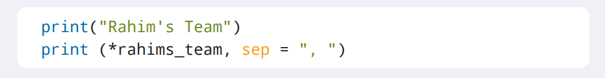

# `while`循环

在上一章里，你学习了如何在Python中使用`for`循环来执行重复的操作。但是，如果你想让循环能够在条件为真时可以不断重复，应该怎么做呢？让我们来学习Python提供的另一种循环吧——*`while`循环*!

## 创建`while`循环

假设有一个会在每次迭代完后都会减少的`x`变量。在`x`不断递减直到等于`0`之前，每一次迭代里都会输出字符串`"x is greater than 0"`（`"x大于0"`）。你要怎么来完成这个需求呢？这时你就可以通过`while`循环来实现了!


只要定义的条件为真，`while`循环就会不断地重复(或迭代)`while`循环下面缩进的所有操作。让我们用`while`循环来为`x`变量实现前面的逻辑吧。


> 如果使用中文交互的话：
> ```Python
> >>> x = 5
> >>> while x > 0:
>         print("x大于0")
>         x -= 1
>
>
> x大于0
> x大于0
> x大于0
> x大于0
> x大于0
> ```

在上面的的代码里，`x`变量在最开始被赋值为`5`。这个值也被`while`循环用来进行倒数。在变量赋值的语句下面，`while`循环会以条件“当`x`大于`0`”作为开始。这也就意味着当`x`的值大于`0`时，`while`循环里的操作就会被执行。在这个例子里，操作是打印一个字符串，并且`x`的值减少`1`。

就像你看到的那样，在完成的五次迭代里`x`都是大于`0`的，因此那个字符串被打印了5次。为了能够确定`x`的值是不是真的在减少*并且*仍然是大于`0`的，让我们修改代码从而在打印的字符串里包含`x`当前值。你可以使用`f`语法的字符串格式化来把`x`的当前值插入到字符串里。


> 如果使用中文交互的话：
> ```Python
> >>> x = 5
> >>> while x > 0:
>         print(f"x的值是{x}")
>         x -= 1
>
>
> x的值是5
> x的值是4
> x的值是3
> x的值是2
> x的值是1
> ```

## `break`语句

和`for`循环类似的，你也可以使用 *`break`语句*（*`break` statement*，*中断语句*）来中断`while`循环。而且，即便`while`循环的条件仍然真，`break`语句也会中断整个循环。


`if`语句可以被用来判断循环是否需要被中断。如果满足`if`语句里的条件，那么循环就会停止迭代。但是，如果没有满足`if`语句里的条件，那么循环将会继续进行，直到满足中断的条件为止。让我们来看看`break`语句的实际应用吧!


在这段代码里，首先会把`num`变量赋值为`2`。`while`循环会检查`num`的值是否小于或等于`10`。如果条件为真，那么`while`循环将检查`num`的值是否等于8。如果`num`的值等于8，那么就中断`while`循环。但是，如果`num`的值不等于`8`，那么就会打印出`num`的值，并且把`num`的值增加`2`。然后，`while`循环会继续迭代，直到`num`的值为`8`时结束。

## `continue`语句

和`for`循环同样类似的，你也可以在某个点停止运行迭代里代码，然后继续执行下一次迭代。你可以使用`continue`语句（继续语句）来告诉循环停止当前的迭代，然后从下一个元素继续迭代[^1]。

> [^1]: 译者注：这里原文有问题：“然后在指定的条件下继续迭代”，`continue`语句并没有这个功能。应该是`if`语句和`continue`合用的结果。


让我们用`continue`语句来打印出从`2`到`10`的所有偶数吧。首先定义一个名为`num`的变量并且把它的赋值为`2`。每次迭代结束后`num`的值会被加上`1`。如果`num`的当前值是偶数，那么就把`num`打印到解释器。


> 如果使用中文交互的话：
> ```Python
> >>> num = 2
> >>> while num <= 10:
>         if (num % 2) == 0:
>                 print(f'{num}是偶数')
>         num += 1
>         continue
>
>
> 2是偶数
> 4是偶数
> 6是偶数
> 8是偶数
> 10是偶数
> ```
> 译者注：这段代码没有`continue`语句也可以输出相同的内容。并不是`continue`语句的好例子。我们可以稍加修改来展现`continue`语句的作用。
> ```Python
> >>> num = 2
> >>> while num <= 10:
>         if (num % 2) == 1:
>                 num += 1
>                 continue
>         print(f'{num} is an even number')
>         num += 1
>
>
> 2 is an even number
> 4 is an even number
> 6 is an even number
> 8 is an even number
> 10 is an even number
> ```
> 如果使用中文交互的话：
> ```Python
> >>> num = 2
> >>> while num <= 10:
>         if (num % 2) == 1:
>                 num += 1
>                 continue
>         print(f'{num}是偶数')
>         num += 1
>
>
> 2是偶数
> 4是偶数
> 6是偶数
> 8是偶数
> 10是偶数
> ```

在上面的代码里，`while`循环会检查`num`的值是否小于或等于`10`。如果条件为真，那么`while`循环会检查`num`对`2`取模的值是否等于`1`。提醒一下，取模运算返回是两个数相除之后的余数。如果一个数除以`2`的余数是`0`，那么这个数就是偶数，不然如果余数是`1`就代表这个数是奇数。对于上面的代码来说，如果模除以`2`的余数是`1`，那么这个数字就是奇数。因此停止当前迭代，从下一个迭代继续。不然的话，就代表`num`的值是偶数，于是它的值会被打印到解释器。不论`num`是奇数还是偶数，它的值都会加`1`，然后继续执行`while`循环。[^2]

> [^2]: 译者注：这一段采用的是修改后的代码。原文是：“在上面的代码里，`while`循环会检查`num`的值是否小于或等于`10`。如果条件为真，那么`while`循环检查`num`对`2`取模的值是否等于`0`。提醒一下，取模运算返回是两个数相除之后的余数。如果一个数除以`2`的余数是`0`，那么这个数就是偶数。对于上面的代码来说，如果模除以2的余数是`0`，那么这个数字就是偶数。因此，`num`的值将会被打印到解释器，然后`num`的值会加`1`。继续执行`while`循环。”可以看到原文的描述里也没有任何关于`continue`语句的解释。

## `while`, `else`循环

如果你想在`while`循环的条件不再为真时执行一段代码的话，可以通过添加一条`else`语句来实现！


在每次迭代开始的时候，Python都会去检查`while`循环里指定的条件是否为真。当条件为假时，`else`语句里的操作就会被执行。

让我们创建一个逻辑来模拟模型火箭的发射过程吧。假设模型火箭只能在没有风的时候才能发射。在`while`循环从`10`倒数到`1`时，不断询问用户当前是否有风。如果有风的话，就中断循环，打印出`Mission Aborted`（`任务中止`）这句话。如果没有风，就继续倒计时。最后倒计时结束，发射模型火箭，并且打印出`We Have Liftoff!`（`发射成功！`）。


> 如果使用中文交互的话：
> ```Python
> >>> countdown = 10
> >>> while countdown > 0:
>         print(countdown)
>         countdown -= 1
>         if input('目前有风吗？ ') == 'yes':
>                 print('任务中止')
>                 break
> else:
>         print('发射成功！')
>
>
> 10
> 目前有风吗？ no
> 9
> 目前有风吗？ no
> 8
> 目前有风吗？ no
> 7
> 目前有风吗？ no
> 6
> 目前有风吗？ no
> 5
> 目前有风吗？ no
> 4
> 目前有风吗？ no
> 3
> 目前有风吗？ no
> 2
> 目前有风吗？ no
> 1
> 目前有风吗？ no
> 发射成功！
> ```

上面的代码以`countdown`变量开始，它被赋值为`10`。`while`循环会检查`countdown`的值是否大于`0`。如果条件为真，那么就会打印出`countdown`的值，并且把它减`1`。接下来是一条用`input()`函数来询问是否有风的条件语句。如果用户的输入等于字符串`yes`，那么就会输出`Mission Aborted`（`任务中止`）, 并且中断`while`循环。但是，如果用户的输入不等于字符串`yes`，那么`while`循环就会继续进行下一个迭代。当`while`循环完成的时候，`else`语句将会输出`We Have Liftoff!`（`发射成功！`）。

### 小测验

下面哪个关于`while`循环的陈述是正确的?

A. `while`循环在指定的条件为假时就会进行迭代。`while`循环可以通过使用`break`语句进行中断。`break`会语句停止整个循环，不再执行`while`循环里的代码。

B. `while`循环不论指定的条件是真还是假都只能迭代一次。

C. `while`循环在指定的条件为真时就会进行迭代。`while`循环可以通过使用`continue`语句进行中断。`continue`会语句停止整个循环，不再执行`while`循环里的代码。

D. `while`循环在指定的条件为真时就会进行迭代。`while`循环可以通过使用`break`语句进行中断。`break`会语句停止整个循环，不再执行`while`循环里的代码。

## 项目: 儿童足球队

### 项目描述

贾里萨（Jaleesa）和拉希姆（Rahim）被选为今天踢球比赛的队长。他们决定不要自己来选择队友，而是用Python来帮忙选择队员！用随机模块来创建一个可以随机分配球员到球队的程序吧。程序需要不断地向球队里添加球员，直到球队里的球员总数到了8人（7人加上队长）。没有被选中加入第一个球队的球员将会自动加入第二个球队。

创建程序后，运行程序并打印出分配给每个球队的球员名单。

这是是今天参加踢球比赛的球员:

* Anastasia
* Eli
* Jamal
* Jada
* Theo
* Michelle
* Adam
* Rhea
* Charlie
* Jasmine
* Marley
* Kenji
* Sydney
* Yara

### 步骤

#### 打开IDLE

在开始编码之前，请打开IDLE并创建一个新文件。请使用文件名**kickball.py**来保存新文件。

#### 导入随机模块

Python配备了可以在程序里使用的内置模块。这些模块能够让你在代码里执行一些有趣的操作！要在Python中使用一个模块，必须先导入这个模块。


*random*（*随机*）模块能够让你得到一个随机值。随机模块中有一个`random.choice()`函数，它可以从列表里返回一个随机元素。在IDLE里，导入随机模块吧。于是你就可以在你的程序里使用`random.choice()`函数从可用的球员名单里随机选择一名球员了。


#### 为球员创建一个列表

今天参加踢球比赛的队员将会从名单里被随机挑选。这个项目里，我们会首先随机挑选出贾里萨球队的所有7名队员。没有被选中的球员将会成为拉希姆球队的队员。由于一名球员只能被选中一次，因此当被贾里萨的球队选中后，这名球员就需要被从可用球员名单里删除。

创建一个名为`available_players`的列表，用来包含前面列出的14个可用球员。


#### 为每个球队创建一个列表

每个队长都需要有一个自己的球员名单来记录他们的球队成员。首先，为贾里萨的球队创建一个名为`jaleesas_team`的列表。别忘了把贾里萨也加入进去。


接下来，为拉希姆的球队创建一个名为`rahims_team`的列表。别忘了把拉希姆也加入进去。


#### 为贾里萨的球队添加球员

这个程序会在贾里萨的球队球员总数有8人之前，不断地随机选择一名球员。你可以通过获取`jaleesas_team`列表的长度（也就是`len`函数）来了解贾里萨所在球队的球员总数。`len()`函数能够为你提供列表里元素的总数。


这段代码创建了当贾里萨的球队长度小于`8`时进行迭代的`while`循环。提醒一下，Python是从`0`开始计数的，而不是从`1`开始的。

接下来，在`while`循环里添加代码，从而把球员添加到球队里。之前导入的随机模块在这里就派上了用场！在`while`循环里，创建一个名为`player_selected`的变量来存放随机选择的球员。用`random.choice()`函数从`available_players`列表里随机选择一名球员。


接下来，把这名球员添加到（也就是`append`方法）贾里萨的球队里去。`append()`方法被用来向列表里添加一名球员。


最后，既然被随机挑选出的球员已经被贾里萨的球队选中，那么就需要把这名球员从可用列表里移除掉。`remove()`方法被用来把球员从列表里移除。


当`while`循环开始时，它会检查`jaleesas_team`列表的长度是否小于`8`。如果长度小于`8`，那么就使用`random.choice()`函数从`available_players`列表里随机选择一名球员。选中的球员会被添加到`jaleesas_team`列表里，并从`available_players`列表里删掉。当`jaleesas_team`列表的长度不再小于`8`时，循环就会中止。

#### 为拉希姆的球队添加球员

既然贾里萨的球队已经准备就绪，那么就把剩余的球员从`available_players`列表里添加到拉希姆的球队里去吧。可以使用`extend()`方法来实现。


#### 打印从每个队的球员名单

在贾里萨的球队成立之后，你需要让队长和球员知道谁属于哪个球队。首先，在单独的一行上打印出字符串`"Jaleesa’s Team"`（`"贾里萨的球队"`）。


> 如果使用中文交互的话：
> ```Python
> print("贾里萨的球队")
> ```

在字符串`“Jaleesa’s Team”`下面，打印出`jaleesas_team`列表里的球员名单。你应该还记得，如果把列表变量直接传递给`print()`语句，输出的格式会包含方括号、逗号和引号。为了让球员名单读起来更像是用逗号分割的自然语言，你可以添加`*`号，并且提供用来分隔列表里的每个元素（球员）的字符。


> 如果使用中文交互的话：
> ```Python
> print("贾里萨的球队")
> print (*jaleesas_team, sep = "，")
> ```

同样的，对拉希姆的球队进行相同的操作!



> 如果使用中文交互的话：
> ```Python
> print("拉希姆的球队")
> print (*rahims_team, sep = "，")
> ```

在程序启动后，Python会先导入随机模块，从而可以在代码里使用`random.choice()`函数从`available_players`列表里随机挑选一名球员。然后，Python会开始第一次迭代，并且检查`jaleesas_team`列表的长度是不是小于`8`的。因为`len(jaleesas_team)`函数返回的值小于`8`，所以会从`available_players`列表里随机选择一名球员并添加到`jaleesas_team`列表里。选中的球员将会从`available_players`列表里移除。接下来，Python会重复循环并检查`len(jaleesas_team)`函数返回的值是否仍然小于`8`。这个循环会一直继续，直到条件不再为真为止。之后，把`available_players`列表里的剩余球员添加到`rahims_team`列表里去。[^3]最后，打印出每个球队的球员名单。

> [^3]: 译者注：这里原文有错：“因为Python里的逻辑流是从上到下执行的，所以接下来会执行`for`循环，循环里会不断获得`available_players`列表里剩余的每名球员，并且把他们添加到`rahims_team`列表里去。”，代码里并没有任何的`for`循环，因此删去并替换内容。

下面是**kickball.py**完整程序的例子：


> 译者注：第五行注释有错，并没有用到`for`循环，因此应当删去
>
> 如果使用中文交互的话：
> ```Python
> # 导入随机模块从列表里随机选择元素
> import random
>
> # 用来选择队友的可用球员名单
> available_players = ['Anastasia', 'Eli', 'Jamal', 'Jada', 'Theo', 'Michelle', 'Adam', 'Rhea', 'Charlie', 'Jasmine', 'Marley', 'Kenji', 'Sydney', 'Cooper']
>
> # 每个队长的球队名单
> jaleesas_team = ['Jaleesa']
> rahims_team = ['Rahim']
>
> # 通过while循环进行迭代，直到贾里萨的球队总共有8名队员，
> while len(jaleesas_team) < 8:
>     player_selected = random.choice(available_players)
>     jaleesas_team.append(player_selected)
>     available_players.remove(player_selected)
>
> # 把剩余的球员添加到拉希姆的球队里
> rahims_team.extend(available_players)
>
> # 打印每个球队里的球员名单
> print("贾里萨的球队")
> print (*jaleesas_team, sep = "，")
>
> print("拉希姆的球队")
> print (*rahims_team, sep = "，")
> ```
