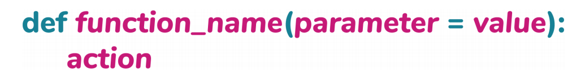
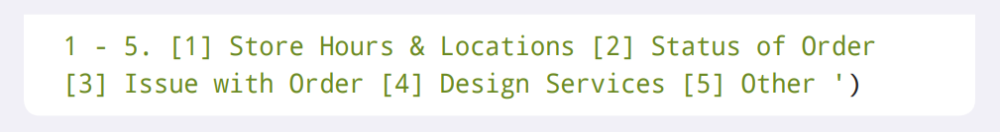
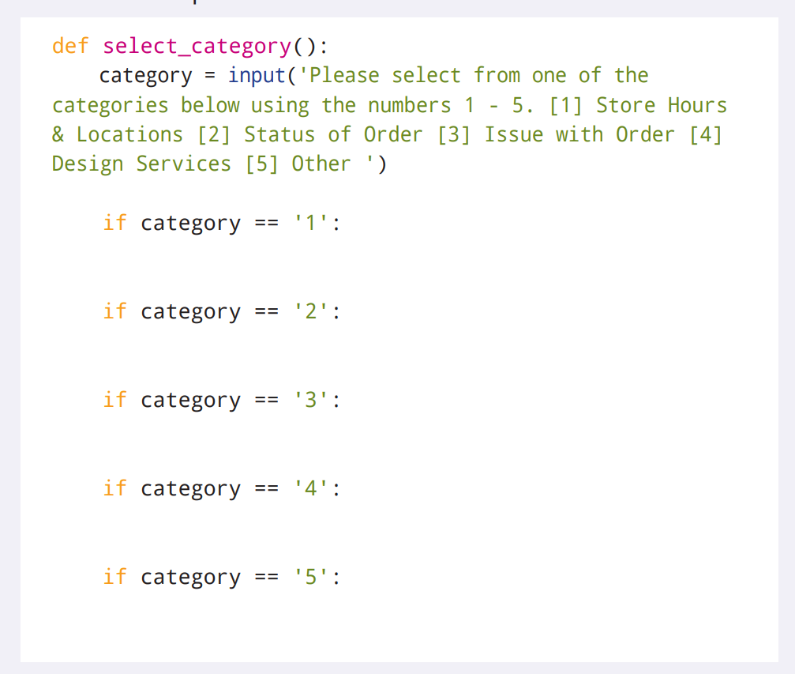
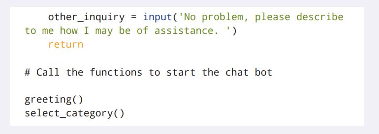

# 函数

Python程序通常会把相同操作集定义为一个代码块。也就是说，并不会在程序里不断地重写相同的代码，而是会创建一个可以在任何需要的地方都可以使用的*函数*（*function*）。

## 创建函数

在Python中，每个函数都有一个名称，也就是你用来调用它的名称。下面是定义函数的语法:


所有的函数都以`def`关键字作为开头，后面跟着函数名和一对圆括号。函数的下面的部分是函数体。函数体里包含了你为了完成函数所选择的各项操作。

下面的例子是一个名为`hello_world`的函数，这个函数会打印出字符串`"Hello World"`:


## 调用函数

上面那个例子里的函数在被调用之前并不会在程序里执行任何操作。调用函数会让你的代码运行函数体里的代码。要调用函数，请使用函数名并包含圆括号。圆括号被用来表示：“把这个名称视为函数并调用它。”


要注意的是，你并不需要在调用函数的时候包含`print`语句。这是因为`hello_world()`函数在函数体里已经包含了一条`print`语句，所以函数内的字符串会在函数被调用时被打印出来。

并且，函数可以做的不仅仅是打印字符串！实际上，到目前为止编写的大部分代码都可以被放在函数体里。

## 返回

通过在函数体里添加`return`语句，就能够结束函数的运行。出现在函数体里的`return`语句可以包含一个表达式[^1]。这个*表达式*（*expression*）可以是值、变量、操作符或者是调用另一个函数。

> [^1]: 译者注：这句原文有问题：“出现在函数体里的各项操作末尾的`return`语句可以包含一个表达式”。`return`语句可以出现在任何地方并不只局限在函数体的末尾。


如果在`return`语句里包含了表达式，那么就会对这个表达式进行计算并返回它的值。能够返回某个值是非常有用的，这是因为它可以让你在代码里使用这个函数的结果值。但是，如果函数的没有包含`return`语句，或是`return`语句没有包含任何表达式[^2]，那么函数将会返回`None`。

> [^2]: 译者注：这句原文有问题：“如果函数的末尾没有包含`return`语句”。不止这一种情况可以返回`None`。

让我们按照上面的例子再次创建一个`hello_world()`函数，不过这次在函数体的末尾添加一条`return`语句。


## 参数

有些时候，你可能需要为函数提供一些数据来完成函数体里的操作。这些需要被传递给函数的数据被称为*形式参数*（*形参*，*parameter*）。


当调用包含形参的函数时，需要在圆括号内为参数提供相应的值。这些值被称为*实际参数*（*实参*，*argument*）。Python会接受实参并把它们赋值给由形参命名的变量。通常来说，函数会按照顺序来接受实参，并且按相同的顺序把实参赋值给形参。

让我们创建一个名为`good_morning()`的函数，它通过使用姓和名来问候某人。


> 如果使用中文交互的话：
> ```Python
> >>> def good_morning(fname, lname):
>         print(f'你好，{fname} {lname}')
>         return
>
> >>> good_morning('April', 'Speight')
> 你好，April Speight
> ```

`good_morning()`函数有两个形参：`fname`和`lname`。在函数体里会输出一个字符串，这个字符串包含了在调用`good_morning()`函数时传入的实参。在调用`good_morning()`函数时，括号里提供的两个实参会被赋值给函数内部的两个形参变量：`fname`和`lname`。然后，你就可以像使用函数体里的其他变量那样使用这些形参变量了。有一点非常重要，函数可以接受任何类型的值来作为实参，比如`int`类型。例如，下面的`sum(`)函数会接受两个形参`a`和`b`，并返回两个数的和[^3]：

> [^3]: 译者注：由于历史遗留问题，Parameter和Argument都可用被翻译成“参数”。不过，Parameter是函数定义里的参数，也被叫做*Formal Parameter*，形式参数，形参。Argument是调用函数时传入的参数，也被叫做*Actual Parameter*，实际参数，实参。下文中，除非需要对他们进行区分，不然会统一使用“参数”作为翻译。


### 小测验

下面的代码块里包含了一个定义了`double()`函数的代码片段。`double()`函数会接受一个数字，并返回这个数字的两倍。请说出代码块每个部分的名称。


### 默认参数

函数也可以有默认参数，于是参数就是可选的了。除非在调用函数时提供了值，否侧函数会使用默认值。



在创建函数时就需要把默认值赋值给参数。当调用的函数包含默认值时，这个默认值就会被使用。下面是一个名为`favorite_season`的函数的例子，它有一个名为`season`的参数，并且`season`参数的默认值为`Summer`（`夏天`）。


> 如果使用中文交互的话：
> ```Python
> >>> def favorite_season(season="夏天"):
>         print(f"{season}是我最喜欢的季节。")
>
>
> >>> favorite_season()
> 夏天是我最喜欢的季节。
> ```

在上面这个例子里，`favorite_season()`函数在被调用时并没有在圆括号里传递任何值。因此，`Summer is my favorite season.`（`夏天是我最喜欢的季节。`）就会被打印出来。但是，如果在调用函数时有传递任何值，那么在打印的时候就会使用提供的值。


> 如果使用中文交互的话：
> ```Python
> >>> def favorite_season(season="夏天"):
>         print(f"{season}是我最喜欢的季节。")
>
>
> >>> favorite_season('春天')
> 春天是我最喜欢的季节。
> ```

尽管`season`参数的默认值是`Summer`（`夏天`），因为在调用函数的时候传递了值`Spring`（`春天`），所以打印出的字符串是`Spring is my favorite season.`（`春天是我最喜欢的季节。`）。

#### 小测验

瑞奇（Ricky）不知道为什么`age_in_dog_years()`函数的返回值是`117`而不是`91`。他应该做什么来确保打印到解释器的是`91`呢?


A. 将函数的调用修改为`age_in_dog_years(age=13, 9)`。
B. 将函数的定义修改为`def age_in_dog_years(age=117, dog_years=7)`，这将就会为函数里的`age`参数指定一个默认值`117`。
C. `age_in_dog_years()`函数调用的时候只传递一个参数：`13`。
D. 将函数调用里的`9`替换为`dog_years=9`。

### 可变参数

即使你不知道有多少个参数会传递到函数里去，你也可以创建函数。在函数定义里，可变参数通过在参数名前加上`*`来表示。可变参数通常被命名为`*args`。


看看下面的名为`states_travelling()`的函数，它会打印出旅行过的州名[^4]：

> [^4]: 译者注：这句原文有问题：“它会返回一个被用来打印出旅行过的州名的字符串”。代码里并没有返回任何值。


> 如果使用中文交互的话：
> ```Python
> >>> def states_traveled(*states):
>             for state in states:
>                     print(f'我在{state}旅行过。')
>
>
> >>> states_traveled('佛蒙特州', '阿拉斯加州', '佛罗里达州')
> 我在佛蒙特州旅行过。
> 我在阿拉斯加州旅行过。
> 我在佛罗里达州旅行过。
> ```

由于旅行过的州的数量是未知的，所以会在`states_travelling()`函数的`states`参数之前加上`*`号。在调用`states_travelling()`函数时提供了三个参数，每个参数都对应着一个旅行过的州。在`states_travelling()`函数体里创建的`for`循环会为每个参数打印一行包含它的字符串。

### 关键字参数[^5]

> [^5]: 译者注：原文这一小节的所有内容都和关键字参数无关。因此我重写了这一小节

你还可以在调用函数时传递一些在定义函数时并不知道名字的参数。在函数定义里，关键字参数通过在参数名前加上`**`来表示。可变参数通常被命名为`**kwargs`。

> ```Python
> def function_name(**kwargs):
> ```

看看下面的名为`introduction()`的函数，它会打印出个人信息以及一些额外的信息：

> ```Python
> def introduction(name, age, **kwargs):
>     print(f'My name is {name}, I\'m {age} years old, and here is my other information: {kwargs}')
>
>
> >>> introduction('Theo', 12)
> My name is Theo, I'm 12 years old, and here is my other information: {}
> >>> introduction('Adam', 15, birth_city='Beijing')
> My name is Adam, I'm 15 years old, and here is my other information: {'birth_city': 'Beijing'}
> ```
> 如果使用中文交互的话：
> ```Python
> def introduction(name, age, **kwargs):
>     print(f'我叫{name}，我今年{age}岁，我的其他信息有： {kwargs}')
>
>
> >>> introduction('Theo', 12)
> 我叫Theo，我今年12岁，我的其他信息有：{}
> >>> introduction('Adam', 15, 出生地='北京')
> 我叫Adam，我今年15岁，我的其他信息有：{'出生地': '北京'}
> ```

由于会有一些不知道名字的参数，所以会在`introduction()`函数的`kwargs`参数前加上`**`号。在调用`introduction()`函数时，`kwargs`参数会把所有关键字参数组合成一个字典。并且在打印出个人信息时包含这些关键字参数的名称和值。关于字典，我们将会在下一章对它进行详细探讨。

## 内置函数

除了你可以在程序里使用自己创建的函数，Python也提供了几十个内置函数！你已经在前面的章节里使用了一些内置函数，比如:

* `print()`
* `bool()`
* `float()`
* `int(`
* `input()`
* `len()`
* `range()`
* `slice()`
* `str()`
* `type()`

Python中有超过60个内置函数。要想查看所有的内置函数，请访问[docs.python.org/3/library/functions.html](https://docs.python.org/3/library/functions.html)。

## 项目：客服机器人

小小空间是一家家具店，它专门销售小空间可以使用的家具。除了实体店，这个公司还有一个专门提供客户服务聊天窗口的网站，客户可以和小小空间团队进行实时聊天。当艾迪森（Addison）刚刚创办小小空间时，她和她的团队会立即处理任何来自客户的聊天消息。然而，现在的业务已经扩张不少，而小小空间团队再也没办法花费大量的时间来回复聊天里的问题了。艾迪森开始探索能够尽量减少与客户交谈时间的解决方案。

艾迪森认为，她可以在小小空间网站的聊天功能中添加一个聊天机器人，用来筛选来自客户的聊天消息，从而可以在必须要人工帮助时将客户送到小小空间团队里的指定人员那里。对于一些询问，聊天机器人甚至应该能够自动回答客户的问题，而不需要有来自小小空间在线团队的人员参与。艾迪森还希望这个聊天机器人能够模拟人类的真实对话。

为了帮助小小空间团队，为小小空间网站的聊天机器人创建一个程序吧。

下面的部分将会提供关于聊天机器人应该如何回应聊天消息的信息。

### 问候

当客户在小小空间网站开始聊天时，机器人应该回应：*“Thanks for contacting Tiny Space!”*（*“感谢您与小小空间联系！”*）

接下来，机器人需要在继续其他沟通之前，先收集客户的名字。在机器人收集到客户的名字后，机器人应该用：*“Thanks, {insert customer’s name}!”*（*“谢谢，{插入客户的名字}！”*）来回应。

### 查询类别

当客户在小小空间网站开始聊天时，他们的问题通常分为五类。在最初的询问筛选之后，不同类别的问题会被分配给不同的提供人工协助成员。下面列出了问题的类别和相应的负责人员：

* 商店位置和营业时间
* 订单状态: Elliot
* 订单问题: Chrissa
* 设计服务: Ramon
* 其它问题: Trinity

商店位置和营业时间是唯一不需要转给人工协助的查询类别。

在聊天机器人向客户问候之后，机器人应该回复这样一条信息：*“Please select from one of the categories below using the numbers 1–5”*（*“请使用数字1-5在下面的类别中进行选择”*）。然后，客户就应该从上面提到的5个类别中选择一个查询类别。如果客户提供了一个无法识别的回答，机器人应该要求客户选择5个提供的类别之一，并再次打印出类别列表。

#### 商店位置和营业时间

小小空间的地址是：2300 Riverdale Lane, Boston, MA 02101。实体店的营业时间是：周一至周六上午10点至下午6点。

在给客户提供了商店位置和营业时间后，聊天机器人会问客户：*“May I help you with anything else?”*（*“还有什么需要我帮忙的吗？”*）如果客户需要额外的帮助，就应该为客户再次打印出查询类别列表。在客户选择了另一个查询类别之后，机器人应该继续基于所选类别进行对话。然而，如果客户不再需要任何额外的帮助，机器人就应该在对话结束时说：*“Thanks for contacting Tiny Space!”*（*“感谢您与小小空间联系！”*）。

#### 订单状态

如果客户想知道他们订单的状态，聊天机器人应该回复：*“Sure, I can help you with that”*（*“当然，我可以帮您”*）。然后机器人应该从客户那里收集下面这些信息:

* 订单上的全名
* 订单号

一旦从客户那里收集到了信息，机器人就应该把对话传递给小小空间团队指定的负责人寻求帮助，并且继续发送信息：*“Awesome! I’m checking the status of the order now”*（*“好极了！我正在检查订单的状态*”）。

#### 订单问题

如果客户的订单有问题，聊天机器人应该回复：*“I’m sorry that you’re experiencing issues with your order”*（*“很抱歉您的订单遇到了问题”*）。然后机器人应该从客户那里收集下面这些信息:

* 订单上的全名
* 订单号
* 问题

一旦从客户那里收集到了信息，机器人就应该把对话传递给小小空间团队指定的负责人寻求帮助，并且继续发送信息：*“Thanks for providing that information. I’m looking into this now”*（*“感谢提供信息的信息。我正在调查这件事”*）。

#### 设计服务

如果客户要求设计服务，聊天机器人应该把对话传递给小小空间团队指定的负责人寻求帮助，并且回复：*“I can definitely help you out with your design questions! Tell me how I may be of assistance”*（*“我们一定可以帮助你解决设计问题！告诉我我能帮上什么忙”*”），并且收集客户的反馈。

#### 其它问题

如果客户选择了其他问题，聊天机器人应该把对话传递给小小空间团队指定的负责人寻求帮助，并且回复：*“No problem, please describe to me how I may be of assistance”*（*“没问题，请告诉我我能帮上什么忙”*），并且收集客户的反馈。

### 步骤

下面的部分是创建客户服务聊天机器人所需要执行的步骤。

#### 打开IDLE

在开始编码之前，请打开IDLE并创建一个新文件。请使用文件名**tinyspace.py**来保存新文件。

#### 创建问候函数

聊天机器人的问候是机器人对客户说的第一句话。可以把这个问候语放在一个名为`greeting()`的函数里，并且通过调用它来启动聊天机器人。


在函数体里，你需要向客户打招呼并且询问他们的姓名。你可以使用`input()`函数来提供与客户的交互，从而获得他们的名字。并且我们需要把客户回复的名字转换为首字母是大写的格式。只有这样，你才可以保证聊天机器人在表达感谢时，名字的格式是正确的。


> 译者注：函数最后的`return`语句是没有任何意义的。
> 如果使用中文交互的话：
> ```Python
> def greeting():
>     name = input('感谢您与小小空间联系！请问您叫什么？ ').capitalize()
>     print(f'谢谢，{name}！')
> ```

#### 创建选择类别函数

在问候客户之后，聊天机器人就需要让客户选择为什么他们会联系小小空间的类别。同样的，你可以通过`input()`函数来让客户从5个查询类别中选择其中1个。由于聊天机器人需要被设计来可以在多次对话里不断地重复打印出问题类别列表，并且根据客户的回答执行一组特定的操作，因此可以创建一个名为`select_category`的函数，来包含根据所选类别需要执行的各项操作。


在后面的部分，你将会为每个查询类别分别创建一个函数。不过现在，让我们先把重点放在`select_category()`函数上。

聊天机器人应该首先要求客户从可选类别列表里选择一个类别。把客户的回答分配给名为`category`的变量。除此之外，在每个类别的左边都用括号括起来一个数字，从而可以让客户更好地了解哪个数字对应哪个类别。




> 如果使用中文交互的话：
> ```Python
> def select_category():
>     category = input('请使用数字1-5在下面的类别中进行选择。[1] 商店位置和营业时间 [2] 订单状态 [3] 订单问题 [4] 设计服务 [5] 其它问题 ')
> ```

接下来，就需要向`select_category()`函数体内添加逻辑了，这些逻辑用来将聊天机器人导向相应的查询类别函数。于是在这里，`if`语句就非常合适了，因为你可以通过比较客户的回答来确定应该运行哪个查询类别的函数。创建比较`category`变量的值是`1`、`2`、`3`、`4`还是`5`的`if`语句。请注意，客户的回答是`str`类型而不是`int`类型的值。



> 译者注：函数里的5条`if`语句可以通过`if`-`elif`语句来完成。这样写非常不经济，也不优雅，还不准守第七章的内容。
> ```Python
> def select_category():
>     category = input('Please select from one of the categories below using the numbers 1 - 5. [1] Store Hours & Locations [2] Status of Order [3] Issue with Order [4] Design Services [5] Other ')
>
>     if category == '1':
>
>     elif category == '2':
>
>     elif category == '3':
>
>     elif category == '4':
>
>     elif category == '5':
>
> ```
> 如果使用中文交互的话：
> ```Python
> def select_category():
>     category = input('请使用数字1-5在下面的类别中进行选择。[1] 商店位置和营业时间 [2] 订单状态 [3] 订单问题 [4] 设计服务 [5] 其它问题 ')
>
>     if category == '1':
>
>     elif category == '2':
>
>     elif category == '3':
>
>     elif category == '4':
>
>     elif category == '5':
>
> ```

如果客户对查询类别的回答与对应编号相匹配，那么就需要调用相应的函数。向`if`-`elif`语句的每个分支都添加一个函数调用吧，这些各个查询类别的函数会稍后在程序里被创建出来。[^6]

> [^6]: 译者注：这里的翻译内容是基于`if`-`elif`语句的。原文是：“如果客户对查询类别的回答与对应编号相匹配，那么这些`if`语句都需要调用一个函数。向每条`if`语句都添加一个函数调用吧，这些各个查询类别的函数会稍后在程序里被创建出来。”


> 译者注：函数里的5条`if`语句可以通过`if`-`elif`语句来完成。从而可以不再需要`return`语句。
> ```Python
> def select_category():
>     category = input('Please select from one of the categories below using the numbers 1 - 5. [1] Store Hours & Locations [2] Status of Order [3] Issue with Order [4] Design Services [5] Other ')
>
>     if category == '1':
>         store_location_hours()
>
>     elif category == '2':
>         order_status()
>
>     elif category == '3':
>         order_issue()
>
>     elif category == '4':
>         design_services()
>
>     elif category == '5':
>         other()()
>
> ```
> 如果使用中文交互的话：
> ```Python
> def select_category():
>     category = input('请使用数字1-5在下面的类别中进行选择。[1] 商店位置和营业时间 [2] 订单状态 [3] 订单问题 [4] 设计服务 [5] 其它问题 ')
>
>     if category == '1':
>         store_location_hours()
>
>     elif category == '2':
>         order_status()
>
>     elif category == '3':
>         order_issue()
>
>     elif category == '4':
>         design_services()
>
>     elif category == '5':
>         other()()
> ```

最后，在`select_category()`函数体的结尾再添加一条`else`语句，它会被用来判断客户回答是否*不是*有效的。如果客户的回答不有效，那么就调用`select_category()`函数自身，从而可以让聊天机器人再次请求客户选择一个类别。[^7]

> [^7]: 译者注：这里的翻译内容是基于`if`-`elif`-`else`语句的。原文是：“最后，在`select_category()`函数体的结尾再添加一条`if`语句，它会被用来判断客户回答是否*不是*有效的。你可以通过检查`category`变量的值是否在有效的答案字符串列表里来一次比较多个字符串。如果客户的回答不是`1`、`2`、`3`、`4`或`5`，那么就调用`select_category()`函数自身，从而可以让聊天机器人再次请求客户选择一个类别。”


> 译者注：函数里的5条`if`语句可以通过`if`-`elif`语句来完成。从而可以不再需要`return`语句。并且最后的判断可以直接用`else`语句完成。
> ```Python
> def select_category():
>     category = input('Please select from one of the categories below using the numbers 1 - 5. [1] Store Hours & Locations [2] Status of Order [3] Issue with Order [4] Design Services [5] Other ')
>
>     if category == '1':
>         store_location_hours()
>
>     elif category == '2':
>         order_status()
>
>     elif category == '3':
>         order_issue()
>
>     elif category == '4':
>         design_services()
>
>     elif category == '5':
>         other()()
>
>     else:
>         select_category()
> ```
> 如果使用中文交互的话：
> ```Python
> def select_category():
>     category = input('请使用数字1-5在下面的类别中进行选择。[1] 商店位置和营业时间 [2] 订单状态 [3] 订单问题 [4] 设计服务 [5] 其它问题 ')
>
>     if category == '1':
>         store_location_hours()
>
>     elif category == '2':
>         order_status()
>
>     elif category == '3':
>         order_issue()
>
>     elif category == '4':
>         design_services()
>
>     elif category == '5':
>         other()()
>
>     else:
>         select_category()
> ```

#### 创建查询类别函数

每个查询类别都需要有它自己的函数，从而可以根据客户的回答来调用它们。请确保继续使用在上一步里用到的函数名。

首先从`store_location_hours()`函数开始。商店的位置可以存放到名为`store`的变量中，商店的营业时间可以存放到名为`hours`的变量里。然后就需要向客户打印一个包含商店位置和营业时间的字符串。


> 如果使用中文交互的话：
> ```Python
> def store_location_hours():
>     location = '2300 Riverdale Lane Boston, MA 02101'
>     hours = '周一至周六上午10点至下午6点'
>     print(f'小小空间位于：{location}。商店的营业时间是：{hours}。')
> ```

接下来，聊天机器人需要使用`input()`函数来询问客户是否有还有其他问题。如果客户的回答是`yes`，那么机器人就会要求客户选择一个查询类别。但是，如果客户的回答是`no`，那么聊天机器人就会结束对话。为了方便把客户的回答与字符串`yes`或`no`进行比较，请将客户的回答转换为全小写字母格式。


> 译者注：函数最后的`return`语句是没有任何意义的。
> 如果使用中文交互的话：
> ```Python
> def store_location_hours():
>     location = '2300 Riverdale Lane Boston, MA 02101'
>     hours = '周一至周六上午10点至下午6点'
>     print(f'小小空间位于：{location}。商店的营业时间是：{hours}。')
>     additional_question = input('还有什么需要我帮忙的吗？[Yes/No] ').lower()
>     if additional_question == 'yes':
>         select_category()
>     elif additional_question == 'no':
>         print('感谢您与小小空间联系！')
> ```

要创建的下一个函数是`order_status()`。这个函数应该首先让聊天机器人告诉客户：我们可以帮助他们。然后，聊天机器人应该向客户询问订单上的全名以及订单号。同样的，可以通过`input()`函数来收集问题的回答，并且存放到变量中。


> 如果使用中文交互的话：
> ```Python
> def order_status():
>     print('当然，我可以帮您。')
>     full_name = input('可以告诉我订单上的全名吗？ ')
>     order_number = input('可以告诉我订单号吗？ ')
> ```

当机器人从客户那里收集完信息之后，对话就应该转移到小小空间团队里指定的负责人。这些转移查询类别的函数会稍后在程序里被创建出来。现在，先假设有一个名为`transfer_Elliot()`函数，可以通过调用它来把对话转移给Elliot。


> 译者注：函数最后的`return`语句是没有任何意义的。
> 如果使用中文交互的话：
> ```Python
> def order_status():
>     print('当然，我可以帮您。')
>     full_name = input('可以告诉我订单上的全名吗？ ')
>     order_number = input('可以告诉我订单号吗？ ')
>     transfer_Elliot()
> ```

下一个要创建的函数是`order_issue()`。这个函数应该首先让聊天机器人告诉客户：小小空间对客户的订单遇到了问题非常抱歉。然后，聊天机器人应该向客户询问订单上的全名、订单号以及遇到的问题。同样的，可以通过`input()`函数来收集问题的回答，并且存放到变量中。最后，调用`transfer_Chrissa()`函数来把对话转移给Chrissa。


> 译者注：函数最后的`return`语句是没有任何意义的。并且订单遇到的问题那句代码缺少了`input`语句。
> ```Python
> def order_issue():
>     print("I'm sorry that you're experiencing issues with your order.")
>     full_name = input('May I have the full name on the order? ')
>     order_number = input('May I have the order number? ')
>     issue = ('Could you please describe the issue with your order? ')
>     transfer_Chrissa()
> ```
> 如果使用中文交互的话：
> ```Python
> def order_issue():
>     print('很抱歉您的订单遇到了问题。')
>     full_name = input('可以告诉我订单上的全名吗？ ')
>     order_number = input('可以告诉我订单号吗？ ')
>     issue = input('请描述你的订单遇到了什么问题呢？ ')
>     transfer_Chrissa()
> ```

下一个要创建的函数是`design_services()`。这个函数应该首先让聊天机器人告诉客户：小小空间可以帮助解决他们的设计问题。然后通过调用`transfer_Ramon()`函数把对话转移给Ramon。


> 译者注：函数最后的`return`语句是没有任何意义的。
> 如果使用中文交互的话：
> ```Python
> def design_services():
>     print('我们一定可以帮助你解决设计问题！')
>     transfer_Ramon()
> ```

要创建的最后一个类别函数是`other()`。这个函数应该通过调用`transfer_Trinity()`函数直接将对话转移给Trinity。


> 译者注：函数最后的`return`语句是没有任何意义的。
> 如果使用中文交互的话：
> ```Python
> def other():
>     transfer_Trinity()
> ```

#### 创建转移函数

程序快要完成了！剩下需要创建的是你在上一步中添加的转移函数的操作。首先，从`transfer_Elliot()`函数开始。当聊天机器人调用`transfer_Elliot()`时，机器人应该告诉客户的最后一件事是他们正在检查订单的状态。这样做可以让聊天过程平稳地从机器人过度到人类，因此当Elliot开始对话时，客户会觉得他们仍然在和同一个人进行交流。


> 译者注：函数最后的`return`语句是没有任何意义的。
> 如果使用中文交互的话：
> ```Python
> def transfer_Elliot():
>     print("好极了！我正在检查订单的状态。")
> ```

`transfer_Chrissa()`函数也遵循同样的逻辑。聊天机器人会感谢客户提供的信息，并通知他们正在研究订单出现的问题。


> 译者注：函数最后的`return`语句是没有任何意义的。
> 如果使用中文交互的话：
> ```Python
> def transfer_Chrissa():
>     print("感谢提供信息的信息。我正在调查这件事。")
> ```

`transfer_Ramon()`函数和`transfer_Trinity()`函数都会让聊天机器人把对话传递给小小空间团队指定的负责人，并且继续向客户询问信息。因此，这两个函数都会通过`input()`函数来收集客户的回答。


> 译者注：函数最后的`return`语句是没有任何意义的。
> 如果使用中文交互的话：
> ```Python
> def transfer_Ramon():
>     design_question = input('告诉我我能帮上什么忙。')
>
> def transfer_Trinity():
>     other_inquiry = input('没问题，请告诉我我能帮上什么忙。')
> ```

#### 启动聊天机器人

要启动聊天机器人，请在文件的结尾调用`greeting()`函数和`select_category()`函数。[^8]

> [^8]: 译者注：原文没有包含应该在哪里调用这两个函数，根据完成版的代码，加上：“在文件的结尾”。


在程序启动后，Python会首先调用`greeting()`函数，然后调用`select_category()`函数。`select_category()`函数会要求客户从提供的类别列表里进行选择。如果客户的回答是有效的回答之一，那么Python就会调用相应的函数，并运行函数内的操作。但是，如果客户的回答不是一个有效的回答，那么就会再次调用`select_category()`函数自身，并且重新开始`select_category()`函数体里的操作。

下面是**tinyspace.py**完整程序的例子：




> 译者注：函数体里的`return`语句是没有任何意义的。
> ```Python
> # Greeting
>
> def greeting():
>     name = input('Thanks for contacting Tiny Space! May I have your name? ').capitalize()
>     print(f'Thanks, {name}!')
>
> # Inquiry Category
>
> def select_category():
>     category = input('Please select from one of the categories below using the numbers 1 - 5. [1] Store Hours & Locations [2] Status of Order [3] Issue with Order [4] Design Services [5] Other ')
>
>     if category == '1':
>         store_location_hours()
>
>     elif category == '2':
>         order_status()
>
>     elif category == '3':
>         order_issue()
>
>     elif category == '4':
>         design_services()
>
>     elif category == '5':
>         other()()
>
>     else:
>         select_category()
>
> # Category: Store Location & Hours
>
> def store_location_hours():
>     location = '2300 Riverdale Lane Boston, MA 02101'
>     hours = 'Monday - Saturday from 10AM to 6PM'
>     print(f'Tiny Space is located at {location}. The store is open {hours}.')
>     additional_question = input('May I help you with anything else? [Yes/No] ').lower()
>     if additional_question == 'yes':
>         select_category()
>     elif additional_question == 'no':
>         print('Thanks for contacting Tiny Space!')
>
> # Category: Status of Order
>
> def order_status():
>     print('Sure, I can help you with that.')
>     full_name = input('May I have the full name on the order? ')
>     order_number = input('May I have the order number? ')
>     transfer_Elliot()
>
> # Category: Issue with Order
> def order_issue():
>     print("I'm sorry that you're experiencing issues with your order.")
>     full_name = input('May I have the full name on the order? ')
>     order_number = input('May I have the order number? ')
>     issue = ('Could you please describe the issue with your order? ')
>     transfer_Chrissa()
>
> # Category: Design Services
>
> def design_services():
>     print('I can definitely help you out with your design questions!')
>     transfer_Ramon()
>
> # Category: Other
>
> def other():
>     transfer_Trinity()
>
> # Transfers to Tiny Space online team
>
> def transfer_Elliot():
>     print("Awesome! I'm checking the status of the order now.")
>
> def transfer_Chrissa():
>     print("Thanks for providing that information. I'm looking into this now.")
>
> def transfer_Ramon():
>     design_question = input('Tell me how I may be of assistance. ')
>
> def transfer_Trinity():
>     other_inquiry = input('No problem, please describe to me how I may be of assistance. ')
>
>
> # Call the functions to start the chat bot
>
> greeting()
> select_category()
> ```

> 如果使用中文交互的话：
> ```Python
> # 问候
>
> def greeting():
>     name = input('感谢您与小小空间联系！请问您叫什么？ ').capitalize()
>     print(f'谢谢，{name}！')
>
> # 查询类别
>
> def select_category():
>     category = input('请使用数字1-5在下面的类别中进行选择。[1] 商店位置和营业时间 [2] 订单状态 [3] 订单问题 [4] 设计服务 [5] 其它问题 ')
>
>     if category == '1':
>         store_location_hours()
>
>     elif category == '2':
>         order_status()
>
>     elif category == '3':
>         order_issue()
>
>     elif category == '4':
>         design_services()
>
>     elif category == '5':
>         other()()
>
>     else:
>         select_category()
>
> # 类型：商店位置和营业时间
>
> def store_location_hours():
>     location = '2300 Riverdale Lane Boston, MA 02101'
>     hours = '周一至周六上午10点至下午6点'
>     print(f'小小空间位于：{location}。商店的营业时间是：{hours}。')
>     additional_question = input('还有什么需要我帮忙的吗？[Yes/No] ').lower()
>     if additional_question == 'yes':
>         select_category()
>     elif additional_question == 'no':
>         print('感谢您与小小空间联系！')
>
> # 类型：订单状态
>
> def order_status():
>     print('当然，我可以帮您。')
>     full_name = input('可以告诉我订单上的全名吗？ ')
>     order_number = input('可以告诉我订单号吗？ ')
>
> # 类型：订单问题
>
> def order_issue():
>     print('很抱歉您的订单遇到了问题。')
>     full_name = input('可以告诉我订单上的全名吗？ ')
>     order_number = input('可以告诉我订单号吗？ ')
>     issue = input('请描述你的订单遇到了什么问题呢？ ')
>     transfer_Chrissa()
>
> # 类型：设计服务
>
> def design_services():
>     print('我们一定可以帮助你解决设计问题！')
>     transfer_Ramon()
>
> # 类型：其它问题
>
> def other():
>     transfer_Trinity()
>
> # 转移给小小空间在线团队
>
> def transfer_Elliot():
>     print("好极了！我正在检查订单的状态。")
>
> def transfer_Chrissa():
>     print("感谢提供信息的信息。我正在调查这件事。")
>
> def transfer_Ramon():
>     design_question = input('告诉我我能帮上什么忙。')
>
> def transfer_Trinity():
>     other_inquiry = input('没问题，请告诉我我能帮上什么忙。')
>
> # 调用函数来启动聊天机器人
>
> greeting()
> select_category()
> ```
