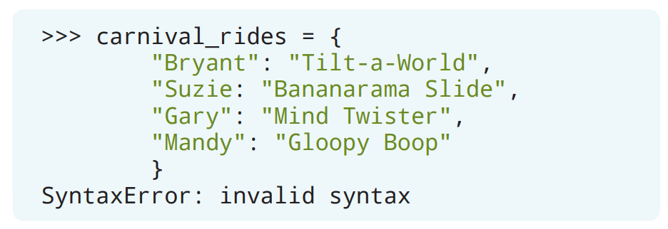
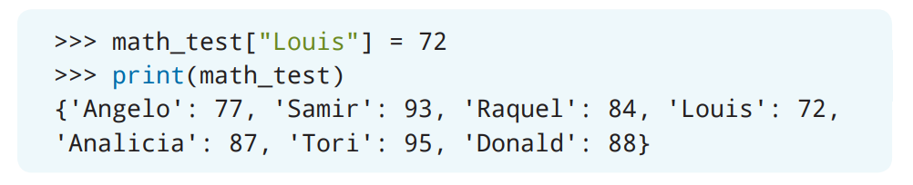
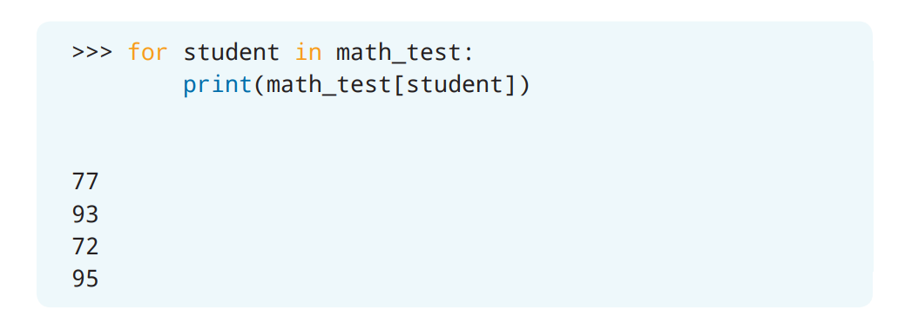

# 字典

在处理数据集时，Python是一个非常好的语言选择！前面我们已经学习了如何创建一个列表来存放元素，这时每个元素都是一个独立的对象。但对于你所使用的数据来说，有时候有名称的值可能会更适合它们。那么应该如何来存放有名称的值呢？这种工作就需要用*字典*（*dictionary*）来完成了！

## 创建字典

*字典*（*dictionary*）是一个存放有名称的值的列表，也就是说在这个列表里的每一个元素都是由一个键和一个值组成的，我们通常把这个元素称为*键值对*（*key-value pair*）。


字典里的数据集会通过大括号`{}`括起来。每个元素（键值对）的语法是`key: value`。键在字典里必须是唯一的，它可以是带引号的字符串、数字或者是元组。并且，键可以是任意类型的任意值。字典里的元素通过逗号进行分隔。由于字典可能会相当长，你可以以一种视觉上更容易阅读的方式来书写字典。


下面是最近一次数学考试的成绩。左边是学生的名字，右边是他们在考试中获得的成绩。


让我们创建一个名为`math_test`的字典来存放每个人的考试成绩。


每一行的学生的名字和数学考试成绩都被创建成了键值对。学生的名字都是字符串，所以用了引号括起来。然而，由于考试成绩是整数，所以它就不需要被引号括起来。而如果打印`math_test`变量的话，那么字典里的所有键值对都会被输出到解释器里。

字典的一个优点是它可以被修改，这就能够让你可以灵活地修改存放到字典里的键值对了！让我们来学习修改字典的方法吧。

### 小测验

布里安娜（Briana）创建了一个字典来存放她的朋友在嘉年华里最喜欢的游乐设施。但是，当她尝试打印这个字典时，她却收到了错误信息`SyntaxError: invalid syntax`。布里安娜应该修改哪一个元素来修正她的字典，从而可以不再出现错误信息呢？



> 如果使用中文交互的话：
> ```Python
> >>> carnival_rides = {
>         "Bryant": "倾斜世界",
>         "Suzie: "香蕉滑梯",
>         "Gary": "脑筋急转弯",
>         "Mandy": "黏黏大碰撞"
>         }
> SyntaxError: invalid syntax
> ```

A. 把代表Bryant的那一个元素改成: `"Bryant": 倾斜世界`
B. 把代表Mandy的那一个元素改成: `Mandy: 黏黏大碰撞`
C. 把代表Gary的那一个元素改成: `Gary: "脑筋急转弯"`
D. 把代表Suzie的那一个元素改成: `"Suzie": "香蕉滑梯"`

## 访问字典里的元素

字典里键所对应的值可以通过引用键的名称来获取（或访问）。


方括号会在字典变量名称之后，键的名称被放在方括号里。可以通过在`math_test`字典里访问Tori的考试成绩，来进行尝试。


在上面这个例子里，从`math_test`字典得到了Tori的考试成绩并打印了出来。

## 检查字典里是否存在某个键

要想确定字典里有没有包含某个键，可以创建一个包含`in`关键字[^1]的`if`语句。


`in`关键字[^1]被用来检查提供的键是否存在字典里。如果键能够在字典里被找到，那么Python将会执行在`if`语句里的操作。

> [^1]: 译者注：原文这两处使用的是：“`in`操作符”。但是全书其他地方都用的是：“`in`关键字”，故而统一为“`in`关键字”。

你可以通过这个方法在`math_test`字典里检查`Samir`是否在字典里。


在上面这个例子里，Python会检查字符串`"Samir"`是否是`math_test`字典里的一个键。而因为`"Samir"`的确是`math_test`字典里的键，所以字符串`"Samir is a key in the dictionary. "`（`"Samir是字典里的一个键。"`）会被打印到解释器里。

## 向字典添加键值对

通过引用键的名称并进行赋值，你就可以向字典里添加新的键值对。


首先出现的是字典变量名，然后是用方括号括起来的新的键的名称。最后，键所对应的值在等号后面进行赋值。

让我们在`math_test`字典里添加另一个学生和成绩吧。选一个你喜欢的名字，并且添加一个考试成绩。


在上面这个例子里，键`Donald`和值`88`被添加到了字典里。于是，当你打印字典时，新的键值对就会显示在字典的末尾。每当一个新的键值对被添加到字典里时，这个键值对都会被添加到字典的末尾。

如果引用的是一个已经存在的键，那么可以为它分配一个新值。让我们通过实例来看看怎么把Louis的考试成绩从`62`改到`72`吧。



当打印`math_test`字典时，可以看到字典里包含了Louis的新考试成绩。

### 小测验

格斯（Gus）有一本记录着他读过的书的字典，其中还包括了对这些书的评分：1-5分。


> 如果使用中文交互的话：
> ```Python
> >>> books = {
>         "无事生非": 3,
>         "凝望上帝": 5,
>         "隐形人": 4,
>         }
> ```

他最近读完了《Speak》（《不再沉默》），并且想给这本书打5分。下面哪一行代码可以让格斯把他对《Speak》（《不再沉默》）这本书的评价添加到他的字典里?

A. `books["Speak"] = 5`
B. `[books]["Speak"] = 5`
C. `books["Speak] = 5`
D. `"books" [Speak] = 5`

> 如果使用中文交互的话：
> A. `books["不再沉默"] = 5`
> B. `[books]["不再沉默"] = 5`
> C. `books["不再沉默] = 5`
> D. `"books" [不再沉默] = 5`

## 从字典里删除元素

有三种可以从字典里删除元素的方法：`pop()`、`popitem()`以及`del`[^2]。

> [^2]: 译者注：本书这一小节只包含了前两种方法的说明。最后一种请参看官方文档：[The `del` statement](https://docs.python.org/3/tutorial/datastructures.html#the-del-statement)，中文版为：[`del` 语句](https://docs.python.org/zh-cn/3/tutorial/datastructures.html#the-del-statement)。

### `pop()`方法

字典的`pop()`方法会删除一个用给定键标识的元素，并返回这个元素的值。


你可以尝试用这个方法来从`math_test`字典里删除Analicia和她的考试成绩。


在`math_test`字典里执行了`pop()`方法之后，Analicia的值会被打印到解释器。并且如果你这时再打印`math_test`字典，Analicia的键值对就不再会出现在字典里了。

### `popitem()`方法

字典的`popitem()`方法会删除字典里的最后一个元素并返回这个元素。


你可以尝试用`popitem`方法来从`math_test`字典里删除掉最后一个元素。


在`math_test`字典里，元素`'Donald': 88`位于字典的最后一个索引处。在`math_test`字典里执行了`popitem()`方法之后，Donald和他的测试成绩将会被打印到解释器。并且如果你这时再打印`math_test`字典，Donald的键值对就不再会出现在字典里了。

## 迭代字典

有若干种可以通过`for`循环来对字典进行迭代的方法。

### 打印出所有的键

默认情况下，当对字典进行循环时，返回的是键。


在上面的例子里，`for`循环会迭代字典里的每个元素（也就是`student`），并且把所有的键都单独成行地打印到解释器。

你也可以使用`keys()`方法来打印出字典里的键。


`keys()`方法被添加到字典变量名的末尾可以确保Python使用的是字典里的键。用`math_test`字典尝试一下吧!


### 打印出所有的值

虽然默认返回的是字典里的键，但是你也可以打印出字典里所有的值。要做掉这一点，可以通过字典变量名以及把键放在一对方括号里来实现[^3]。

> [^3]: 译者注：这句原文有错：“可以通过字典变量名以及把元素的值包括在一对方括号里来实现”


通过在`print`语句里使用`math_test`字典和`student`变量，就可以打印出每个学生的考试成绩了。



可以看到，每个学生的考试成绩都单独成行地被打印到了解释器里。另一种得到字典里所有的值的方法是使用`values()`方法。


`values()`方法被添加到字典变量名的末尾可以确保Python使用的是字典里的值。用`math_test`字典尝试一下吧!


### 打印出所有的键和值

在前面的部分里，你学习了如何打印一个字典。另一种打印字典里的元素的方法是使用`items()`方法来对字典进行迭代。


元素对（`key`和`value`）被用来代表`for`循环里的变量。`items()`方法被添加到字典变量名的末尾可以确保Python使用的是字典里的键值对。

对于`math_test`字典来说，`student`变量表示的是键，`score`变量表示的是值。Python会把每一对键和值都单独成行地打印出来。


### 小测验

下面哪个代码片段可以只打印出`birthday_month`字典里的值?


> 如果使用中文交互的话：
> ```Python
> >>> birthday_month = {
>         "Aya": "六月",
>         "Clair": "八月",
>         "Noah": "十二月"
>         }
> ```

A. 

B. 

C.  [^4]

D. A，B，C都可以

> [^4]: 译者注：根据附录里的答案，C选项需要是正确答案，但是原文里的C选项只会打印出人名。所以需要修改为：
> ```Python
> >>> for person, month in birthday_month.items():
>      print(month)
> ```

## 嵌套字典

字典里也可以包含其他的字典！这种在一个字典里存放其他字典的行为被称为*nesting*（*嵌套*）。


在字典里的每个嵌套字典都是以它的名称开始，并用一对花括号`{}`作为值[^5]。

> [^5]: 译者注：原文这里有问题：“并用一对花括号`{}`作为分隔”。分隔的依然是逗号。

假设你有三个学生的一系列科目和成绩，以及他们的平均绩点（GPA）。通过嵌套字典，你就可以在一个更大的字典里存放每个人的所有科目的成绩。


> 译者注：原文这里的排版有问题，应该是：
> ```Python
> >>> gradebook = {
>         "Mylene" : {
>                 "English" : "A",
>                 "Math" : "A",
>                 "Science": "B",
>                 "GPA": 3.7
>                 },
>         "Terrell" : {
>                 "English" : "C",
>                 "Math" : "B",
>                 "Science": "A",
>                 "GPA": 3.2
>                 },
>         "Joseph" : {
>                 "English" : "B",
>                 "Math" : "B",
>                 "Science": "B",
>                 "GPA": 3.0
>                 }
>         }
> ```
> 如果使用中文交互的话：
> ```Python
> >>> gradebook = {
>         "Mylene" : {
>                 "英语" : "A",
>                 "数学" : "A",
>                 "科学": "B",
>                 "GPA": 3.7
>         },
>         "Terrell" : {
>                 "英语" : "C",
>                 "数学" : "B",
>                 "科学": "A",
>                 "GPA": 3.2
>         },
>         "Joseph" : {
>                 "英语" : "B",
>                 "数学" : "B",
>                 "科学": "B",
>                 "GPA": 3.0
>         }
> }
> ```

如果你打算对每个元素都进行迭代，并且需要输出信息，那么最好把每个嵌套字典内的键值对的顺序保持一致。也就是说，嵌套字典里的数据将会是一一对应的。

只要能确保你引用的是正确的字典，那么在这一章学到的所有内容都可以被应用到嵌套字典里！后面的内容将会提供如何使用嵌套字典里的数据的例子。虽然提供的例子里并没有包含所有的操作，但是你可以参考这一章前面的部分来把类似的逻辑应用到任何嵌套字典里。

### 访问嵌套字典里的元素

那么，应该如何访问嵌套字典里的元素呢？如果你还记得前面关于得到字典里的值的内容的话，你首先需要引用字典名称，然后把相应的键包括在方括号里。嵌套字典也适用同样的规则！


> 如果使用中文交互的话：
> ```Python
> >>> print(gradebook["Mylene"]["英语"])
> A
> ```

首先提供了字典变量的名称，然后引用了嵌套字典的名称。这样做之后，你就可以在另一个方括号对里提供键的名称了！在上面的例子里，将会打印出Mylene的英语成绩。你可以这样来阅读代码：在`gradebook`字典里的`Mylene`字典里对应`English`（`英语`）的值。

### 向嵌套字典里添加键值对

你可以通过名称来引用嵌套字典，并且为它添加一对新的键和值，从而完成向嵌套字典里添加元素的操作。


> 如果使用中文交互的话：
> ```Python
> >>> gradebook["Mylene"]["艺术"] = "A"
> >>> print(gradebook["Mylene"])
> {'英语': 'A', '数学': 'A', '科学': 'B', 'GPA': 3.7, '艺术': 'A'}
> ```

在上面的例子里，键`Art`（`艺术`）被添加到了`Mylene`字典里，并且键`Art`（`艺术`）所对应的值是`A`。

而要想修改嵌套字典里的值，也需要先访问这个你想要更改的键值对元素，然后对它进行赋值操作。


> 如果使用中文交互的话：
> ```Python
> >>> gradebook["Mylene"]["英语"] = "B"
> >>> mylene_english_grade = gradebook["Mylene"]["英语"]
> >>> print(mylene_english_grade)
> B
> ```

在上面这个例子里，Mylene的英语成绩（也就是值)从`A`被改为了`B`。

### 从嵌套字典里删除最后一个元素

要从嵌套字典里删除最后一个元素，可以在引用的字典的末尾添加`pop()`方法来完成。


> 如果使用中文交互的话：
> ```Python
> >>> gradebook["Mylene"].pop()
> ('艺术', 'A')
> >>> print(gradebook["Mylene"])
> {'英语': 'B', '数学': 'A', '科学': 'B', 'GPA': 3.7}
> ```

因为其他学生都没有包含艺术课程的成绩，所以可以通过`pop()`方法来从Mylene字典的末尾删除掉这个新创建的`Art`（`艺术`）课程成绩键值对。

### 迭代嵌套字典

迭代嵌套字典仍然需要通过一个变量来表示它。在成绩册这个例子里，你可以像下面这样迭代各个嵌套字典的名称:


虽然只提供了更大的`gradebook`字典的名称，但是每个嵌套字典的名称都会被打印到解释器。如你想要在迭代里得到每个嵌套字典里的元素，那么可以用这一章前面介绍的方法。


> 译者注：根据下文，原文这个地方的代码有错：
> ```Python
> >>> for student in gradebook:
>         print(student)
>         for subject, grade in gradebook[student].items():
>                 print(subject, grade)
>
>
> Mylene
> English B
> Math A
> Science B
> GPA 3.7
> Terrell
> English C
> Math B
> Science A
> GPA 3.2
> Joseph
> English B
> Math B
> Science B
> GPA 3.0
> ```
> 如果使用中文交互的话：
> ```Python
> >>> for student, grades in gradebook.items():
>         print(student)
>         for subject, grade in grades():
>                 print(subject, grade)
>
>
> Mylene
> 英语 B
> 数学 A
> 科学 B
> GPA 3.7
> Terrell
> 英语 C
> 数学 B
> 科学 A
> GPA 3.2
> Joseph
> 英语 B
> 数学 B
> 科学 B
> GPA 3.0
> ```

在上面的例子里，创建了一个`for`循环来迭代嵌套字典里的每个元素。于是，嵌套字典的名称、键值对都会被单独成行地打印到解释器。

## 项目：学校音乐剧报名

一年一度的学校音乐剧时间到了！今年，维杰（Vijay）需要为他新写的音乐剧《没有校长的一天》挑选同学进行排练。海选就要到了；但是维杰还需要创建一个项目，从而让那些对试演感兴趣的人能够报名参加他们喜欢的角色。除此之外，他每天可以用来试镜时间也是有限的。维杰每天只能安排五名同学进行面试。因此，报名名单将会以先到先得的方式完成。所以，当有5名同学报名后，报名名单将会关闭。维杰计划会运行这个项目若干天，因此需要在必要时可以运行这个项目，并且在有5名同学注册后关闭。

维杰需要为这四个角色的完成试镜：

* Principal（校长）
* Teacher（老师）
* Troublemaker（麻烦制造者）
* Students（学生）

这个程序会向同学询问下面这些问题：

1. What is your name?（你叫什么名字？）
2. What is your grade?（你的成绩是多少？）
3. What is your preferred role?（你的首选角色是什么？）

每个问题的回答都应该存放到字典里去，这样维杰才可以在之后查看每个人的信息，以及他们的首选角色。

你的工作就是创建一个这样的程序，从而可以帮助维杰开始学校音乐剧试演的注册。

### 步骤

#### 打开IDLE

在开始编码之前，请打开IDLE并创建一个新文件。请使用文件名**auditions.py**来保存新文件。

#### 创建字典来存放回答

让我们首先创建一个字典来存放同学们对注册问题的回答。为了让试演基于兴趣来进行组织，请使用嵌套字典来存放有关哪个同学注册了什么角色的数据。字典里的元素可以先留空。


> 如果使用中文交互的话：
> ```Python
> auditions = {
>     "校长" : {
>         },
>     "老师" : {
>         },
>     "麻烦制造者" : {
>         },
>     "学生" : {
>         }
>     }
> ```

在上面的代码片段里，`auditions`是字典的名称。在`auditions`字典里面有四个嵌套字典：`Principal`（`校长`），`Teacher`（`老师`），`Troublemaker`（`麻烦制造者`）以及`Students`（`学生`）。这些字典目前都是空的，这是为了能够在程序运行时添加来自同学们的答复。

#### 要求输入

为前面提到的第一个注册问题创建一个变量，并使用`input()`函数来要求同学进行回答。为了确保同学的名字格式是正确的，请把同学的回答转换为首字母大写的格式。


> 如果使用中文交互的话：
> ```Python
> name = input('你叫什么名字？ ').capitalize()
> ```

通过在`input()`函数的末尾添加`capitalize()`方法，就可以将同学提供的输入转换为首字母大写的格式。接下来，你需要为第二个注册问题创建一个变量。为了引导同学应该如何回答这个问题，请在问题里要求同学输入一个数字来作为成绩。


> 译者注：根据后面的代码，这里的代码有错，缺少`str`函数：
> ```Python
> grade = str(input('What is your grade? (Please respond with a number) ')))
> ```
> 如果使用中文交互的话：
> ```Python
> grade = str(input('你的成绩是多少？（请用数字作答） '))
> ```

当在一对圆括号里还需要使用另一对圆括号时，请确保有添加足够多的右圆括号，不然会出现错误！

最后，为最后一个注册问题创建一个变量。就像前面关于同学的成绩的问题一样，同学应该回答一个数字来反映他们对四个角色中的哪一个感兴趣。


> 如果使用中文交互的话：
> ```Python
> role = input('''你的首选角色是什么？请从下面的选项里选择一个数字：
>                 [1] 校长
>                 [2] 老师
>                 [3] 麻烦制造者
>                 [4] 学生
>                 ''')
> ```

三引号可以让你能够编写多行字符串。因此，只要字符串是被包含在三引号里的，你就可以在程序里把每个角色的信息都放在单独的一行中。当问题被打印到解释器时，每个角色都会被单独显示在一行上。

#### 把回复添加到嵌套字典里

现在，你需要在对应的嵌套字典里创建新元素的逻辑。根据同学选择的角色，同学的名字和成绩需要在对应的嵌套字典被创建为一个新的键值对。例如，如果一个同学选择了角色“校长”，那么来自这个同学的回答就应该应该在`Principal`（`校长`）嵌套字典里创建一个新的键值对。

让我们先创建一条`if`语句，它被用来检查同学是否想要试镜校长的角色。由于`input()`函数的默认回答类型是`str`，因此`if`语句应该检查回答是否为字符串`'1'`，而不是`int`或`float`类型的`1`。

在`if`语句里，把同学对名字和成绩回答的变量作为键值对添加到嵌套的`Principal`（`校长`）字典里。


> 如果使用中文交互的话：
> ```Python
> if role == '1':
>     auditions['校长'][name] = grade
> ```

可以把`name`变量作为键放在括号里，而把`grade`变量作为值赋值给它。

接下来，你需要检查同学是否想要试镜老师这个角色。你可以用把前面`if`条件类似的逻辑应用于`elif`语句。


> 如果使用中文交互的话：
> ```Python
> elif role == '2':
>     auditions['老师'][name] = grade
> ```

`elif`语句会检查存放在`role`变量的回答是否为`'2'`。如果值是`'2'`，那么同学的名字和成绩将会被添加到嵌套的`Teacher`（`老师`）字典里。同样的逻辑也适用于麻烦制造者这个角色。创建另一条`elif`语句来添加麻烦制造者这个角色的注册吧。


> 如果使用中文交互的话：
> ```Python
> elif role == '3':
>     auditions['麻烦制造者'][name] = grade
> ```

最后，创建一条`else`语句来让其他同学注册试演学生这一角色吧。


> 如果使用中文交互的话：
> ```Python
> else:
>     auditions['学生'][name] = grade
> ```

#### 循环填写注册表格

到目前为止，如果你运行这个程序，那么整个注册的过程只会发生一次。而由于不断地会有人来报名，因此这个程序应该一直运行到有五名同学报名参加试镜为止。这听起来就像是`for`循环和函数能做到的工作！

首先，把你先前创建的注册过程代码放到一个函数里。别忘了用来存放每个同学的回答而创建的变量。


> 如果使用中文交互的话：
> ```Python
> def sign_up():
>     name = input('你叫什么名字？ ').capitalize()
>     grade = str(input('你的成绩是多少？（请用数字作答） '))
>     role = input('''你的首选角色是什么？请从下面的选项里选择一个数字：
>                     [1] 校长
>                     [2] 老师
>                     [3] 麻烦制造者
>                     [4] 学生
>                     ''')
>
>     if role == '1':
>         auditions['校长'][name] = grade
>     elif role == '2':
>         auditions['老师'][name] = grade
>     elif role == '3':
>         auditions['麻烦制造者'][name] = grade
>     else:
>         auditions['学生'][name] = grade
> ```

于是，新的`sign_up()`函数就包含了整个注册的过程。接下来，在`sign_up()`函数外部创建一个`for`循环，这个循环总共会迭代五次。传递给`range()`函数的数字可以被用来告诉循环需要迭代的次数。


由于循环需要迭代五次，因此将数字`5`传递给`range()`函数。然后，在`for`循环体内，调用`sign_up()`函数。在`for`循环内调用这个函数就能保证注册过程会被执行五次。


循环结束后，你还需要通知其他同学当天的报名已经结束。在代码里添加代码从而打印出声明来告诉同学们注册已经关闭吧。


> 如果使用中文交互的话：
> ```Python
> print("注册《没有校长的一天》的试镜已经结束")
> ```

#### 打印注册名单

注册结束后，还需要打印出所有注册参加试镜的人员名单。理想情况下，输出应该按照角色进行组织。在每个角色的下方，应该显示出想参演这个角色的同学的名字和成绩。你可以使用另一个`for`循环来完成它！

首先，我们会列出所有报名参加试镜校长这个角色的名单。先创建一个打印语句，并且输出：`Role：Principal`（`角色：校长`）吧。


> 如果使用中文交互的话：
> ```Python
> print("角色：校长")
> ```

在`print`语句之后，添加一个`for`循环来访问嵌套的`Principal`（`校长`）字典，并且打印出每个同学的名字和成绩。你可以通过`items()`函数来同时打印出元素的键和值。


> 如果使用中文交互的话：
> ```Python
> for student, grade in auditions['校长'].items():
>     print(student, grade)
> ```

程序启动时，Python会开始`for`循环的第一次迭代，这个循环会调用`sign_up()`函数。注册的同学会被要求回答三个问题。根据同学对角色选择的回答，他们对名字和成绩的回答会存放到相应的嵌套字典中。然后，循环再次进行迭代，直到总共迭代了5次为止。在最后一次迭代之后，Python会打印出一个通知到解释器，让其他同学知道今天的注册已经关闭。最后，Python会列出一份包含了想试演各个角色的同学的名单。

下面是**Auditions.py**完整程序的例子：


> 译者注：第三条注释语句有错，注释里是12次试演，代码里是5次。根据上下文改为五次：
> ```Python
> # For-loop that calls the sign_up() function 5 times
> ```
> 如果使用中文交互的话：
> ```Python
> # 存放试演注册的字典
> auditions = {
>     "校长" : {
>         },
>     "老师" : {
>         },
>     "麻烦制造者" : {
>         },
>     "学生" : {
>         }
>     }
>
> # 注册过程函数
> def sign_up():
>     name = input('你叫什么名字？ ').capitalize()
>     grade = str(input('你的成绩是多少？（请用数字作答） '))
>     role = input('''你的首选角色是什么？请从下面的选项里选择一个数字：
>                     [1] 校长
>                     [2] 老师
>                     [3] 麻烦制造者
>                     [4] 学生
>                     ''')
>
>     if role == '1':
>         auditions['校长'][name] = grade
>     elif role == '2':
>         auditions['老师'][name] = grade
>     elif role == '3':
>         auditions['麻烦制造者'][name] = grade
>     else:
>         auditions['学生'][name] = grade
>
> # 用来执行sign_up()函数5次的for循环
> for i in range(5):
>     sign_up()
>
> # 打印出注册参加试演的同学名单
> print("Sign-ups for 'A Day without a Principal' are now closed")
>
> print("Role: Principal")
> for student, grade in auditions['Principal'].items():
>     print(student, grade)
>
> print("Role: Teacher")
> for student, grade in auditions['Teacher'].items():
>     print(student, grade)
>
> print("Role: Troublemaker")
> for student, grade in auditions['Troublemaker'].items():
>     print(student, grade)
>
> print("Role: Students")
> for student, grade in auditions['Students'].items():
>     print(student, grade)
> ```
