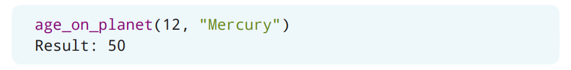

# 模块

到这章之前，这本书的例子都是让你在一个Python文件（扩展名为`.py`）里编写所有的代码。但是，在使用Python时，你可以把代码（尤其是函数和变量）放进任意数量的`.py`文件里，从而创建出所谓的*模块*（*modules*）。

## 什么是模块？

*模块*（*modules*）是包含一组你想要包含在程序里的函数的文件。与其在不同的Python程序里重复创建相同的函数或变量，不如把函数或变量存放到一个模块中，然后再把这个模块导入多个Python程序里去。模块还能够让Python程序组织得更好。就像书籍会把信息组织成章节那样，你还可以把代码片段放到不同的模块中，而不是把所有的代码都放在一个文件里。模块能够让函数有*更*好的可重用性，因为它能够让你导入模块中的文件到你正在编写Python程序的文件里。虽然模块可以被导入到程序里，但模块本身并不是程序。

## 创建模块

你可以通过把编写的代码保存在扩展名为`.py`的文件里来创建模块。提醒一下，`.py`扩展名是Python文件的扩展名。文件本身可以包含函数和变量。

让我们创建你的第一个模块吧，它将会在这一章里被反复用到！这个模块会由函数和变量组成，用来提供有关太阳系行星的信息。

在IDLE里，创建一个新文件，并将文件保存为**solarsystem.py**。在**solarsystem.py**文件里，创建一个名为`planets`的嵌套字典，它会包含有关太阳系里的每个行星的空字典。


> 如果使用中文交互的话：
> ```Python
> planets = {
>     "水星" : {
>         },
>     "金星" : {
>         },
>     "地球" : {
>         },
>     "火星" : {
>         },
>     "木星" : {
>         },
>     "土星" : {
>         },
>     "天王星" : {
>         },
>     "海王星" : {
>         }
>     }
> ```

如果这时候运行**solarsystem.py**文件，那么这个模块并不会做任何事情，因为它只是定义了`planets`变量。

### 小测验

下面哪个文件扩展名可以被用来创建Python模块？

A. `python`
B. `py`
C. `png`
D. `html`

现在，让我们把有关各个行星的情况添加到`planets`字典里去。行星情况表包含了会被添加到`planets`字典里的每个行星的信息。


| 星球 | 一年的长度（地球日） | 行星类型 | 到太阳的距离（天文单位） |
| --- | --- | --- | --- |
| 水星 | 88 | 类地行星 | 0.4 |
| 金星 | 225 | 类地行星 | 0.7 |
| 地球 | 365 | 类地行星 | 1 |
| 火星 | 687 | 类地行星 | 1.5 |
| 木星 | 4333 | 气态巨行星 | 5.2 |
| 土星 | 10759 | 气态巨行星 | 9.5 |
| 天王星 | 30687 | 冰巨行星 | 19.8 |
| 海王星 | 60190 | 冰巨行星 | 30 |

使用行星情况表中的信息为每个行星创建键值对。


> 如果使用中文交互的话：
> ```Python
> planets = {
>     "水星" : {
>         "一年的长度": 88,
>         "行星类型": "类地行星",
>         "到太阳的距离": 0.4
>         },
>     "金星" : {
>         "一年的长度": 225,
>         "行星类型": "类地行星",
>         "到太阳的距离": 0.7
>         },
>     "地球" : {
>         "一年的长度": 365,
>         "行星类型": "类地行星",
>         "到太阳的距离": 1
>         },
>     "火星" : {
>         "一年的长度": 687,
>         "行星类型": "类地行星",
>         "到太阳的距离": 1.5
>         },
>     "木星" : {
>         "一年的长度": 4333,
>         "行星类型": "气态巨行星",
>         "到太阳的距离": 5.2
>         },
>     "土星" : {
>         "一年的长度": 10759,
>         "行星类型": "气态巨行星",
>         "到太阳的距离": 9.5
>         },
>     "天王星" : {
>         "一年的长度": 30687,
>         "行星类型": "冰巨行星",
>         "到太阳的距离": 19.8
>         },
>     "海王星" : {
>         "一年的长度": 60190,
>         "行星类型": "冰巨行星",
>         "到太阳的距离": 30
>         }
>     }
> ```

我们可以使用`planets`字典里的数据来计算一个人在某个行星上的年龄。这样的计算过程可以放到一个函数里。在创建函数之前，请考虑需要使用哪些值来计算一个人在行星上的年龄。

要计算一个人在某个星球上的年龄，你首先需要用他们在地球上的年龄（以年为单位）乘以地球上一年的总天数。这个数字反映了这个人的年龄在地球上的地球日数量。接下来，用这个地球日总数除以行星上的一年的地球日长度。例如，要在计算一个12岁的孩子在水星上的年龄，就应该是$(12 \times 365) \div 88 = 49.77272727272727$。

在上面的例子里，一个人的年龄、地球上一年的天数、以及行星上一年的地球日长度都是计算一个人在这个星球上的年龄所需要的值[^1]。但是，地球上一年的天数是恒定的，也就是说这个数是不变的。因此，我们可以在函数外创建一个名为`EARTH_DAYS`的变量来存放的值，也就是`365`天。在Python中，不变的变量（常量）的变量名是全大写的。

> [^1]: 译者注：原文这句话有点模糊：”在上面的例子里，一个人的年龄、他们在地球上的天数以及行星上一年的地球日长度“。根据前面的代码和后面一句：”但是，地球上一年的天数是恒定的“，应该用“地球上一年的天数”。


接下来，就需要考虑应该把哪些值作为参数传递给函数调用了。我们可以让用户输入他们的年龄和行星的名称。


在函数体内，我们可以把计算得到的值存放到名为`new_age`的变量中。


计算会先把用户的年龄和地球上一年的总天数相乘。我们已经在函数外创建了一个名为`EARTH_DAYS`的变量，可以用它来完成这个计算。


然后，对于给定的行星，我们需要将上面计算的结果除以行星上一年的地球日长度。这个值被存到了`planets`字典里的嵌套字典的`length of year`（`一年的长度`）键这里。在对`new_age`变量的计算里，需要用到传递给函数的`planet`变量来作为键得到这个值。


> 译者注：原文代码有问题，代码是在文件里而不在解释器里：
> ```Python
> def age_on_planet(age, planet):
>     new_age = (age * EARTH_DAYS) / planets[planet]["length of year"]
> ```
> 如果使用中文交互的话：
> ```Python
> def age_on_planet(age, planet):
>     new_age = (age * EARTH_DAYS) / planets[planet]["一年的长度"]
> ```

最后，让我们将`new_age`的值作为整数返回。你可以使用`round()`函数来实现这一点。


> 如果使用中文交互的话：
> ```Python
> def age_on_planet(age, planet):
>     new_age = (age * EARTH_DAYS) / planets[planet]["一年的长度"]
>     return round(new_age)
> ```

在完成**solarsystem.py**里的模块之前，请先测试这些功能来确保计算是正确的。在IDLE里运行模块之前，请先保存**solarsystem.py**文件。你可以利用上面计算一个12岁的孩子在水星上的年龄的例子来进行测试。在函数调用时，传递的第一个参数是年龄，第二个参数是行星的名称。



> 译者注：输出的结果并不应该包含`Result: `
> ```Python
> age_on_planet(12, "Mercury")
> 50
> ```
> 如果使用中文交互的话：
> ```Python
> age_on_planet(12, "水星")
> 50
> ```

现在，你已经确认了这个函数可以正常工作，请删除或是注释掉这个函数调用并保存**solarsystem.py**文件。下面是这个完整模块的例子：


> 如果使用中文交互的话：
> ```Python
> # 行星的信息
>
> planets = {
>     "水星" : {
>         "一年的长度": 88,
>         "行星类型": "类地行星",
>         "到太阳的距离": 0.4
>         },
>     "金星" : {
>         "一年的长度": 225,
>         "行星类型": "类地行星",
>         "到太阳的距离": 0.7
>         },
>     "地球" : {
>         "一年的长度": 365,
>         "行星类型": "类地行星",
>         "到太阳的距离": 1
>         },
>     "火星" : {
>         "一年的长度": 687,
>         "行星类型": "类地行星",
>         "到太阳的距离": 1.5
>         },
>     "木星" : {
>         "一年的长度": 4333,
>         "行星类型": "气态巨行星",
>         "到太阳的距离": 5.2
>         },
>     "土星" : {
>         "一年的长度": 10759,
>         "行星类型": "气态巨行星",
>         "到太阳的距离": 9.5
>         },
>     "天王星" : {
>         "一年的长度": 30687,
>         "行星类型": "冰巨行星",
>         "到太阳的距离": 19.8
>         },
>     "海王星" : {
>         "一年的长度": 60190,
>         "行星类型": "冰巨行星",
>         "到太阳的距离": 30
>         }
>     }
>
> EARTH_DAYS = 365
>
> # 计算一个人在某个星球上的年龄
>
> def age_on_planet(age, planet):
>     new_age = (age * EARTH_DAYS) / planets[planet]["一年的长度"]
>     return round(new_age)
> ```

## 使用模块

要使用模块，就必须先把模块导入到程序里。


要导入模块，可以通过`import`语句以及模块名称来完成。模块的名称是包含需要被导入的函数和变量的`.py`文件的文件名，但并不包括`.py`扩展名。请确保不要在`import`语句里包含`.py`。

让我们导入`solarsystem`模块来访问这个模块的函数和变量吧。在IDLE里，运行**solarsystem.py**模块。在新出现的解释器窗口中，使用`import`语句导入`solarsystem`模块。


在导入了`solarsystem`模块之后，准备工作就已经完成并且可以使用这个模块了！让我们先试试看访问`solarsystem`模块中的变量。访问模块中的变量的语法是:


首先使用模块名称，然后使用句点和变量名称。在IDLE里，访问`solarsystem`模块中的`EARTH_DAYS`变量的值就是：


> 译者注：输出的结果并不应该包含`Result: `
> ```Python
> solarsystem.EARTH_DAYS
> 365
> ```

你可能会注意到，在输入的时候IDLE就向你提供了一个包含`solarsystem`模块中的字典、变量和函数的列表。这是一个非常有用的特性，它可以帮助你了解模块中可用的内容。如果这时你单击`EARTH_DAYS`变量，那么这个变量就会被放置到代码行里。


让我们访问`solarsystem`模块中的`planets`字典变量里的一个嵌套字典元素。在IDLE里，访问土星的`"distance from sun"`（`"到太阳的距离"`）键的值。

![访问土星到太阳的距离]](./Resources/Chapter13/Code-13-15.png)

> 译者注：输出的结果并不应该包含`Result: `
> ```Python
> solarsystem.planets["Saturn"]["distance from sun"]
> 9.5
> ```
> 如果使用中文交互的话：
> ```Python
> solarsystem.planets["土星"]["到太阳的距离"]
> 9.5
> ```

要访问模块中的嵌套的字典元素，可以参见第12章“字典”里介绍的访问嵌套字典的元素的语法。

接下来，让我们使用`solarsystem`模块中的`age_on_planet()`函数。使用模块中的函数遵循下面这个语法：


当使用导入的模块中的函数时，IDLE也提供了参数的文档。当你访问`solarsystem`模块的`age_on_planet()`函数时，你就可以看到它。


在IDLE里，使用`age_on_planet()`函数计算12岁的孩子在火星上的年龄吧。


> 译者注：输出的结果并不应该包含`Result: `
> ```Python
> solarsystem.age_on_planet(12, "Mars")
> 6
> ```
> 如果使用中文交互的话：
> ```Python
> solarsystem.age_on_planet(12, "火星")
> 6
> ```

当你调用`age_on_planet`函数时，这个函数的参数会被放在括号里来进行传递。第一个参数是`age`对应的`int`类型的值，第二个参数是`planet`对应的`str`类型的值。

要在程序文件里使用模块，就必须要把模块文件保存在计算机的同一个文件夹里[^2]。让我们来试试看吧，请在IDLE里创建一个名为**program.py**的新文件，并将这个程序与**solarsystem.py**文件保存在同一文件夹里。在**program.py**文件里，使用`import`语句导入`solarsystem`模块。

> [^2]: 译者注：有其他的方法可以加载在不同文件夹的模块，不过作为初学者，可以默认都应该在同一个文件夹。


和前面提到的操作类似，你也可以按照相同的步骤来访问`solarsystem`模块中的字典、变量和函数。例如，要访问`EARTH_DAYS`变量的值，就可以在**program.py**文件里编写一条打印出`solarsystem`模块中的`EARTH_DAYS`变量的`print`语句。


当你运行**program.py**模块时，`365`就会在新出现的解释器窗口中被打印出来。

### 小测验

下面哪个选项是导入一个名为`orderpizza`的模块到Python程序的正确语法?

A. `orderpizza import`
B. `import module orderpizza`
C. `import orderpizza`
D. `import orderpizza module`

## 为模块使用别名

*别名*（*alias*）能够让你通过不同的名称来引用模块。这在你导入了一个名称很长的模块时会非常有用。在Python中，你可以使用`as`关键字来为模块创建别名。


如果打算为一个模块使用别名，请确保在整个程序里都使用的是别名。这是因为在为模块创建别名之后，Python就只会识别模块的别名，而不能再识别模块原本的名称了。

你可以为`solarsystem`模块创建别名`sol`来缩短整个名称。让我们修改**program.py**文件，来让它导入`solarsystem`模块并为它创建别名`sol`。


你仍然可以像之前那样访问`solarsystem`模块中的函数和变量。但是，这时就应该把模块称为`sol`了。调用`age_on_planet()`函数来计算12岁的孩子在金星上的年龄吧。


> 如果使用中文交互的话：
> ```Python
> print(sol.age_on_planet(12, "金星"))
> ```

## `from`关键字

通常来说，你可能只需要从一个模块中导入特定的函数、变量或是字典等等。你可以使用`from`关键字来实现这个操作。


`solarsystem`模块中包含了一个字典、一个常量变量以及一个函数。修改**program.py**文件，来让它只导入`planets`字典吧。


如果只导入模块的一部分的话，就不再需要在访问模块中变量的时候包含模块名称了。例如，要访问金星的`planet_type`（`行星类型`）键的值，就可以直接通过访问嵌套字典里的元素的语法来完成。


> 译者注：输出的结果并不应该包含`Result: `
> ```Python
> print(planets["Venus"]["planet type"])
> Terrestrial
> ```
> 如果使用中文交互的话：
> ```Python
> print(planets["金星"]["行星类型"])
> 类地行星
> ```

如果这时你想要使用`age_on_planet`函数会发生什么呢？


> 如果使用中文交互的话：
> ```Python
> age_on_planet(12, "金星")
> Traceback (most recent call last):
>   File "C:/Users/aprilspeight/solarsystem/program.py", line 5, in <module>
>     age_on_planet(12, "金星")
> NameError: name 'age_on_planet' is not defined
> ```

可以看到Python无法识别这个函数！这是因为`age_of_planet()`函数并没有被导入到**program.py**里去，所以Python不能意识到它的存在。

就像你可以为模块名称创建别名那样，你也可以为导入的部分创建别名。例如，可以为`planet`字典创建别名`p`。在**program.py**文件里，修改导入`planets`字典的`import`语句来为它创建别名为`p`吧。


和前面一样，在访问金星的`planet_type`（`行星类型`）键的值的时候，并不需要包含`solarsystem`模块的名称。同时，也不用再需要完整的字典名称`planets`，而是通过别名`p`来完成了。


> 如果使用中文交互的话：
> ```Python
> print(p["金星"]["行星类型"])
> 类地行星
> ```

### 小测验

香农（Shannon）创建了一个名为`chessboardgame`的模块，其中包含的函数和变量可以被用来对计算机进行编程从而可以进行国际象棋游戏。她想在程序里使用这个模块，并且希望能给模块名称起一个别名，从而不用在每次想使用模块的功能时都必须得键入完整的模块名称。当香农将`chessboardgame`模块导入到她的程序时，她应该使用什么语法来让`chess`代表`chessboardgame`模块？

A. `import chessboardgame as chess`
B. `chessboardgame import chess`
C. `import module chessboardgame as chess`
D. `as chess import chessboardgame`

## 查看模块中的所有属性 [^3]

> [^3]: 译者注：原文标题是：“查看模块中的所有函数”，根据内容，应该是：“查看模块中的所有属性”。

要得到一个包含模块中的所有函数名称和变量名称的列表，可以使用`dir()`函数。


`dir()`函数会返回包含模块中所有属性的名称的列表。你可以把属性当做是模块的特征。

在**program.py**文件里，修改`import`语句，从而把`solarsystem`模块的所有部分都导入到程序里。接下来，使用`dir()`函数来得到`solarsystem`模块的所有属性吧。


> 译者注：输出的结果并不应该包含`Result: `，同时还应该包含`EARTH_DAYS`
> ```Python
> import solarsystem
>
> print(dir(solarsystem))
> ['EARTH_DAYS', '__builtins__', '__cached__', '__doc__', '__file__', '__loader__', '__name__', '__package__', '__spec__', 'age_on_planet', 'planets']
> ```

你可能会注意到有一些以前从未听说过的属性被打印了出来。这些属性是由Python自动生成的。

* `__builtins__` 是一个包含了可以在模块中使用的所有内置属性的列表。这些内置属性是由Python自动添加的。

* `__cached__` 会告诉你与模块相关联的缓存文件的名称和位置。缓存文件能够加快加载Python模块所需的时间。

* `__doc__` 提供了这个模块的帮助信息。如果在模块中创建了文档字符串，那么就可以使用`__doc__`属性来得到文档字符串里的文本。

* `__file__` 会告诉你模块的名称和位置。

* `__loader__` 提供模块的加载器信息。*加载器*（*loader*）是一个软件，它会获取模块并把它放入内存中，从而让Python可以使用这个模块。

* `__name__` 会告诉你模块的名称。

* `__package__` 被导入系统用来简化模块的加载和管理。

* `__spec__` 包含了导入这个模块的规范。

在列表的开头和末尾是由用户创建的模块属性。例如，`solarsystem`模块包含的三个分别名为`EARTH_DAYS`、`age_on_planet`和`planets`的属性。[^4]

> [^4]: 译者注：原文只提到了列表的末尾，并且不包含`EARTH_DAYS`属性。
