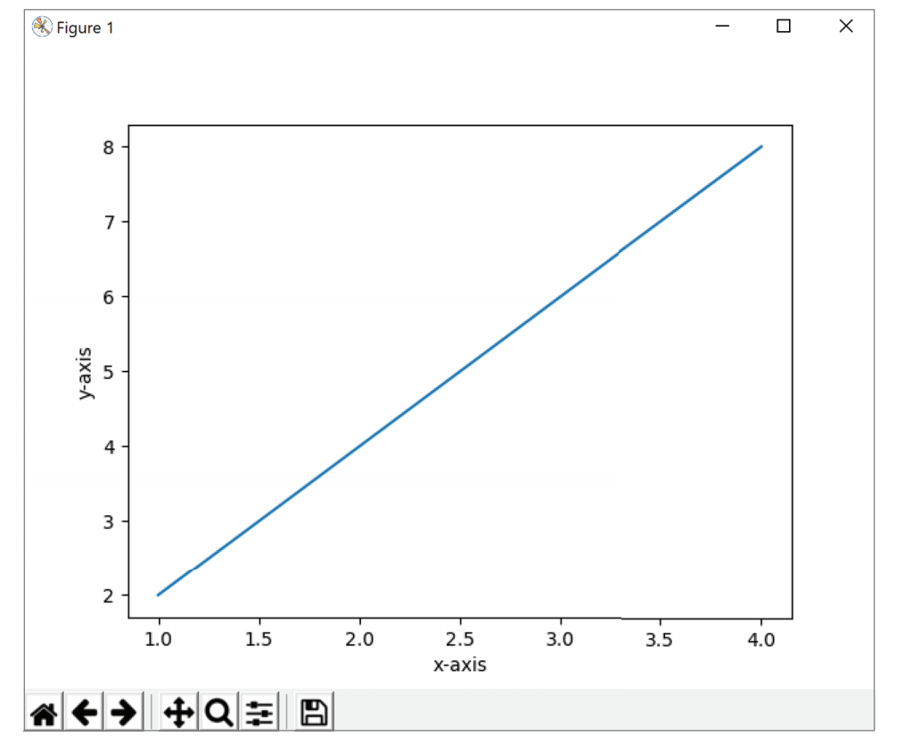
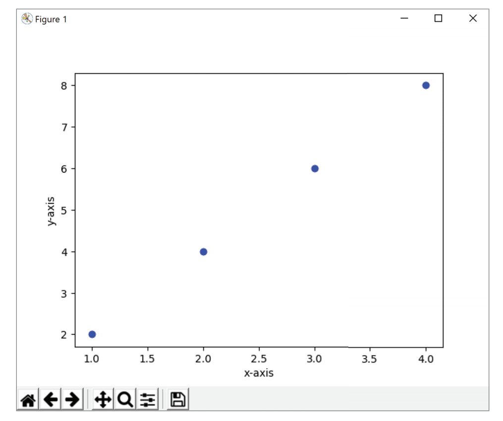

# 接下来

到目前为止，你所学的内容向你提供了最基础的Python的基本概念。那么，接下来该做些什么呢？在继续创建自己的Python程序之前，请继续探索可以用来帮你创建和管理Python项目的其他工具吧！

## Python库

模块功能让你能够通过导入其他Python程序员创建的模块，从而提供了使用Python做更多事情的能力。网站[PyPI.org](https://pypi.org/)提供了可以安装并导入到个人程序的*包*（*packages*）。*包*是一组Python模块的集合。

在使用来自Python社区的包时，你必须通过PIP（Package Installer for Python）来安装这个包。*PIP*是Python包的包管理器。你可以通过在终端里键入命令`pip --version`来查看你的计算机上是否安装了PIP。如果没有安装PIP，那么可以从[pypi.org/project/pip](https://pypi.org/project/pip/)下载并安装它。

如果计算机上已经安装了PIP，那么可以通过命令`pip install package`来安装包。将命令中的`package`替换为要安装的包的名称就行了（例如，`pip install emoji`）。可以按照第13章"模块"里介绍的相同步骤来使用包里的函数和变量。

让我们来试试Matplotlib库吧！Matplotlib是一个用来在Python中创建静态、动画和交互式可视化的库。我们将会用它来使用在同一条线上的几个坐标来画一个线图。你可以通过访问[matplotlib.org](https://matplotlib.org/)来查看Matplotlib的相关文档。

在使用Matplotlib之前，先打开终端并输入命令`pip install Matplotlib`。这条命令会把Matplotlib库安装到你的计算机上，从而可以在Python程序里使用。

在IDLE里，创建一个新文件，并将文件保存为**pyplot.py**。接下来，你需要导入`matplotlib.pylot`才能访问创建线图的函数。打开IDLE并输入`import matplotlib.pylot as plt`。在这里使用别名会非常方便，因为你可以用更短的名称`plt`来引用这个库。

在`matplotlib.pyplot`库里包含的`plot()`函数可用来基于x轴和y轴绘制点。在使用`plot()`函数时，会把x轴和y轴的信息通过数字列表放在括号里。第一个列表传递的是x轴的值，后面的另一个列表传递的是y轴的值。在这个例子里，我们将用到下面这些坐标：

* (1, 2)
* (2, 4)
* (3, 6)
* (4, 8)

在**pyplot.py**文件里，使用`plt`别名和`plot()`函数绘制相应的坐标。

在图里添加上x轴和y轴的标签可以帮助了解图表上的值代表了什么。`matplotlib.pylot`库里包含了`xlabel()`函数和`ylabel()`函数，它们可以被用来让你为两个轴提供标签。标签名称会以字符串形式传递到函数的括号里。我们将会把x轴和y轴分别标记为：`x-axis`和`y-axis`。

![画x轴和y轴坐标]](./Resources/Chapter14/Code-14-3.png)

在**pyplot.py**程序里使用的最后一个函数是`show()`。`show()`函数被用来显示图表。

![`show()`函数]](./Resources/Chapter14/Code-14-4.png)

保存**pyplot.py**程序并运行它。在新出现的解释器窗口中，稍等片刻IDLE就会显示出图表了。

默认的可视化方式会把那些坐标绘制在一条线上。但是，你可以通过修改`plot()`函数里的参数来设置图形的可视化方式。比如说，你可以在图表对应的坐标上添加带颜色的标记点。IDLE里，修改`plot()`的参数让它包含`'ob'`参数吧，这个参数会为每个坐标画上一个蓝色小圆圈。

保存**pyplot.py**程序并运行它。在新出现的解释器窗口中，稍等片刻IDLE就会显示出图表了。

## 虚拟环境

当你继续你的Python之旅时，你会发现自己为不同的项目安装了一堆库。如果可以把这些库按照项目分开，那么在使用过程中就会非常方便。到目前为止，你一直使用的是Python的全局环境，这个环境会被所有的项目和程序共享。当你创建了越来越多的程序时，保持它们的环境相互独立，特别是让每个项目都维护自己的所需的库的列表是很有帮助的。这样的需求被称为*依赖关系*（*dependencies*）。

使用Python的时候，你可以为每个项目都用上虚拟环境。虚拟环境为Python的项目提供了一个隔离的环境。虚拟环境之间是彼此独立的，这也就意味着项目的依赖关系并不会彼此冲突。

`virtualenv`包被用来创建虚拟环境。因此，需要使用命令行来创建隔离环境。命令`pip install virtualenv`被用来安装包。安装了包之后，使用命令`python3 -m venv`[^1]来创建虚拟环境。

命令`python3 -m venv <folder name>`[^1]会在当前的文件夹里创建一个新文件夹，这个新文件夹会被用来存放虚拟环境的所有相关文件。在命令里，记得把末尾的`<folder name>`替换成你选择的文件夹名（例如，`python3 -m venv env`[^1]会创建一个名为`env`的文件夹）。虚拟环境会使用安装在`PATH`环境变量上的Python版本。

> [^1]: 译者注：根据第二章的内容，在Windows里使用`python`就行了，MacOS里才需要用`python3`。

你可以通过把命令里的`python3`替换为相应的版本（例如，在Windows里可以用`c:\Python35\python`来使用python 3.5版本）[^2]来决定要在虚拟环境里使用的Python版本。

> [^2]: 译者注：原文是“通过将命令行里的`python3`替换为适当的版本（例如，用`python3.8`来使用python 3.8版本）”，这里的描述并不成立。

在使用虚拟环境前必须要先激活它。根据你的操作系统，用来激活虚拟环境的文件会被存放到bin（Windows）或是Scripts（MacOS[^3]，Linux）文件夹里。对于Windows，你可以使用命令提示符应用程序或PowerShell来激活虚拟环境。使用命令提示符应用程序激活的命令是`<environment_name>\Scripts\activate.bat`；使用PowerShell激活的命令是`<environment_name>\Scripts\Activate.ps1`。对于MacOS[^3]或Linux，你可以使用bash或zsh来激活虚拟环境。使用bash或zsh来激活的命令是`source <environment_name>/bin/activate`。

> [^3]: 译者注：原文是“iOS”，iOS是手机操作系统，应该是MacOS操作系统。

在激活虚拟环境后，你就会在终端提示符开头的括号里看到虚拟环境的相应名称了。激活虚拟环境后，安装的所有包都会被存放在虚拟环境里。在终端里输入命令`deactivate`就可以退出虚拟环境了。

如果你想要把你的程序分享给朋友应该怎么做呢？他们怎么能够知道程序需要什么库呢？你可以在`require.txt`文件里保留所有需要的库的列表，并且把它和程序一同分享。接收到程序的人可以使用命令`pip install -r require.txt`[^4]来把需要的库安装到虚拟环境里。

> [^4]: 译者注：原文是`pip install -r requirements.txt`，根据前文，应该是`require.txt`。

你可以通过访问[docs.python.org/3/library/venv.html](https://docs.python.org/3/library/venv.html)来了解有关虚拟环境的更多信息。

## 集成开发环境

到目前为止，你使用了IDLE来创建和运行Python程序。虽然你可以继续使用IDLE来创建和管理Python程序，但并不推荐在比较大的项目里使用IDLE。有一些其他的包含各种附加功能的集成开发环境（IDE，Integrated Development Environment）可以帮助你创建和管理程序。

IDE为你提供了编辑、运行和修复Python程序的能力。IDE也会提供语法高亮显示和自动完成来帮助你编写代码。你还可以在IDE的帮助下找到并修复代码里的错误。

一些可以和Python一起使用的流行IDE有：PyCharm（[jetbrains.com/pycharm](https://www.jetbrains.com/pycharm/)）、Visual Studio Code（[code.visualstudio.com](https://code.visualstudio.com/)）以及Atom（[atom.io](https://atom.io/)）。
