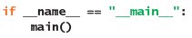
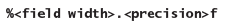
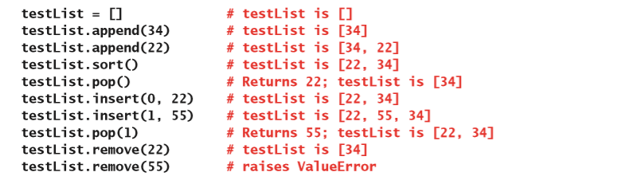
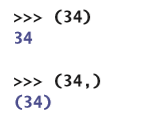
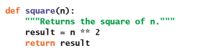

# Python编程的基本知识

在完成这一章的学习之后，你就能够：

* 通过的基本的结构编写出一个简单的Python程序；
* 掌握简单的输入和输出操作；
* 进行数学运算，比如：代数计算以及对数字进行比较；
* 对布尔值进行操作；
* 通过使用顺序语句、条件语句以及循环所构成的基本结构来实现算法；
* 定义函数来构建代码；
* 使用内置的数据结构，例如：字符串、文件、列表、元组以及字典；
* 定义那些用来表示新的类型对象的类；
* 通过函数、数据结构、类以及模块的协同合作来构建程序。

这一章简要概述了如何通过Python来进行编程。这一章是为了给那些对Python不熟悉的初学者提供一个快速的简介，但是并不会对计算机科学或者是Python编程语言进行全面介绍。如果想要更详细地了解如何使用Python语言来进行编程，可以参阅我的另一本书：《Python基础：第一个程序》（Fundamentals of Python: First Programs）第二版（Cengage Learning出版社，2019年出版）。另外，你也可以访问[*www.python.org*](https://www.python.org)来查看Python编程语言的官方文档。

如果你的计算机已经安装了Python，你可以通过在终端提示符（Linux和Mac用户需要先打开终端窗口，Windows用户需要首先打开DOS窗口。）下运行`python`或`python3`命令来查看它的版本号。在学习本书的时候，你最好能够使用Python的最新版本。在官方网站[*www.python.org*](https://www.python.org)里，你也可以查到最新版本的相关信息，以及如何下载和安装最新版本的Python的说明。对于本书而言，你需要使用Python 3.0或者更高的版本才能运行书里所列举的程序。

## 程序的基本要素

和所有其它的现代编程语言一样，Python也提供了大量的功能和构造。但是，Python是少有的几种基本程序元素都非常简单的编程语言之一。这一节会介绍Python编程的一些基本入门知识。

### 程序和模块

Python的程序总会包含一个或多个模块。模块是指包含Python源代码的文件，这些代码里会包含语句、函数的定义以及类的定义等等。一个简短的Python程序——也被称为**脚本**（**script**）——通常会被包含在一个模块里。而相对来说，更长、更复杂的程序通常会有一个主模块以及一个或多个支持模块。主模块会包含程序执行的起点；而支持模块则会包含函数以及类的定义。

### Python的示例程序：猜数字

接下来，你将会看到一个完整的Python程序，这个程序会和用户进行一个猜数字的游戏。一开始，计算机会要求用户输入所猜数字会出现的范围。然后，计算机会从这个范围里的随机“选择”一个数，并且在用户输入了正确的结果之前，不断地要求用户去猜这个数字。每次猜测之后，计算机都会向用户提示当前猜测的数字是大是小，而且会在游戏结束的时候显示用户猜测的总次数。这个程序会用到这一章稍后部分里将会讨论的几种Python语句类型，例如：输入语句、输出语句、赋值语句、循环以及条件语句。这个程序还会有一个函数的定义。

下面的代码片段是存放在文件numberguess.py里的程序：

这是用户和程序进行互动之后的输出：

可以看到，代码和它的输出会被显示为黑色、蓝色、橙色以及绿色这样的不同颜色。Python的IDLE会通过使用对代码进行着色来帮助程序员更方便地去识别程序元素的各种类型。不同颜色的标准将会稍后进行解释。

### 编辑、编译和运行Python程序

对于书里的大多数例子来说，你都可以在终端窗口里通过命令来运行这些Python程序。比如说，要运行文件numberguess.py里所包含的程序，在大多数终端窗口里你都可以通过下面这个命令来运行它：

我们可以通过Python的IDLE（Integrated DeveLopment Environment的缩写）来创建或编辑一个Python模块。你只需要在终端提示符下输入`idle`或`idle3`命令就可以启动IDLE了，或者如果有快捷方式的话，也可以通过快捷方式来启动它。你也可以通过鼠标双击Python源代码文件（任何扩展名为.py的文件）或者鼠标右键单击源代码文件并选择“通过IDLE打开或编辑”来启动IDLE。如果要通过双击文件来启动IDLE的话，你需要确保源代码文件在系统里默认的打开方式已经被设置为通过IDLE打开（macOS上这是默认设置，但是在Windows上不是默认设置）。

IDLE能够为你提供一个可以用来进行交互式运行Python表达式和语句的Shell窗口。使用IDLE的时候，你可以在编辑器窗口和Shell窗口之间来回切换，从而对程序进行开发或是运行完整的程序。同时，IDLE还会格式化你的代码并且对它进行着色处理。

当你使用IDLE打开Python文件的时候，这个文件就会显示在编辑器窗口里，这时，Shell窗口将会作为单独的窗口被弹出。要运行这个文件里的程序的话，你只需要先将光标置于编辑器窗口里，然后按F5键就行了。Python会在编辑器窗口里编译代码，然后在Shell窗口里去运行它。

如果遇到Python程序没有响应或者是无法正常退出的情况，可以通过按Ctrl + C或者关闭Shell窗口来终止这个程序的运行。

### 程序注释

程序的注释是指那些会被Python编译器忽略的文本，但这部分文本对代码的阅读者来说会是非常有价值的文档。Python里的单行注释以`#`符号作为开头，并且直到当前行的末尾都是注释。在IDLE里，注释会用红色进行代码着色。就像这样：

多行注释是通过三重单引号或三重双引号括起来的字符串。这些注释（会被着色成绿色）也被称为**文档字符串**（**docstrings**），因为它们可以被用来对程序的主要结构进行文档化描述。在前面展示的`numberguess`程序里就包含了两个文档字符串。在程序文件顶部的第一个文档字符串被用来对整个`numberguess`模块进行描述。第二个文档字符串位于**主**（**main**）函数的下面，描述了这个函数的相关功能。马上我们就会看到，在Python的Shell窗口里，文档字符串是如何为程序员提供至关重要的帮助的。

### 词法元素

一门语言里的词法元素是指那些用来构造句子的单词或符号的类型。和所有的高级编程语言一样，Python的一些基本符号同样也是关键字，比如说：`if`、`while`以及`def`。这些关键字在IDLE里会被着色为橙色。词法元素还包括：标识符（名称）；字面值（数字、字符串和其它的内置数据结构）；运算符以及分隔符（引号、逗号、圆括号、方括号和大括号）。对于那些内置的函数名称的标识符来说，这些函数名会被着色为紫色。

### 拼写和命名惯例

Python的关键字和名称是区分大小写的。也就是说`while`是Python的关键字，而`While`则会是程序员定义的名称。Python的关键字都是全小写字母拼写的，并且在IDLE窗口里会以橙色进行代码着色。

Python内置的函数名都会被统一着色为黑色，而对于其它的名称，比如函数、类或者方法名，它们会被着色为蓝色。名称可以以字母或下划线（_）开头，后面可以接上任意数量的字母、下划线或数字。

在本书里，模块、变量、函数和方法的名称都会用小写字母进行拼写。除了模块之外，当这些名称包含多个单词的时候，那些位于后面的单词会把首字母进行大写。类名遵循着相同的惯例，但所有的单词都会以大写字母作为开头。另外，当一个变量是常量的时候，所有的字母都会大写，并且通过下划线来分隔单词。表1-1展示了一些关于这些命名惯例的一些例子。

表1-1 Python命名惯例的一些例子

| 名称类型 | 例子 |
| ---- | ---- |
| 变量 | `salary`、`hoursWorked`、`isAbsent` |
| 常数 | `ABSOLUTE_ZERO`、`INTEREST_RATE` |
| 函数或方法 | `printResults`、`cubeRoot`、`input` |
| 类 | `BankAccount`、`SortedSet` |

我们选择名称时，应该尽可能地描述它在程序里所对应的角色。通常来说，变量名应该选择名词或形容词（如果它们被用来代表布尔值的话）。而对于函数和方法名来说，如果它们表示的是动作的话，就应该选择动词；而如果表示的是返回的值的话，则应该选择名词或形容词。

### 语法元素

一门语言里的语法元素是由词法元素所组成的句子的类型（表达、陈述、定义以及其它结构）。和大多数高级语言不同的是，Python通过**空白符**（**whitespace characters**）（空格、制表符或换行符）来表示不同类型的句子的语法。这也就是说缩进和换行符在Python代码里是非常重要的。像Python的IDLE这样的智能编辑器可以帮你对代码进行正确缩进。相应的，程序员也就不必去关心用分号来对语句进行分隔，以及用大括号来标记代码块了。在本书里，所有的Python代码都使用四个空格来作为缩进宽度。

### 字面值

数字（整数或浮点数）的写法和其它编程语言是一样的。布尔值`True`和`False`是关键字。其它的一些像是字符串、元组、列表和字典这样的数据结构也有与之相对应的字面值，你将在稍后的内容里看到。

#### 字符串字面值

你可以把字符串包括在单引号对、双引号对以及三个双引号对或三个单引号对里。最后这个用法在使用包含多行文本的字符串的时候很有用。字符值是指只包含一个字符的字符串。“`\`”字符在字符串里被用来对非图形字符（如：换行符（`\n`）、制表符（`\t`）或者是`\`字符本身）进行转义。下面这个代码片段以及它所对应的输出展示了这些情况。

输出结果是：

### 运算符和表达式

Python里的算术表达式用的是标准运算符（`+`、`–`、`*`、`/`、`%`）和中缀表示法。不论操作数是什么数字类型，`/`运算符都会以浮点数作为结果，而`//`运算符则会输出整数形式的商。当这些运算符和多项集（如：字符串和列表）在一起使用的时候，`+`运算符会被用来作为串联。此外，`**`运算符用来进行幂运算。

比较运算符有：`<`、`<=`、`>`、`>=`、`==`以及`!=`，它们可以被用来对数字或字符串进行比较。

`==`运算符会去对比数据结构里内容，比如说：可以对两个列表进行比较；而`is`运算符则会去比较两个对象的标识是否一致。比较运算符会返回`True`或`False`。

逻辑运算符`and`、`or`和`not`会把很多像是：`0`、`None`、空字符串以及空列表这样的值视为`False`。除此之外，Python里其它的大多数值都会被当作`True`。

下标运算符`[]`会和多项集对象一起使用，稍后我们就会对它进行介绍。

选择运算符`.`被用来引用模块、类或是对象里的名称。

Python的运算符优先级和其它语言是一样的（选择、函数调用、下标、算术、比较、逻辑、赋值）。括号也和其它语言一样，被用来让子表达式更早地进行执行。

`**`和`=`运算符是满足右向结合律的，而其它运算符则满足左向结合律。

### 函数调用

调用函数的方法和其它语言也是一样的：函数名称后跟一个在括号里的参数列表。例如：

Python提供了一些标准函数，比如说`abs`和`round`函数。你也可以从模块里去导入其它的函数，稍后你将会看到这部分内容。

### `print`函数

标准输出函数`print`会在控制台里打印出它的参数。它支持使用可变数量的参数，并且Python会自动为每个参数运行`str`函数来获得它的字符串表达形式，然后在输出的时候用空格来对每个字符串进行分隔。默认情况下，`print`会以换行符作为结束。

### `input`函数

标准输入函数`input`会一直监听用户在键盘上输入的文本。当用户按下回车键的时候，这个函数将会返回一个包含所有输入字符的字符串。这个函数还有一个可选的字符串参数，这个可选参数会在不换行的情况下被打印出来从而对用户输入进行提示。

### 类型转换函数和混合模式操作

你可以用一些数据类型的名称来作为类型转换函数。比如，当用户在键盘上输入的是数字的时候，`input`函数将返回这个数字的字符串形式，而不是这个数字本身。因此，程序必须在进行数字处理之前把这个字符串转换为`int`或者是`float`类型。下面这个代码片段首先会要求用户输入圆的半径，然后把输入字符串转换为浮点数，最后计算并输出圆的面积：

和大多数其它语言一样，Python允许在一个算术表达式里同时使用不同类型的数字作为操作数。在这些情况下，返回的结果类型会和操作数里的最通用的类型相同。比如，将`int`和`float`相加会得到另一个`float`类型的数。

### 可选和关键字函数参数

函数可以支持可选参数，因此在调用函数的时候，可以通过使用关键字来对参数进行命名。比如，默认情况下，`print`函数在输出了它的所有参数后就会输出换行符。为了不产生新行，你可以把可选参数`end`赋值为一个空字符串，就像这样一样：

必选参数是没有默认值的；相对应的，可选参数是有默认值的，并且在通过关键字使用它们的时候，只要它们处于必选参数之后，就可以按照任何顺序来进行传递。

比如，标准函数`round`预期会有一个必要参数，这个参数是一个需要被四舍五入的数字；除此之外，还可以有第二个可选参数来对精度进行确认。当省略第二个参数的时候，这个函数会返回最接近的整数（一个`int`）；而当包含第二个参数的时候，这个函数会返回一个`float`浮点数。下面是关于这部分内容的例子：

通常来说，在调用函数的时候，传递给函数的参数数量必须至少和必选参数的数量相同。

要注意的是：标准函数和Python库里的函数在调用的时候都会对传入的参数进行类型检查。而在Python里，程序员自己定义的函数是可以接收任何的数据类型作为参数的，这些参数甚至可以传递函数和类型本身。

### 变量和赋值语句

Python的变量是在使用赋值语句的时候被创建的。就像这样：

这段代码把变量`PI`的值设置为了`3.1416`。简单来说，赋值语句的语法是：

并且也可以像下面这样，在一个赋值语句里，同时用到多个变量：

因此要交换变量`a`和`b`的值的话，就可以这样写：

赋值语句通常来说是必须被写在一行代码里的，但是你也可以在代码里的逗号、括号、花括号或方括号之后进行换行。另一种在没有这些分割符号的情况下进行语句换行的方法是：让这一行代码以转义符号`\`作为结束。一般来说，在用这种方法进行换行的时候，会把这个符号放在表达式里的运算符之前或者是之后。就像下面这两个其实并不需要换行的例子那样：

当你在逗号或者是转义符号之后按回车键的时候，IDLE将会自动为下一行代码进行缩进。

### Python的数据类型

在Python里，所有的变量都可以被指定为任何类型的值。这些变量并不是像其它许多语言那样被声明为了特定的类型，它们只是被分配给了一个值而已。

因此，在Python程序里，几乎永远都不会出现数据类型的名称。但是，所有的值和对象都是有类型的，这些类型在表达式里作为操作数进行运算的时候，会在运行时进行类型检查，因此类型错误还是会被发现的。只是相对来说，程序员在编写代码的时候不用对数据类型进行太多的关注。

### `import`语句

`import`语句的作用是让程序可以看到另一个模块里的标识符。这些标识符可以是对象、函数或者是类。使用`import`语句的方法有几种。其中最简单方式就是像下面这样，通过名称直接导入模块：

这段代码能够让当前模块通过语法`math.<name>`来使用`math`（数学）模块里所定义的所有名称。因此，语句`math.sqrt(2)`将会返回`2`的平方根。

第二种导入模块的方法是，直接使用名称来进行导入。这样的结果是，在代码里可以不用把模块名称作为前缀来直接使用这个名称：

同时，你还可以同时列出多个名称来同时导入它们：

你也可以使用`*`运算符来从模块里导入它所包含的所有名称，但通常来说，这样做并不被认为是一个很好的编程习惯。

### 获得有关程序组件的帮助

虽然Python的官网（[*www.python.org*](https://www.python.org)）提供了有关于Python语言的完整文档，然而Python的大多数组件还可以在Python的Shell窗口里很方便地得到帮助文档。只需要在Shell窗口的提示符下，输入函数调用`help(<component>)`就可以通过这种方式得到相应的帮助文档了，其中的`<component>`可以是模块、数据类型、函数或者是方法的名称。例如：`help(abs)`和`help(math.sqrt)`就会分别显示出`abs`和`math.sqrt`函数的帮助文档。类似的，调用`dir(int)`和`dir(math)`能够分别地列出`int`类型和`math`模块里的所有操作。之后，你就可以再对这些操作运行`help`函数来获得相关的帮助文档了。

在这里需要注意的是，在启动Shell窗口时，Python会自动加载一些内置模块，但是如果某个模块不是内置模块的话，那么在查找帮助之前，程序员必须要先导入这个模块。比如，下面这个在Shell窗口的交互操作的例子，就展示出了之前讨论过的`numberguess`程序的文档：

## 控制声明

Python也包含着一套常用的、用来进行顺序、条件判定以及迭代的控制语句。语句序列是一组连续编写的语句。序列中的每条语句必须在同一列（相同的缩进）开始。这一节将会学习用来进行依条件执行和迭代的控制语句。

### 条件语句

Python条件语句的结构和其它语言是一样的。它通过关键字`if`、`elif`和`else`，以及冒号和缩进来实现。

单向`if`语句的语法为：

布尔表达（Boolean expression）式可以是任意一个Python的值。就像前面提到过的，这些值里的一部分会被当作`False`，另一部分会被当作`True`。如果布尔表达式的结果是`True`，那么就会去运行代码块里的代码序列（sequence of statements）部分；不然什么都不会发生。代码序列里的（一条或多条）代码行必须要缩进至少一个空格或者制表符（通常为四个空格）并且要保持对齐。冒号在这个代码块里是唯一的分隔符，因此，如果代码序列里只有一行语句的话，这行语句也可以被写在同一行上的冒号之后。

双向`if`语句的语法为：

这里，可以注意下缩进和关键字`else`后面的冒号。在这种用法下，两个代码序列中的一个将会被运行。如果布尔表达式为`True`，那么第一个序列会被运行；否则，在布尔表达式为`False`的情况下的第二个序列将会被运行。

多路`if`语句的语法为：

多路`if`语句也只会运行一个代码序列。多路`if`语句会包含一个或多个不同的布尔表达式，除了第一个布尔表达式，其余的布尔表达式都会被写在关键字`elif`之后。在这种用法里，你可以省略结尾部分的`else:`分支。

下面这个例子展示了如何输出关于两个数字的相对大小的问题的答案：

### 使用`if __name__ == "__main__"`

前面讨论过的`numberguess`程序包含了一个`main`（主）函数的定义以及下面这个`if`语句：

这个`if`语句的目的是：让程序员将这个模块作为一个独立程序来运行，或者是在Shell窗口或其它模块里导入这个模块。这段语句是这样工作的：每个Python模块都包含有一组内置的模块变量，当模块加载时，Python虚拟机会自动为这些变量分配值。如果模块（通过从终端提示符运行，或是通过从IDLE窗口来加载，从而）作为独立程序被加载的话，那么这个模块的`__name__`变量将会被设置为`"__main__"`字符串。不然的话，这个变量将会被设置为模块自己的名称：在这个例子里，也就是`"numberguess"`。这些分配工作会发生在加载模块里的任何代码之前。因此，当控制器到达模块末尾的`if`语句的时候，只有在这个模块作为独立程序被启动，才会调用模块的`main`函数。

`if __name__ == "__main__"`这样的用法在开发独立的程序模块的时候非常有用，因为它可以让程序员只需要在Shell里导入这个模块，就能够查看它的相关帮助文档。类似的，程序员也可以在IDLE内对模块进行开发的时候，通过这个用法来运行一些测试函数。

### 循环语句

Python`while`循环语句的结构和其它语言也是类似的。它的语法是：

下面这个例子展示了如何计算并打印出从`1`到`10`的数字乘积：

可以注意到这里有一个对扩展赋值运算符`*=`的使用。使用它的代码行和下面这个语句是等效的：

Python也包含`for`循环语句，它可以被用来在值的序列上进行更简洁的迭代。这个语句的语法是：

运行这个循环时，循环变量会被分配为可迭代对象里的每个值，并且把这个值应用在它后面的语句序列里。可迭代对象包含有：字符串以及列表。在下面这个代码片段里，使用了Python的`range`函数，这个函数会返回一个可迭代的整数序列，这个序列被用来计算之前那个例子里的乘积：

Python程序员在面对确定的范围或者是值序列的时候，通常更喜欢用`for`循环来进行迭代。而判定条件是某个布尔表达式的时候，通常会使用`while`循环。

## 字符串及其操作

与其它语言一样，Python的字符串是一个包含其它对象的复合对象，也就是它里面的字符。但是不同的是，Python字符串里的每一个字符本身也都是一个包含单个字符的字符串，并且它们会按照类似的方式进行编写。Python的字符串类型叫做`str`，它包含着大量的操作，这一节将会介绍其中的一些操作。

### 运算符

在使用比较运算符来比较字符串的时候，将会按照ASCII的顺序来比较两个字符串中每个位置的字符对。因此，`'a'`会小于`'b'`，但是`'A'`也会小于`'a'`。这里有一点需要注意，在本书里，我们将会把单字符的字符串括在单引号里，而多字符的字符串则会括在双引号里。

`+`运算符将会生成并返回一个包含两个操作数的新字符串。

简单形式下的下标运算符会期望有一个从0到字符串长度减1的整数。这个运算符会返回字符串所对应位置的字符。因此会有：

尽管字符串索引的值不能超过它长度减1的大小，但是，负的索引值在这里是被允许使用的。当索引为负数时，Python将会把这个值加上字符串的长度，从而找到需要返回的字符。在这种情况下，提供的索引值也不能小于字符串的长度的负数。

字符串是不可变的。也就是说，一旦创建它们，就不能够再去修改它的内部内容。因此，你不能使用下标运算符来替换字符串里指定位置的字符。

下标运算符的一种变体被称为：**切片运算符**（**slice operator**），它可以用来获取字符串里的子字符串。切片运算符的语法为：

在这段代码里，如果存在`<lower>`（低索引）的话，这个值的范围应当是从0到字符串的长度减去1的整数；相应的，如果存在`<upper>`（高索引）的话，它的范围是从0到字符串的长度的整数。

当你把两个值都省略掉的时候，切片运算符会返回整个字符串。但是，如果你省略掉了第一个值，那么切片运算符将会返回一个以当前字符串的第一个字符作为开头的子字符串；如果你省略的是第二个值，那么切片运算符将会返回一个以当前字符串的最后一个字符作为结尾的子字符串。除此之外的其它情况，切片运算符都会返回这样一个子字符串：这个子字符串会从低索引处的字符开始，到高索引减1的位置作为结束。

下面是切片运算符的一些例子：

我们建议读者在Python的Shell里去尝试使用一下切片运算符，从而能够更清晰地了解它的用法。

### 格式化字符串以便输出

许多数据处理的应用程序都需要有一种表格格式的输出。在这种格式下，数字和其它信息在列里可以进行左、右对齐。如果一列数据的值按照它最左边的字符进行垂直对齐的话，就叫做左对齐。如果数据列的值以最右边的字符进行垂直对齐的话，则为右对齐。为了维护数据列之间的距离，在左对齐的情况下，需要在基准线的右侧添加空格，而右对齐就需要在基准线的左侧添加空格。如果某一列里数据两侧的空格数是相等的，那么这一列就是居中对齐。

格式化字符串里的数据字符以及满足给定基准线的附加空格的总数被称为它的**字段宽度**（**field width**）。

`print`函数会在遇到第一列的时候就自动开始打印出输出基准线。在下面这个例子里，它展示了如何用`print`语句来生产两列的格式，也就是输出了：指数，7到10；以及它们对应的值：$10^7$到$10^10$：

要这个例子里需要注意的是，当指数是10的情况下，第二列的输出将会后移一个空格从而显得参差不齐。如果我们让左边这一列左对齐，右边这一列右对齐的话，那么输出的结果看起应该会更加整洁。当对浮点数进行格式化输出的时候，需要指定出想要显示的精度的位数以及相应的字段宽度。这一点在显示需要精确到两位数的财务数据的时候，显得尤其重要。

Python包含一种通用的格式化机制，这个机制能够让程序员为不同类型的数据指定相同的字段宽度。后面的例子展示了如何在字段宽度为6的情况下，对字符串`"four"`进行左对齐和右对齐：

第一行代码通过在字符串的左侧填充了两个空格来对它进行右对齐；第二行代码则通过在字符串的右边放置两个空格来进行左对齐。

这个操作的基本形式是：

这个写法里包含了：格式字符串、格式运算符`%`以及需要被格式化的单个数据值。格式字符串里可以包含有：字符串数据和有关于基准格式的其它信息。为了格式化后面的字符串数据值，可以在格式字符串里使用符号`%<field width>s`。当字段宽度为正的时候，基准线是右对齐的；相应的，当字段宽度为负时，也就代表着时左对齐。如果字段宽度小于或是等于基准线的实际打印长度（以字符为单位），那么就不会添加任何字符来进行调整。`%`运算符会使用这些在格式字符串里的信息来构建并返回一个格式化之后的字符串。

要格式化整数的话，使用的是字母`d`而不是`s`；然而要格式化一个序列的数据值，就需要构建一个包含每个基准线的格式代码的格式字符串，并且把所有的数据值都放在`%`运算符之后的元组里。因此，我们也就有了这个操作的另一个版本的代码：

有了格式操作之后，10的幂指数的循环现在就可以把数字都显示在对齐的列里了。第一列会是以字段宽度为3的左对齐，第二列则是字段宽度为12的右对齐。

对于`float`类型的数据值来说，它的格式信息是这样的：

其中`.<precision>`这一部分是可选的。后面这个交互式例子展示了：浮点数在使用了格式字符串和没有使用格式字符串的这两种情况下的输出：

下面是另一个使用格式字符串的小例子，它被用来以字段宽度为6、精度为3对浮点值3.14进行格式化：

可以看到，Python为这个浮点值的字符串里添加了一位精度，并且在它的左侧填充了一个空格，从而实现了字段宽度为6、精度为3的设置。这个宽度会包含小数点后的部分所占据的位置。

### 对象和方法调用

除了标准的运算符和函数之外，Python还包含了大量对“对象”进行操作的方法。方法和函数有点类似，因为它也会接收参数、执行任务、再返回相应的值。但是，不同的地方在于，方法的调用总是关联在对象上。方法调用的语法是：

下面是一些对字符串进行方法调用的例子：

如果你尝试运行一些对象无法识别的方法的话，Python会引发异常并且暂停当前程序。要想知道对象所支持的方法集，可以在Python的Shell窗口里，把这个对象的类型作为参数，来运行Python的`dir`函数。比如说：`dir(str)`就会返回一个字符串对象所支持的方法名称的列表。之后再运行`help(str.upper)`，就会打印出如何使用`str.upper`方法的相关文档。

某些像是叫做`__add__`和`__len__`的方法，是在Python发现对象和某些运算符一起使用时会自动调用的。比如说：

我们建议读者通过`dir`和`help`函数来探索`str`类型的各个方法。

## Python内置的多项集以及它们的操作

现代编程语言都会包含若干种（如列表这样的）多项集类型，这些多项集能够让程序员可以对多个数据值进行组织并且进行统一的操作。这一节将会去探讨Python的内置多项集。这本书的其余部分则会探讨如何向语言里添加新的多项集类型。

### 列表
列表是一个包含零个或多个Python对象（通常被称为**元素**（**item**））的序列。列表的文字表现形式是：用方括号括起整个列表，并且以逗号对元素进行分隔。就像下面这个例子一样：

和字符串类似的，列表也可以通过标准运算符来进行切片以及串联操作。不同之处在于，在这种情况下返回的结果会是一个列表。另外和字符串不同的一点是，列表是可变的，也就是说你可以替换、插入以及删除列表里所包含的元素。这个特性会导致两个和字符串的不同：首先，切片和串联运算符返回的列表将会是一个新的列表，而不是原始列表的一部分；其次，**列表**（**list**）类型包含几种被称为变异器的方法，它们被用来修改列表的结构。你可以在Python的Shell窗口里通过`dir(list)`来查看它们。

最常用的列表变异器是`append`、`insert`、`pop`、`remove`以及`sort`。下面是一些这些方法的用法的例子：

字符串的`split`方法会从字符串里分离出一个单词列表，而`join`方法则会把单词列表粘在一起从而形成字符串，就像这样：

我们鼓励你使用`dir`和`help`函数来对列表的各个方法进行探索。

### 元组

**元组**（**tuple**）是一个不可变的元素序列。元组的文字表现形式是用圆括号括起来的。本质上来说，元组就像是一个没有变异器的列表。但是，如果想要让元组只包含一个元素的话，还是必须要在元组里包含逗号，就像下面这样：

可以看到，Python把第一个表达式`(34)`当成了用括号括起来的整数，而第二个表达式`(34,)`则被视为只有一个元素的新元组。对于元组所支持的各个方法，请在Python的Shell窗口里运行`dir(tuple)`命令。

### 遍历整个序列

`for`循环可以被用来遍历序列（如字符串、列表或元组）里的所有元素。比如，像下面这个代码片段将会把列表里的所有元素都打印出来：

`for`循环的遍历和基于索引去遍历列表是等效的，但会显得更简单，下面是基于索引去遍历列表的代码：

### 字典

字典包含有零个或多个条目。每个条目都是唯一存在的键与它所对应的值的关联。键通常是一个字符串或者是整数，而值则会是任意的Python对象。

字典的文字表现形式是把键值条目括在一组大括号里。就像这样：

你可以通过下标运算符来：访问给定键所对应的值、添加一个新键以及它所对应的值以及替换给定键所对应的值。`pop`方法会删除一个条目并返回给定键所对应的值。`keys`方法会把所有的键返回成一个可迭代对象；相应的，`values`方法则会把所有的值返回成一个可迭代对象。和列表类似，字典本身也是一个可迭代对象，但是`for`循环会在字典的键上进行迭代。下面这个代码片段会打印出一个小字典里的所有的键：

我们鼓励读者在Python的Shell窗口里使用`dir`和`help`函数来探索`dict`所支持的方法，并且对字典和它的操作进行尝试。

### 搜索一个值

程序员可以在字符串列表元组或字典里通过`in`运算符来对值或是多项集进行搜索。整个运算符会返回`True`或`False`。对于字典来说，搜索的目标值应该是一个键。

如果已知给定值是存在于序列（字符串、列表或元组）里的时候，`index`方法将返回这个值所出现的第一个位置。

对于字典而言，方法`get`和`pop`都有两个参数：键和默认值。当搜索失败的时候，这两个方法将会返回默认值；而搜索成功时，将会返回键所对应的值。

### 通过模式匹配来访问多项集

尽管下标运算符可以用来访问列表、元组和字典里的元素，但是通常来说，我们可以通过模式匹配来更方便地一次性地访问多个元素。比如，颜色选择对话框返回的值就是一个包含两个元素的元组。当用户选择了颜色之后，元组的第一项是一个由三个数字组成的嵌套元组，第二项是一个字符串。因此，外层元组的形式就是`((<r>, <g>, <b>), <string>)`。为了能够进一步地处理这些数据，我们可以把三个数字分配给三个不同的变量，再把字符串分配给第四个变量。下面的代码通过`colorTuple`的下标运算符完成了这些处理操作，并且为返回值都取了相应的名字：

模式匹配可以把一个结构分配给完全相同的另一个结构。这里的目标结构，会通过变量从源结构里的相应位置处获得对应的值。接下来，你就可以使用这些变量来进行后续的处理了。因此，通过使用模式匹配，你就可以在一行代码里完成上面代码完成的全部功能，就像这样：

## 创建新函数

虽然Python是一种面向对象的编程语言，但它也包含有许多内置函数，并且能够让程序员创建新函数。这些新函数可以使用递归，而且还可以把函数作为数据来进行传递和返回。因此，Python可以让程序员使用功能全面的编程样式来设计自己的解决方案。这一节将会介绍一些相关的理念。

### 函数的定义

Python里定义函数的语法是：

函数名称和参数名称的命名规则与惯例和变量名称相同的。可以不包含任何参数，也可以通过逗号来分隔各个参数名称。在这里，和其它的编程语言不同的是，这些参数名称或函数名称本身并不会和数据类型进行关联。

下面是一个简单函数的定义，它可以被用来计算并返回数字的平方：

可以看到，在函数的标题下有一行用三引号括起来的字符串，这是一个文档字符串。这个字符串的在这里就像函数里的注释一样，并且当用户在Python的Shell窗口里输入`help(square)`时，也会显示这个字符串。你定义的每一个函数里都应该包含这样的文档字符串，它可以说明这个函数的功能并提供相关的所有参数以及返回值的信息。

函数可以引入新的变量，它们也被称为**临时变量**（**temporary variable**）。在函数`square`里，`n`是参数，而`result`就是一个临时变量。函数的参数和临时变量只会在函数调用的生存周期内存在，其它的函数以及它旁边的程序都看不到它们。因此，就算几个不同的函数使用了相同的参数名和变量名，也不会发生冲突。

当一个函数不包含`return`语句时，它将在最后一条语句执行之后自动返回`None`值。

在模块里，你可以以任何顺序来定义函数，只要在编译它的定义之前没有去执行这些函数就行了。在下面这个例子里，模块的开头部分就有一次非法的函数调用：

当Python运行第一行代码的时候，还没有定义`first`函数，因此会引发异常。如果在这一行的开头放一个注释符`#`，然后再次运行这段代码，那么这时整个程序都会运行正常。在这种情况下，即使在定义`second`函数之前就调用了它，但实际上也要等到`first`函数被定义了之后才会真正调用它。

你可以通过用`<parameter name> = <default value>`这样地语法，来把参数指定为有默认值的可选参数。必选参数（没有默认值的参数）必须要在参数列表里的可选参数之前。

### 递归函数

**递归函数**（**recursive function**）是指一个会调用自身的函数。为了防止函数无限期地调用自身，它必须至少包含一条选择语句。这个用来查验条件的语句被称为**基本情况**（**base case**），它被用来确定接下来是继续递归还是停止。

让我们看看怎样把一个迭代算法转换成一个递归函数。下面是`displayRange`函数的定义，它会打印出从下限到上限的所有数字：

应该怎样把整个函数变成递归函数呢？首先，你应该注意下面这两点：

* 当`lower <= upper`的时候，循环的主体会继续执行。

* 执行这个函数的时候，`lower`会不断地加1，但是`upper`不会有任何改变。

和这段代码等效的递归函数和前面的代码是类似的，区别在于：循环被替换成了`if`语句；以及赋值语句被替换成了函数的递归调用。下面是包含这些改变的代码片段：

尽管这两个函数的语法和设计是不一样的，但是它们执行的算法过程是相同的。递归函数的每次调用都像在迭代版本函数里的循环一样，一次访问整个序列里的下一个数字。

通常来说，递归函数都至少有一个参数。这个参数的值会被用来对递归过程的基本情况进行判定，从而决定是否要结束整个调用。在每次递归调用之前，这个值也会被进行某种方式的修改。对这个值的修改应该要能产生一个可以让函数最终能够达到基本情况的新的数据值。在`displayRange`这个例子里，每次递归调用之前都会增加参数`lower`的值，从而让它最终能够超过参数`upper`的值。

接下来的例子是一个可以构建并且返回数值的递归函数。Python内置的`sum`函数会接收一个包含数字的多项集，并且返回它们的总和。而我们的这个函数则会返回从下限到上限的数字之和。如果`lower`大于`upper`的话，那么ourSum递归函数将会返回0（基本情况）；不然的话，这个函数会把`lower`加到以`lower + 1`和`upper`为参数的`ourSum`函数的结果里去，再返回这个最终结果。下面是这个函数的代码：

可以看到，递归调用的`ourSum`函数会把从`lower + 1`到`upper`之间的数字进行相加。然后，接下来再把这个结果和`lower`相加并返回它。

要想更好地了解递归的工作流程，通过跟踪递归调用是一个很好的方式。比如，为了对`ourSum`函数的递归版本进行跟踪，你可以添加一个代表缩进边距的参数并且添加一些`print`语句。这样在每次调用的时候，函数的第一条语句都会计算出缩进数量，然后在打印两个参数的值以及每次返回调用之前的返回值的时候，都使用相同的缩进。这样你就可以对两个参数的值以及每次调用的返回值进行跟踪了。下面是相应的代码，以及它的交互式会话的结果：

交互式的结果：

从结果可以看出，随着对`ourSum`的调用的进行，参数对将会不断地向右缩进。而且可以看到，在每次调用的时候，`lower`的值都增加了1，而`upper`的值始终保持不变。最后一次对`ourSum`函数的调用会返回0。然后随着递归展开，每一个返回的值都和它所对应的参数是对齐的，而且它的值是它自身和当前的`lower`值之和。这样的代码跟踪对于递归函数来说，是非常有用的调试工具。

### 函数的嵌套定义

函数的定义是可以嵌套在一个函数的语句序列里的。下面的代码片段，是`factorial`（阶乘）递归函数的两个不同的定义。其中，第一个定义使用了嵌套的辅助函数来对所需要的参数进行递归；第二个定义则是为第二个参数提供了默认值，从而对设计进行了简化。

### 高阶函数

在Python里，函数本身也是一种独特的数据对象。也就是说，你可以把它们分配给变量、储存在数据结构里、作为参数传递给其它函数以及作为其它函数的返回值进行返回。因此，我们这样来定义**高阶函数**（**higher-order function**）：它作为一个函数会接收另一个函数作为参数，并按照某种方式来使用这个函数。Python有两个内置的高阶函数，分别是：`map`和`filter`，它们可以被用来对可迭代对象进行处理。

假设你要把一个整数列表转换成另一个包含这些整数的字符串形式的列表。你可以像下面这个例子这样，通过循环来遍历每一个整数，并且将它转换成字符串，再把这个字符串添加到新的列表里：

除了这种方法，你还可以使用`map`函数。这个函数会接受另一个函数以及一个可迭代对象来作为参数，然后返回另一个可迭代对象。这个函数会把作为参数传递进入的函数应用在可迭代对象里的每个元素上。简单来说，`map`函数会把可迭代对象里的每个元素都进行转换。因此，对于行面这个代码来说：

它将会创建一个包含字符串的可迭代对象，而代码：

则会基于这个新创建出来的可迭代对象建立一个新列表。

如果你想要从考试分数的列表里剔除掉所有的零分，下面这个循环语句就可以满足你的需求：

当然了，你也可以使用`filter`函数来完成这个操作。这个函数的参数是一个布尔函数以及一个可迭代对象。`filter`函数会返回这样一个可迭代对象，它的每一个元素都会被传递给布尔函数，如果这个函数返回`True`，那么这个元素将会被保留在返回的可迭代对象里；不然的话，这个元素将不回被包含再返回的可迭代对象里。简单来说，`filter`函数会把所有能够通过检验的元素保留在可迭代对象里。因此，如果程序员已经定义了布尔函数`isPositive`（判断是否为正数）的话，那么下面这段代码：

将会创建一个不包含任何零分的可迭代对象，而代码：

则会基于这个新创建出来的可迭代对象建立一个新列表。

### 使用lambda来创建匿名函数

程序员可以通过动态创建一个匿名函数来传递给`map`或是`filter`函数，从而避免定义（像`isPositive`这样的）只用一次的辅助函数。要创建这些匿名函数，可以使用Python的`lambda`来实现。`lambda`的语法是：

有一点需要注意的是，`lambda`表达式不能像其它Python函数那样包含一整个语句序列。下面这段代码：

就通过使用匿名的布尔函数来从成绩列表里剔除掉所有成绩为零的元素。

另一个高阶函数`functools.reduce`通过把接收两个参数的函数的结果以及迭代对象的下一个元素再次应用于这个接收两个参数的函数，来把可迭代对象计算成一个单一的值。因此，要实现前面通过`for`循环来计算数字序列乘积的逻辑可以这样写：

## 捕捉异常

当Python虚拟机在程序执行期间遇到了语义错误时，它将会得到相应的错误消息，从而引发一个异常、并且暂停程序。语义错误的一些简单例子包括：没有定义过的变量名、尝试除以0以及超出列表范围的索引等等。这些错误的对于程序员来说是一个好事，因为程序员可以对这些代码进行修正，从而得到更好的程序。但是，某些错误（如，期望输入数字的时候输入了其它字符）是由用户引起的错误。对于在这些情况下产生的异常，程序就不应该让停止执行，而应该对这些异常进行捕获，并且让用户可以对错误进行修正。

Python提供有`try-except`语句，整个语句能够让程序去获取异常或者说捕获异常，并且执行相应的恢复操作。下面提供了这个语句最简单形式的语法：

运行这条语句的时候，将先执行`try`子句里的语句。如果这些语句的任何一个引发了异常，那么控制权就会立即被转移到`except`子句去。如果引发的异常类型和这个子句里的类型一致，那么就会执行它里面的语句；不然的话，控制权将会转移到`try-except`语句的调用者，并基于调用链向上传递，直到这个异常被成功捕获，或者是程序因错误消息而停止运行。如果`try`子句里的语句没有引发任何异常，那么将会跳过`except`子句，然后程序将会行进到`try-except`语句的末尾。

通常来说，如果你知道当前情况下可能会发生的异常类型，就应该在这个语句里包括它。如果不知道异常的类型，那么可以用更通用的`Exception`类型来匹配可能会引发的任何异常。

在下面这个例子里，程序里定义了一个被称为`safeIntegerInput`的递归函数。这个函数会捕获`ValueError`异常。这个异常会当用户在输入的过程中输入了错误的字符时被引发。这个函数将会要求用户重新输入，直到输入格式正确的整数为止，然后它会返回这个整数给调用者。

与这个程序进行交互的结果是：

## 文件及其操作

Python为管理和处理若干种类型的文件提供了强大的支持。这一节将会对文本文件以及目标文件的一些操作进行探讨。

### 文本文件输出

根据文本文件的格式和它的使用目的，你可以把文本文件里的数据看成是字符、单词、数字、或者是若干行文本。当这些数据被视为整数或浮点数时，它们就必须用空白符（空格制表符以及换行符）来进行分隔。比如说，包含有六个浮点数的文本文件可能会像下面这样：

用文本编辑器来查看这个内容的时候，可以看到文本里的格式包含了空格以及换行符来作为元素的分隔符。

输出或输入到文本文件的所有数据都必须是字符串形式。因此，输出前数字必须被转换为字符串，并且在输入后这些字符串必须被转换回数字。

你可以通过使用文件对象来把数据输出到文本文件。Python的`open`函数会接收文件路径和一个用来指定打开模式的字符串来作为参数，它会打开一个与磁盘上文件的连接并且返回相应的文件对象。对于从文件输入，模式字符串是`'r'`；对于输出到文件，模式字符串是`'w'`。下面这个代码片段会为名叫myfile.txt的文件打开一个用来进行输出的文件对象：

如果这个文件不存在，那么就会使用给定的路径创建并打开这个文件；相应的，如果它已经存在了，Python会直接打开这个文件。这个时候，当数据被输出到文件里并且关闭文件之后，文件里先前存在的所有数据都将会被删除。

字符串数据通过`write`函数和文件对象来被写入（或输出）到文件里。`write`方法的参数是一个字符串。如果想要让输出的文本以换行符作为结尾，那么就需要在字符串里包含对应的转义符`\n`。下面这条语句将会向文件里写入两行文本：

在完成所有的输出之后，就可以使用`close`方法来关闭文件了，就像下面这样：

没有关闭输出文件的话，可能会导致数据丢失。

### 将数字写入到文本文件

文件的`write`方法接收的是一个字符串参数。因此，其它类型的数据（如：整数或浮点数）在写入到输出文件之前，都必须先被转换为字符串。在Python里，可以使用`str`函数来把绝大多数的数据类型的值都转换为字符串，然后就可以通过空格或换行符来作为分隔符从而被写入到文件里去了。

下面这个代码片段展示了如何把整数输出到文本文件的步骤。它会生成500个在1到500之间的随机整数，并且把它们写入到名为integers.txt的文本文件里去。在这里，分隔符用的是换行符。

### 从文本文件里读取文本

打开文件进行输入的方法和打开文件进行输出是类似的。唯一需要做的是用不同的模式字符串，在打开文件进行输入的情况下，模式字符串应该用`'r'`。但是，如果从当前的工作目录没办法访问到路径的话，那么Python就会引发错误。下面是用来打开myfile.txt文件进行输入的相应代码：

从输入文件读取数据有若干种方法。最简单的方法是用文件的`read`方法，来把文件的全部内容输入到单个字符串里去。这个时候，如果文件里包含有多行文本，那么换行符将会被嵌入在这个字符串里。下面这个与Shell窗口的交互展示了如何使用`read`方法：

输入完成后，再执行`read`函数将会得到一个空字符串，代表着已到达文件末尾。而要重新开始输入，就需要重新打开文件。在这个过程中，并不需要关闭文件。

除了这种方式，应用程序还可以一次只读取和处理一行文本。这时，就需要用到`for`循环了，它会把文件对象当作文本行的序列；并且在循环体里，循环变量每次都会被绑定到序列里的下一行文本。下面的交互会重新打开示例文件，并且对其中的文本行进行访问：

可以看到`print`函数输出了一个额外的换行符。这是因为从文件输入的每一行文本都会保留它的换行符。你可以用前面提到过的`print`函数的可选参数来从输出的文本里删除掉这个额外的换行符。

如果你想从文件里读取指定数量的文本行（如，只读第一行），那么可以使用文件的`readline`方法。`readline`方法会从输入的文本里获取一行数据，并且返回这个包含换行符的字符串。如果`readline`遇到了文件结尾，那么会返回空字符串。下面这个代码片段，会通过使用循环`while True`和`readline`方法来输入所有的文本行：

### 从文件里读取数字

所有的文件输入操作都会把数据作为字符串返回到程序。如果这些字符串是其它类型的数据（如：整数或浮点数）的话，那么程序员在对它们进行操作之前，必须先要把它们转换为相应的类型。在Python里，可以分别使用`int`和`float`函数来把字符串形式的整数和浮点数转换为数字本身。

从文件读取数据时，另一个重要的考虑因素是：文件里这个数据元素的格式。在前面的例子里，你看到了如何以换行符作为分隔，来把整数输出到文本文件。在输入的时候，这些数据可以通过`for`循环来轻松地读取，它的循环体将会在每次遍历时访问一行文本。为了能够把这一行文本转换成相应的整数，程序员可以用字符串的`strip`方法来剔除掉换行符，再运行`int`函数来获得这个整数的值。

下面的代码片段展示了这个流程。它首先会打开先前写入了随机整数的文件，然后读取它们，最后打印出它们的总和。

从文本文件里得到通过空格进行分隔的数字会相对麻烦一些。有一种方法是前面提到过的：通过`for`循环来读取一行数据。但是，每一行都有可能包含着若干个用空格来进行分隔的整数。好在，你可以用字符串的`split`方法来得到代表这些整数的字符串列表，然后用另一个`for`循环来处理这个列表里的所有字符串。

下面这个代码片段对上一个例子进行了修改，从而能够处理用空格或换行符进行分隔的整数。

可以看到，我们并没有从数据行里剔除掉换行符，这是因为`split`方法会自动处理掉它。

通常来说，应该让代码尽可能的简化。比如，在前面的两个例子里，我们通过循环来对整数序列进行求和。Python有一个叫做`sum`的内置函数，这个函数可以用来执行相应操作。但是，在调用这个函数之前，我们还是必须要先把输入文件里的单词序列转换成整数序列。你可以在不使用循环的情况下，通过下面四个步骤来完成所需要的操作：

1. 将文件里的文本读取到单个字符串。

2. 把这个字符串拆分成单词列表。

3. 将`int`函数映射到这个列表，从而将字符串转换为整数。

4. 对结果进行求和。

下面是这个操作的简化版本，一共只有两行代码：

因为`split`方法会把单词之间的空格或换行符都识别为分隔符，所以对于两种使用不同格式来对数据值进行分隔的文件来说，这段代码都可以正常处理。

### 通过`pickle`来读写对象

你可以在进行存储的时候把任何对象都转换为文本，但是把复杂的对象映射为文本再映射回来可能会很繁琐，并且会维护起来也非常麻烦。好在Python包含了一个模块，这个模块能够让程序员可以使用被称为`pickle`（酸洗）的过程来保存和加载对象。这个称呼的原本意思是指把黄瓜进行腌制并保存到罐子里的过程。当然，在我们对对象进行转换的情况下，你是还能够把腌黄瓜“反腌制”得到普通黄瓜的。因此，在把任何对象保存到文件之前，可以对它进行腌制，然后在把它从文件加载到程序中时，可以再对它进行“反腌制”。在这些的过程中，Python会自动处理掉所有的转换细节。

要使用它，首先导入`pickle`模块。然后，通过标志`'rb'`或`'wb'`（用于字节流）来打开文件，从而进行输入与输出操作，最后和之前一样关闭文件。要保存对象，可以使用`pickle.dump`函数。它的第一个参数是需要被“转储”——保存——到文件里的对象，第二个参数是文件对象。

比如，你可以使用`pickle`模块来把叫做`lyst`的列表里的对象都保存到items.dat文件里。在这个过程中，你不需要知道列表里有哪些类型的对象，以及有多少个对象。下面是相应的代码：

在这个例子里，你可以一次性把整个列表都写入到文件里，而不用对列表里的每个对象进行逐一地写入。但需要注意的是，对于本书里讨论的某些多项集类型（比如基于链接结构的多项集）来说，你是不能这么做的。在这些情况下，你还是只能：把多项集里的每个元素都逐一写入到文件里去，然后根据文件的输入内容重新构建整个多项集。

要把“腌制”好了的对象从文件里再加载回到程序中，你可以使用`pickle.load`函数。如果已经处于文件末尾，那么这个函数会引发异常。而由于没有一个明确的方法可以在引发异常之前检测到文件的结尾，就使得输入的过程变得复杂起来。不过好在我们有Python的`try-except`语句，它可以捕获异常并让程序恢复运行。

现在，你可以构造出一个输入文件的循环了，整个循环将会持续不断地加载对象，直到文件末尾为止。当到达文件末尾时，将会引发`EOFError`异常。于是`except`子句将会关闭文件并退出循环。下面的例子是把对象从items.dat文件加载回叫做lyst的新列表里的相应代码：

## 创建新类

一个**类**（**class**）是用来描述与一组对象有关的数据和方法。它提供了用来创建对象的蓝图，以及在对象上调用方法时所需要执行的代码。Python里的所有数据类型都是类。

Python里，类定义的语法为：

> 译者注：例子里的第一行代码应该是`class <class name>(<parent class name>):`，这是原文有误。

类名按照惯例首字母会是大写的，而定义类的代码通常会被存放在首字母小写的类名的模块文件里。相关的类也可能会出现在同一个模块里。

**父类**（**parent class**）的名称是可选的，在缺省情况下，它会是`object`。所有Python类都属于一个以`object`作为根节点的层次结构。在`object`里，Python定义了几种方法：`__str__`和`__eq__`，因此所有的子类都会自动继承这些方法。稍后你将看到，这些方法为任何新的类都提供了最基础的一些默认行为。

**实例方法**（**Instance methods**）是在类的对象上运行的。它们包含用来访问或修改实例变量的代码。**实例变量**（**instance variable**）是指由单个对象所拥有的存储信息。

**类变量**（**Class variables**）是指由类的所有对象所共有的数据信息。

为了说明这些概念，这一节将对定义`Counter`（计数器）类的代码进行探讨。顾名思义，计数器对象会跟踪一个整数的计数。计数器的值最初为0，也可以随时重置回0。你可以对计数器递增或是递减、获取它当前的整数值、获取它的字符串表达形式以及比较两个计数器是否相等。下面是整个类的相应代码：

这是在Python的Shell窗口里对计数器对象的一些交互结果：

接下来，我们会对这些代码和结果进行一些观察：

`Counter`类是`object`的子类。

类变量`instances`会跟踪已经创建了的计数器对象的数量。除了对它进行最初赋值的情况之外，类变量必须以类名作为前缀来进行访问。

定义实例方法的语法和定义函数的语法是类似的。但是实例方法会有一个被称为`self`的额外的参数，并且这个参数总是出现在参数列表的开头。在方法定义的上下文里，名称`self`是指在运行这个方法的对象本身。

创建了`Counter`的实例之后，实例方法`__init__`（也被称为构造函数）将会被自动运行。这个方法会用来初始化实例变量，并且对类变量进行更新。可以看到，`__init__`通过语法`self.reset()`来调用`reset`实例方法，从而对单个实例变量进行初始化。

其它实例方法可以被分为两种：**变异器**（**mutators**）和**访问器**（**accessors**）。变异器会通过修改对象的实例变量，来对它的内部状态进行修改或是更改。访问器则只会观察或使用对象的实例变量的值，而不会去修改它们。

在`reset`实例方法被首次调用的时候，它引入了实例变量`self.value`。之后，对这个方法的任何其它调用都会将这个变量的值修改为0。

实例变量的使用都会加上前缀`self`。和参数或是临时变量不同的地方是，实例变量在类的任何方法里都是可见的。

`increment`和`decrement`方法都包含默认参数，从而为程序员提供了指定数目的可能性。

`Counter`类的`__str__`方法将会覆盖`object`类里的这个方法。当把这个对象作为参数传递给`str`函数时，Python会调用对象的`__str__`方法。在运行对象上的方法时，Python会首先在这个对象自己的类里查找相应方法的代码。如果找不到这个方法，那么Python将会在它的父类里进行查找，依此类推。如果在最后（在查看`object`类之后）还是找不到这个方法的代码，那么Python就会引发异常。

当Python的`print`函数接收到一个参数时，这个参数的`__str__`方法将会被自动运行，从而得到它的字符串表达形式，以便用来进行输出。我们鼓励程序员为每个新定义的类都实现`__str__`方法，从而对调试提供帮助。

当看到`==`运算符时，Python将运行`__eq__`方法。在`object`类里，这个方法的默认定义是运行`is`运算符，这个运算符将会对两个操作数的对象标识进行比较。在我们的例子里，很明显我们希望对于两个不同的计数器对象来说，只要它们具有相同的值，它们就应该被视为相等的。由于`==`的第二个操作数可以是任意对象，因此`__eq__`方法会在访问实例变量之前先判断操作数的类型是否相同。可以看到，你可以通过对象上的点运算符来访问它的实例变量。

还有很多其它的相关内容才能让你开发出自己的Python类，本书的其余部分将会非常详尽地探讨这些内容。

## 编程项目

1. 编写这样一个程序，它能够接收球体的半径（浮点数），并且可以输出球体的直径、周长、表面积以及体积。

2. 员工每周的工资等于小时工资乘以正常的工作时间总数再加上加班工资。加班工资等于总加班时间乘以小时工资的1.5倍。编写这样一个程序，它可以输入小时工资、正常总工时以及加班总时间，然后显示出员工的周工资。

3. 有一个标准的科学实验：扔一个球，看看它能反弹多高。一旦确定了球的“反弹度”，这个比率就给出了相应的反弹度指数。例如：如果从10英尺高处掉落的球可以反弹到6英尺高的高度，那么相应的反弹度指数就是0.6；并且，在一次反弹之后，球的总行进距离是16英尺。接下来，球继续弹跳，那么两次弹跳后的总距离就应该是：10 ft + 6 ft + 6 ft + 3.6 ft = 25.6 ft。可以看到，每次连续弹跳所经过的距离是：球到地面的距离，加上这个距离的0.6，这是球又弹回来了。编写这样一个程序，它让用户输入球的初始高度和允许球弹跳的次数，并输出球所经过的总距离。

4. 德国数学家Gottfried Leibniz（戈特弗里德·莱布尼茨）发明了下面这个用来求π的近似值的方法：

    $$
    π/4 = 1 - 1/3 + 1/5 - 1/7 + ...
    $$

    编写这样一个程序，它让用户可以指定这个近似值所使用的迭代次数，并且显示出结果。

5. TidBit计算机商店有购买计算机的信贷计划：首付10%，年利率12%，每月所付款为购买价格减去首付之后的5%。编写一个以购买价格为输入的程序，它将会输出出一个有适当标题的表格，它可以被用来显示贷款期限内的付款计划表。表的每一行都应包含下面各项：
    * 月数（以1开头）
    * 当前所欠余额
    * 当月所欠的利息
    * 当月所欠的本金金额
    * 当月所需付款
    * 付款之后所欠的余额

    一个月的利息金额等于余额*利率/12；一个月所欠的本金金额等于当月还款额减去所欠利息。

6. 工资部门在文本文件里储存了所有员工在每个工资周期里的信息列表。文件里的每一行的格式为：

    

    编写这样一个程序，它可以让用户输入文件的名称，并在终端上打印出给定期间内支付给各个员工的工资报告。这个报告是一个有适当标题的表格，它的每行都应该包含员工的姓名、工作时长以及这个期间内所支付的工资。

7. 统计学家希望有一组函数来计算数字列表的**中位数**（**median**）和**众数**（**mode**）。中位数是指：如果对列表进行排序将会出现在列表中点的数字；众数是指：列表中最常出现的数字。把这些功能定义在名叫stats.py的模块中。除此之外，模块里还应该包含一个名叫`mean`的函数，它可以被用来计算一组数字的平均值。每个函数都会接收一个数字列表来作为参数，并返回一个数字。

8. 编写这样一个程序，它让用户可以浏览文件里的文本行。这个程序会提示用户输入文件名，然后把文本行都输入到列表里。接下来，这个程序会进入一个循环，在这个循环里打印出文件的总行数，并提示用户输入行号。这个行号的范围应当是1到文件的总行数。如果输入是0，那么程序退出。否则，程序将会打印出行号所对应的文本行。

9. 在这一章讨论的猜数字程序里，计算机会“构思”一个数字，而用户则输入猜测的值，直到猜对为止。编写这样一个程序，它会调换这两个角色，也就是：用户去“构思”一个数字，然后计算机去计算并输出猜测。和前面那个游戏版本里一样，当计算机猜错时，用户必须提供相应的提示，比如“<”和“>”（分别带表“我的数字更小”和“我的数字更大”）。当计算机猜测出正确结果时，用户应该输入“=”。用户需要在程序启动的时候输入数字范围的下限和上限。计算机应该在最多$(\log_2(high - low) + 1)$次猜测里找到正确的数字。你的程序应该能够跟踪猜测的数量，并且如果猜测错误的次数到了允许猜测的最大值还没有猜到的话，就输出消息“你在作弊！”。下面是和这个程序的进行交互的例子：

    

10. 有一个简单的课程管理系统，它通过使用名字和一组考试分数来模拟学生的信息。这个系统应该能够创建一个具有给定名字和分数（在开始的时候都是0）的学生对象。系统应该能够访问以及替换指定位置处的分数（从0开始计数）、得到学生有多少次考试、得到的最高分、得到的平均分以及学生的姓名。除此之外，学生对象在打印的时候，应该像这样显示出学生的姓名和分数：

    

    定义一个支持这些功能和行为的`Student`类，并且编写一个创建Student对象并运行其方法的简短的测试函数。
