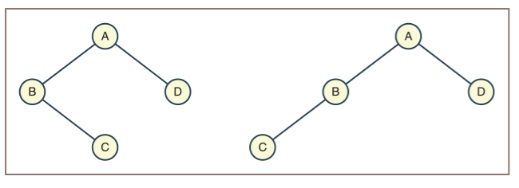
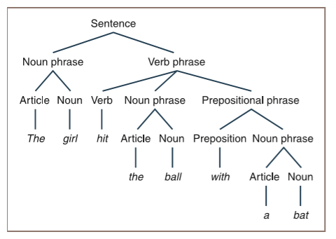
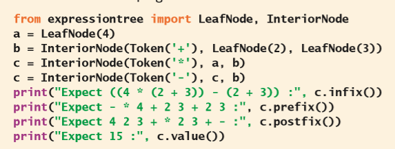

# 树

在完成这一章的学习之后，你就能够：

* 描述树的功能；
* 描述树遍历算法的各种类型；
* 知道树适合被用在哪三种常见的应用程序；
* 描述二叉查找树的功能以及它所包含的操作；
* 知道二叉查找树适合被用在哪三种常见的应用程序；
* 描述表达式树的功能以及它所包含的操作；
* 在递归下降解析里使用表达式树；
* 描述堆的功能以及它所包含的操作；
* 对堆排序进行复杂度分析。

多项集的另一种主要类别在第2章“多项集的概述”里被称为**分层**（**hierarchical**），它由各种类型的树结构组成。大多数编程语言都不会把树包含在标准类型里。但是，树结构有非常广泛的使用场景。它们非常自然地代表了一些像是文件目录结构或书的目录等等这样的对象的多项集。树还可以用来实现其它需要有高效的搜索操作的多项集，例如有序多项集和有序字典；或是实现如优先队列那样，需要在元素上添加某些优先级顺序的多项集。这一章介绍了让树成为非常有用的数据结构的相关属性，并探讨了树在实现若干种类型的多项集里的作用。

> 译者注：在第二章里，分层多项集是第二种，而原文这里写的是第三种。因此翻译忽略了这一排序情况。

## 树的概述

到目前为止我们所研究的线性数据结构都有：第一个元素之外的所有元素都有一个不同的前序；最后一个元素之外的所有元素都有一个不同的后继。而树结构里，前序和后继的这种关系被**父节点**（**parent**）和**子节点**（**child**）的关系所取代。树有两个主要特征：

* 每个元素可以有多个子节点。

* 除了一个特殊的元素（被称为**根节点**（**root**））外，所有的其它元素都有且只有一个父节点。根节点没有父节点。

### 树的术语

树的术语是一种融合了生物学、家谱以及几何学的术语的特殊组合。表10-1提供了这些术语的简单介绍。图10-1展示了一棵树以及它的一些属性。

表10-1 用来描述树的术语的总结

| 术语 | 定义 |
| --- | --- |
| 节点（Node） | 存储在树里的元素。 |
| 根节点（Root） | 在树最上层的节点。唯一没有父节点的节点。 |
| 子节点（Child） | 某个给定节点的下方的直接连接到的节点。一个节点可以有多个子节点，并且它的子节点在查看的时候会按照从左到右的顺序进行组织。最左边的子节点被称为第一个子节点；最右边的子节点被称为最后一个子节点。 |
| 父节点（Parent） | 某个给定节点的上方的直接连接到的节点。一个节点只能有一个父节点。 |
| 兄弟节点（Siblings） | 拥有共同父节点的一些子节点。 |
| 叶节点（Leaf） | 没有子节点的节点。 |
| 内部节点（Interior node） | 一个至少包含一个子节点的节点。 |
| 边/分支/链接（Edge/Branch/Link） | 连接父节点和子节点的线。 |
| 后裔（Descendant） | 节点的子节点，子节点的子节点，依此类推，直到叶节点为止。 |
| 祖先（Ancestor） | 节点的父节点，父节点的父节点，依此类推，直到根节点为止。 |
| 路径（Path） | 连接节点和它的其中一个后代的一系列的边。 |
| 路径长度（Path length） | 路径里的边的数目。 |
| 深度或层数（Depth or level） | 节点的深度或层数等于把它连接到根节点的路径长度。因此，根节点的深度或层数为0。它的子节点是的层数是1，依此类推。 |
| 高度（Height） | 树里最长路径的长度；换句话说，也是树里叶节点的最大层数。 |
| 子树（Subtree） | 由一个节点和它的所有后代形成的树。 |


> 左边分别是：第0层；第1层；第2层；第3层。
>
> 右边是：
>
>    | 属性 | 值 |
>    | --- | --- |
>    | 节点数 | 10 |
>    | 高度 | 3 |
>    | 根节点 | H |
>    | 叶节点 | A, C, J, L, M, N |
>    | 内部节点 | H, B, F, E |
>    | 第二层的节点 | A, C, J, E |
>    | E的祖先 | F, H |
>    | F的后裔 | J, E, L, M, N |
>    | F最右侧的子树的节点 | E, L, M, N |

图10-1 树的一些属性

可以看到，树的高度和它所包含的节点数是不同的。只包含一个节点的树的高度为0，按照惯例，空树的高度为-1。

### 普通树和二叉树

图10-1里所展示的树有时被称为**普通树**（**general tree**），从而可以把它和被称为**二叉树**（**binary tree**）的特殊类别区分开。在二叉树里，每个节点最多有两个子节点，分别被称为**左子节点**（**left child**）和**右子节点**（**right child**）。在二叉树里，当一个节点只有一个子节点的时候，你仍然可以把它区分为左子节点或右子节点。因此，图10-2里所展示的两棵树，如果当作二叉树的话，那么就并不相同，但是在被视为普通树时它们是相同的。



图10-2 具有同样一组节点集的两个不相等的二叉树

### 树的递归定义

接下来，你将会看到普通树和二叉树的更为正式的定义。通常来说，在没有直观地理解所定义的概念的时候，是无法理解正式的定义的。但是，正式的定义仍然很重要，这是因为它为进一步的讨论提供了更为精确的基础。而对树的递归处理十分常见，所以我们对下面的这两种树的都有递归定义：

* 普通树——普通树若不是空树，那就是由有限的一组节点$T$组成的。其中一个节点$r$和其它所有节点都不同，被称为根节点。除此之外，集合$T – {r}$被分成了若干不相交的子集，每个子集都是一棵普通树。

* 二叉树——二叉树若不是空树，那就是由根节点加上左子树和右子树组成的，并且这些子树也都是二叉树。

### 练习题

根据下面这颗树来回答以下六个问题。


1. 树里的叶节点是什么？

2. 树里的内部节点是什么？

3. 节点7的兄弟节点是什么？

4. 树的高度是多少？

5. 第2层里有多少个节点？

6. 树是普通树、二叉树还是两者都满足？

## 为什么要用树结构？

前面提到过，树能够很好地表示层次结构。**解析**（**parsing**）是指分析语言里特定句子的语法的过程。**解析树**（**parse tree**）根据句子的组成部分（如名词短语或动词短语）来描述句子的句法结构。例如，图10-3展示了句子“The girl hit the ball with a bat”（“女孩用球棒击打球”）的解析树。



>                   句子
>               /          \
>        名词短语           动词短语
>         /   \        /      |       \
>       冠词  名词  动词   名词短语      介词短语
>        |     |     |     /   \        /     \
>       The   girl  hit  冠词  名词   介词    名词短语
>                         |     |     |       /   \
>                        the   ball  with   冠词  名词
>                                             |    |
>                                             a   bat

图10-3 句子的解析树

这颗树的根节点被标记为“句子”，用来表示这个结构里的最顶层的结构。它的两个子节点分别被标记为“名词短语”和“动词短语”，代表了这个句子的组成部分。标记为“介词短语”的节点是“动词短语”的子节点，因此表示了介词短语“with a ball”是用来修饰动词“hit”的而不是去修饰名词短语“the ball”的。在最底层，像是“ball”这样的叶节点用来表示解析的过程中的单词。

在这一章的后面你将会看到，计算机程序可以在算术表达式的分析期间构造解析树。然后，你可以把这些解析树进行进一步地处理和挖掘，例如检查表达式里是否存在语法错误，以及解释它们的含义或值。

文件系统结构也是树状的。图10-4展示了这样的结构，其中目录（现在通常被称为文件夹）被标记为了“D”，文件则被标记为“F”。


图10-4 文件系统结构

可以看到，这个图里的根节点代表了根目录。其它目录在非空时是内部节点，而在空时则是叶节点。所有的文件都是叶节点。

一些有序多项集也可以被表示为树状结构。这种树被称为**二叉查找树**（**binary search tree**），简称BST。在这棵树里的左子树里的每个节点的值都小于它的根节点的值，并且它的右子树里的每个节点的值都大于它的根节点的值。图10-5展示了包含字母A到G的由二叉查找树表示的有序多项集。


图10-5 二叉查找树表示的有序多项集

与第6章“继承与抽象类”里讨论的有序背包不同，二叉查找树不仅可以支持对数时间的搜索操作，还能够支持对数时间的插入和删除操作。

上面三个例子表明了，树的最重要和最有用的特征并不是树里节点的位置，而是父节点与子节点之间的关系。这些关系对于树结构里的数据的意义非常重要。它们可能会用来表示字母的顺序、短语的结构、子目录之间的包含关系、或是在问题里的任何一对多关系。树里的数据的处理将会基于数据之间的父/子关系。

后面的小节将会着重介绍二叉树的不同类型、应用程序以及它的实现。

## 二叉树的形状

自然界里的树包含各种形状和大小，而数据结构里的树也有各种形状和大小。简单地说，有些树是藤蔓状的、几乎是线性的；而另一些则是浓密的。这些形状的两个极端如图10-6所示。


图10-6 藤蔓状的树和茂密的树

为了能够更正式地描述二叉树的形状，我们可以用到树的高度和它所包含的节点数之间的关系。这个关系还会提供有关树的某些操作的潜在效率的相关信息。

在极端情况下，二叉树可以像藤蔓一样，在有$N$个节点时，高度为$N – 1$（如图10-6的左侧）。这样的树类似于链表里的一条节点链。

因此，在最差情况下，对这个结构里的节点进行访问、插入或删除操作都是线性的。

与此对应的另一个极端的例子是：一颗**满二叉树**（**full binary tree**），它拥有给定高度$H$可以容纳的最大节点数（如图10-6的右侧）。这个形状的树在每一层都包含了所有的节点。因此，所有的内部节点都有两个子节点，所有的叶节点都位于最低层。表10-2列出了四个不同高度的满二叉树的高度和节点数。

表10-2 满二叉树的高度与节点数的关系

| 树的高度 | 树的节点数 |
| --- | --- |
| 0 | 1 |
| 1 | 3 |
| 2 | 7 |
| 3 | 15 |

让我们来总结下这张表格里的数据。高度为$H$的满二叉树里包含的节点数$N$是多少？要用$H$来表示$N$，可以从根节点（1个节点）开始，添加它的子节点（2个节点），再添加子节点的子节点（4个节点），依此类推：

$$
N = 1 + 2 + 4 + ... + 2^H \\
  = 2^{H+1} - 1
$$

那么，具有$N$个节点的满二叉树的高度$H$是多少？通过简单的代数计算，我们可以得出：

$$
H = \log_2 (N+1) - 1
$$

因为从根节点到叶节点的路径上的节点数接近$\log_2 (N)$，所以要访问满二叉树里的给定节点所需要的最大工作量为$O(\log n)$。

但是，并不是所有茂密的树都是满二叉树。比如，一个**完美平衡二叉树**（**perfectly balanced binary tree**）是除了最后一层的其它每一层的节点都被填满的树，它足够茂密，并且也能支持在最差情况下，对叶节点在对数时间内进行访问。另一个例子是：**完全二叉树**（**complete binary tree**），它是完美平衡二叉树的一个特例，并且会像满二叉树那样从左到右填充最后一层的节点。图10-7总结了这些类型的二叉树的形状，并提供了一些示例。


> 不平衡的二叉树 | 完美平衡二叉树
>
> 完全二叉树 | 满二叉树

图10-7 二叉树的四种形状

一般而言，随着二叉树越来越平衡，访问、插入和删除操作的性能都会有所提高。

### 练习题

1. 完美平衡二叉树和完全二叉树之间有什么区别？

2. 完全二叉树和满二叉树有什么区别？

3. 一颗满二叉树的高度为5。那么它包含多少个节点？

4. 一颗完全二叉树包含125个节点。那么它的高度是多少？

5. 在满二叉树里，在第$L$层上有多少个节点？用$L$来表示你的答案。

## 二叉树的遍历

在前面的章节里，你了解到了如何通过`for`循环或迭代器来遍历线性多项集里的元素。二叉树的遍历有四种标准类型：前序、中序、后序以及层次遍历。每种遍历在访问树里的节点时都遵循特定的路径和方向。这一节将展示在二叉查找树上的每种遍历的图；遍历算法将在这一章的后面部分进行开发。

### 前序遍历

**前序遍历**（**preorder traversal**）算法会先访问树的根节点，然后以相同的方式分别遍历它的左子树和右子树。前序遍历访问的节点序列如图10-8所示。


> 访问的节点的顺序

图10-8 前序遍历

### 中序遍历

**中序遍历**（**inorder traversal**）算法会依次遍历左子树、访问根节点、最后遍历右子树。在对节点进行访问之前，这个过程将会先从树的最左侧开始。中序遍历访问的节点序列如图10-9所示。


> 访问的节点的顺序

图10-9 中序遍历

### 后序遍历

**后序遍历**（**postorder traversal**）算法先遍历左子树、遍历右子树、最后访问根节点。后序遍历所经过的路径如图10-10所示。


> 访问的节点的顺序

图10-10 后序遍历

### 层次遍历

**层次遍历**（**level order traversal**）算法是从第0层开始，以从左到右的顺序访问每一层里的节点。层次遍历所经过的路径如图10-11所示。


> 访问的节点的顺序

图10-11 层次遍历

可以看到，中序遍历可以用来按照排序顺序访问二叉查找树里的元素。表达式树的前序、中序和后序遍历可以分别用来生成前缀、中缀以及后缀形式的表达式。

## 二叉树的三种常见应用

前面提到过，树强调的是父子节点之间的关系，这就能够让用户可以根据位置以外的标准来对数据进行排序。这一节介绍了二叉树的三种特殊用法：堆、二叉查找树和表达式树，这些特殊用法都对它们的数据加上了顺序。

### 堆

二叉树里的数据通常是从可以相互进行比较的元素的有序集合里得到的。**最小堆**（**min-heap**）就是一个特殊的二叉树，其中每个节点的值都小于或等于它的两个子节点。而**最大堆**（**max-heap**）则是把更大的节点放在更靠近根节点的位置。这种对节点的顺序进行的任何约束都被称为**堆属性**（**heap property**）。这里提到的堆和计算机用来管理动态内存的堆并不一样，请不要混淆它们的概念。图10-12展示了两个最小堆的示例。


图10-12 最小堆的示例

就像图里展示的，最小的元素会在根节点处，而最大的元素则会在叶节点里。可以看到，根据前面给出的定义，图10-12里的堆都是完全二叉树的形状。这种在堆里放置数据的方法为我们提供了一种被称为**堆排序**（**heap sort**）的高效排序方法。堆排序算法会先把一组数据构建成一个堆，然后不断的删除根节点的元素并把它添加到列表的末尾，而达到排序的目的。堆还可以用来实现优先队列。你将在这一章后面开发堆的实现。

> 译者注：原文这段用的图的序号是10-8，根据上下文，这里应该是图10-12。

### 二叉查找树

前面提到过，BST在它的节点上添加了排序的顺序。但是，这样做的方式和堆的方式是不一样的。在BST里，给定节点的左子树里的节点会小于给定节点，而它的右子树里的节点会大于给定节点。当BST的形状接近完美平衡二叉树的形状时，在最差情况下，搜索和插入操作的复杂度都是$O(\log n)$。

图10-13展示了用在有序列表上的二分搜索的所有可能的搜索路径，但是在实际搜索的过程中只会用到其中一条路径。图里每个子列表里为了进行比较而访问的元素会加上阴影进行显示。


> 调用的层数

图10-13 有序列表的二分搜索的可能搜索路径

如图所示，最长的搜索路径（元素4-7-8-9）需要在包含八个元素的列表里进行四次比较。这是因为列表是有序的，因此搜索算法在每次比较后都可会把搜索空间减少一半。

> 译者注：原文中：“最长的搜索路径（元素5-7-8-9）需要”，应该是“最长的搜索路径（元素4-7-8-9）需要”

接下来，你可以把上图里的阴影部分转换成一个明确的二叉树结构，就像图10-14这样。


> 调用的层数

图10-14 二叉查找树

你将在这一章的稍后部分开发的搜索算法里遵循这样一条从根节点到目标节点的非常明确的路径。在这种情况下，完美平衡树会在对数时间里完成搜索。遗憾的是，并不是所有的BST都是完美平衡的。因此，在最差情况下，它们的搜索时间将会是线性的，也就是支持线性搜索。好在这种最差情况在实践里很少发生。

### 表达式树

在第7章“堆栈”里，我们介绍了如何使用堆栈来把中缀表达式转换为后缀的形式，并且还介绍了如何使用堆栈来计算后缀表达式。在那一章里，你还为算术表达式语言开发了解释器和计算器。在一个语言里翻译句子的过程也被称为**解析**（**parsing**）。另一个处理句子的方法是在解析的过程中构建**解析树**（**parse tree**）。对于表达式语言来说，这个结构也被称为**表达式树**（**expression tree**）。图10-15展示了若干个解析中缀表达式后得到的表达式树。


> 根节点
>
> 右子树
>
> 左子树

图10-15 若干个表达式树

对于表达式树，有下面几点需要注意：

* 表达式树永远不会为空；

* 每个内部节点都代表一个复合表达式，它会由一个运算符及其操作数组成。因此，每个内部节点都恰好有两个子节点，它们代表这个运算符的操作数；

* 每个叶节点都代表一个原子的数字操作数；

* 优先级较高的运算符通常出现在树的底部附近，除非它们在源表达式里被括号改变了优先级。

如果用表达式树来作为存放算术表达式的结构，那么就可以从表达式树里得到：

* 得到表达式的值；

* 得到后缀形式的表达式；

* 得到前缀形式的表达式；

* 得到中缀形式的表达式。

这一章的案例研究将会开发一个表达式树的类型，并把它合并到一个可以执行这些操作的程序里。

### 练习题

1. 最小堆的堆属性是什么？

2. 二叉查找树与二叉树有何不同？

3. 分别用中缀、前缀和后缀表示法来编写下面这颗表达式树所代表的表达式。（*提示*：使用这一节里描述的中序、前序和后序遍历来得到答案。）

    

4. 画出下面这些表达式的表达式树图：

    a) 35 + 6

    b) 3 + 56

    c) 356

## 开发二叉查找树

二叉查找树会对二叉树里的节点添加额外的顺序信息，因此它支持对数时间的搜索和插入操作。这一节将开发一个二叉查找树多项集，并对它的性能进行评估。

### 二叉查找树接口

二叉查找树的接口应该包含构造函数和所有多项集通用的基本操作（`isEmpty`、`len`、`str`、`+`、`==`、`in`、`add`以及`count`）。

就像背包和集合那样，插入和删除操作是由`add`和`remove`方法完成的。当Python看到`in`运算符时会运行的`__contains__`方法在BST的各种实现里都将会执行二分搜索操作。

为了让用户可以检索和替换二叉查找树里的节点，还应该包含`find`和`replace`方法。`find`方法会接收一个元素作为参数，然后返回在树里和它相匹配的元素，如果不存在的话，就返回`None`。`replace`方法会接收两个元素作为参数。如果这个方法在树里能够找到第一个参数的匹配元素，那么就把这个节点里的元素替换为第二个参数，并返回被替换的元素。如果不存在的话，这个方法会返回`None`。当你用二叉查找树来实现有序字典时，这两种方法对于查找和修改元素（如字典条目）会非常有用。

由于遍历二叉树有四种方法，因此你要在树里实现所有的遍历方法。每个遍历方法都会返回一个迭代器。树的`__iter__`方法将会支持前序遍历。选择这种遍历方式来作为标准迭代器有两个好处，一是因为这样可以让用户创建一颗形状和原始形状完全相同的二叉查找树的克隆体，二是由于这样可以在链接两棵树的时候得到一颗形状相似的树。

如果两棵树在相同的位置都包含相同的元素，那么就可以认为它们是相等的。`str`操作会返回一个字符串，这个字符串在输出时会显示出树的形状。

表10-3里描述了所有的二叉查找树类都会包含的方法。

表10-3 二叉查找树接口里的方法

| BST方法 | 它的功能 |
| --- | --- |
| `tree.isEmpty()` | 当树为空时返回`True`；不然返回`False`。 |
| `tree.__len__()` | 相当于`len(tree)`。返回`tree`里的元素数量。 |
| `tree.__str__()` | 相当于`str(tree)`。返回一个在输出时会显示出树的形状的字符串。 |
| `tree.__iter__()` | 相当于`iter(tree)`或是`for item in tree:`。在树上执行前序遍历。 |
| `tree.__contains__(item)` | 相当于`item in tree`。当`item`在树里时返回`True`；不然返回`False`。 |
| `tree.__add__(otherTree)` | 相当于`tree + otherTree`。返回一颗包含`tree`和`otherTree`里的元素的新树。 |
| `tree.__eq__(anyObject)` | 相当于`tree == anyObject`。如果当前的树和`anyObject`相等，返回`True`；不然返回`False`。如果两棵树在相同的位置都包含相同的元素，那么就可以认为它们是相等的。 |
| `tree.clear()` | 把`tree`清空。 |
| `tree.add(item)` | 把`item`添加到树里相应的位置。 |
| `tree.remove(item)` | 从树里删除掉`item`。*先验条件*：`item`在树里。 |
| `tree.find(item)` | 如果在树里存在节点等于`item`，返回这个相等的元素；不然返回`None`。 |
| `tree.replace(item, newItem)` | 如果在树里存在节点等于`item`，用`newItem`来替换树里的这个节点，并返回被替换的元素；不然的话，返回`None`。 |
| `tree.preorder()` | 返回一个在树上执行前序遍历的迭代器。 |
| `tree.inorder()` | 返回一个在树上执行中序遍历的迭代器。 |
| `tree.postorder()` | 返回一个在树上执行后序遍历的迭代器。 |
| `tree.levelorder()` | 返回一个在树上执行层次遍历的迭代器。 |

下面这个Python的脚本会假定已经在`linkedbst`模块里定义了`LinkedBST`类。这个脚本将会创建一个包含图10-15里显示出的字母的BST，并输出出它的形状。


这是这段脚本的输出：


### 链式实现的数据结构

二叉查找树的实现被称为`LinkedBST`，它是`AbstractCollection`的子类，它提供基本的多项集的方法以及变量`self.size`。树里的每个元素的容器都是`BSTNode`类型的节点对象。这种类型的节点会包含一个叫做`data`的数据字段以及两个分别叫做`left`和`right`的链接字段。而因为每个元素在被插入到树里的时候，一开始都是叶节点，所以`BSTNode`的左右链接的默认值都是`None`。另外一个用来引用整个树结构的链接被称为`self.root`。在这个类被实例化时，这个变量会被设置为`None`。下面是`LinkedBST`类里创建树的部分的代码。


接下来我们将会更仔细地研究其它的几种方法。大多数这些方法都用到了递归策略，这是因为这样正好利用了树里节点的递归结构。这种设计模式和你在第9章里用来处理类Lisp列表的模式很类似。

#### 二叉查找树的搜索

如果目标元素在树里，那么`find`方法就会返回第一个匹配的元素；否则返回`None`。在设计搜索时，你可以使用一个利用二叉树底层的递归结构的递归策略。下面是这个过程的伪代码算法：


由于递归搜索算法需要用到树节点来作为参数，因此你不能把它定义为顶层方法。然而，你可以把它定义为一个嵌套的辅助函数，这个函数会在顶层`find`方法里被调用。下面是这两个过程的代码：


#### 二叉查找树的遍历

遍历二叉查找树有四种方法：`inorder`、`postorder`、`levelorder`以及`__iter__`（前序遍历）。这些方法都会返回一个能够让用户按指定顺序访问树的迭代器。这一节将会展示两种遍历的递归和迭代的策略的例子，其它的遍历操作将会留给你作为练习。

下面是二叉树的中序遍历的通用递归策略：


你可以将这个策略作为递归辅助函数嵌入到`inorder`方法里去。这个方法首先创建一个空列表，然后把根节点传递给这个辅助函数。当辅助函数访问元素的时候，这个元素将会被添加到列表里去。`inorder`方法将会返回这个列表上的迭代器。下面是递归实现的`inorder`方法的代码：


后序遍历可以使用非常相似的递归策略，只需要让它访问元素的代码在另一个位置就行了。

层次遍历是在树的每一层都按照从左到右的顺序访问元素，就像读取文档里的文本行那样样。这个过程的迭代策略可以使用队列来排列需要被访问的节点，并使用列表来收集被访问的元素。`levelorder`方法将会创建这个列表和队列，并将根节点（如果有的话）添加到队列中。接下来，当队列不为空时，弹出它的前端节点；并把它的元素添加到列表里；然后，再把这个节点的左右子节点（如果存在的话）添加到队列中。当循环终止时，这个方法会返回一个列表上的迭代器。

使用前序遍历的`__iter__`方法会被非常频繁地运行，因此我们需要用迭代策略来实现它。你可以像前面那样通过创建一个列表并返回它的迭代器来实现；但是这样做会需要线性的运行时间和线性的内存使用量，才能让用户访问到这些元素。一种替代方案是，可以通过基于探针的循环来访问节点，并使用堆栈来支持在遍历期间那些能够返回父节点的操作。并且，就像其它多项集的这个方法那样，在每次访问节点时都直接返回这个元素。新的方案是这样的：


这个实现不会在运行时带来额外的开销，并且它的内存增长并不会随着树的深度增加而变得更糟（理想情况下是$O(\log n)$）。

### 二叉查找树的字符串表达形式

通过任何一种遍历方式都可以让你查看到二叉查找树里的所有元素。但是，因为要在测试和调试里使用`__str__`方法，因此你的实现里将会返回一个“ASCII艺术”样式的字符串，这个字符串将会显示出树的形状以及它的元素。一种用纯文本来进行显示的简单方法是把树逆时针“旋转”90度，然后用竖线把每一层的内部节点的空隙部分填满。下面的代码就会先从右子树进行递归，然后访问当前元素，最后在左子树进行递归来构建出恰当的字符串。


### 将元素插入到二叉查找树

`add`方法会把一个元素插入到二叉查找树里的合适位置。通常来说，一个元素的恰当的位置应该是下面三个位置之一：

* 根节点（如果树为空的话）；

* 如果新的元素小于当前节点里的元素，那么就应该是当前节点左子树里的一个节点；

* 如果新的元素大于或等于当前节点里的元素，那么就应该是当前节点右子树里的一个节点。

对于第二和第三种状况来说，`add`方法会通过一个叫做`recurse`的递归辅助函数来完成。这个函数会把一个节点作为参数，并且在节点的左子节点或右子节点里搜索新元素的位置。`recurse`函数先根据新元素是小于（左）还是大于或等于（右）当前节点里的元素，来决定去到当前节点的左侧或右侧。如果这个恰当的子节点位置是`None`，那么就把新元素放在新节点里然后再插入到这个位置。不然的话，将继续使用当前的子节点来递归地调用`recurse`函数，知道找到适当的位置为止。

下面是`add`方法的代码：


可以看到，不论是什么情况，都会插入一个包含元素的叶节点。

### 从二叉查找树里删除元素

回想一下，从数组里删除元素会导致元素的移动来填补被删除产生的空间。而从链表里删除元素则需要重新排列若干个指针。在二叉查找树里删除一个元素可能会同时需要这两种操作。下面是对这个策略的过程的概述：

1. 保存对根节点的引用。

2. 找到要删除的节点、它的父节点以及它的父节点对这个节点的引用。

3. 如果节点同时拥有左子节点和右子节点，那么就以左子树里的最大值替换掉当前节点的值，然后从左子树里删除最大值刚才所在的那个节点。

4. 不然的话，把父节点对当前节点的引用指向这个节点的那个子节点。

5. 把根节点指针重新指向第一步里保存的引用。

6. 减小数据结构的大小并返回被删除的元素。

这个过程中的步骤3会很复杂，因此你可以把它分解成一个辅助函数，这个函数将会把要被删除的节点作为参数。它的功能就像下面描述的这样。在这个大纲里，那个包含需要被删除的元素的节点被称为*顶部节点*（*top node*）。

1. 在顶部节点的左子树里搜索包含最大元素的节点。它应该是位于子树的最右边节点（这颗子树里最右侧的路径的最后一个节点）。在搜索的过程中，还需要跟踪当前节点的父节点。

2. 用找到的最大元素替换顶部节点里的值。

3. 如果顶部节点的左子节点里就包含了最大元素（如，这个节点没有右子树，因此这时对父节点的引用仍然会指向顶部节点），那么就把顶部节点的左子节点设置为这个左子节点的左子节点。

4. 不然的话，把父节点的右子节点设置为这个右子节点的左子节点。

### 二叉查找树的复杂度分析

就像你知道的那样，建立二叉查找树的目的是为了可以像在有序列表进行二分搜索那样，能够以$O(\log n)$的复杂度来执行查找操作。另外，二叉查找树还可以提供快速的插入操作。遗憾的是，前面提到过，快速的插入操作并不总是能够实现。能不能得到最好的性能取决于树的高度。完美平衡树（高度为$O(\log n)$的树）能够支持在对数时间进行搜索操作。在最差情况下，当按照顺序（按升序或降序）来插入元素时，树的高度将变成线性的，它的搜索行为也将会变成线性复杂度。但是，我们也看到了：如果以随机顺序插入元素，会让树的搜索行为接近最好情况。

插入的运行时间也高度依赖于树的高度。回想一下，插入会涉及到搜索元素的位置，而这个位置始终会是一个叶节点。因此，插入到完美平衡树里的运行时间接近对数时间。同样的，删除操作也需要搜索目标元素，其它的操作也有类似的情况。

如何维护一颗树结构，使得它能够在所有情况下进行插入和搜索的操作都是最佳情况的策略，是更高级的计算机科学课程里的主题。但是，如果你假设一棵树已经相对平衡了，只要你的程序能够吧BST和文本文件进行转换，那么就有一种你可以立即使用的技术，来保持这颗树的形状不变。在输出操作的时候，要想得到树的元素的唯一办法就是对它进行一次遍历。这个遍历最糟糕的选择是使用中序遍历，因为这个遍历会按照排序顺序去访问节点，所以树里的元素将会按照顺序进行保存。然后，当元素从文件里输入到另一棵树时，它们将按照顺序被依次插入，这样就会让你得到一棵线性形状的树。当然，如果你选择的是前序遍历（通过简单的`for`循环来使用它），那么在元素输出到文件里的时候，会从父节点开始，然后向下移动到它的左、右子节点。之后，从文件里输入元素的时候就能够得到一棵新的和原来的树的形状完全相同的树。

编程项目里将会包括实现用来判断树是否平衡以及重新平衡一颗树的方法的练习。

### 练习题

1. 描述插入操作是如何对二叉查找树的后续搜索产生负面影响的。

2. 讨论基于二叉查找树的有序背包实现和第6章里介绍的基于数组的有序背包实现之间的权衡。

## 递归下降解析和编程语言

第7章里讨论了使用堆栈来把表达式从中缀转换为后缀，然后计算后缀表达式的算法。递归算法也可以用来处理语言，无论是像是Python这样的编程语言还是像是英语这样的自然语言都可以被处理。这一节将会简单介绍一些用来处理语言的资源，包括语法、解析和递归下降解析策略。在后面一节将会通过案例研究来说明它们的应用。

### 语法简介

不论是大还是小，大多数编程语言，都有精确而完整的定义，这被称为**语法**（**grammar**）。语法由下面几个部分组成：

* **词汇表**（**vocabulary**）（或是**字典**（**dictionary**）或**词典**（**lexicon**））是指可以被用来组成语言里的句子的单词和符号。

* 一组**句法规则**（**syntax rules**）用来代表应该如何把语言里的符号组合成句子。

* 一组**语义规则**（**semantic rules**）用来代表应该如何去解释语言里的句子。例如，语句$x = y$可以解释为“将y的值复制到变量x”的意思。

计算机科学家已经开发出了几种用来表示语法的符号。比如，假设你想定义一种语言来表示下面的这些简单的算术表达式：

```
4 + 2
3 * 5
6 - 3
10 / 2
(4 + 5)* 10
```

并且，你不允许包含像是`4 + 3 − 2`或是`4 * 3 / 2`这样连续出现的加减法和乘除法的表达式。下面这个语法规则就定义了这种新的小语言的句法和词汇：


这种语法被称为扩展巴科斯范式（Extended Backus–Naur Form，EBNF）语法。EBNF语法通过三种符号来完成：

* **终结符**（**Terminal symbols**）——这些符号会存在于语言的词汇表里，并按照自身的样子显示在语言的程序里。例如，在前面的示例里的`+`和`*`。

* **非终结符**（**Nonterminal symbols**）——这些符号用来对应语言里的短语名称。例如，上面的例子里的`expression`或是`factor`。短语通常是由一个或多个终结符或是其它短语名称组成。

* **元符号**（**Metasymbols**）——这些符号用来组织语法规则。表10-4列出了EBNF里使用的元符号。

表10-4 EBNF里的元符号

| 元符号 | 作用 |
| --- | --- |
| `""` | 包围文字元素 |
| `=` | 表示“被定义为” |
| `[]` | 包围可选元素 |
| `{}` | 包围零个或多个元素 |
| `()` | 把选择组合在一起 |
| `|` | 表示选择一个 |

因此，规则


的意思就是“一个表达式被定义为一个术语，它可能会也可能不会跟着一个加减法运算符以及另一个术语。”在规则里`=`左边的符号被称为规则的左侧；位于`=`右边的一组元素被称为规则的右侧。

在前面讨论的那个语法不允许使用像是`45 * 22 * 14 / 2`这样的表达式，因此如果程序员想要得到等效的表达式，就必须要使用括号，像是这样：`((45 * 22) * 14) / 2`。要解决这个问题，可以通过允许对术语和因子进行迭代来完成：


在任何语法里，都会有一个特权符号，被称为**开始符号**（**start symbol**）。在这两个语法的例子里，开始符号是`expression`。我们将会在稍后讨论这个符号是如何被使用的。

你可能已经注意到，上面这个语法会包含递归的性质。比如，表达式是由术语组成的；而术语又是由因子组成；接下来，因子又是由数字或是括号内的表达式构成的。因此，一个表达式里是可以包含另一个表达式的。

### 识别、解析和解释语言里的句子

要处理语言里的句子，就需要用到识别器、解析器和解释器。

**识别器**（**recognizer**）会分析字符串来确定它是不是属于给定语言的句子。识别器的输入是语法和字符串。输出则为“是”或“否”以及相应的语法错误消息。如果存在一个或多个语法错误，那么就会得到“否”，表明这个字符串不是一个合法的句子。

**解析器**（**parser**）有识别器所包含的全部功能，并且还可以返回有关句子的句法和语义结构的信息。这些信息会在后面的处理的过程中被用到，并且会被包含在解析树里。

**解释器**（**interpreter**）根据句子来执行指定的动作。换句话说，解释器会运行程序。有时，解析和解释是同时发生的；不然的话，解释器的输入就是解析的过程中产生的数据结构。

在后面的内容里，我们不会严格的区分识别器和解析器，而是直接用*解析器*来代表它们。

### 词法分析和扫描器

在开发解析器时，把识别字符串里符号的任务交给被称为**扫描器**（**scanner**）的较低级模块来处理会比较方便。扫描器会执行**词法分析**（**lexical analysis**），也就是从字符流里提取出各个单词。扫描器还会根据需要输出词法错误的消息。词法错误的例子包括有：数字里不应该出现的字符，以及无法被识别的符号（词汇表里没有的符号）。

扫描器的输出是被称为**标记**（**token**）的单词流。这些标记会成为另一个被称为**语法分析器**（**syntax analyer**）的模块的输入。这个模块会使用标记和语法规则来确定这个程序在语法上是不是正确的。因此，词法分析器会确定字符在一起能不能组成正确的单词，而语法分析器则会确定单词在一起能不能组成正确的句子。为了简单起见，我们会把将词法分析器称为扫描器，而语法分析器则被称为解析器。在图10-16里展示了扫描器和解析器之间的联系。


>          源字符串                 标记                  “是”或“否”
>       ------------->  扫描器  ----------->  解析器  ---------------->
>                         |                     |
>                    词法错误消息           语法错误消息

图10-16 串联工作的扫描器和解析器

### 解析策略

你可以使用若干种不同的策略来进行解析。其中最简单的方法之一被称为**递归下降解析**（**recursive descent parsing**）。递归下降解析器为语法里的每个规则都定义了一个函数。每个函数会处理它所对应的规则所包含的短语或是输入语句的一部分。最顶层的函数对应于规则左侧是开始符号的规则。调用这个函数时，它将调用规则右侧的非终结符所相对应的函数。比如，下面是和这一节里一开始那个语法的顶层规则相对应的解析函数：


从代码里可以看到下面几点：

* 语法里的每个非终结符都将会成为解析器里函数的名称。

* 函数的主体会处理规则右侧的短语。

* 要处理非终结符，只需要调用这个符号同名的函数就行了。

* 要处理可选元素，需要用到`if`语句。

* 通过调用扫描器对象上的`get`方法来观察当前标记。

* 通过调用扫描器对象上的`next`方法来扫描到下一个标记。

你的解析器将遵循语法规则，从顶层函数开始，一直执行到下层函数，而这些下层函数又会去递归地调用更高层的函数。

你可以很方便地扩展递归下降解析器来解释和解析程序。比如，对于你的语言来说，每个解析函数都可以计算并返回表达式所关联的短语里所代表的值。因此最顶层的函数返回的值也就是整个表达式的值。或者，就像后面这个案例研究这样，递归下降解析器也可以构建并返回一颗解析树，再通过另一个模块来遍历这颗树，从而进行计算来得到的表达式的值。

## 案例研究：解析和表达式树

前面提到过，表达式树是一颗包含表达式的操作数和运算符的二叉树。因为表达式树永远不会为空，所以它非常适合进行特别优雅的递归处理。在这一节里，你将会设计和实现一个表达式树，从而对算术表达式的处理进行支持。

### 案例需求

编写一个使用表达式树来计算表达式或把它转换为其它形式的程序。

### 案例分析

这个程序会对输入的表达式进行解析，并在出现错误时输出语法错误的消息。如果这个表达式在语法上是正确的，那么程序就会输出这个表达式的值以及它的前缀、中缀和后缀形式。下面这个交互示例展示了如何与这个程序进行交互。可以看到，中缀的输出会通过括号来显式地表示出运算符的优先级。


> 译者注：第一行的“`4 + 5 * 2`”和第五行的“`(4 + 5) * 2`”根据前面的交互示例应该时黑色的。

这个程序包含了前面讨论过的`Scanner`和`Token`类。除此之外，还有三个新类。其中`Parser`类将执行解析操作，而`LeafNode`类和`InteriorNode`类则会被用来表示表达式树。叶节点会表示表达式里的整数操作数，而内部节点则会用来表示运算符以及它的两个操作数。图10-17展示了这个系统结构的类图。


图10-17 解析系统的类

### 节点类的设计与实现

解析器通过两个步骤来构建表达式树：

* 它会构建用来包含数字的叶节点。

* 它会构建值是运算符的内部节点，并且这个内部节点的左、右子树是代表操作数表达式的节点。

通过把节点分成这两种类型，我们就可以有一种简单且优雅的设计了。第一个类型的节点被称为`LeafNode`，它会包含一个整数。第二个类型的节点被称为`InteriorNode`，它包含一个运算符和两个其它节点。这两个其它节点既可以是叶节点也可以是内部节点。

两种类型的节点都支持表10-5里的这些方法。

表10-5 节点类的方法

| 方法 | 它的功能 |
| --- | --- |
| `N.prefix()` | 返回节点表达式的前缀形式的字符串表示形式。 |
| `N.infix()` | 返回节点表达式的中缀形式的字符串表示形式。 |
| `N.postfix()` | 返回节点表达式的后缀形式的字符串表示形式。 |
| `N.value()` | 返回节点表达式的值。 |

`LeafNode`的构造函数会接收一个整数作为参数，而`InteriorNode`的构造函数会接收一个运算符标记和两个其它节点来作为参数。

下面是一个简短的测试程序，它展示了如何使用这两个节点类：



接下来，你将会开发支持这两个类的遍历方法里的一种，其它的几种将会留作练习。`postfix`方法会按照后缀形式返回表达式的字符串表达形式。对于`LeafNode`来说，这也就是节点的整数的字符串表达形式。


`InteriorNode`的后缀字符串会包含它的两个操作数节点的后缀字符串，再加上这个节点的运算符。


`InteriorNode`和`LeafNode`的`postifx`方法的设计模式有点类似于用来遍历二叉树的方法。但是，它们之间的一个区别是：在这个应用程序里，表达式树永远不会为空，因此基本情况就是叶节点；而另一个区别是：表达式树的`postifx`操作不会用到包含`if`语句和递归调用的递归函数，在这个操作里，使用的是都叫做`postfix`的具有相同名称的不同的方法。Python虚拟机会根据它所调用的节点类型，来选择需要运行这个方法的哪一个版本。在第5章里我们就介绍了被称为多态的概念，它提供了一种简化递归数据处理的强大方法。表达式树的其它遍历方法会有类似的设计，将会留给你作为练习。

### 解析器类的设计与实现

通过使用前面介绍的递归下降策略，可以很简单地使用解析器来构建表达式树。而由于这个策略是被嵌入在类里的，因此在上一节里描述的解析函数将会被重新定义为方法。

顶层方法`parse`会把表达式树返回给它的调用者，然后这个调用者会使用这颗树来获得有关表达式的相关信息。用来处理语言里的语法形式的各个解析方法都会生成并返回一个表达式树。这颗树会被用来代表这个方法所解析的表达式的短语。你将会开发其中的两个方法；其它则会留作练习。

`factor`方法会被用来处理数字或是被嵌套在括号里的表达式。当标记是数字时，这个方法将创建一个包含这个数字的叶节点并返回它。否则，如果标记是左括号，那么这个方法将会调用`expression`方法来解析括号里嵌套的表达式。`expression`方法会返回一个表示结果的树，然后`factor`再把这颗树返回给它的调用者。下面是`factor`方法的代码：


`expression`方法会处理一个术语，以及它后面的零个或多个加减法运算符以及术语对。它首先会调用`term`方法，这个方法会返回代表这个术语的树。然后，如果当前的标记不是加减法运算符，`expression`方法就会把这颗树传递回它的调用者。不然的话，`expression`方法将会进入循环。在这个循环里，`expression`方法会构建一个内部节点，这个节点的值是加减法运算符，这个内部节点的左子树就是之前调用`term`而刚刚收到的树，它的右子树会是新调用`term`方法收到的树。当`expression`方法里不存在还没有处理的加减法运算符时，整个过程就会结束。接下来，`expression`方法将返回在这个过程中可能会建立的一颗非常复杂的树。下面是`expression`方法的代码：


其它的解析方法会按照类似的方式来构建它的树。这个完整的程序的编写将会留给你作为练习。

## 二叉树的数组实现

除了某些特殊情况下会很难定义和实践，通过数组来实现二叉树的也是可行的。将堆栈、队列和列表映射到数组很简单，这是因为它们都是线性结构并且都支持相同的邻接概念，也就是每个元素都有明确的前序和后继。但是对于树里的节点来说，它在数组里的直接前序是什么？是它的父节点还是左边的兄弟节点？它的直接后继是什么？是它的子节点还是右边的兄弟节点？树是分层的，也不会被展平。但是，虽然有这些问题，对于完全二叉树来说，还是有一个优雅而且高效的基于数组的存储方式。

考虑图10-18里的完全二叉树。


> 第0层
>
> 第1层
>
> 第2层
>
> 第3层

图10-18 完全二叉树

在基于数组的实现里，元素将会按层次进行存储，就像图10-19这样。


图10-19 完全二叉树的数组表示

对于在数组里位于位置$i$处的任意元素，都可以很容易地确定和它相关的元素的位置，就像表10-6里展示地这样。

表10-6 完全二叉树的数组存储方式里元素的位置

| 元素 | 位置 |
| --- | --- |
| 父节点 | (i − 1) / 2 |
| 左兄弟节点（如果存在的话） | i − 1 |
| 右兄弟节点（如果存在的话） | i + 1 |
| 左子节点（如果存在的话） | i * 2 + 1 |
| 左子节点（如果存在的话） | i * 2 + 2 |

因此，对于位置3处的`d`来说，你可以得到表10-7里展示的结果。

表10-7 完全二叉树的数组存储方式里d的相关元素

| 元素 | 位置 |
| --- | --- |
| 父节点 | 在位置1的`b` |
| 左兄弟节点（如果存在的话） | 不存在 |
| 右兄弟节点（如果存在的话） | 在位置4的`e` |
| 左子节点（如果存在的话） | 在位置7的`h` |
| 左子节点（如果存在的话） | 在位置8的`i` |

很自然的，你会问为什么数组的存储方式并不适用于非完全二叉树。究其原因不难发现：在非完全二叉树里，某些层级并没有被填满；但是，在数组里计算节点的其它相关节点时用到了对索引进行乘或除2的计算，而如果没有自上而下把某一层填满，那么就没有办法执行这个操作。

> 译者注：这一段的描述其实有问题，数组完全可以被用来实现非完全二叉树，只是比较浪费内存空间而已。这一点在其它所有算法和数据结构的书或视频里都有实现。

通过数组来存储二叉树非常少见，这样做的主要用途是用来实现堆，这部分将会在下一节里讨论。

### 练习题

1. 假定节点在二叉树的数组存储方式里的位置12。给出这个节点的父节点、左子节点和右子节点的位置。

2. 要把二叉树放在数组里会有什么限制？

## 堆的实现

你将会用最小堆来实现优先队列，因此堆的接口会包括返回它的大小、添加元素、删除元素以及查看元素的各个方法（见表10-8）。

表10-8 堆接口里的方法

| 方法 | 它的功能 |
| --- | --- |
| `heap.isEmpty()` | 当`heap`为空时返回`True`；不然返回`False`。 |
| `heap.__len__()` | 相当于`len(heap)`。返回`heap`里的元素数量。 |
| `heap.__iter__()` | 相当于`iter(heap)`或是`for item in heap:`。由小到大访问所有的元素。 |
| `heap.__str__()` | 相当于`str(heap)`。返回一个在输出时会显示出堆的形状的字符串。 |
| `heap.__contains__(item)` | 相当于`item in heap`。当元素在堆里时返回`True`；不然返回`False`。 |
| `heap.__add__(otherHeap)` | 相当于`heap + otherHeap`。返回一个包含`heap`和`otherHeap`里的元素的新堆。 |
| `heap.__eq__(anyObject)` | 相当于`heap == anyObject`。如果当前的堆和`anyObject`相等，返回`True`；不然返回`False`。如果两个堆包含相同的元素，那么就可以认为它们是相等的。 |
| `heap.peek()` | 返回在`heap`最上层的元素。*先验条件*：`heap`不为空。 |
| `heap.add(item)` | 把`item`添加到`heap`的合适位置。 |
| `heap.pop()` | 删除并返回在`heap`最上层的元素。*先验条件*：`heap`不为空。 |

这些堆的操作里，最重要的两个分别是`add`和`pop`。`add`方法会需要一个可以进行比较的元素来作为参数，并且会把这个元素添加到堆里的适当位置。这个位置通常是在比它大的元素的上方或者是在比它小的元素的下方。重复的元素将会被放置在之前那个值的下方。`pop`方法可以删除堆里最顶层的节点，并返回它所包含的元素，而且还会维护堆属性。`peek`操作会返回但不删除堆的最顶层的节点里的元素。

在堆的整个实现的过程中都会被用到的`add`（添加）和`pop`（删除）方法，会在`ArrayHeap`类里被定义。在基于数组的实现里，这两种方法都需要维护数组里这个堆的结构。（你实际上使用的是Python的列表来代表数组，在后面的讨论里，将会继续把它称为数组。）这个结构有点类似于前面讨论过的二叉树的数组存储方式，只不过在这里它的约束条件是每个节点里的值都需要小于它的两个子节点。

先来考虑添加操作。它会在堆里找到被添加的新元素的适当位置并把新元素添加到堆里去。因此添加操作的策略是：

1. 首先从堆的底部添加元素。在数组实现里，这相当于是添加到当前数组里的最后一个元素之后的位置。

2. 然后进入一个循环，让新元素在它的值小于它的父节点的值的时候在堆里向上进行“移动”。因此当这个判断为真时，新元素都会和它的父节点进行交换。当这个过程结束的时候（也就是新元素大于或等于它父节点里的元素时，或是已经到了顶部节点），新元素就会位于它应该在的位置了。

前面提到过，元素的父节点在数组里的位置是通过元素的位置减去1并将结果除以2来计算的；并且堆的顶部会位于数组的位置0处。在实现里，实例变量`self.heap`会引用到一个Python的列表。下面是`add`方法的代码：


快速浏览这个方法可以发现，从底部开始在树里向上移动最多会需要进行$\log_2 n$次比较，因此添加操作的复杂度为$O(\log n)$。这个方法偶尔也会触发到需要对底层数组的尺寸进行加倍的步骤。当这个步骤发生时，添加操作的运算复杂度会是$O(n)$，但是，如果把这个开销平摊到所有的添加操作里，这个增加尺寸的步骤在每次添加操作里的复杂度就是$O(1)$。

删除操作会删除根节点，然后对其它节点的位置进行调整从而继续保持堆属性，最后会返回根节点里的元素。下面是这个删除操作的策略：

1. 首先保存两个分别指向堆里最上层和最底层的元素的指针，然后把堆的底部的元素移动到顶部。

2. 让新的顶部元素从堆的顶部向下移动，在这个过程中，总是和包含更小元素的那个子节点进行交换，直至到达堆的底部位置。

下面是`pop`方法的代码：


对这段代码的分析再次表明，执行删除所需要进行比较的次数最多也为$\log_2{n}$，因此`pop`操作的复杂度也是$O(\log n)$。`pop`方法有时也会触发到底层数组尺寸减半的步骤。当这个步骤发生时，这个操作的运算复杂度会是$O(n)$，但是，如果把这个开销平摊到所有的删除操作里，这个较小尺寸的步骤在每次删除操作里的复杂度就是$O(1)$。

### 练习题

1. 堆操作的运行时间和二叉查找树里的运行时间有何不同？

2. 使用列表而不是使用数组来实现堆的好处是什么？

3. 堆排序会通过堆来对列表里的元素进行排序。这种策略的步骤是先把列表里的元素依次添加到堆里，然后再把它们依次从堆里删除掉，从而全部转移回到列表里。堆排序的运行时间和内存复杂度是多少？

## 章节总结

* 树是分层多项集。树里最顶层的节点被称为它的根节点。在普通树里，根下面的所有节点都最多只有一个前序节点也就是父节点，以及包含零个或多个后继节点也就是子节点。没有子节点的节点被称为叶节点。有子节点的节点被称为内部节点。一棵树的根节点在第0层，它的子节点在第1层，依此类推。

* 在二叉树里，一个节点最多可以有两个子节点。完全二叉树会在填满每一层的节点之后再去填充下一层的节点。而满二叉树则是在每一层都被填充满了节点。

* 有四种标准的树的遍历类型：前序、中序、后序和层级顺序。

* 表达式树是这样一种二叉树：其中内部节点会包含运算符，内部节点的后继节点会包含它的操作数。原子操作数会被包含在叶节点里。表达式树在编程语言的解析器和解释器里用来表示表达式的结构。

* 二叉查找树是这样一种二叉树：其中每个非空的左子树里所包含的数据都小于它的父节点里的数据，每个非空的右子树里所包含的数据都大于它的父节点里的数据。

* 二叉查找树如果是接近平衡的，那么就支持在对数时间里执行搜索和插入操作。

* 堆是这样一种二叉树：其中越小的数据元素会越靠近根的附近。你可以使用堆来实现优先队列以及$n \log n$复杂度的堆排序算法。

## 复习题

1. 位于树的开头或顶部的特殊节点被称为：

    a) 标头节点

    b) 根节点

    c) 叶节点

2. 没有子节点的节点被称为：

    a) 单节点

    b) 叶节点

3. 满二叉树里的第k层包含由：

    a) $2^k$个节点

    b) $2^k - 1$个节点

    c) $2^k + 1$个节点

4. 假设数据以D B A C F E G的顺序插入到二叉查找树里。前序遍历将按照下面哪个顺序返回这些数据：

    a) D B A C F E G

    b) A B C D E F G

5. 假设数据以D B A C F E G的顺序插入到二叉查找树里。中序遍历将按照下面哪个顺序返回这些数据：

    a) D B A C F E G

    b) A B C D E F G

6. 假设数据以A B C D E F G的顺序插入到二叉查找树里。这颗树的结构会类似于下面哪个结构：

    a) 满二叉树

    b) 列表

7. 从最小堆里删除的元素始终是：

    a) 最小的元素

    b) 最大的元素

8. 表达式树的后序遍历会返回什么形式的表达式：

    a) 中缀形式

    b) 前缀形式

    c) 后缀形式

9. 二叉查找树的搜索在最差情况下的复杂度是：

    a) $O(\log n)$

    b) $O(n)$

    c) $O(n^2)$

10. 堆的插入和删除操作是：

    a) 线性时间操作

    b) 对数时间操作

## 编程项目

1. 完成在这一章里讨论的`LinkedBST`类的实现，并使用测试程序对它进行测试。

2. 将方法`height`和`isBalanced`添加到`LinkedBST`类里。`height`方法会返回这一章里定义的树的高度。如果树的高度小于它的节点数的$\log_2$的值的两倍的话，那么`isBalanced`方法就会返回`True`，不然返回`False`。

3. 将方法`rebalance`添加到`LinkedBST`类里。这个方法会通过中序遍历把树里的元素复制到列表里去，然后清空这颗树。接下来，这个方法会再把列表里的元素按照平衡的情况复制回树里。*提示*：使用一个递归辅助函数来不断地访问列表中点的元素。

4. 将方法`successor`和`predecessor`添加到`LinkedBST`类里。这两个方法都会接收一个元素作为参数，然后返回一个元素或是`None`。一个元素的后序是指大于指定元素的最小的那个元素。而前续是指小于指定元素的最大的那个元素。可以看到，即使指定的元素不存在于树里，它的后续也是可能存在的。

5. 将方法`rangeFind`添加到`LinkedBST`类里。这个方法会接收两个元素作为参数，这两个元素用来指定在树里需要被找到的一系列元素的范围。这个方法会对树进行遍历、然后生成并返回在指定范围内找到的元素的有序列表。

6. 第6章里讨论的`ArraySortedSet`类是基于数组实现的有序集合。它所对应的链接实现叫做`TreeSortedSet`，整个实现应该通过使用二叉查找树来完成。编写并测试有序集合的整个新实现。比较`add`、`remove`和`in`操作在这两个有序集合的不同实现里的运行时性能。

7. 完成并测试这一章里开发的表达式树的节点类。

8. 为这一章里开发的表达式树添加`^`运算符来进行幂运算，并对这个新的运算符进行测试。

9. 完成这一章的案例研究里所开发的解析器。这个解析器还应该能够处理幂运算符`^`。我们提到过，这个运算符的优先级会比`*`和`/`要高，而且是向右关联的。这也就意味着表达式`2 ^ 3 ^ 4`等效于`2 ^ (3 ^ 4)`，而不是`(2 ^ 3) ^ 4`。要处理这个语法和语义，把现在的`factor`规则和解析器里的方法重命名为`primary`。然后再添加一个叫做`factor`的新规则到语法里，并将相应的方法添加到解析器里。这个规则是，一个`factor`由`primary`和它后面跟着的可选的一对`^`运算符和另一个`factor`而组成。你还需要修改`Token`类来包含新的`^`运算符。

10. 实现并测试基于这一章里开发的堆的`heapSort`函数。使用第3章“搜索、排序以及复杂度分析”里开发的技术来分析这个函数，从而验证它的运行时复杂度。

11. 修改第8章“队列”里的案例研究：急诊室调度程序，从而能够让它使用叫做`HeapPriorityQueue`的基于堆的优先队列。
