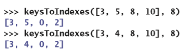

# 集合和字典

在完成这一章的学习之后，你就能够：

* 描述集合的功能以及它所包含的操作；
* 根据性能特点来选择集合的实现；
* 知道集合应该被用于哪些应用程序；
* 描述字典的功能以及它所包含的操作；
* 根据性能特点来选择字典的实现；
* 知道字典应该被用于哪些应用程序；
* 使用一个散列策略来实现具有常数时间性能的无序多项集

在有序多项集里，每个元素的值以及它的位置都很重要，并且可以通过位置来访问到每一个元素。这一章将会着眼于无序多项集，并且会特别关注它们的实现。从用户的角度来看，只有元素的值才是重要的；他们并不需要去关注了解元素的位置等等问题。因此，无序多项集的所有操作都不会基于位置。当元素被添加之后，这个元素将会通过它自身的值来被访问到。用户可以在无序多项集里插入、获取或是删除元素，但是它们不能指定去访问第$i$个、下一个或是上一个元素。无序多项集的一些例子有：背包、集合以及字典。第5章“接口、实现和多态”以及第6章“继承与抽象类”已经探讨了各种类型的背包，你可能也有了使用Python的集合和字典的经验。这一章将会介绍比较高效的集合和字典的一些实现策略。

## 使用集合

就像你在数学定义里学到的那样，**集合**（**set**）是一个由无序排列的元素组成的多项集。从用户的角度来看，集合里的元素都是唯一的。也就是说，集合里没有重复的元素。在数学里，你可以对集合执行许多操作。一些典型的操作有：

* 返回集合里的元素数量；

* 检测是否为空集（不包含任何元素的集合）；

* 将元素添加到集合里；

* 从集合里删除一个元素；

* 测试集合的成员资格（集合里是否包含指定元素）；

* 获得两个集合的并集。两个集合A和B的并集是指包含A和B里的所有元素的集合；

* 获得两个集合的交集。两个集合A和B的交集是指同时存在于A和B里的元素集合；

* 获得两个集合的差集。两个集合A和B的差集是指存在于A、但是不存在于B里的元素集合；

* 测试一个集合来判定另一个集合是不是它的子集。当且仅当B是空集或B里的所有元素也都在A里时，集合B才是集合A的子集。

可以看到，差集和子集操作（上面列表里的最后两个）不是对称的。比如说，集合A和B的差集并不总是与集合B和A的差集相同。

要描述集合里的内容，可以使用符号`{<item-1>...<item-n>}`来表示，其中这些元素并没有特定的顺序。表11-1展示了对示例集合的某些操作的结果。

表11-1 某些典型的集合操作的结果

| 集合 | 值 | 并集 | 交集 | 差集 | 子集 |
| --- | --- | --- | --- | --- | --- |
| A | {12 5 17 6} | {12 5 42 17 6} | {17 6} | {12 5} | `False` |
| B | {42 17 6} | | | | |
| A | {21 76 10 3 9} | {21 76 10 3 9} | {} | {21 76 10 3 9} | `True` |
| B | {} | | | | |
| A | {87} | {22 87 23} | {87} | {} | `False` |
| B | {22 87 23} | | | | |
| A | {22 87 23} | {22 87 23} | {87} | {22 23} | `True` |
| B | {87} | | | | |

## Python的集合类

Python里包含了一个`set`类。表11-2里列出了这个类里的一些常用的方法。

表11-2 集合类型的常用操作

| 集合方法 | 它的功能 |
| --- | --- |
| `s = set()` | 创建一个空的集合并把它分配给`s`。 |
| `s = set(anIterable)` | 创建一个包含有`anIterable`对象（如：字符串、列表以及字典）里的不重复的元素的集合并把它分配给`s`。 |
| `s.add(item)` | 如果`item`不在`s`里就把它添加到`s`里。 |
| `s.remove(item)` | 从`s`里返回`item`。*先验条件*：`item`需要在`s`里。 |
| `s.__len__()` | 相当于`len(s)`。返回`s`里的元素数量。 |
| `s.__iter__()` | 返回一个基于`s`的迭代器。用来支持在`s`上执行`for`循环。元素并不会按照特定顺序被访问。 |
| `s.__str__()` | 相当于`str(s)`。返回一个包含`s`里的元素的字符串表达形式的字符串。 |
| `s.__contains__(item)` | 相当于`item in s`。当`item`在`s`里时返回`True`；不然返回`False`。 |
| `S1.__or__(s2)` | 集合的并集。相当于`s1 s2`。返回一个存在于`s1`或`s2`里的元素的集合。 |
| `S1.__and__(s2)` | 集合的交集。相当于`s1 & s2`。返回一个同时存在于`s1`和`s2`里的元素的集合。 |
| `S1.__sub__(s2)` | 集合的差集。相当于`s1 - s2`。返回一个只存在于`s1`，不存在于`s2`里的元素的集合。 |
| `S1.issubset(s2)` | 当`s1`是`s2`的子集时返回`True`；不然返回`False`。 |

### 使用集合的交互示例

在下面这个例子里，你将会创建两个分别叫做`A`和`B`的集合，并对它们执行一些操作。当`set`的构造函数接收到一个列表作为参数时，这个列表的元素将会被复制到集合里去，同时会忽略掉重复的元素。可以看到，Python使用的是大括号而不是方括号来输出集合的值。

### 集合的应用

集合除了在数学里的作用外，集合在数据处理领域还有许多应用。比如说，在数据库管理领域，如果一个查询语句包含了堆两个键的结合，那么就可以通过与这两个键相关联的元素集合的交集来得到答案。

### 集合和背包之间的关系

就像在第5章里了解到的那样，背包是一个无序的元素多项集。集合和背包之间的主要区别在于，集合里每个元素只能有一个，而背包则可以包含同一个元素的多个实例。集合类型还包括了通常不会和背包相关联的操作，比如交集、差集和子集。你很快就会看到，集合和背包的相似性会对它的某些实现策略产生影响。

### 集合与字典之间的关系

就像在第2章“多项集的概述”里提到的那样，*字典*是一个包含称为*条目*的元素的无序多项集。每个条目都包含一个键和一个相关联的值。添加、修改和删除条目的操作会使用键来定位条目以及它的值。字典的键必须是唯一的，但是它的值可以有重复。因此，你可以把字典当成键的集合。字典和集合之间的差异和相似性将会影响到字典的实现策略，你会在这一章的后面了解到这些。

### 集合的实现

你可以通过使用数组或是链接结构来存放集合的数据元素。链接结构的优点是只要元素位于结构里，就可以支持在常数时间里对它进行移除。但是，你很快就会发现，这样做会让添加和删除元素需要用到线性搜索。而另一种策略被称为**散列**（**hashing**），这个策略会通过把数组的近似随机访问用在插入、删除和搜索操作上。你将在这一章的后面部分了解到它所有的三种实现策略。

### 练习题

1. 集合与列表在哪些方面有所不同？

2. 假设集合`s`里包含有数字3。写出在执行了下面这些操作后产生的集合序列：

    a) `s.add(4)`

    b) `s.add(4)`

    c) `s.add(5)`

    d) `s.remove(3)`

3. 你如何访问集合里的所有元素？

## 集合的数组实现和链式实现

前面提到过，集合相当于是一个只能包含不重复的数据和一些额外方法的背包。因此，最简单的集合的实现就是让它成为在第6章里讨论过的背包类的子类。于是，通过继承可以从父类（`ArrayBag`、`LinkedBag`和`ArraySortedBag`类）得到它们的大部分代码；再去实现支持集合接口里的方法，就可以得到这些叫做`ArraySet`、`LinkedSet`和`ArraySortedSet`的集合类了。

集合的特定方法:`__and__`、`__or__`、`__sub__`以及`issubset`可以被分别实现在各个集合类里。由于这些方法只是运行集合接口里的其它方法，在不同的实现里，它们的代码都是相同的；因此，可以在叫做`AbstractSet`的父类里去实现它们。图11-1展示了集合类之间的关系。

图11-1 集合的数组实现和链式实现

可以看到，每个具体的集合类都是两个类的子类，其中之一就是`AbstractSet`类。Python支持多重继承，也就是说，一个类可以有多个父类，只要被继承的元素是不同的就行了。

还有需要注意的一点是，和`AbstractBag`不同，`AbstractSet`并不是`AbstractCollection`的子类。这样做的好处是，`AbstractSet`不会为数据引入任何新的实例变量，而只会定义集合所特有的其它方法。接下来，你将通过探索集合的基于数组的实现，来了解明白在这个层次结构里的继承关系。

### `AbstractSet`类

`AbstractSet`类相当于只是集合的通用方法`__and__`、`__or__`、`__sub__`以及`issubset`的存放器。这个类是`object`的子类，这是因为其它的集合类已经从背包类里继承了其它的多项集资源。下面是这个类的相关代码：

这样的设计能够让你可以在这个类里添加集合的任何其它的通用方法，比如`__eq__`。

### `ArraySet`类

`ArraySet`类继承了父类`ArrayBag`里的`isEmpty`、`__len__`、`__iter__`、`__add__`、`add`以及`remove`方法。`ArraySet`类还从另一个父类`AbstractSet`里继承了`__and__`、`__or__`、`__sub__`、`issubset`以及`__eq__`方法。`ArraySet`类因此也就成为了，把这些方法融合在一起从而支持一个新类型的对象。但是，在这个过程中，`ArraySet`必须把`ArrayBag`里的`add`方法进行重写，从而防止重复的元素被插入。下面是`ArraySet`的代码：

可以看到，在类的定义里列出了两个父类，其中`AbstractSet`在`ArrayBag`前面。因为这两个类都定义了`__eq__`方法，所以Python编译器必须要确定在`ArraySet`类的代码里应该包括哪个版本。而这就是在类的定义里列出的第一个父类里的方法。

还可以看到，只有在目标元素不在集合里的时候，才会调用在`ArrayBag`里的`add`方法。`LinkedSet`和`ArraySortedSet`类的代码和`ArraySet`非常相似，将会作为联系留给你完成它们。

## 使用字典

你可以把字典看成是包含被称为**条目**（**entry**）的键值对的集合。但是，字典的接口和集合的接口并不相同。就像你通过使用Python的`dict`类型了解到的那样，它可以通过下标运算符`[]`，在指定的键的位置处插入或替换值。`pop`方法会删除给定键的位置处的值，而`keys`和`values`方法则会分别返回字典里的键的集合或是值的多项集上的迭代器。`__iter__`方法用来支持在字典的键上进行`for`循环。`get`方法能够让你访问键所关联的值；如果键不存在的话，就返回默认值。字典也能够支持常用的多项集的方法。表11-3列出了在这一章里将会实现的字典接口里专门给字典的方法。

表11-3 字典多项集的接口

| 方法 | 它的功能 |
| --- | --- |
| `d = <dictionary type>(keys = None, values = None)` | 创建一个字典并把它分配给`d`。如果`keys`和`values`存在的话，就用复制这个键值对的序列。 |
| `d.__getitem__(key)` | 相当于`d[key]`。当`key`存在时，返回和`key`相关联的值；不然引发`KeyError`异常。 |
| `d.__setitem__(key, value)` | 相当于`d[key] = value`。如果`key`存在，用`value`来替换它所关联的值；不然插入一个新的键值对条目。 |
| `d.get(key, defaultValue = None)` | 当`key`存在时，返回和它相关联的值；不然返回`defaultValue`。 |
| `d.pop(key, defaultValue = None)` | 当`key`存在时，删除键值对条目，并返回和它相关联的值；不然返回`defaultValue`。 |
| `d.__iter__()` | 相当于`iter(d)`或是`for key in d:`。返回`d`的键的迭代器。 |
| `d.keys()` | 返回`d`的键的迭代器。 |
| `d.values()` | 返回`d`的值的迭代器。 |
| `d.entries()` | 返回`d`的条目（键值对）的迭代器。 |

可以看到，字典的构造函数和其它多项集类型不同，它需要两个可选的集合参数：键的多项集和所对应的值的多项集。

## 字典的数组实现和链式实现

字典的两个实现分别是基于数组和基于链接的。它的设计策略和你在这本书里学习到的其它多项集所使用的策略是类似的：

* 把新的类放入多项集框架里，从而让它可以通过继承祖先类来得到一些数据和方法。

* 如果新接口里的其它方法在所有的类里都有相同的实现，那么就把它们放在一个新的抽象类里。

为了实现这个设计目标，我们会把`AbstractDict`类作为`AbstractCollection`的子类添到框架里去。这个新类将会负责实现`__str__`、`__add__`、`__eq__`、`__iter__`、`get`、`keys`、`values`以及`entries`方法。

接下来，实体类`ArrayDict`和`LinkedDict`将作为`AbstractDict`的子类出现。它们会实现`__iter__`、`clear`、`__getitem__`、`__setitem__`以及`pop`方法。图11-2展示了这些类之间的关系。

图11-2 字典的数组实现和链式实现

### `Entry`类

字典里的元素或者说条目是由两部分组成的：键和值。图11-3展示了这样的一个条目，它的键为`"age"`，值为`39`。

图11-3 字典条目

字典的所有实现都会包含条目。每个键值对都被打包在`Entry`对象里。`Entry`类会包含一些比较方法，从而让程序员可以检测两个条目是否相等，或是在有序字典里对它进行排序。所有的比较都是在键上进行的。下面是这个类的代码：

为方便起见，`Entry`类与`AbstractDict`类将会被放在同一个模块`abstractdict`里。

### `AbstractDict`类

`AbstractDict`类会包含所有只需要调用字典的其它方法来完成工作的方法。这些方法还包括了一些`AbstractCollection`里的方法，比如说：`__str__`、`__add__`和`__eq__`，但是必须要重写这些方法来支持字典的相关行为。

另外，`AbstractDict`里的`__init__`方法现在需要把键和值从可选的源多项集里复制到新的字典对象里。可以看到，这一步是在调用`AbstractCollection`里的没有多项集参数的`_init__`方法之后完成的。

下面是`AbstractDict`类的代码：

`AbstractDict`类很好地说明了如何通过继承来对代码进行组织。在这里所包含的八个方法里，其中的四个（`keys`、`values`、`entries`以及`get`）对于所有的字典都有相同的实现，而其它四个（`__init__`、`__str__`、`__add__`以及`__eq__`）是对`AbstractCollection`里的相同方法进行的重写，从而满足字典的需求。

### `ArrayDict`类

和其它实体类一样，`ArrayDict`类负责初始化多项集的容器对象，以及实现用来直接访问这个容器的方法。为了避免对数组进行管理所需要的额外工作，我们可以选择Python里的基于数组的列表来作为容器对象，然后再实现字典接口里的`__iter__`、`__getitem__`、`__setitem__`以及`pop`方法。在`__getitem__`、`__setitem__`和`pop`方法里，可以通过调用辅助方法`getIndex`来得到指定的键的位置。

下面是`ArrayDict`类的代码：

`LinkedDict`类的实现是类似的，将会作为练习留给你。

### 字典的数组实现和链式实现的复杂度分析

集合和字典的基于数组的实现对程序员来说并不太难，但遗憾的是，它们的表现并不好。只需要稍微看下基本的访问方法就可以知道，所有的访问方法都必须要对底层的数组执行线性搜索，因此，这些基本的访问方法都是$O(n)$。

因为从用户的角度来看，元素并没有特定的顺序，所以你不能像第10章“树”里讨论的二叉查找树那样，找到一个支持对数时间进行访问和插入操作的实现。好在，你马上就会在下一节里看到，还是会有一些集合和字典的实现策略来让这些操作比线性更快。

### 练习题

1. `ArraySet`类的`add`方法会搜索整个集合。讨论在`union`、`intersection`和`difference`方法里，这样对整个集合进行搜索对性能产生的影响，并给出这些方法的大$O$复杂度。

2. Jill为`ArraySet`类的`add`方法提出了一种更高效的策略。这个策略是不去检查有没有重复项，而是直接把它添加到列表里去。讨论这个策略对`ArraySet`类的其它方法的影响。

## 散列策略

就像在第4章“数组和链接结构”里提到的那样，访问多项集里的元素的最快方法是通过数组或是基于数组的列表所支持的随机访问。如果我们也假设集合和字典的底层数据结构是数组的话，那么看看能不能找到一种接近随机访问的方法来访问集合里的元素或是字典里的键。在理想情况下，集合里的元素或是字典里的键都是从0到结构大小减1的连续数字。因此我们可以在常数时间内访问它们在底层数组里的位置。在实际的数据处理的过程中，键通常会是一个非常大的数字、或是人的名字也或是其它的一些属性，这种简单情况很少发生。

所有，假设第一个键是数字15000，它后面的键都是连续编号的。那么就可以通过表达式`key-15000`来计算指定的键在数组里的位置。这种计算被称为**键到地址的转换**（**key-to-address transformation**）或是**散列函数**（**hashing function**）。散列函数对于给定的键会返回它在数组里的相应位置。和这个散列策略一起使用的数组被称为**散列表**（**hash table**）。如果散列函数能够在常数时间内运行，那么通过键进行插入、访问和删除操作都为$O(1)$。

散列函数的第一个例子并不会十分简单。假设键不是连续的数字，并且数组结构的长度为4。然后我们会希望散列函数`key % 4`能够为键3、5、8和10在数组里产生不同的索引，就像在图11-4里展示的那样。

图11-4 键3、5、8和10使用散列函数`key % 4`之后的位置

遗憾的是，如果换成键3、4、8和10，那么它们在数组里并不都能找到唯一的位置，因为4和8都会被散列到索引0（图11-5）。

图11-5 键3、4、8和10使用散列函数`key % 4`之后的位置

这里把4和8散列到相同索引的过程被称为**冲突**（**collision**）。

这一节的其余部分将会探讨与散列相关的技术的开发，这些技术能够最大程度地减少冲突并且增加对无序多项集里的元素进行常数时间访问的可能性。这部分内容还讨论了冲突发生时的处理策略。

### 冲突与密度的关系

你已经在图11-5里看到了，在散列到一个快要满的数组的过程时所会发生的数据冲突的例子。当数组里有额外的内存单元（超出数据所需的内存单元）时，还会发生冲突吗？为了回答这个问题，你将会编写一个叫做`keysToIndexes`的Python函数来进行验证，这个函数会通过一个包含键的列表来生成一个大小为$N$的索引数组。在这里，键是一个正整数。键所对应的数组的索引是键除以数组长度后的余数（对于任何正整数`c`来说，就是`c % n`，是一个从0到n – 1的数字）。下面是`keysToIndexes`的定义，以及紧跟着它的交互结果来展示前面讨论的两个数据集的索引：

通过不断增长数组来继续基于这两组键执行`keysToIndexes`，我们可以发现当数组长度达到8时，就不会再发生冲突：

可能还会存在其它的四个键的集合会在长度为8的数组里产生冲突，但是很明显，只要你愿意浪费一些数组的内存，那么在散列处理的过程中会发生冲突的可能性就会降低。换句话说，随着键的**密度**（**density**）或数量（相对于数组长度）的减少，发生冲突的可能性也随之降低。在第4章里介绍的数组的负载因子，就是对它的数据的密度（元素的数量/数组长度）的度量。比如，在刚刚讨论的例子里，当负载因子超过0.5时，就会发生冲突。保持较低的负载因子（如低于0.2）看起来是一种避免冲突的好方法，但是，负载因子低于0.5所导致的内存成本对于有数百万个元素的数据集来说是不可能的。

而且，即使负载因子低于0.5也不能防止某些数据集会发生很多的冲突。比如一个有七个键的集合10、20、30、40、50、60和70，如果把它们散列到长度为15的数组里，那么它们全部都不能够得到唯一的索引，就像下面这个交互结果一样：

但是，如果为数组的长度选择一个质数，例如11，那么结果就会更好一些：

较小的负载因子和数组长度是质数能够为防止冲突提供一些帮助，但是你还是有必要去开发出其它的技术来处理发生冲突时的情况。

### 非数字键的散列

前面的例子使用的都是数据的整数键。那么，你要怎样才能为像是名称或者是包含字母的商品代码这样的其它类型的数据产生整数键呢？

如果我们把它们都看作字符串的话，我们就需要从每个唯一的字符串里得到唯一的整数键。你可以尝试返回字符串里ASCII码值的总和来完成，但是，这个方法在面对**字谜**（**anagrams**），也就是包含相同的字符但字符的顺序不同的时候，会得到相同的键，例如“cinema”和“iceman”。同时，还有另一个问题是，英语里单词的首字母并不是平均分布的；比如说，以字母S开头的单词会比以字母X开头的单词要多。而这就可能会让得到的字符串的所有字符的ASCII码值的总和产生加权或是偏差，因此，键会在整个键的集合的特定范围内发生聚集。这样的聚集也就会导致在数组里的键的聚集。而理想情况下，最好是能够把键均匀地分布在数组里。为了减少首字母所导致的潜在偏差，并且减少字谜所产生的影响，如果字符串的长度大于某个阈值，那么就可以在计算总和之前从字符串里先删除掉第一个字符。除此之外，如果字符串超过了特定的长度，那么你还可以减去最后一个字符的ASCII码值。下面是这个叫做`stringHash`函数的定义，以及展示在处理字谜情况下的例子：

为了测试这个新的散列函数是否能够满足我们的需求，你可以通过修改`keysToIndexes`函数，从而让它的第三个可选参数接收散列函数。这个散列函数的默认值（可以用来处理前面提到的整数键的情况）就是简单地直接返回接收到的那个键。

这样修改之后，测试函数就可以和之前一样继续使用整数键列表来测试，也可以使用字符串列表来进行测试了，就像下面这个交互操作一样：

Python还包括了用在散列应用程序里的标准散列函数——`hash`。这个函数可以接收任何的Python对象作为参数，并返回一个唯一的整数。由于整数可能为负数，因此必须在通过余数运算符计算索引之前，对它取绝对值。下面是使用`hash`函数的结果和使用你的`stringHash`函数的结果的比较：

更高级的散列函数是更高阶的课程里的主题，不属于本书的范围。在这一章的其余部分，你将会使用Python的`hash`函数以及其它的方法。

无论散列函数多么先进，散列表里仍然会存在冲突的可能性。计算机科学家已经开发出了许多解决冲突的方法。后面的小节里将会对其中一些方法进行讨论。

### 线性探测法

对于插入操作来说，解决冲突的最简单方法是从冲突点开始，在数组里向后搜索第一个可用的位置。这个过程被称为**线性探测法**（**linear probing**）。数组里的所有位置都处于这三种可区分的状态之一：已被占用、未被占用和曾被占用。如果一个位置从未被占用过，或者是从这里删除了一个键（曾经被占用），那么就认为这个位置可以被用于插入一个新的键。我们可以用值`EMPTY`和`DELETED`分别代表这两个状态。在程序开始的时候，将会用值`EMPTY`来填充整个数组。在删除这个键的时候，内存单元的值将会被设置为`DELETED`。在插入操作开始时，将会运行散列函数来计算元素的**起始索引**（**home index**）。整个起始索引是指元素在散列函数正常工作的情况下应该到达的位置（这个位置还没有被占用）。如果起始索引处的内存单元不可用，那么这个算法会将把整个索引移到它的右侧来检测可以使用的内存单元。当搜索到达数组的最后时，探测将会绕回到第一个位置继续。如果你假设数组没有满并且不包含重复的元素，那么插入到名为`table`的数组的代码是这样的：

访问和删除的工作方式类似。对于访问来说，如果当前数组单元为空或是包含目标元素的话，就停止探测过程。这个过程可以忽略掉曾被占用和已被占用的内存单元。对于删除来说，你仍然像访问那样进行探测，并且如果找到目标元素，就把它的内存单元设置为`DELETED`。

这种解决冲突的方法有一个问题：在若干次插入和删除操作之后，在给定的元素以及它的起始索引之间可能会存在标记为`DELETED`的内存单元。这也就意味着这个元素和它的起始索引的距离会比实际需要的更远，从而增加了平均的总体访问时间。有两种方法可以解决这个问题：

1. 在删​​除操作后，把内存单元里右侧的数据都移动到整个内存单元的左侧，直到遇到空内存单元、已被占用的内存单元或是已经在起始索引的元素为止。因此，如果删除一个元素会产生一个空隙，这个过程就会消除掉这个空隙。

2. 定期刷新散列表，比如当表的负载因子到达0.5时就进行刷新。这样做会把所有曾被占用的内存单元转换为已被占用或是未被占用的内存单元。如果散列表可以通过某种方式来跟踪特定元素的访问频率，那么就可以按照从高到低的频率顺序重新插入元素。这样做能够把更为频繁访问的元素放在更靠近它的起始索引的位置。

因为在任何数组变满（或是负载因子超过可接受的范围）的情况下都必须要重新整理散列表，因此你可能会更喜欢这里的第二种策略。

线性探测法还容易产生另一个被称为**聚集**（**clustering**）的问题。也就是当会导致冲突发生的元素重新被定位到数组里的同一区域（聚落）时，冲突仍然会发生。图11-6展示了对于包含20、30、40、50、60、70的数据集合进行几次插入键的操作之后的情况的例子。可以看到，虽然直到在插入键60和70的时候才会进行线性探测，但是这个时候聚落已经在数组的底部形成了。

> Insert XX ---> 插入XX后
>
> Collision! ---> 冲突发生！

图11-6 线性探测法过程中所产生的聚集

这种聚集通常会导致和其它被重新定位的元素发生冲突。在应用程序的运行过程中，几个聚落可能会不断发展并合并成为更大的聚落。而随着聚落不断地变得更大，从起始索引探测到可用位置的平均距离也就会变得更长，平均运行时间也会变得更长。

### 二次探测法

为了避免产生线性探测发所导致的聚集的一种办法是：把对空位的搜索移动到距离冲突点相当远的为止。**二次探测法**（**quadratic probing**）通过把每次得到的起始索引增加一个距离的平方来实现这个目的。如果尝试失败，就会继续增加距离，然后再试一次。换句话说，如果你从起始索引$k$和距离$d$开始，那么每次使用的公式就是$k + d^2$。因此，如果需要继续进行探测的话，那么探测将会从起始索引加1开始，如果还需要继续，就会从起始索引加4、加9、加25等等开始。

下面是插入操作的代码，它已经被修改为使用二次探测法了：

这种策略的主要问题是，跳过某些内存单元可能会错过其中的一个或多个未被占用的内存空间。而这会导致空间的浪费。

### 链式法

在被称为**链式法**（**chaining**）的冲突处理策略里，元素被存储在一个链表的数组，也就是**链**（**chain**）里。每个已经存在或是即将插入的元素的键都会位于链的**存储桶**（**bucket**）或是索引里。每次访问或删除操作都会执行下面这些步骤：

1. 在数组里计算元素的起始索引。

2. 在这个索引的链表里搜索这个元素。

如果找到了这个元素，那么就可以返回它或是删除它。图11-7展示了包含五个存储桶和八个元素的一个链表的数组。

图11-7 包含五个存储桶的链

每个元素的起始索引都是数组里它的链表所对应的索引。比如，元素D7、D3和D1的起始索引都是4。

要把元素插入这个结构里就需要执行下面这些步骤：

1. 在数组里计算元素的起始索引。

2. 如果数组单元为空，就创建一个包含这个元素的节点，然后把这个节点分配给这个单元。不然的话，就会发生冲突——已经存在的元素在这个位置上的链表或是链的头。接下来，把新元素插入到这个链表的开头。

使用第4章里讨论的`Node`类，我们可以得到下面这个使用链式策略的插入元素的代码：

### 复杂度分析

可以看到，线性冲突处理的复杂度取决于负载因子以及重新定位的元素产生聚落的趋势。在最差情况下，如果方法必须要在确定元素的位置前遍历整个数组，那么这个操作就是线性的。对线性方法的一项研究（高德纳（Donald E. Knuth）所著的《计算机程序设计艺术（卷3）：排序与搜索》（*The Art of Computer Programming*），由位于加利福尼亚州门洛帕克市的艾迪生韦斯利出版社在1973年出品）表明，在平均情况下，要找到一个不存在的元素的复杂度为：

> 译者注：这本书的新版由位于美国马萨诸塞州雷丁镇的艾迪生韦斯利出版社在1998年出品

$$
(1 / 2)[1 + 1 / (1 - D)^2]
$$

其中D是密度比也就是负载因子。

由于二次探测法是为了减轻聚集问题，因此你可以期望它的平均性能要优于线性方法。根据高德纳（前面曾提到）的研究，二次探测法的平均搜索复杂度，对于查找成功的情况来说是：

$$
1 - \log_e (1 - D) - (D / 2)
$$

而对于失败的情况来说，复杂度是：

$$
1 / (1 - D) - D - \log_e (1 - D)
$$

对于存储桶，也就是链式法的分析表明，找到一个元素的过程包括两个部分：

1. 计算起始索引

2. 发生冲突时搜索链表

第一个部分是常数时间的行为。第二个部分是线性时间的行为。在最差情况下，这个操作的工作量为$O(n)$。在这种情况下，彼此冲突的所有元素都被存放在一个链里，而这也就是一个链表。但是，如果列表均匀地分布在整个数组里，并且数组很大的话，那么第二个部分也是可以接近常数时间的。在最好的情况下，长度为1的链占据了每个数组单元，因此这一步的性能也恰好为$O(1)$。元素的随机插入往往会得到均匀的分布。但是，当负载因子增加到1以上时，链的长度也会增加，从而导致性能下降。和其它方法不同，链式法并不需要去调整数组的尺寸和重新进行散列。

其它的各种散列策略的权衡和优化是计算机科学的后续课程的主题，不会包含在这本书的讨论范围之内。

### 练习题

1. 解释为什么散列可以提供在常数时间里对数据结构的访问。

2. 什么是起始索引？

3. 导致冲突的原因是什么？

4. 解决冲突的线性探测法是如何工作的？

5. 什么导致了聚集？

6. 解决冲突的二次探测法是如何工作的，为什么它能减轻聚集的问题？

7. 计算下面这些情况的负载因子：

    a) 长度为30的数组，包含10个元素。

    b) 长度为30的数组，包含30个元素。

    c) 长度为30的数组，包含100个元素。

8. 解释链式法的工作方式。

## 案例研究：分析散列策略

在第3章“搜索、排序以及复杂度分析”里的案例研究里，你开发了一个算法分析器，也就让你有了一个可以帮你评估某些排序算法性能的软件工具。接下来，你将会开发一个类似的工具，从而可以评估在上一节里讨论的某些散列策略的性能。

### 案例需求

编写一个程序，能够让程序员分析不同的散列策略。

### 案例分析

分析器应该能够让程序员收集到不同的散列策略所引起的冲突数量的统计信息，以及其它的一些也应该被获得的有用信息，包括了：散列表的负载因子以及在线性探测法或是二次探测法的过程中要解决冲突所需要进行的探测数量。分析器会假设程序员已经定义了一个叫做`HashTable`的类，这个类包含了表11-4里列出的方法。

表11-4 `HashTable`类里的方法

| `HashTable`的方法 | 它的功能 |
| --- | --- |
| `T = HashTable(capacity = 29, hashFunction = hash, linear = True)` | 创建并返回一个基于初始容量、散列函数和冲突处理策略的散列表。如果参数`linear`是`False`就会使用二次探测策略。 |
| `T.insert(item)` | 把`item`添加到散列表里。 |
| `T.__len__()` | 相当于`len(T)`。返回散列表里的元素数量。 |
| `T.getLoadFactor()` | 返回散列表当前的负载因子(元素的数量除以总容量).
| `T.getHomeIndex()` | 返回被插入、删除或访问操作所用到的最后一个元素的初始索引。 |
| `T.getActualIndex()` | 返回被插入、删除或访问操作所用到的最后一个元素的实际索引。 |
| `T.getProbeCount()` | 返回被插入、删除或访问操作所用到的最后一个元素在处理冲突时所需要的探测数量。 |
| `T.__str__()` | 相当于`str(T)`。返回散列表的数组的字符串表达形式。当内存单元为空时，显示为`None`。如果内存单元里曾经有过值，显示为`True`。 |

为了能够满足这个案例研究的目的，这个简单的表格里包含了若干不同的方法，从而可以让程序员插入元素并确定：数组的长度、负载因子、最新插入的起始索引和实际索引、以及冲突后所需的探测数量。可以看到，在创建散列表时，程序员可以提供它的初始容量和使用的散列函数。程序员还可以声明是否使用线性探测策略。默认的散列函数是Python自己的`hash`函数，但是程序员也可以在散列表的实例化的过程中提供不同的散列函数。如果不想选择使用线性探测法，那么这个散列表将会使用二次探测法。散列表的默认容量是29个内存单元，但程序员可以在创建它的时候调整它的容量。

提供给分析器的信息是散列表和它的数据集里的元素的列表。返回的信息则会是一个字符串。这个字符串会展示一个格式化的结果表格，其中的列包含：负载因子、插入的元素、起始索引、这次插入在散列表里的最终位置以及所需的探测数。冲突总次数、探测总次数以及每次冲突的平均探测数，也会输出这个表的下方的在字符串里。程序员会基于散列表以及它的数据集来运行分析器，再把这些数据结果作为参数提供给`test`方法。可以通过单独调用相应的分析器方法或是通过直接输出整个分析器对象来得到冲突总次数和探测总次数。表11-5列出了`Profiler`类里的方法。

表11-5 `Profiler`类里的方法

| `Profiler`的方法 | 它的功能 |
| --- | --- |
| `P = profiler()` | 创建并返回一个分析器对象。 |
| `p.test (aTable, aList)` | 在一个散列表和给定的数据集上运行分析器。 |
| `p.__str__()` | 相当于`str(p)`。返回一个格式化的结果表格。 |
| `p.getCollisions()` | 返回冲突总次数。
| `p.getProbeCount()` | 返回为了解决冲突而进行的探测总次数。 |

下面这个`main`函数，分析了前面的采用线性探测法的例子里使用的的散列表：

这是分析器的结果：

### 案例设计

`HashTable`类需要为它的内存单元数组、大小、散列函数、冲突策略、最新操作的元素的起始索引和实际索引，以及探测的数量分配实例变量。`insert`方法会采用上一节里讨论的策略，并且会加上下面两个变化：

* 起始索引和探测数量会被更新。

* 在探测期间需要增加索引的时候，由提供给散列表的策略（线性探测法或二次探测法）来确定需要使用什么方法。

和前面一样，`insert`方法会假设数组里有空间来放下新的元素，并且新的元素并不和现有元素相同。`HashTable`类的其它方法不在这里进行讨论。

`Profiler`类需要实例变量来跟踪散列表、冲突总次数和探测总次数。`test`方法会按照给定的顺序依次插入元素，并且在每次插入之后都对统计信息进行累积。这个方法还会通过这些结果来创建并构建一个格式化的字符串输出。这个字符串会被保存在另一个实例变量里，从而可以在分析器上调用`str`函数时进行使用。它的其它方法只会返回单个的统计信息。

### 案例实现

下面是这两个类的部分代码清单。完成它们的工作将会作为练习留给你。下面是`HashTable`类的相关代码：

这是`Profiler`类的相关代码：

## 集合的散列实现

在这一节和下一节的内容里，我们将会使用散列来构造无序集合的高效实现。集合的这种散列实现被称为`HashSet`，它使用的是前面介绍过的存储桶/链式策略。因此，这个实现必须要维护一个数组以及它里面的条目，从而得到链式的方式。要维护数组，你需要包含三个实例变量：`items`（数组）、`size`（集合里的元素数）以及`capacity`容量（数组里的内存单元数）。这些元素会被包含在第4章介绍的单向链接节点类型里。在默认情况下，`capacity`的值会是一个被定义为3的、会保证频繁发生冲突的常数。

因为在插入和删除节点的时候，用到了相同的方法来定位需要被用到的位置，所以可以用同一个方法（`__contains__`）来完成它。从用户的角度来看，这个方法只会搜索指定的元素并且返回`True`或是`False`。而从实现者的角度来看，这个方法还会把某些实例变量的值设置为在插入、访问和删除操作期间可以被用到的信息。表11-6给出了变量以及它们在实现里的作用。

表11-6 用来访问这个类里的条目的变量

| 实例变量 | 用途 |
| --- | --- |
| `self.foundNode` | 指向刚被找到的节点；不然的话，为`None`。 |
| `self.priorNode` | 指向刚被找到的节点的前一个节点；不然的话，为`None`。 |
| `self.index` | 指向刚被找到的节点所在链里的索引；不然的话，为-1。 |

接下来，你会看到`__contains__`是如何找到节点的位置并设置这些变量的。下面是这个过程的伪代码：

可以看到，这个算法在搜索的过程中会用到`index`、`foundNode`和`priorNode`。如果算法散列到一个空的数组单元，那么就表示没有找到任何节点，但是`index`仍然会包含这个可以被用来插入第一个元素的存储桶的索引。如果算法散列到了非空数组单元，那么这个算法就会沿着节点的链依次进行访问，直至找到匹配的元素或是访问到链尾。在这两种情况下，算法都会把`foundNode`和`PriorNode`设置为适当的值，从而方便后面对元素可能进行的插入或删除操作。

除此之外，`HashSet`类的设计和`ArraySet`与`LinkedSet`的设计类似。为了能够从继承得到最大的收益，`HashSet`类将会是`AbstractCollection`和`AbtractSet`类的子类。`Node`类被用来存放一个元素以及指向链里下一个元素的指针。

下面是`HashSet`类的部分实现：

## 字典的散列实现

字典的散列实现被称为`HashDict`。它用到的存储桶/链式策略和`HashSet`类里用到的策略非常类似。在其它实现里已经定义过了的`Entry`类，我们可以用它来存放键/值条目。这样一来，链里的每个节点的`data`字段都会包含一个`Entry`对象。

`__contains__`方法在这个实现里会去底层的结构里查找键，并像`HashSet`的实现里那样更新指针变量。

方法`__getitem__`只需要调用`__contains__`，如果找到了键，就返回`foundNode.data`里所包含的值。

`__setitem__`方法也会调用`__contains__`来确定在目标键的位置里，有没有包含这个条目。如果能够找到这个条目，那么`__setitem__`就会把它的值替换为新值；不然的话，`__setitem__`会执行下面这些步骤：

1. 创建一个包含键和值的新的条目对象。

2. 创建一个新节点，它的`data`字段是刚创建的条目，而`next`指针则指向链顶部的节点。

3. 将链的标头结点设置为这个新节点。

4. 增加`size`变量。

下面是`__setitem__`的伪代码：

`pop`方法的策略是类似的。主要区别在于，当要删除的条目位于链的开头之后时，`pop`方法会用到变量`priorNode`。下面是`HashDict`类的部分实现：

### 练习题

提出一个修改`__setitem__`方法的策略，来利用到字典当前的负载因子的相关信息。

## 有序集合和有序字典

尽管集合和字典里的数据并不是按照位置进行排列的，但是根据顺序来对它们进行访问是可行的，并且会被经常用到。**有序集合**（**sorted set**）和**有序字典**（**sorted dictionary**）分别会包含集合和字典的行为，但是用户可以按照排序顺序来访问它里面的数据。添加到有序集合里的每个元素都必须和其它元素是可比的；同样的，添加到有序字典里的每个键也都必须要能够和其它元素具有可比性。这两个多项集类型的迭代器能够保证它的用户可以按照排序顺序来访问元素或键。接下来的讨论将会着重于有序集合，但所有内容也同样适用于有序字典。

数据要有序的要求对这一章里所讨论的集合的两种实现方式都会产生重要影响。在这种情况下，基于数组的实现就必须要维护一个包含元素的有序列表。而这样做也就可以把`__contains__`方法的运行时性能从线性时间提高到对数时间，因为它可以对给定的元素进行二分搜索。遗憾的是，由于不能一直跟踪集合里元素的排序顺序，因此只能放弃掉散列的实现。

另一种有序集合的常见实现方式是使用二叉查找树。如第10章所述，当树保持平衡时，这个数据结构支持对数时间的搜索和插入操作。因此，基于二叉查找树实现的有序集合（和有序字典）可以在对数时间里提供对数据元素的访问。

在有序集合的实现里使用二叉查找树有两种设计策略。一种策略是开发一种基于树的有序背包类，这个类包含了一颗用来存放它的数据元素的二叉查找树，通过调用这颗树上的方法来对数据进行操作。然后，把这个基于树的有序集合类变为基于树的有序背包类的子类，并通过继承来得到它的方法。这类似于第6章里讨论的基于数组的有序背包和有序集合的策略。而另一种策略是把二叉查找树作为实例变量直接包含在有序集合类里，并且通过它的方法直接操作这颗树。

下面这个代码片段采用的是第二种策略。它展示了第10章里的`LinkedBST`类在一个叫做`TreeSortedSet`的被部分定义了的有序集合类里的用法。可以看到，每个`TreeSortedSet`方法都会调用`LinkedBST`实例变量里的相应方法。`__eq__`、`__iter__`和`__str__`方法会被重写来保证有序集合所对应的行为。它的完整实现将会作为练习留给你。

## 章节总结

* 集合是元素的无序多项集。每个元素都是唯一的。可以添加和删除元素，以及检测元素是否存在于集合之中。可以使用迭代器来遍历集合。

* 集合的基于列表的实现支持线性时间的访问操作。集合的散列实现支持常数时间的访问操作。

* 可以按照排序顺序来访问有序集合里的元素。基于树的有序集合的实现支持对数时间的访问操作。

* 字典是条目的无序多项集，其中每个条目都由一个键和一个值组成。字典里的每个键都是唯一的，但是它的值是可以重复的。值的访问、替换、插入和删除操作是通过提供它所相关联的键来完成的。

* 有序字典是通过对键进行比较来进行的排序。

* 两种字典的实现都和集合的实现类似。

* 散列是一种用来在常数时间内定位元素的技术。这个技术使用散列函数来计算数组里元素的索引。

* 使用散列时，新元素的位置可能与数组里已有的元素的位置冲突。存在若干种解决冲突的技术。其中包括了线性冲突处理，二次冲突处理和链式法。

* 链式法使用了一系列被叫做存储桶的包含元素的链接结构。

* 散列方法的运行时和内存使用会基于数组的负载因子而不同。负载因子（逻辑尺寸/物理尺寸）越接近1，发生冲突的可能性就会越大，并且也增加了需要额外进行处理的可能性。

## 复习题

1. 基于数组的集合的`__or__`、`__and__`和`__sub__`方法的运行时复杂度为：

    a) $O(n)$

    b) $O(n \log n)$

    c) $O(n^2)$

2. 两个集合：`{A, B, C}`和`{B, C, D}`的交集为：

    a) `{A, B, C, D}`

    b) `{B, C}`

3. 有10个位置的数组在包含3个元素时的负载因子为：

    a) 3.0

    b) 0.33

    c) 0.67

4. 解决冲突的线性方法是：

    a) 在数组里搜索下一个空位置

    b) 不断地随机选择一个位置，直到这个位置为空

5. 当负载因子较小时，集合或字典的散列实现将能够提供：

    a) 对数时间的访问

    b) 常数时间的访问

6. 有序集合的最佳实现是通过：

    a) 散列表

    b) 有序列表

    c) 平衡二叉查找树

7. 假定`hash`函数会根据它的参数的内容生成一个很大的数（正数或负数）。然后，可以通过下面哪个表达式来确定这个参数在总容量为`capacity`的数组里的位置：

    a) `abs(hash(item)) // capacity`

    b) `abs(hash(item)) % capacity`

    > 译者注：这个题目里是包含了`hash`和`capacity`两个代码的，但是排版并没有为这两个代码进行修改

8. 集合或字典的链式/散列实现在最差情况下的访问时间为：

    a) 常数时间

    b) 对数时间

    c) 线性时间

9. 字典有：

    a) 一个单独的用来支持迭代器的方法

    b) 两个支持迭代器的方法：一种用于键；另一种用于值

10. 一个可以避免聚集的办法是：

    a) 线性探测法

    b) 二次探测法

## 编程项目

1. 完成案例研究里的散列表分析器。

2. 使用一个会导致多次冲突的数据集和负载因子，使用三个不同的散列函数和线性冲突处理策略来运行分析器，然后比较它们的结果。

3. 将`get`和`remove`方法添加到案例研究里开发的`HashTable`类中。

4. 修改`Profiler`类，从而让程序员可以研究`HashTable`类的`get`方法的行为。前面我们曾提到过，这个方法在探测目标元素的时候会跳过曾被占用的内存单元。分析器将会把一组数据元素依次插入到散列表里，然后删除掉指定数量的数据元素，最后再对剩下的元素执行`get`操作。程序员应能够查看到这个过程中进行探测的总次数和探测的平均次数这样的结果。

5. 完成集合的散列实现，并使用适当的测试程序来对它进行测试。

6. 将`loadFactor`和`rehash`方法添加到集合的散列实现里，从而可以计算它的负载因子，然后调整数组的容量，并重新散列元素。在这里，负载因子是已被占用的数组单元数除以数组的容量。你将会用一个新的实例变量来跟踪已被占用的内存单元数量。重新散列的方法会把集合里的元素都先保存在列表里，再把集合的大小和已被占用的元素数量都设置为0，接着把数组的尺寸翻倍，然后再把列表里的元素依次添加回集合里去。只有当源多项集里包含足够多的元素从而让负载因子高于0.8的时候，你就应该在`__init__`方法里进行重新散列的操作。你需要反复运行`rehash`方法，直到负载因子降到0.8以下。

7. 完成字典的散列实现，并使用适当的测试程序来对它进行测试。

8. 使用这一章讨论的基于树的有序集合的第二种策略来实现它。使用适当的测试程序来测试你的实现。

9. 使用和编程项目8类似的策略来完成基于树的有序字典的实现。但是，在这里有序字典可以从它的父类里继承一些通用的多项集方法，例如：`__len__`、`__str__`_和`__add__`。

10. Python的`zip`函数被用来把数据打包到字典里去。`zip`函数需要一个键列表和一个值列表来作为参数，并返回一个新的可迭代的`zip`对象。把这个对象传递给`dict`函数将会生成并返回包含这些数据的字典。因此，这个函数的行为类似于这一章里讨论过的字典的构造函数。`unzip`函数是`zip`的反函数。`unzip`函数会把字典作为参数并返回一个元组，其中包含字典的键的列表和它所对应的值的列表。在`AbstractDict`类里添加一个叫做`unzip`的方法，从而可以让多项集框架里的所有的字典类型都能够使用这个方法。
