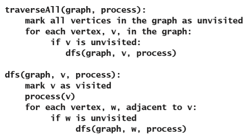
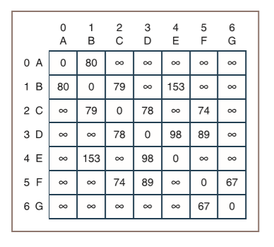

# 图

在完成这一章的学习之后，你就能够：

* 描述图的功能；
* 描述各种类型的图遍历算法；
* 知道图应该被用于哪些应用程序；
* 根据图的性能特点来选择适当的图的实现；
* 开发用来处理图的算法。

这一章将会介绍一种最通用、也最有用的多项集：图。我们首先会介绍一些讨论图会涉及到的术语。然后再探讨图的两种常见的存储方式：邻接矩阵存储方式和邻接表存储方式。接下来还会学习一些被广泛使用并且也广为熟知的基于图的算法，这里我们会重点关注的算法涉及到：图的遍历、最小生成树、拓扑排序以及最短路径问题。这一章的最后，我们会介绍图的类，并且以一个案例研究作为结束。

## 为什么要使用图？

图可以用来作为各种对象的模型。比如：

* 路线图；

* 航线图；

* 冒险游戏世界的布局；

* 构成互联网的计算机以及它们之间的连接的示意图；

* 互联网页面之间的链接；

* 学生与课程之间的关系；

* 呈现计算机科学系的课程的前提条件的结构；

* 通信或运输网络里流量的图表。

这些模型的主要共同点是它们都由一组通过链接而相互连接的对象组成，这些链接能够让用户从一个对象移动到另一个对象。与你之前看到的线性以及分层类型的多项集不同，图里的链接可以把许多的对象连接到许多的其它对象，并且还支持在任何方向上的移动。图里甚至可能会存在没有被链接连接到其它对象的孤立对象。因此，图是多项集里的最通用的类型，因此可以把线性、分层和无序多项集类型都当作它的特殊情况。现在我们先来看看图的精确定义以及讨论它所用到的一些技术术语。

## 图的术语

从数学上来说，图是由一组**顶点**（**vertices**）$V$和一组**边**（**edges**）$E$组成的，其中$E$里的每条边都会连接$V$里的两个顶点。术语**节点**（**node**）在这里也被用来当作顶点的同义词。

顶点和边可以是有标号的或是无标号的。当边的标号是数字时，这个数字可以被视为**权重**（**weights**），这个时候这个图就被称为**加权图**（**weighted graph**）。图12-1展示了无标号图、有标号图和加权图的示例。

> 无标号图    有标号图    加权图

图12-1 无标号图、有标号图和加权图

如果存在连接到两个顶点的边，那么这两个顶点就是**相邻**（**adjacent**）的，这两个顶点也被相互称为**邻居**（**neighbors**）。**路径**（**path**）是指可以从图里的一个顶点到达另一个顶点的一系列边。因此，当且仅当两个顶点之间存在路径时，才能说一个顶点是另一个顶点的**可到达**（**reachable**）的顶点。路径的长度是指路径上的边数。如果所有的顶点都存在到其它顶点的路径，那么就说明图是**连通**（**connected**）的。如果每个顶点都有到其它所有顶点的边，那么图就是**完全**（**complete**）图。图12-2展示了非连通图、连通但不完全图以及完全图。

> 非连通图    连通图    完全图

图12-2 非连通图、连通但不完全图以及完全图

**顶点的度**（**degree of a vertex**）等于和它相连的边数。比如，完全图（见图12-2）里的每个顶点的度都等于顶点数减一。

一个给定图的**子图**（**subgraph**）是由这个图的顶点的子集和连接这些顶点的边组成。**连接组件**（**connected component**）就是一个子图，这个子图由从给定顶点可到达的一组顶点组成。图12-3展示了包含顶点A、B、C、D和E的非连通图以及包含顶点B的连接组件。

> 连接组件

图12-3 图的连接组件

**简单路径**（**simple path**）是指不会多次通过同一顶点的路径。与此对应的**环**（**cycle**）是指在相同顶点处开始和结束的路径。图12-4展示了包含简单路径的图和包含环的图。

> 简单路径：ABD    环：BCD

图12-4 简单路径和环

图12-1到图12-4里展示的图都是**无向**（**undirected**）的，这也就说它们的边都没有方向。因此图的处理算法可以沿着连接两个顶点的边的任何一个方向进行移动。一个无向图里最多可以有一条边来连接两个顶点。相比之下，**有向图**（**directed graph**或**digraph**）里的边会指定明确的方向，就像图12-5这样。

图12-5 有向图

有向图里的边被称为**有向边**（**directed edge**）。这样的边会有**起始顶点**（**source vertex**）和**目标顶点**（**destination vertex**）。当两个顶点之间只有一条有向边进行连接时，这一对顶点就会处于前序（起始顶点）和后继（目标顶点）的关系里。并且，它们之间的邻接关系是不对称的。起始顶点和目标顶点是相邻的，但是反之则不成立。要把无向图转换为等效的有向图，可以用一对指向相反方向的边来替换掉无向图里的边，就像图12-6里这样。从给定的起始顶点发出的边被称为它的**入射边**（**incident edges**）。

> 无向图    有向图

图12-6 将无向图转换为有向图

一个不包含环的有向图的特殊情况被称为**有向无环图**（**directed acyclic graph**）也就是DAG。上面这个图的右边这个有向图就包含着一个环。在图12-7里，右边的图把左边图的一条边（B和C之间）的方向取反，从而得到了一个DAG。

> 有向图    有向无环图（DAG）

图12-7 有向图和有向无环图（DAG）

列表和树是有向图的特殊情况。列表里的节点是有前序和后继的关系的，而树里的节点则是有父节点和子节点的关系。

简单地说，包含相对较多的边的连接图被称为**稠密图**（**dense graph**），而包含相对较少的边的连接图被称为**稀疏图**（**sparse graph**）。但是这里有两个极限的情况。因为包含$N$个顶点的完全有向图的边数是$N(N-1)$，而无向完全图里的边数为$N(N - 1) / 2$。所以稠密图的极限（上限）情况是有大约$N^2$条边。相比之下，稀疏图的极限（下界）情况是有大约$N$条边。

后面的部分里，除非另外明确指出，否则“连接图”在文中是指无向图。并且，当提到“组件”时，表示的是无向图里的连接组件。

### 练习题

1. 本地大学的计算机科学专业的课程前提条件的编号是：112和210的需要111；312、313、209和211的需要112； 312需要210。绘制一个表示这个编号结构的有向图。

2. 包含六个顶点的无向完全图里有多少条边？

3. 网络里的星形配置是把它的结构表示为包含从单个中心节点到每个其余节点的边的图。点对点的配置是把网络表示为完全图。绘制出包含四个节点的这两个配置的图，并使用大$O$来表示在每种类型的配置里添加或删除给指定节点的效率。在这里，你可以假设删除每条边的操作都只需要常数时间。

## 图的存储方式

要存放图，你需要一种合适的方法来存储顶点和连接它们的边。图有两种常用的存储方式，分别是：**邻接矩阵**（**adjacency matrix**）和**邻接表**（**adjacency list**）。

### 邻接矩阵

邻接矩阵存储方式会把有关图的信息存储在矩阵也就是在第4章“数组和链接结构”里提到的网格里。当时提到过，矩阵是二维的，每个单元可以通过指定的行和列的位置进行访问。假设一个图有N个顶点，分别标号为0、1、...、$N – 1$，那么会有下面的这些情况：

* 图的邻接矩阵的网格$G$具有$N$行$N$列。

* 如果图里从顶点$i$到顶点$j$存在边，那么内存单元$G[i][j]$里的值是1。不然的话，如果不存在边，这个内存单元里的值是0。

图12-8展示了有向图以及它的邻接矩阵。图里的每个节点都有字母标号。在节点旁边的数字是它在邻接矩阵里的行号。

图12-8 有向图和它的邻接矩阵

这个邻接矩阵本身是一个四乘四的网格，并且每个子网格里包含着值1或0。矩阵左侧的数字列和字母列分别代表着行的位置以及顶点的标号。在这两列里所表示的顶点会被当作可能会存在的边的起始顶点。矩阵上方的数字和字母则分别表示可能会存在的边的目标顶点。

> 译者注：原文第一句说在矩阵的右下角才会包含值，是错误的，所以翻译的时候删掉了。

可以看到，这个图里有四条边，因此16个矩阵单元里只有4个的值是1，分别是单元：`(1, 0)`、`(1, 2)`、`(1, 3)`以及`(3, 2)`。因此，这是一个稀疏图的例子，从它得到的是一个稀疏的邻接矩阵。如果这个图是无向的，那么还有另外四个单元的值也是1，从而说明每条边都是双向的特性（见图12-9）。

图12-9 无向图和它的邻接矩阵

如果边有了权重，那么权重的值就是邻接矩阵里单元的值。然后，用来表示不存在边的值必须是不在权重所允许的范围内的某个值。如果顶点有标号，那么可以把这些标号单独地存储在一个一维数组里（就像图12-8和图12-9的第二行那样）。

### 邻接表

图12-10展示了有向图和它的邻接表存储方式。邻接表会把有关图的信息存储在一个数组的列表里。在这里，你可以使用基于链接或是基于数组的列表实现。这个例子里使用的是链表的实现。假设一个图里有$N$个顶点，分别被标号为0、1、...、$N – 1$，那么会有下面的这些情况：

* 图的邻接表是一个包含$N$个链表的数组。

* 第$i$个链表里当且仅当存在从顶点$i$到顶点$j$的边时，才会包含顶点$j$的节点。

图12-10 有向图和它的邻接表

可以看到，顶点的标号会被包含在代表每条边的节点里。很明显，无向图的邻接表里的节点数应该是有向图的两倍（见图12-11）。

图12-11 无向图和它的邻接表

当边有权重时，权重也可以作为节点里的第二个数据字段从而被包含进节点，就像图12-12这样。

图12-12 加权有向图和它的邻接表

### 两种存储方式的分析

就运行时间而言，两个常用的图操作的行为可以说明邻接矩阵和邻接表之间的计算效率差异。这两个操作是：

* 确定两个给定的顶点之间是否存在边。

* 查找和给定顶点相邻的所有顶点。

邻接矩阵对第一个操作是支持常数时间复杂度的，因为它只需要在二维数组里进行索引运算就行了。相比之下，基于链接的邻接表则需要先通过索引在数组里找到链表，然后再在链表里搜索目标顶点。平均情况下，运行时间会和这个列表的长度成线性关系。如果可以在列表里对顶点进行排序的话，那么基于数组的邻接表可以把这个操作的性能提高到对数时间。

邻接表比邻接矩阵更倾向于用来支持更高效地查找和给定顶点相邻的所有顶点。在邻接表里，给定顶点的相邻顶点就是这个顶点的那个链表，因此只需要使用索引操作就能找到它们。与此相反，对于邻接矩阵来说就必须要通过遍历矩阵里这个顶点的行，并且找到那些值为1的位置，从而从邻接矩阵里得到给定顶点的相邻顶点。这个操作需要完全访问到邻接矩阵里的$N$个单元；而通常来说，在邻接表里这个操作通常只会访问到少于$N$个节点的次数。完全图是一个极限的情况，这个时候邻接矩阵里的每个单元都会被1占用，而邻接表里的每个链表都有$N – 1$个节点，也就是它们的性能差异并不明显。

基于链接的邻接表和基于数组的邻接表，表现出了对插入边到列表里的操作在性能上的权衡。基于数组的邻接表在插入边的时候需要线性时间，而基于链接的邻接表的插入操作只需要常数时间。

就内存使用而言，邻接矩阵不管连接各个顶点的边有多少，总会需要用到$N^2$个单元。因此，唯一不会浪费内存单元的情况就是完全图的情况。与此相反，在无向图的情况下，邻接表需要包含$N$个指针的数组和等于边数两倍的节点数。边的数量通常都会比$N^2$小得多，但是随着边的数量的增加，基于链接的邻接表里的指针所需要的额外内存就会成为一个重要因素。

### 对运行时的进一步思考

图算法里的另一个通常执行的操作是遍历给定顶点的所有邻居。比如说有：$N=$顶点的数量；$M=$边的数量。那么会有下面的这些情况：

* 使用邻接矩阵在所有的邻居之间进行迭代，你需要用$O(n)$的时间遍历一行。对所有的行重复这个操作的总时间是$O(N^2)$。

* 使用邻接表遍历所有邻居的时间取决于邻居的数量。平均情况下，这是一个$O(M/N)$的操作。对所有的顶点重复这个操作的总时间是$O(max(M, N))$，因此对于稠密图来说是$O(N^2)$，对于稀疏图来说是$O(N)$。因此，在使用稀疏图时，邻接表可以提供更好的运行时性能。

### 练习题

1. 填一张用来表示下面这个有向加权图的邻接矩阵的表。

    

2. 画一幅用来表示上面这个有向加权图的邻接表的图。你可以假设列表里的边按照从小到大的顺序进行排列。

3. 分别描述图的邻接矩阵和邻接表的一种优点和一种缺点。

## 图的遍历

就像在树里那样，你可以通过跟随元素的链接来找到图里的指定元素。通常来说，你需要在路径里跟踪从一个元素到另一个元素的若干个链接，才能到达给定的元素。除了插入和删除元素之外，其它重要的图处理操作还包括了下面这些：

* 查找到达图里指定元素的最短路径;

* 查找通过路径能够连接到指定元素的所有元素；

* 遍历图里的所有元素。

这一节将会查看几种图的遍历算法。这些算法会从给定的顶点开始，然后开始访问所有它能够连接到的顶点。因此，图的遍历和树的遍历是不同的，树的遍历会访问到树里的所有节点。

### 通用遍历算法

图的遍历算法是从给定的顶点开始，然后向外移动来探索到它的相邻顶点的路径。这些算法的迭代（非递归）版本会先把需要被访问的顶点放在一个额外的临时的多项集里。你马上就会看到，用不同类型的多项集来存放需要被访问的顶点的会影响顶点的访问顺序。接下来，你会用到一个通用的函数来执行图遍历，这个函数会从任意一个顶点`startVertex`开始，并且使用通用多项集来存放需要被访问到的顶点。在访问顶点时，会对这个顶点执行一个函数，这个函数也是作为图遍历函数的参数被提供的。下面是这个遍历函数的伪代码：

在上面这个函数里，对于包含$N$个顶点的图，会有：

1. 所有可以从`startVertex`顶点到达的顶点都会被处理一次。

2. 要确定给定顶点相邻的所有顶点会很简单：

    a) 使用邻接矩阵时，将迭代和这个顶点所对应的行。

      * 这是一个$O(n)$的操作。

      * 对所有的行重复这个操作的总时间为$O(N^2)$。

    b) 使用邻接表时，你会遍历这个顶点所对应的链表。

      * 这个操作的性能取决于给定顶点相邻的顶点数量。

      * 对所有的顶点重复这个操作的总时间为$O(max(M, N))$，其中$M$为边的数量。

### 广度优先遍历和深度优先遍历

> 译者注：在计算机算法的常用称呼里，只存在**深度优先搜索**和**广度优先搜索**两种算法，而它们并不叫做**深度优先遍历**和**广度优先遍历**。不论英文和中文都是这样。

在图的遍历期间，顶点会以两种常见的顺序进行访问。第一种被称为**深度优先遍历**（**depth-first traversal**），它使用的是堆栈来作为通用算法里的多项集。堆栈的使用会让遍历过程深入到图里去，然后才会再回溯到另一条路径去。换句话说，使用堆栈会限制算法从一个顶点移动到它的一个邻居，然后再移动到这个邻居的一个邻居，依此类推。

第二种遍历被称为**广度优先遍历**（**breadth-first traversal**），它使用的是队列来作为通用算法里的多项集。队列的使用会让遍历过程在更深入地访问图之前，先去访问与给定顶点相邻的每个顶点。从这个方面看，图的广度优先遍历有点类似于第10章“树”里描述的树的层级遍历。

图12-13展示了一个图以及在这两种遍历期间会访问到的顶点或节点。起始顶点会被着色，而顶点在遍历期间的访问顺序会被编号。

> 图    深度优先遍历    广度优先遍历

图12-13 一个给定的图的深度优先遍历和广度优先遍历

你还可以通过递归来实现深度优先遍历。只要你还能记得第7章“堆栈”里提到的堆栈和递归之间的关系，它的实现应该就不会很难。下面是递归实现的深度优先遍历的函数。它使用了一个被称为`dfs`（深度优先搜索（depth-first search）的缩写）的辅助函数来完成。下面是这两个函数的伪代码：

就像刚刚介绍的那样，从顶点`v`开始的遍历会被限制在可以从`v`到达的顶点，这在无向图里的也就是包含着顶点`v`的组件。如果你希望在无向图里，一个一个的通过组件来访问到所有的顶点，那么可以把上面的函数进行扩展，就像下面这样。下面是通过迭代实现的版本：

这是通过递归实现的版本：

如果忽略对节点进行的处理，通用遍历算法的性能就像下面这个算法这样是$O(max(N, M))$或是$O(N^2)$的；具体是哪一个，取决于图的存储方式。我们假设从多项集里进行插入和删除操作是$O(1)$的，也就是说这个多项集可以是堆栈或是队列。

可以看到，表达式$O(deg(v))$的值取决于图的存储方式。

### 图的组件

你可以通过已经讨论过的遍历算法来把图的顶点划分成若干个不相交的组件。在下面这个的代码例子里，每个组件都会被存放在一个集合里，而这些集合则会被存放在一个列表里：

### 练习题

1. 假设下面的图会从标号为A的顶点开始，以深度优先的方式进行遍历。以可能会被访问到的顺序来写出被访问的顶点标号的列表。

    

2. 假设在上一个练习里，图会从标号为A的顶点开始，以广度优先的方式进行遍历。以可能会被访问到的顺序来写出被访问的顶点标号的列表。

3. 简单的、不需要使用伪代码来描述执行图的广度优先遍历的策略。

## 图里的树

函数`traverseFromVertex`会隐式地产生一颗树，这颗树的根就是遍历开始的顶点，并且会包含遍历的过程中会到达的所有顶点。这棵树只是被遍历的图的一个子图。比如说，让我们来考虑下这个方法的深度优先搜索的变体。假设我们先为顶点`v`调用了`dfs`函数，如果现在发生了使用顶点`w`的递归调用，那么就可以把`w`当作`v`的子节点。边`(v, w)`也就对应着`v`和`w`之间的父节点和子节点的关系。起始顶点就是这颗树的根，同时这颗树也被称为**深度优先搜索树**（**depth-first search tree**）。

> 译者注：倒数第二句，原文里有：“边`(v, w)`对应着`v`和`w`之间的边”，这句话非常多余。。。

同样的，也可以构建出广度优先搜索树。图12-13里就展示了从给定顶点进行遍历的图里的这两种树。

### 生成树和生成森林

**生成树**（**spanning tree**）之所以会让人感兴趣，是因为它可以在保证边的数量最少的同时，还保留了组件里所有顶点之间的连接。如果组件包含$n$个顶点的话，那么生成树会包含$n – 1$条边。当遍历无向图的所有顶点时，不仅会遍历单个组件里的顶点，还会产生一个**生成森林**（**spanning forest**）。

### 最小生成树

对图里的边进行加权后，可以对生成树里的所有边的权重进行求和，从而尝试找到一个能够让这个总和最小的生成树。有若干种算法可以找到一个组件的**最小生成树**（**minimum spanning tree**）。为图里的所有组件都重复执行这个操作，就可以得到这个图的**最小生成森林**（**minimum spanning forest**）。比如说，考虑城市之间的航空里程地图。这个地图可以帮助航空公司确定如何为所有的城市提供服务，并且同时最大程度地减少需要支持的航线的总长度。为了达到这个目标，你可以把地图当作加权图，并且生成它的最小生成森林。

### 最小生成树的算法

有两种著名的查找最小生成树的算法：一种是由罗伯特·普里姆（Robert C. Prim）在1957年开发的；另一种是由约瑟夫·克鲁斯克尔（Joseph Kruskal）在1956年开发的。下面是Prim算法。在不需要放弃一般性的前提下，你可以假设图是已联通的。

在这个过程结束时，被标记了的边就是最小生成树里的分支。可以通过被称为反证法的逻辑方法来证明这种情况。在这个证明里，我们先假设算法产生的生成树不是最小的，然后通过把这个假设作为推理的起点，就可以得出与这个假设相矛盾的断言。最后，我们通过这个断言证明了一开始的假设是错误的，所以这个算法确实产生了最小生成树。现在，我们的证明开始：假设$G$是一个图，对于这个图，Prim算法得出的生成树不是最小的。

按照Prim算法，将会按照顶点被添加到生成树的顺序来对顶点进行编号，因此我们有编号：$v_1$、$v_2$、...、$v_n$，其中$v_1$表示算法开始时的任何一个顶点。

接下来，我们根据生成树的顶点来对生成树里的每条边进行编号，比如说，$e_i$代表进入顶点$i$的边。

因为一开始有假设Prim算法不能为图$G$产生最小生成树，因此一定存在一条边（$e_i$）可以让边的集合$E_i={e_2, e_3, ..., e_i}$不能扩展为最小值生成树，同时存在边的集合$E_{i-1}={e_2, e_3, ..., e_{i-1}}$*可以*被扩展为最小值生成树。而集合$E_{i-1}$可以为空，这也就意味着Prim算法在添加第一条边时就可能会出错。

> 译者注：原文里第二个边的集合被写成了：$E_{i-r}$，根据上下文应该是$E_{i-1}$。

令$V_i={v_1, v_2, ... , v_{i-1}}$。这个集合至少包含了顶点$v_1$。

令$T$是$E_{i-1}$能扩展出的任何生成树。$T$里不包括$e_i$。

向$T$添加边$e_i$和另外一个应该被选择产生最小生成树的边，从而可以得到一个包含顶点$v_i$和边$e_i$的环。

> 译者注：这段话的原文自相矛盾。。。

这时，这个环里会包括两条连接$V_i$到图里其它节点的边。其中一条边是$e_i$，我们把另一条边称为$e$。而因为之前根据Prim算法选择了$e_i$，所以会有$e_i <= e$。

从$T$里删除$e$。你仍然得到的一个生成树，并且由于$e_i <= e$，所以它是最小的生成树。但这和一开始的假设$E_i$不能被扩展为最小生成树相矛盾。因此，如果你有正确的推理，避免这种明显的矛盾的唯一办法就是承认Prim算法适用于每个图。

这个算法的最大运行时间为$O(m * n)$。证明：

假设有：$n=$顶点的数量；$m=$边的数量，那么有

第2步：$O(n + m)$的时间

第3步：$O(1)$时间

第4步：循环执行$O(n)$次

第5步：如果以简单的方式来完成这个操作，那么

查看$m$条边——需要$O(m)$的时间

为每一条边判断它的目标顶点式否已被访问——$O(1)$的时间

第6步：需要$O(1)$的时间

因此：

最大时间 $= O(N + m + nm)$

但是 $n + m + n * m < 1 + n + m + n*M = (n+1){m+1}$

也就是$O(m * n)$

你可以通过稍微修改这个算法来得到更好的结果。修改后的算法的核心是用一个边的堆。因此，权重最小的边会在顶部。而因为图是已联通的，所以有$n - 1 < m$。

对于邻接表的存储方式来说，最大运行时间为$O(m \log n)$。证明：

假设有：$n=$顶点的数量；$m=$边的数量，那么，忽略掉$O(1)$的代码行，就可以有：

第2步：$O(m)$的时间

第3步：$O(n)$的时间

第5步：$O(n)$次循环

第6步：$O(\log m)$的时间

第5步和第6步加起来：$O(n \log m)$的时间

第8步：$O(n)$的时间

步骤9：$O(\log m)$的时间，并且最多会发生$m$次；因此是，$O(m \log m)$的时间

第12步：这个内部循环的所有执行都只会最多有$m$次

第13步：$O(\log m)$的时间

第12步和第13步加起来：$O(m \log m)$的时间

总计：

$= O(m + n + \log m + n \log m + m \log m)$

$= O(m \log m)$

$= O(m \log n)$，因为$m<=n*n$并且$\log n*n = 2 \log n$

## 拓扑排序

一个DAG在顶点之间是有顺序的。比如，在计算机科学这些专业课程的课程图里，有些课程是另一些课程的前提条件。在这种情况下，很自然会问到的一个问题是：按照给定的课程，我应该以什么顺序来学习，从而满足所有的前提条件？答案在于这个图里顶点的**拓扑顺序**（**topological order**）。拓扑顺序会为每个顶点都分配一个等级，从而让边对它们从低到高进行连接。图12-14展示了包含P、Q、R、S和T的课程图表。图12-15和12-16展示了这个图里的课程的两种可能的拓扑顺序。

图12-14 课程图

图12-15 图的第一种拓扑顺序

图12-16 图的第二种拓扑顺序

在图里找到并返回顶点的拓扑顺序的过程被称为**拓扑排序**（**topological sort**）。拓扑排序的一种算法是基于图的遍历，因此无论使用的是深度优先遍历还是广度优先遍历都可以完成。在这里使用的是深度优先遍历，其中，顶点会在堆栈里以（拓扑）升序排列的顺序返回：

当堆栈的插入操作是$O(1)$时，这个算法的性能为$O(m)$。

## 最短路径问题

如何在图里确定两个顶点之间的最短路径是非常有用的问题。考虑一个以加权有向图表示的航空公司的地图，它的权重代表着机场之间的距离。而两个机场之间的最短路径就是指边的权重总和最小的路径。

**确定起点的最短路径问题**（**single-source shortest path problem**）要求一种能够解决从给定顶点到所有其它顶点的最短路径的解决方案。这个问题已经有了一个被广泛使用的由艾兹赫尔·戴克斯特拉（Edsger Wybe Dijkstra）找到的解决方案。他的解决方案是$O(n^2)$的，并且假设所有的权重都必须为正。

另一个问题被称为**全局最短路径问题**（**all-pairs shortest path problem**），它要求得到图里所有顶点之间的最短路径的集合。这个问题被广泛使用的解决方案是$O(n^3)$的弗洛伊德（Floyd）算法。

> 译者注：这两个最短路径的英文名称在原文里都是：“shortest-path problem”，根据惯例以及本书词汇表，shortest和path不应该有连接符。

### 戴克斯特拉算法

接下来，你将会开发用来计算单源最短路径的戴克斯特拉（Dijkstra）算法。这个算法的输入是一个有向无环图，并且边的权重都要大于0，以及有一个用来表示起始顶点的顶点。这个算法会计算从起始顶点到图里的所有其它顶点的最短路径的距离。这个算法的输出是一个二维网格：`results`。这个网格有$N$行，其中$N$是图里的顶点数。每一行的第一列都是一个顶点；第二列则包含从起始顶点到这个顶点之间的距离；第三列包含这条路径上的直接父顶点。（之前曾提到过，当在这个图里遍历它的隐式树的时候，图里的顶点是可以具有父/子关系的。）

除这个网格外，这个算法还会使用一个叫做`included`的有$N$个布尔值的临时列表来跟踪给特定的顶点是不是已经被包含在前面确定了的最短路径的一组顶点里。这个算法包含了两个主要步骤：初始化步骤和计算步骤。

### 初始化步骤

在这一步里，你将会根据下面这个算法来初始化`results`网格里的所有列以及`included`列表里的所有内存单元：

当这个过程结束之后，将会有：

* `included`列表里的内存单元的值，除了`results`网格里对应的起始顶点那一行，都是`False`。

* 在行里的距离单元里的值可能是0（对于起始顶点）、无穷大（对于没有直接连接到起始顶点的边的顶点）或是一个正数（对于有直接连接到起始顶点的边的顶点）。你将会学习如何来表示无穷大，从而可以在后面的算术和比较运算里使用它。

* 行里的父顶点内存单元里的顶点是起始顶点或是未定义。我们会用`None`，在实现里表示未定义。

图12-17展示了在给定图上运行了初始化步骤之后的两个数据结构的状态。

> 顶点    距离    父顶点
>
> 图    `included`    `results`

图12-17 一个图以及从给定顶点计算最短路径的数据结构的初始状态

### 计算步骤

在计算步骤里，戴克斯特拉算法会找到从起始顶点到一个顶点的最短路径，然后在`included`列表的内存单元里对这个顶点进行标记，再不断继续这个过程，直到所有的内存单元都被标记了为止。下面是这一步的算法：

可以看到，这个算法会不断选择还没有被包含在`included`列表里的，有最短路径距离的顶点，并在进入嵌套的`for`循环之前把它在`included`列表进行标记。在这个循环的主体里，这个过程会遍历所有从已被标记的顶点到还没有被标记的顶点的边，并且计算出从起始顶点到每一个这些其它顶点的最小距离。这个过程中的关键步骤是嵌套的`if`语句，如果通过已被标记的顶点找到了一个到没被标记的顶点的新的最小距离，就会重置这个没被标记的顶点的距离和父顶点单元。图12-18展示了图和运行算法之后的数据结构的状态。

图12-18 一个图以及从给定顶点计算最短路径的数据结构的最终状态

### 无穷大的表示和使用

许多教科书里会把无穷大的值表示为一个非常大的整数，或者是这门语言所支持的最大整数值。这种策略不仅不准确，而且在Python里也并不需要。只要在这个算法里对数字的运算仅限于加法和比较操作的话，把无穷大表示为一个非数字值就可以了。在这个实现里，我们会把常量`INFINITY`定义为可以在输出时显示出更恰当的格式的字符串`"-"`，并且再为加法和比较操作定义一个专用函数就行了。比如，下面是无穷大常量的定义和一个用来把两个可能是无穷大的数字进行相加的函数：

可以看到，Python的`==`和`!=`运算符都能够正确地工作于任意的两个操作数上。另外，像是`isLessWithInfinity`和`minWithInfinity`这样的专用函数的实现将会作为练习留给你。

### 分析

初始化步骤必须要处理每一个顶点，因此它是$O(n)$的复杂度。计算步骤的外部循环也会遍历每一个顶点，而它的内部循环会遍历到目前为止还没有被标记的每个顶点。因此，计算步骤的总体行为类似于其它的$O(n^2)$算法，因此戴克斯特拉算法的复杂度为$O(n^2)$。

### 练习题

1. Dijkstra的单源最短路径算法会返回一个结果网格，其中包含了从给定顶点到所有可以从它到达的其它顶点的最短路径的长度。用伪代码开发一种算法，这个算法使用结果网格来构建并返回一条从起始顶点到给定顶点的实际路径（也就是一个顶点的列表）。（*提示*：这个算法会从网格里第一列是给定顶点的那一行开始，从而不断去到它的祖先顶点，直至到达起始顶点为止。）

2. 定义`isLessWithInfinity`和`minWithInfinity`函数。

### 弗洛伊德算法

弗洛伊德（Floyd）算法解决了全局最短路径问题。也就是说，对于图里的每个顶点$v$，这个算法都会找到从顶点v到它可以到达的任何其它顶点$w$的最短路径。先看看图12-19里的加权图。

图12-19 加权图

在预处理步骤里，你将会构建一个初始**距离矩阵**（**distance matrix**），这个矩阵的内存单元包含了每个顶点和与它相邻的邻居相连的边的权重。当没有边直接连接到两个顶点时，用代表无穷大的值对矩阵单元进行填充。图12-20展示了图12-19里展示的图的距离矩阵。

图12-20 图12-19里的图的初始距离矩阵

然后，弗洛伊德算法会遍历这个矩阵，如果两个顶点之间存在路径，那么就用它们之间的最小距离路径来替换掉当前单元里的值。如果不存在路径的话，那么这个内存单元里的值将会继续保留无穷大的值。图12-21展示了经过了计算之后的距离矩阵，这个距离矩阵是根据弗洛伊德算法得出的。可以看到，其中的一些无穷大的值已经被最小距离路径的权重大小所取代。

图12-21 图12-19里的图的最终距离矩阵

下面是弗洛伊德算法的伪代码：

可以看到，`min`和`+`操作也都需要能够处理那些可能会是无穷大的操作数。前面的小节里我们讨论了实现这个目标的策略。

### 分析

根据图来创建距离矩阵的初始化步骤是$O(n^2)$的复杂度。这个矩阵起始和给定图的邻接矩阵是一样的大小。由于弗洛伊德算法会对$N$个顶点包含三个嵌套循环，因此这个算法本身很明显是$O(n^3)$的。因此，这个算法过程的总运行时间会以$O(n^3)$为上限。

## 开发图多项集

要开发图多项集，你需要考虑各种因素，包括：

* 用户的要求；

* 图的数学性质；

* 常用的存储方式：邻接矩阵或邻接表。

所有的图，无论它们是有向的、无向的、加权的还是不加权的，都是通过边进行连接的顶点多项集。一个非常通用的图会允许顶点和边的标号是任意一种类型的对象，尽管标号通常都会是字符串或数字。用户应该能够插入和删除顶点、插入或删除边以及访问所有的顶点和边。获取图里给定顶点的相邻顶点和它的入射边，以及在顶点和边上设置和清除标号也会很有用。最后，用户应能够根据自己的需求在有向图和无向图之间以及在邻接矩阵存储方式和邻接表存储方式之间进行选择。

再这一节里开发出的图多项集，会是一个基于邻接表的加权有向图。在例子里，顶点会用字符串作为标号，边会用数字作为权重。图多项集在这里的实现会由`LinkedDirectedGraph`、`LinkedVertex`和`LinkedEdge`类组成。

### 图多项集的用法示例

假设你要创建一个在图12-22里这样的加权有向图。

图12-22 加权有向图

下面的代码片段将执行这些操作，并在终端窗口里输出出图的字符串表达形式：

输出：

下面这个代码片段展示了这个示例图里标号为A的顶点的相邻顶点和它的入射边：

输出：

接下来的部分将会介绍，图ADT里的各个类的接口和部分实现。完整的实现将会作为练习留给你。

### `LinkedDirectedGraph`类

图与这本书到目前为止所介绍的多项集都不相同，这是因为它们的顶点和边会以一定的方式和规则进行排列。比如说，虽然图可以为空（没有顶点），但是图并没有单独的一个长度属性，它是由若干个顶点和若干个边组成的。图的迭代器应该访问的是它的顶点？还是访问它的边？比较两个图是否相等以及克隆一个图是有意义的，但是把两个图合并为第三个图或是使用另一个多项集的内容来创建一个新的图的结果又应该是什么样呢？

在图的实现过程中，你需要对下面的这些实现方向进行判断，从而了解它们可能会产生的后果：

* 使图类成为`AbstractCollection`的子类。

* 使图的大小等于它的顶点数。

* `add`方法会把一个有标号的顶点添加到图里。

* 允许图的迭代器去访问它的顶点。

在选择了这些实现方向之后，就会有下面这些后果：

* `len`函数会返回图的顶点数。

* 图的构造函数的源多项集包含的是新的图的顶点的标号。

* `for`循环会访问到图的顶点。

* 如果图包含给定的顶点，那么`in`运算符会返回True。

* `==`运算符会比较两个图操作数里的顶点。

* `+`运算符会创建一个包含它的两个操作数的顶点的新图。

前三个后果看起来没有什么问题，但后面的三个后果可能就需要在实现上进行一些改进。接下来，你还是会像以前一样继续实现，并且把图多项集合并到多项集层次结构里去。在把其它类型的图（例如无向图或使用邻接矩阵的图）添加到框架里之前，你可能会需要把一些通用代码重构到`AbstractGraph`类里去。

表12-1列出了`LinkedDirectedGraph`类里的方法。可以看到，表格里的方法是根据它们与边、顶点和其它角色的关系来进行分类的。在这些方法里并没有包含先验条件，但很明显它们是需要一些先验条件的。比如是，`addVertex`和`addEdge`方法就不应该让用户插入图里已经存在的顶点或边。完整的先验条件的开发将会作为练习留给你。

表12-1 `LinkedDirectedGraph`类里的方法

| `LinkedDirectedGraph`类的方法 | 它的功能 |
| --- | --- |
| `g = LinkedDirectedGraph(sourceCollection = None)` | 用邻接表创建一个有向图。接收一个可选的包含标号的多项集作为参数，从而插入带这些标号的顶点。 |
| 清除标记、大小、字符串表示法 | --- |
| `g.clear()` | 从图里删除掉所有的顶点。 |
| `g.clearEdgeMarks()` | 清除所有边的标记。 |
| `g.clearVertexMarks()` | 清除所有顶点的标记。 |
| `g.isEmpty()` | 当图不包含任何顶点时返回`True`；不然返回`False`。 |
| `g.sizeEdges()` | 返回图里边的条数。 |
| `g.sizeVertices()` | 相当于`len(tree)`。返回图里的顶点的数量。 |
| `g.__str__()` | 相当于`str(tree)`。返回图的字符串表达形式。 |
| 顶点相关的方法 | --- |
| `g.containsVertex(label)` | 当图里包含一个相同标号的顶点时返回`True`；不然返回`False`。 |
| `g.addVertex(label)` | 相当于`add(label)`。添加一个带标号的顶点。 |
| `g.getVertex(label)` | 返回相同标号的顶点，不然如果顶点不存在就返回`None`。 |
| `g.removeVertex(label)` | 删除并返回相同标号的顶点，不然如果顶点不存在就返回`None`。 |
| 边相关的方法 | --- |
| `g.containsEdge(fromLabel, toLabel)` | 当图里包含一条从顶点标号是`fromLabel`到顶点标号是`toLabel`的边时返回`True`；不然返回`False`。 |
| `g.addEdge (fromLabel, toLabel, weight = None)` | 在指定标号的顶点之间添加一条指定权重的边。 |
| `g.getEdge(fromLabel, toLabel)` | 返回连接指定标号的顶点之间的边，不然如果边不存在就返回`None`。 |
| `g.removeEdge(fromLabel, toLabel)` | 删除连接指定标号的顶点之间的边并返回`True`，不然如果边不存在就返回`None`。 |
| 迭代器 | --- |
| `g.edges()` | 返回一个图里的边的迭代器。 |
| `g.getVertices()` | 相当于`iter(g)`或是`for vertex in g:`。返回一个图里的顶点的迭代器。 |
| `g.incidentEdges(label)` | 返回标号为`label`的顶点的入射边的迭代器。 |
| `g.neighboringVertices(label)` | 返回标号为`label`的顶点的邻居的迭代器。 |

`LinkedDirectedGraph`的实现会维护一个字典，这个字典的键是标号，值是标号所对应的顶点。下面是这个类的定义和构造函数的代码：

添加、访问和检测顶点是否存在，都可以直接对字典进行操作。比如，下面是`addVertex`方法的代码：

但是，删除顶点还需要删除掉所有和它相连接的边。`removeVertex`方法会访问图里的所有其它顶点，从而切断这些顶点和被删除的顶点之间的任何连接。它通过调用`LinkedVertex`类的`removeEdgeTo`方法来做到这一点，就像下面这样：

和边有关的方法会首先获取和标号相对应的顶点，然后使用`LinkedEdge`类里的相应方法来完成操作。下面是用来进行添加、访问和删除边的操作的代码：

图的迭代器会访问内部多项集或是构建一个适当的内部多项集，并返回在这些多项集上的迭代器。这里面最简单的方法是`getVertices`方法，它会直接返回字典的值的迭代器。`incidentEdges`和`neighborVertices`方法都会调用`LinkedVertex`类里的相应方法。但是，`edges`方法会需要从所有的顶点那里取得它们的所有的入射边的集合。这个结果相当于是所有入射边集合的并集，可以像下面这样进行定义：

### `LinkedVertex`类

在表12-2里列出了`LinkedVertex`类里的方法。

表12-2 `LinkedVertex`类里的方法

| `LinkedVertex`类的方法 | 它的功能 |
| --- | --- |
| `v = LinkedVertex(label)` | 基于标号创建一个顶点。在初始化的时候顶点是没有被标记的。 |
| `v.clearMark()` | 取消对顶点的标记。 |
| `v.setMark()` | 标记顶点。 |
| `v.isMarked()` | 当顶点被标记时返回`True`；不然返回`False`。 |
| `v.getLabel()` | 返回顶点的标号。 |
| `v.setLabel(label, g)` | 修改图`g`里当前顶点的标号。 |
| `v.addEdgeTo(toVertex, weight)` | 添加一条从`v`到`toVertex`的有权重的边。 |
| `v.getEdgeTo(toVertex)` | 返回从`v`到`toVertex`的边，不然如果边不存在就返回`None`。 |
| `v.incidentEdges()` | 返回顶点的入射边的迭代器。 |
| `v.neighboringVertices()` | 返回顶点的邻居的迭代器。 |
| `v.__str__()` | 相当于`str(v)`。返回顶点的字符串表达形式。 |
| `v.__eq__(anyObject)` | 相当于`v == anyObject`。当`anyObject`是一个顶点并且标号相同时返回`True`。 |
| `v.__hash__()` | 相当于`hash(v)`。返回`v`所对应的散列值。 |

邻接表的实现是为每个顶点都创建一个它的边的列表。下面这个代码片段展示了这个类的构造函数和`setLabel`方法。可以看到，`setLabel`方法包含了一个图作为参数。这是由于重置顶点的标号会比较麻烦，因为在这里你只是想在图的字典里去修改这个顶点的键就行了，而不用去干扰可能会和这个顶点相关的其它对象（如入射边）。因此，你首先需要从字典里弹出顶点，然后把用新标号来作为它的键的相同顶点对象重新插入到字典里去，最后再把这个顶点的标号字段重置为新标号。下面是相应的代码：

`LinkedVertex`类里定义了其它几个会用到`LinkedGraph`来访问顶点的边的方法。添加和访问边可以直接调用相应的列表方法，迭代器方法`identificationEdges`也可以这样完成。`getNeighboringVertices`方法会用到`LinkedEdge`类的`getOtherVertex`方法从边列表去构建出包含其它顶点的列表。`removeEdgeTo`方法会先创建一个包含当前顶点和参数里的顶点相连接的虚拟边，然后通过这个虚拟边并从列表里删除真正的边（如果它在列表里的话）。下面是上面提到的其中两个方法的代码：

就像你在前面看到的那样，`LinkeDirectedGraph`类有时会在它的实现里构建一组顶点。若要把对象添加到Python的内置`set`类型，应用程序就必须要确保这些被作为参数传递给Python的对象支持`hash`函数。`set`类型会使用这个`hash`函数来在它的散列实现里对对象进行存储或访问（参见第11章“集合和字典”）。要支持这个功能，就必须要在`LinkedVertex`类里包括一个叫做`__hash__`的方法。这个方法会返回顶点里的标号的散列值，就像下面这样：

### `LinkedEdge`类

在表12-3里列出了`LinkedEdge`类里的方法。

表12-3 `LinkedEdge`类里的方法

| `LinkedEdge`类的方法 | 它的功能 |
| --- | --- |
| `e = LinkedEdge(fromVertex, toVertex, weight = None)` | 在指定标号的顶点之间添加一条指定权重的边。在初始化的时候边是没有被标记的。 |
| `e.clearMark()` | 取消对边的标记。 |
| `e.setMark()` | 标记边。 |
| `e.isMarked()` | 当边被标记时返回`True`；不然返回`False`。 |
| `e.getWeight()` | 返回边的权重。 |
| `e.setWeight(weight)` | 修改边的权重到新的指定的权重值。 |
| `e.getOtherVertex(vertex)` | 返回边的另一个顶点。 |
| `e.getToVertex()` | 返回边的目标顶点。 |
| `e.__str__()` | 相当于`str(e)`。返回边的字符串表达形式。 |
| `e.__eq__(anyObject)` | 相当于`e == anyObject`。当`anyObject`是一条边，并且它和自身连接的起始顶点和目标节点都相同，而且权重也相同时返回`True`。 |

边对象里维护着它的两个顶点、权重以及一个对标记符号的引用。尽管作为边的标号的权重可以是任何对象，但权重通常都是一个数字或者是其它可以进行比较的值。如果两条边的顶点和权重都相同，那么就可以认为它们是相等的。下面是这个类的构造函数和`__eq__`方法的代码：

## 案例研究：测试图算法

尽管图ADT非常方便使用，但是在实际应用程序里构建一个非常复杂的图，可能会既枯燥又麻烦。这个案例研究将会开发一个数据模型以及用户交互接口，让程序员可以创建图并且使用这些图来测试图算法的性能。

### 案例需求

编写一个程序，能够让用户测试一些图处理的算法。

### 案例分析

这个程序可以让用户输入图的顶点和边。这个程序还能够让用户为某些测试输入起始顶点的标号。菜单选项能够让用户很简单地执行若干项不同的任务，比如下面这些图算法：

* 从起始顶点查找最小生成树。

* 得到确定起点的最短路径问题。

* 执行拓扑排序。

当用户选择构建图的选项时，程序将会尝试根据用户的输入（键盘输入或是文本文件导入）来构建图结构。如果用户的输入能够生成一个图，那么程序会通知用户；不然的话，程序会输出错误消息。用户可以通过其它的菜单选项来显示这个图或是在这个图上运行算法并输出结果。下面是这个程序的一个简单的交互示例：

字符串`"p>q:0"`表示的是从顶点`p`到顶点`q`的一条权重为`0`的边。字符串里用顶点的标号来代表还没有进行连接的顶点。

这个程序会包含两个主要的类：`GraphDemoView`和`GraphDemoModel`。和之前的案例研究一样，视图类会被用来处理和用户之间的交互；而模型类则会构建图并在这个图上运行各种图算法。这些算法会在另一个叫做`algorithms`的单独的模块里被定义为函数。这些类的部分功能我们会在这一节里进行开发，完整的功能将会作为练习留给你。

### `GraphDemoView`和`GraphDemoModel`类

这里的命令菜单的设置和之前的案例研究里的命令菜单是一样的。当用户选择命令（键盘输入或是文本文件导入）来创建图时，输入的文本将会作为参数传递给模型类里的`createGraph`方法。这个方法会返回一个字符串来表示图是有效的或是格式不正确。

当用户选择运行图算法的命令时，相应的图处理函数将会被模型类执行。如果模型类返回的是`None`，就代表模型类里还没有可以被用来进行处理的图。不然的话，模型将会执行指定的任务并返回一个代表结果的数据结构用作输出。表12-4列出了模型类提供给视图类的方法。

表12-4 `GraphDemoModel`类里的方法

| `GraphDemoModel`类的方法 | 它的功能 |
| --- | --- |
| `createGraph(rep, startLabel)` | 尝试通过图的字符串表达形式`rep`和起始节点的标号`startLabel`来创建一个图。返回一个字符串来表示创建成功或失败。 |
| `getGraph()` | 当图不存在时返回`None`；不然返回图的字符串表达形式。 |
| `run(aGraphFunction)` | 当图不存在时返回`None`；不然在图上运行`aGraphFunction`函数，并返回它的结果。 |

在`algorithms`模块里，我们定义了三个图处理函数，表12-5里列出了它们。

表12-5 `algorithms`模块里的图处理函数

| 图处理函数 | 它的功能 |
| --- | --- |
| `spanTree(graph, startVertex)` | 返回一个包含图的最小生成树的边的列表。 |
| `topoSort(graph, startVertex)` | 返回一个表示图的顶点的拓扑顺序的包含顶点的堆栈。 |
| `shortestPaths(graph, startVertex)` | 返回一个$N$行、3列的二维数组，其中$n$是顶点的数量。在二维数组里，第一列包含顶点；第二列包含起始顶点到这个顶点的距离；第三列包含在最短路径里，当前顶点的直接父顶点，如果不存在的话用`None`填充。 |

### 案例实现（编码）

视图类里包含了用来显示菜单和获取命令的方法，这些方法和其它的案例研究里的方法是类似的。唯一不同的两个方法是从键盘或文件里得到关于图的输入。下面是这部分的代码实现：

模型类会包含创建图以及运行图处理算法的方法。下面是这个类的代码：

`algorithms`模块里定义的函数都需要接受两个参数：图和开始顶点的标号。如果一个算法不需要用到开始顶点的标号时，可以把它定义为可选参数。下面这个代码片段完成了拓扑排序的相关功能，其它的两个函数将会作为练习留给你：

## 章节总结

* 图会被许多的应用程序用到。它们通常用来表示可以通过各种路径连接的元素网络。

* 图是由被一条或多条边连接的一个或多个顶点（元素）组成的。如果存在连接到两个顶点的边，那么就说明一个顶点和另一顶点是相邻的，这两个顶点也被相互称为邻居。路径是指可以从图里的一个顶点到达另一个顶点的一系列边。当且仅当两个顶点之间存在路径时，才能说一个顶点是另一个顶点的可到达的顶点。路径的长度是指路径上的边数。如果所有的顶点都存在到其它顶点的路径，那么就说明图是连通的。如果每个顶点都有到其它所有顶点的边，那么图就是完全图。

* 子图是由这个图的顶点的子集和连接这些顶点的边组成。连接组件就是一个子图，这个子图由从给定顶点和它可到达的一组顶点组成。

* 有向图只允许沿着边的一个方向进行移动，而无向图则允许在边的任何一个方向上进行移动。可以用权重来作为边的标号，这里的权重是指沿这条边移动的成本。

* 图有两种常见的实现方式。邻接矩阵的实现方式是指对于一个包含$N$个顶点的图来说，用一个有$N$行和$N$列的二维网格$G$来作为图的存储方式。如果图里从顶点$i$到顶点$j$存在边，那么内存单元$G[i][j]$里的值是1。不然的话，如果不存在边，这个内存单元里的值是0。如果不是所有的顶点都相互连接的话，这个实现会存在内存浪费。

* 邻接表的实现方式是指对于一个包含$N$个顶点的图来说，用一个包含$N$个链表的数组来作为图的存储方式。第$i$个链表里当且仅当存在从顶点$i$到顶点$j$的边时，才会包含顶点$j$的节点。

* 图的遍历会从给定的顶点开始，然后像树结构一样访问所有它能够连接到的顶点。深度优先遍历会先访问给定路径上的所有后代顶点，而广度优先遍历会先访问每个顶点的所有子顶点。

* 生成树在保证边的数量最少的同时，还保留了图里所有顶点之间的连接。最小生成树是边的权重的总和最小的生成树。

* 拓扑排序会在有向无环图里生成一个顶点的序列。

* 确定起点的最短路径问题，会需要一种能够获取从给定顶点到所有其它顶点的最短路径的解决方案。

## 复习题

1. 图是一个用来表示下列哪一个比较合适的多项集：

    a) 文件目录结构

    b) 城市之间的航线图

2. 图和树不同的地方在于，图：

    a) 是一个无序集合

    b) 可以包含有多个前序节点的节点

3. 在无向连通图里，每个顶点都有：

    a) 到其它所有顶点的边

    b) 到其它所有顶点的路径

4. 图的邻接矩阵存储方式里的索引$I$和$J$代表：

    a) 一个顶点的第$I$条连接到顶点$J$的边

    b) 顶点$I$和$J$之间的边

5. 在有$N$个顶点的无向完全图里，会有：

    a) $N^2$条边

    b) $N$条边

6. 有向无环图的深度优先搜索会：

    a) 在沿着一个路径前进之前，访问给定路径上的每个节点的子节点

    b) 在从指定节点发出另一条路径之前，尽可能的在从给定节点发出的路径上前进

7. 图的邻接矩阵的实现里的内存会被什么类型的图充分利用：

    a) 完全图

    b) 有向图

    c) 无向图

8. 在图的邻接矩阵实现里，确定两个顶点之间是否有边需要：

    a) 对数时间

    b) 常数时间

    c) 线性时间

    d) 二次方时间

9. 在图的邻接表实现里，确定两个顶点之间是否有边需要：

    a) 对数时间

    b) 常数时间

    c) 线性时间

    d) 二次方时间

10. 加权有向图里的两个顶点之间的最短路径是指

    a) 最少的边数

    b) 边的权重总和最小

## 编程项目

1. 完成有向图多项集的邻接表实现，包括实现以及强制执行方法的先验条件。

2. 完成案例研究里的各个类，并通过输入并显示这个图来测试各项操作。

3. 完成案例研究里的`spanTree`函数，并且对它进行全面的测试。

4. 完成案例研究里的`shortestPaths`函数，并且对它进行全面的测试。

5. 定义一个叫做`breadthFirst`的函数，这个函数会以给定的起始顶点来对图执行广度优先遍历。这个函数会按照访问顶点的顺序来返回一个包含顶点标号的列表。用案例研究里的程序来对这个函数进行全面的测试。

6. 定义一个叫做`hasPath`的函数，这个函数接收一个有向图和两个顶点的标号来作为参数。如果两个顶点之间存在路径，那么这个函数会返回`True`；不然返回`False`。用一个合适的测试程序来对这个函数进行全面的测试。

7. 将方法`makeLabelTable`添加到`LinkedDirectedGraph`类里。这个方法会生成并返回一个字典，在这个字典里，键是顶点的标号；值是从0开始的连续整数。编写一个测试程序来构建和查看这个字典。

> 译者注：原文最后一句说查看表格，根据上下文应该是字典。

8. 将方法`makeDistanceMatrix`添加到`LinkedDirectedGraph`类里。这个方法会调用`makeLabelTable`方法（参见编程项目7）来构建一个表格，并且用这个表格来构建并返回一个距离矩阵。你可以把`INFINITY`定义成一个值为`"-"`的类变量。编写一个用来构建和查看这个距离矩阵的测试程序，然后再编写另一个用来输出距离矩阵的函数，在这个输出里，行和列的标号应该像图12-20那样显示。

9. 定义并测试一个叫做`allPairsShortestPaths`的函数。这个函数会接收图的距离矩阵来作为参数。这个函数会使用弗洛伊德（Floyd）算法来对这个矩阵里的数据进行修改，从而让它包含所有能够通过路径进行连接的顶点之间的最短路径。编写一个测试程序来在运行这个函数之前和之后分别查看这个矩阵。使用图12-19里的图来测试这个函数。

10. 默认情况下的`in`、`=`和`+`操作是基于多项集的迭代器来完成的。对于图来说，迭代器只会访问顶点，因此这些操作需要被进一步细化，来完成相应的工作。如果`in`运算符的左操作数是图里的一个顶点的标号，那么`in`运算符会返回`True`，不然返回`False`。如果两个图操作数是完全相同的，也就是说它们包含了相同数量的顶点，并且这些顶点都有相同的标号以及它们都以相同的方式被边进行连接（包括边的权重），那么`==`运算符会返回`True`。`+`运算符会通过使用两个操作数的内容来创建和构建一个新的图，在这个新图里，两个操作数都会是它的一个独立的组件。把这些方法和用来返回原始图的完整副本的`clone`方法一起添加到`LinkedDirectedGraph`类里去。
