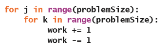
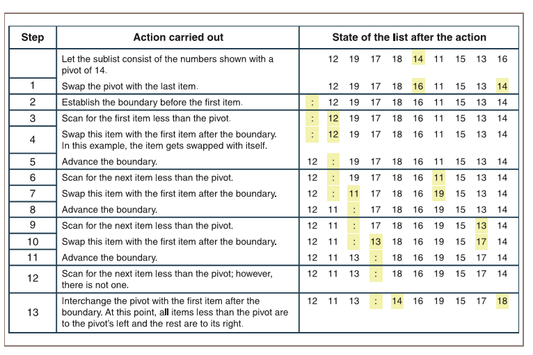
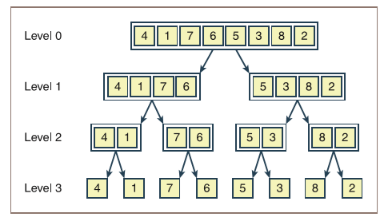

# 搜索、排序以及复杂度分析

在完成这一章的学习之后，你就能够：

* 根据问题的规模来确定算法工作量的增长率；
* 使用大$O$表示法来描述算法的运行时间和内存使用情况；
* 认识到常见的工作量增长率或复杂度的类别：常数、对数、线性、二次方和指数；
* 将算法转换为复杂度低一个数量级的更快的版本；
* 描述顺序搜索算法和二分搜索算法的工作方式；
* 描述选择排序算法和快速排序算法的工作方式。

算法是计算机程序的基本组成部分之一。（另一个基本组成部分——数据结构——将会在第4章“数组和链接结构”里进行探讨。）算法描述了一个随着问题被解决而停止的计算过程。对于算法的质量有许多评估标准，其中最重要的就是正确性，也就是说算法能够解决那些需要用它来解决的问题。同时，可读性和易于维护性对算法来说也是非常重要的质量保证。而这一章则会去研究算法质量里的另一个重要标准——运行时性能。

当算法过程只能在特定的有限资源的真实计算机上运行时，经济学的思想就开始发挥影响力了。在算法的过程中会消耗两个资源：处理对象所需的时间和空间（也就是内存）。当面对相同的问题或数据集的时候，消耗这两种资源更少的过程，相应的也就比消耗资源更多的过程具有更高的质量。因此，对于算法来说，总会去追求消耗更短的时间和占用更少的空间。

这一章将会介绍一些用来进行复杂度分析的工具，从而可以对算法运行时的性能或效率进行评估。你将会把这些工具，应用在计算机程序中通常会涉及到的各种搜索算法和排序算法上。而且，这一章所介绍的分析工具和技术将会被贯穿于整本书。

## 衡量算法的效率

某些算法需要消耗的时间或内存量都会低于能够容忍的阈值。比如，对于大多数用户来说，对任何能够在不到一秒钟的时间内加载完文件的算法都是好算法。对于他们来说，只要能满足这个要求，不论是什么算法都是能够接收的。但是，在处理大型数据集的时候，某些算法花费的时间可能会非常的漫长而显得荒唐（比如要几千年）。在这个时候，你就不能用这些算法了，而是需要去找到其它的性能更好的算法（如果存在的话）。

在选择算法的时候，你通常需要对空间/时间进行权衡。比如，可以把算法设计来通过使用额外的空间（内存）或是其它方法来得到更快的运行速度。对于某些用户来说，他们可能会愿意为了使用更快的算法而花费更多的内存；而另一些用户则可能会宁愿选择节省内存去使用慢速的算法。尽管对于现在的台式机和笔记本电脑而言，内存的价格已经非常便宜了，但是空间/时间的权衡仍然与微型设备是紧密相关的。

在任何情况下，都希望能够有更好效率的算法。因此，某些性能不好的算法是需要注意的。这一节将会介绍几种衡量算法效率的方法。

### 衡量算法的运行时间

衡量算法的时间成本的一种方法是：用计算机时钟来得到算法实际的运行时间。这个过程被称为**基准测试**（**benchmarking**）或是**性能分析**（**profiling**），它会首先去确定算法处理相同规模的多个不同数据集的运行时间，然后再计算平均值；接着，对越来越大的数据集收集这样的平均运行时间；经过若干次测试之后，就有足够多的数据可以用来预测这个算法在面对任何规模的数据集时所需要的运行时间了。

考虑这样一个简单的、可能不太现实的例子：下面这个程序实现了一个从1到给定数字进行计数的算法。因此，问题的规模也就是这个给定数字。代码里选择了数字1000 0000，然后记录下算法的运行时间，并且把这个运行时间输出到终端窗口。接下来，将这个数字翻倍，然后重复整个过程。经过五次之后，你可以得出一组结果。下面是整个测试程序的代码：

测试程序里使用了`time`（时间）模块里的`time()`函数来跟踪运行时间。这个函数会返回计算机时钟的当前时间到1970年1月1日（也被称为**纪元**（**Epoch**））之间所经过的秒数。因此，两次调用`time.time()`的结果之间的差值，就代表了中间经历了多少秒。同时可以看到，这个程序在每次循环的时候，都会执行两个扩展的赋值语句，也就每次都执行了常数的工作量。尽管这并不是一个很大的工作量，但是，每次迭代也的确消耗了一定的时间，因此总的运行时间就会很长，但是最终结果每次都是一样的。图3-1展示了程序的输出结果。

>    | 问题规模 | 秒 |
>    | --- | --- |
>    | 1000 0000 | 3.8 |
>    | 2000 0000 | 7.591 |
>    | 4000 0000 | 15.352 |
>    | 8000 0000 | 30.697 |
>    | 1 6000 0000 | 61.631 |

图3-1 测试程序的输出

从结果可以很轻易地看出：当问题的规模翻倍时，运行时间也差不多翻了一番。因此，你也就可以预测当问题规模为3 2000 0000时，运行时间差不多是为124秒。

> 译者注：原文这里是3200 0000（三千两百万），根据上下文应该是3 2000 0000（三亿两千万）

再举一个例子，让我们把测试程序里的算法改成下面这样：

在这个版本的测试程序里，两个扩展的赋值语句被放在了嵌套循环里。很明显，这个循环会在另一个循环里遍历问题的规模，而另一个循环也是遍历问题的规模。我们曾经让这个程序跑了一整晚，但是直到第二天早上，它也只处理完了第一个规模为1000 0000的数据集。于是我们终止了这个程序，并且让它在一个更小的问题规模上（1000）运行。输出结果像图3-2这样。

>    | 问题规模 | 秒 |
>    | --- | --- |
>    | 1000 | 0.387 |
>    | 2000 | 1.681 |
>    | 4000 | 6.463 |
>    | 8000 | 25.702 |
>    | 1 6000 | 102.666 |

图3-2 第二个测试程序的输出

可以看到，当问题规模翻倍时，运行的时间差不多翻了两番。按照这种增长速度，要处理先前那个最大的数据集的话，大概需要175天的时间！

这种方法可以准确地预测很多算法的运行时间。但是，它存在两个主要问题：

* 不同的硬件平台会有不同的处理速度，因此算法的运行时间会由于机器的不同而存在差异；另外，程序的运行时间也会随着它和硬件之间的操作系统类型的不同而变化；最后，不同的编程语言和编译器生成的代码的性能也会有所不同。比如，用C语言进行编码的算法的机器代码运行速度通常会比用Python编写的相同算法所生产的字节代码要快一些。因此，在某一个硬件或软件平台上的测得的运行时结果，通常不能来预测在其它平台上的性能。

* 用一个非常大的数据计来确定一个算法的运行时间是非常不切实际的。对于某些算法来说，不论是编译的代码或是硬件处理器的速度有多快都没有任何的区别。因为，它们在任何计算机上都没办法处理非常大的数据集。

尽管对于某些情况来说，通过对算法进行计时可能是一种有用的测试形式，但是，你还是会希望算法能够在独立于特定硬件或软件平台的情况下对效率进行估算。就像你马上要在下一节里学习的那样，这种方式可以告诉你一个算法在任何平台上的执行效果是什么样的。

### 统计指令的数量

另一种用来衡量算法的时间成本的方法是：在不同问题规模下，对需要执行的指令条数进行计数。这样无论在什么平台上运行算法，这些结果就能够很好地去预测算法执行的抽象工作量了。这个方法需要注意的是，当统计指令的数量的时候，统计的应该是编写算法的高级语言里的指令数，而不是可执行程序里的机器语言的指令数。

通过这种方式来对算法进行分析时，你可以把它分成两个部分：

* 无论问题的规模如何变化，指令执行的次数总是相同；

* 执行的指令数随着问题规模的变化而变化。

那么，我们将会忽略掉第一种类型的指令，这是因为效率分析里它们的作用并不明显。第二类种类型的指令通常可以在循环或者是递归函数里找到。对于循环来说，通常会不统计循环内部会执行的指令，也就是说，只会用到循环迭代的数目。比如，我们可以修改前面那个面对不同规模的数据集，跟踪并显示内部循环的迭代次数的程序：

从结果中可以看到，迭代次数是问题规模的平方（图3-3）。

>    | 问题规模 | 迭代次数 |
>    | --- | --- |
>    | 1000 | 100 0000 |
>    | 2000 | 400 0000 |
>    | 4000 | 1600 0000 |
>    | 8000 | 6400 0000 |
>    | 1 6000 | 2 5600 0000 |

图3-3 统计迭代次数的测试程序的输出

接下来是一个类似的程序，它会基于若干个问题的规模，来跟踪递归斐波那契函数的调用次数。可以看到，这个函数现在需要接收计数器对象作为第二个参数了。因此，每次在上层调用这个函数的时候，都会创建一个新的计数器对象（在第1章“Python编程的基本知识”里定义的）传递给它。在这个调用和每次递归调用的时候，函数的计数器对象都会不断地增加。

这个程序的输出如图3-4所示。

>    | 问题规模 | 调用次数 |
>    | --- | --- |
>    | 2 | 1 |
>    | 4 | 5 |
>    | 8 | 41 |
>    | 16 | 1973 |
>    | 32 | 435 6617 |

图3-4 运行斐波那契函数的测试程序的输出

随着问题规模的翻倍，指令数（递归调用的次数）在一开始的时候缓慢增长，随后增长迅速加快。刚开始的时候，指令数是小于问题规模的平方的。但是，当问题规模到16时，指令数1973已经非常明显的大于了256或$16^2$。在这一章的稍后部分，你将会得到这个算法更精确的增长率。

以这种方式进行跟踪统计的问题在于，对于某些算法来说，计算机仍然无法以足够快的速度运行，从而在一定时间内得到非常大的问题规模的结果。

统计指令的数量是正确的思路，但是你需要通过逻辑和数学推理才能获得完整的分析方法。因此，要进行这种分析所需要的唯一工具就是纸和铅笔。

### 衡量算法使用的内存

对于算法所使用的资源的完整分析是需要包含它所需的内存量的。同样的，我们会关注它潜在的增长率。一些算法会需要与将被解决的问题相同的内存量。而其它的一些算法则会随着问题规模变大，而需要额外更多的内存。后面的章节将会对其中的几种算法进行探讨。

### 练习题

1. 编写一个测试程序，这个程序统计并显示出下面这个循环的迭代次数：

    

2. 在问题规模1000、2000、4000、1 0000和10 0000的情况下，运行你在练习1里所创建的程序。当问题规模翻倍或是乘以10时，迭代次数会如何变化？

3. 两次调用函数`time.time()`的结果之差就是运行时间。而由于操作系统也可能会在这段时间内使用CPU，因此这个运行时间可能并不能反映出Python代码使用CPU的实际时间。浏览Python文档来找出另一种可以完整记录下处理时间的方法，并描述如何用它去实现。

## 复杂度分析

在这一节里，你将会学习到一种用来确定算法效率的方法，这个方法可以让你不用关心与平台相关的时间，也不像是统计指令的数量这种不太实际的方法来对算法进行评估。这种被称为**复杂度分析**（**complexity analysis**）的方法，所需要做的是阅读算法，并用铅笔和纸来进行一些简单的代数计算就行了。

### 复杂度的阶

对于前面讨论过的那两个循环计数算法。对于问题规模为$n$的情况，第一个循环算法会执行$n$次；第二个循环算法则会包含一个会迭代$n^2$次的嵌套循环。在$n$还比较小的时候，这两种算法完成的工作量是差不多的，但是随着$n$的逐步增大，它们完成的工作量也越来越产生显著的差异。图3-5和表3-1展示了这种差异。在当前情况下，“工作”是指最深层的嵌套循环的迭代次数。

> Problem size -> 问题规模
>
> Operations -> 操作

图3-5 测试程序所完成的工作量的图表

表3-1 测试程序所完成的工作量

| 问题规模 | 第一个算法的工作量 | 第二个算法的工作量 |
| --- | --- | --- |
| 2 | 2 | 4 |
| 10 | 10 | 100 |
| 1000 | 1000 | 100 0000 |

这两个算法的性能在**复杂度的阶**（**order of complexity**）上是不一样的。第一个算法的性能因为它的工作量与问题的规模成正比（问题规模为10则工作量为10；问题规模为20则工作量为20；依此类推），因此是**线性阶**（**linear**）。而第二种算法的复杂度是**二次阶**（**quadratic**），这是因为它的工作量随问题规模的平方（问题规模为10时，工作量为100）而增长。从图和表中可以看出，对于问题规模为$n$的大多数情况下，线性复杂度算法的工作量要比二次方复杂度算法的工作量更少。实际上，随着问题规模的增大，具有较高复杂度的阶的算法的性能会更快的变差。

在算法分析中通常还有其它几个复杂度的阶。如果对于任意的问题规模，算法都需要相同数量的运算，那么它的性能就是**常数阶**（**constant**）的。列表的索引就是一个常数时间算法的好例子。很明显，这种情况下的算法是最优的。

比线性性能好，但比常数性能差的另一个复杂度的阶被称为**对数阶**（**logarithmic**）。对数算法的工作量与问题规模的$\log_2$成正比。因此，当问题的规模扩大一倍时，工作量只会加1（是的，只会增加1）。

**多项式时间算法**（**polynomial time algorithm**）的工作量会以$n^k$的速率增长，其中$k$是大于1的常数。比如说，有：$n^2$、$n^3$以及$n^{10}$。

尽管从某种意义上来说$n^3$比$n^2$的性能要差，但它们都是多项式复杂度，并且都会比复杂度的阶的下一个级别更好。比多项式还要差的复杂度的阶被称为**指数阶**（**exponential**）。在这个复杂度的一个简单例子是：增长率为$2^n$。因此对于大问题来说，指数算法是不可行的。图3-6和表3-2总结了算法分析中会用到的最常见的复杂度的阶。

> Problem size -> 问题规模
>
> Operations -> 操作

图3-6 一些复杂度的阶的示例图

表3-2 复杂度的阶的一些例子

| $n$ | **对数阶**（$\log_2 {n}$） | **线性阶**（$n$） | **平方阶**（$n^2$） | **指数阶**（$2^n$） |
| --- | --- | --- | --- | --- |
| 100 | 7 | 100 | 1 0000 | 在图外 |
| 1000 | 10 | 1000 | 100 0000 | 在图外 |
| 100 0000 | 20 | 100 0000 | 1 0000 0000 0000 | 在图非常远的地方了 |

### 大$O$表示法

算法很少会执行刚好等于$n$、$n^2$或是$n^k$的操作。算法也通常会在循环体内、循环之前以及循环之后执行一些其它的工作。比如，更准确地来说，一个算法可能会执行$2n + 3$或是$2n^2$个操作。而且，在嵌套循环的情况下，内部循环可能会在每次回到外部循环后减少一次执行，因此迭代的总数可能更像$\frac{1}{2}n^2-\frac{1}{2}n$，而不是$n^2$。也就是说，在这些情况下算法中的工作量通常是多项式里多个项的总和，而当工作量被表示为多项式时，其中一项是处于**主导地位**（**dominant**）的。随着$n$越来越大，主导项将会变得非常大，以至于你可以忽略掉其它项所代表的工作量。因此，对于多项式$\frac{1}{2}n^2-\frac{1}{2}n$，你只需要着重考虑二次项$\frac{1}{2}n^2$就行了，也就是在考虑的时候忽略掉了线性项$\frac{1}{2}n$。你也可以忽略掉系数$\frac{1}{2}$，这是因为随着$n$的增加$\frac{1}{2}n^2$和$n^2$之间的比率并不会改变。比如，如果问题的规模翻倍，那么$\frac{1}{2}n^2$和$n^2$算法的运行时间都将会增加4倍。正是因为，随着$n$变得非常大，多项式的值渐近地接近或近似于它的最大项的值，这种形式的分析有时被称为**渐近分析**（**asymptotic analysis**）。

计算机科学家们用来表示算法的效率、或是计算算法的复杂度的一种表示方法被称为**大$O$表示法**（**big-O notation**）。在这里，“O”代表“在...阶”，指的是算法工作的复杂度的阶。因此，线性算法的复杂度的阶也就是$O(n)$。大$O$符号让我们对复杂度的阶的探讨变得非常正式。

### 比例常数的作用

**比例常数**（**constant of proportionality**）包含了那些在大$O$分析中会被忽略掉的项和系数。比如说，线性时间算法所执行的工作量可以被表示为：*work = 2 \* size*，那么在里，比例常数就是*work/size*，也就是2。在处理中小型数据集的时候，如果这些常数很大，它们也会影响到算法效率。比如，当$n$为100 0000时，就不能忽略掉$n$与$n / 2$之间的差了。对于你已经看到的所有算法例子来说，在循环内执行的指令是比例常数的一部分，在进入循环前初始化变量的指令也是。并且，在分析算法时，必须要仔细地确认任何一条单独的指令会不会根据问题的规模变化而变化。如果会的话，那么对工作量的分析就必须要对这个指令进行深入研究。

现在让我们回头再看看在这一章开头讨论的那第一个算法，并尝试确定它的比例常数。下面是它的代码：

可以看到，除了循环本身之外，还有三行代码，它们都是赋值语句，因此这三个语句都会以常数时间运行。我们再假设：在每次迭代的时候，隐藏在循环头里的用来对循环进行管理的开销也会运行一个常数时间的指令。因此，这个算法执行的抽象工作量就是：$3n + 1$。尽管它会大于$n$，但这两个不同的工作量$n$和$3n + 1$的运行时间却都会以线性速率增加。也就是说，它们的运行时间都是$O(n)$。

### 练习题

1. 假设下面的表达式都分别表示对于问题规模为$n$的算法所需要执行的操作数。指出每种算法的处于主导地位的项，并使用大$O$表示法来对它进行分类。

    a. $2^n - 4n^2 +5n$

    b. $3n^2 + 6$

    c. $n^3 + n^2 - n$

2. 对于规模为$n$的问题，算法A和B分别会执行$n^2$和$\frac{1}{2}n^2+\frac{1}{2}n$条指令。那么哪种算法更高效？有没有存在可以让一种算法比另一种算法性能明显更好的特定问题规模？是否有让两种算法都执行大致相同的工作量的特定问题规模？

3. 在什么时候开始$n^4$算法比$2^n$算法的表现更好？

## 搜索算法

接下来，你将会看到几种被用来对列表进行搜索和排序的算法；然后会学习这些算法的设计，并把它实现为Python的函数；最后，你将会对这些算法的计算复杂度进行分析。为了简便起见，这里出现的所有函数都只会处理全部是整数的列表，因此，不同大小的列表将会被作为参数传递给函数。这些函数会被定义在单个模块中，在这一章的稍后的案例分析里，将会用到这个模块。

### 最小值搜索

Python的`min`函数将会返回列表里的最小值或是最小元素。为了研究这个算法的复杂度，你将会开发一个它的替代版本，这个版本会返回最小元素的**索引**（**index**）。这个算法会假定列表不为空，并且元素是按照任意顺序被存放在列表里的。它首先会把第一个位置作为存放最小元素的位置；然后向右侧搜索更小的元素，如果找到，那么把最小元素的位置重置到当前位置；当算法到达列表末尾时，它将返回最小元素的位置。下面在函数`indexOfMin`里的是这个算法的代码：

可以看到，无论列表的大小如何，循环外的3条指令都会执行相同的次数，因此，你可以忽略掉它们。循环里还有另外三个指令：其中，`if`语句里的比较和`currentIndex`的自增会在每次循环里都被执行，而且这些指令里也没有嵌套或隐藏的循环。这个算法必须要访问到列表里的每个元素，从而保证它能够找到最小元素的位置，而这个工作实际上是在`if`语句的比较里完成的。因此，这个算法必须对大小为$n$的列表进行$n - 1$次比较，也就是说，它的复杂度为$O(n)$。

### 顺序搜索列表

Python的`in`运算符在`list`类里被实现为叫做`__contains__`的方法，它会在任意序列的元素列表里搜索特定的元素（称为**目标元素**（**target item**））。在这个列表里，找到目标元素的唯一方法是从位于第一个位置的元素开始，并把它和目标元素进行比较。如果元素相等，那么这个方法返回`True`；否则，这个方法将会移动到下一个位置，并把它的元素和目标元素进行比较。如果这个方法到了最后一个位置，还仍然找不到目标，那么就返回`False`。这种搜索被称为**顺序搜索**（**sequential search**）或**线性搜索**（**linear search**）。一个更好用的顺序搜索将会在找到目标的情况下返回元素的索引，不然就返回-1。下面是顺序搜索函数的Python实现：

顺序搜索的分析会和最小值搜索的分析有些不同，你将在下一个子节里看到。

### 最好情况、最差情况以及平均情况下的性能

一些算法的性能会取决于需要处理的数据所在的位置。顺序搜索算法在列表开头就找到目标元素的工作量很明显会比在列表末尾找到的工作量要少。对于这类算法，你可以确定最好情况下的性能、最差情况下的性能以及平均性能。一般来说，我们会建议你把考虑的重点放在平均情况和最差情况下的表现，而不用太关心最好情况。

对顺序搜索的分析需要考虑下面三种情况：

1. 在最差情况下，目标元素会位于列表的末尾或者根本就不在列表里。那么，这个算法就必须要访问到每一个元素，也就是对于大小为$n$的列表需要执行$n$次迭代。因此，顺序搜索的最差情况复杂度为$O(n)$；

2. 在最好情况下，只需要$O(1)$的复杂度，因为这个算法在一次迭代之后就会在第一个位置找到目标元素；

3. 而要确定平均情况，就需要把在每个可能位置找到目标所需要的迭代次数相加，然后再将它们的总和除以$n$就行了。因此，这个算法会执行$(n + n - 1 + n - 2 + ... + 1) / n$，也就是$(n + 1)/ 2$次迭代。并且对于非常大的$n$来说，常数系数2是可以被忽略的。因此，平均复杂度仍然是$O(n)$。

很明显，最好情况下的顺序搜索的性能和其它两种情况比起来是非常小的。而其它两种情况下的性能是差不多的。

### 基于有序列表的二分搜索

对于没有按照任何特定顺序排列的数据来说，只能使用顺序搜索来找到目标元素。而在数据有序的情况下，就可以使用二分搜索来找到目标元素了。

要了解二分搜索的工作原理，可以想想如果你要在电话簿（20世纪的时候使用的纸质形式）里找某个人的电话号码时，你会怎么做。电话簿里的数据已经是有序的，因此你不需要在通过顺序搜索来进行查找。你可以根据姓名的字母来估计它会在电话簿里所处的位置，然后尽可能地在接近这个位置的地方打开它。打开电话簿之后，你就可以知道按照字母顺序目标姓名会处于前面还是后面的书页，然后根据需要再向前或向后翻页。不断重复这个过程，直至找到这个姓名，或是知道电话簿里并没有包含这个姓名。

接下来想一想，用Python来进行二分搜索的情况。在开始之前，我们假设列表里的所有元素都以升序排序（和电话簿一样）。搜索算法首先到列表的中间位置，并把这个位置的元素与目标元素进行比较，如果匹配的话，那么算法就返回当前位置。不然的话，如果目标元素小于当前元素，那么算法将会搜索列表里在中间位置之前的部分；如果目标元素大于当前元素，则搜索列表中间位置之后的部分。在找到了目标元素或者是当前开始位置溢出了当前结束位置时，停止搜索过程。

这是二分搜索函数的代码：

算法里只有一个循环，并且没有嵌套或隐藏的循环。和前面类似，当目标不在列表里时，也会得到最差情况。在这个算法里，循环在最差情况下会运行多少次？它等于列表的大小不断除以2直到商为1的次数。对于大小为$n$的列表来说，也就是你需要执行$n/2/2 ... /2$直到结果为1。假设$k$是这个$n$可以除以2的次数。那么，求解$k$，你会有$n/2^k=1$，也就是$n=2^k$，于是$k=\log_2{n}$。因此，二分搜索在最差情况下的复杂度为$O(\log_2{n})$。

图3-7展示了在包含9个元素的列表里，通过二分搜索查找并不在列表里的目标元素10时，对列表进行的分解。在图里，与目标元素进行比较的元素将会被加上阴影。可以看到，原始列表的左半部分里的任何元素都不会被访问。

图3-7 二分搜索10时所访问的列表元素

对目标元素10的二分搜索需要四次比较，而顺序搜索将会需要10次比较。当问题规模变得更大时，这个算法很明显会表现得更好。对于我们这个包含9个元素的列表来说，它最多需要进行4次比较，而包含100 0000个元素的列表则最多需要进行20次比较就能完成！

二分搜索肯定要比顺序搜索更有效。但是，你只能基于列表里数据的组织情况来选择合适的搜索算法的类型。为了让列表能够保持有顺，二分搜索需要付出额外的成本。稍后，你将会了解一些对列表进行排序的策略并分析它们的复杂度。但是现在，让我们来了解一些关于比较数据元素的细节。

### 数据元素的比较

二分搜索和最小值搜索都有一个假定，那就是：列表里的元素彼此之间是可以进行比较的。在Python里，这也就意味着这些元素属于同一个类型，并且它们可以识别比较运算符：`==`、`<`和`>`。几种Python内置的类型对象是支持使用这些运算符进行比较的，它们有：数字、字符串和列表。

为了能够让算法对新的类的对象使用比较运算符：`==`、`<`和`>`，程序员应在这个类里定义`__eq__`、`__lt__`和`__gt__`方法。在定义了这些方法之后，其它的比较运算符的方法，将会被自动生成。`__lt__`的定义如下：

如果`self`小于`other`的话，那么这个方法将会返回`True`，不然返回`False`。比较对象的标准取决于它们的内部结构以及它们所应该满足的顺序序列。

比如，`SavingsAccount`对象可能会包含三个数据字段：名称、PIN（密码）以及余额。如果你假定这个账户对象应该按照名称的字母顺序对它进行排序，那么就需要下面这样来实现`__lt__`方法：

可以看到，`__lt__`方法会为两个账户对象的`name`字段调用`<`运算符。名称字段是字符串，而字符串类型已经包含了`__lt__`方法。因此，在使用`<`运算符时，Python会自动运行字符串的`__lt__`方法，这个状况与调用`str`函数时，会自动运行`__str__`方法是类似的。

下面这部分将显示对若干个账户对象进行比较的结果：

现在，你可以把账户放在列表中，并按照它的名称来对它进行排序了。

### 练习题

1. 假设一个列表在索引0到9的位置处包含有值20、44、48、55、62、66、74、88、93、99。在用二分搜索去查找目标元素90的时候，对变量`left`、`right`和`midpoint`的值进行跟踪。改变要查找的目标元素为44，并重复这个步骤。

2. 通常来说，查找电话簿中条目的方法与二分搜索并不完全相同，因为使用电话簿的时候，你并不会每次都转到要被搜索的子列表的中点。一般来说，你会可以根据这个人的姓氏的第一个字母的字母顺序来估算目标可能会在的位置。例如，当你查找“Smith”的电话的时候，你将会首先查看电话簿的下半部分的中间，而不是整个电话簿的中间。对二分搜索算法尝试进行修改，从而可以在处理名称列表的时候模拟这个策略。它的计算复杂度与标准的二分搜索相比较会更好吗？

## 基本的排序算法

计算机科学家们设计了许多巧妙的策略来对元素列表进行排序。这里会讨论其中的若干个这样的策略。这一节里讨论的算法虽然非常容易编写，但它们的效率并不高。而下一节讨论的算法则会更难编写，但效率也相对会更高。（这是一个普遍的需要权衡的情况。）在这里，所有的Python排序函数都将被编写为可以在整数列表上运行，并且使用`swap`函数来交换列表中两个元素的位置。这个`swap`函数的代码是这样的：

### 选择排序

也许排序的最简单的策略是：在整个列表中去搜索最小元素的位置；如果它的位置不在第一个位置的话，那么算法将会交换这两个位置上的元素；然后，算法会回到列表的第二个位置并向后重复这个过程，找到后面最小的元素，并与第二个位置的元素进行交换；当算法到达整个过程的最后那个位置的时候，这个列表也就已经是有序的了。这个算法被称为**选择排序**（**selection sort**），这是因为它在每次通过主循环的时候，都会选择将要移动的那一个元素。图3-8展示了进行每一轮选择排序的搜索和交换的遍历之后，五个元素在列表里的踪迹。在图里，每次交换的两个元素旁边都带有星号作为标识，并且列表的有序部分将会被加上阴影来进行显示。

>    | 无序列表 | 第1次遍历之后 | 第2次遍历之后 | 第3次遍历之后 | 第4次遍历之后 |
>    | --- | --- | --- | --- | --- |

图3-8 选择排序期间数据的踪迹

这是用来进行选择排序的Python函数：

这个函数包含了一个嵌套循环。对于大小为$n$的列表来说，外部循环将会执行$n - 1$次。在第一次通过外部循环的时候，内部循环会执行$n - 1$次。在第二次通过外部循环时，内部循环会执行$n - 2$次。在最后一次通过外部循环时，内部循环会执行一次。因此，大小为$n$的列表总共所需要的比较次数是：

$$
(n - 1) + (n - 2)+ ... + 1 = \\
n(n - 1) / 2 = \\
\frac{1}{2}n^2-\frac{1}{2}n
$$

对于比较大的$n$来说，你可以选择最高次的项并忽略掉系数，因此在所有的情况下，选择排序的复杂度都是$O(n^2)$。对于大型数据集来说，交换元素的成本也可能会很高。这是因为这个算法只会在外部循环里对数据元素进行交换，因此在最差情况和平均情况下，选择排序的额外成本是线性的。

### 冒泡排序

相对容易构思和编码的另一种排序算法是冒泡排序。它的策略是从列表的开头开始，在向后移动到末尾时，对数据进行比较；当配对的元素不是有序的时候，算法就会交换它们。这个过程的作用是将最大的元素冒泡到列表的末尾。然后，这个算法从列表的开头开始重复该过程，然后转到倒数第二个元素，依此类推，直到从最后一个元素开始为止。此时，列表已排序。

图3-9展示了一次冒泡的过程中五个元素在列表里的踪迹。这个过程中嵌套循环运行了四遍，从而让最大的元素冒泡到了列表的末尾。同样在这个图里，每次交换的两个元素旁边都带有星号作为标识，并且列表的有序部分将会被加上阴影来进行显示。

>    | 无序列表 | 第1次遍历之后 | 第2次遍历之后 | 第3次遍历之后 | 第4次遍历之后 |
>    | --- | --- | --- | --- | --- |

图3-9 冒泡排序期间数据的踪迹

这是用来进行冒泡排序的Python函数：

和选择排序一样，冒泡排序也使用了嵌套循环。不过，这次列表的排序部分是从列表的末尾到开头这样增长的，但是冒泡排序的性能和选择排序是非常相似的：对于大小为$n$的列表，内部循环会执行$\frac{1}{2}n^2-\frac{1}{2}n$次。因此，冒泡排序也是$O(n^2)$。和选择排序一样，如果列表已经是有序的状态，冒泡排序也不会执行任何的交换。但是，冒泡排序在最差情况下的交换操作会大于线性复杂度，对于这一点的证明将会作为练习留给你。

为了让冒泡排序在最好情况下的性能可以提高到线性复杂度，你可以对它进行一些简单调整。这是因为，如果在主循环的一次遍历中没有发生任何的交换，那么就说明整个列表已经是有序的了。这种事情在任何一次遍历的时候都有可能发生，而且在最好情况下，第一次遍历的时候就会发生。于是，你可以使用一个布尔值标志来追踪有没有发生交换，当内部循环没有设置这个标志时，就直接返回函数。下面是修改后的冒泡排序函数：

要注意的是，这个修改只会改善在最好情况下的复杂度。对于平均情况而言，这个版本的冒泡排序的仍然是$O(n^2)$。

### 插入排序

对于已经有序的列表来说，我们修改后的冒泡排序会比选择排序执行效率更好。但是，如果列表中有很多元素都不是有序的情况下，我们修改后的冒泡排序的性能仍然不会很好。另一种被称为插入排序的算法将会尝试通过另一种方式来利用列表的有序部分。它的策略是这样的：

* 在第$i$次遍历列表的时候，这其中$i$的范围应当是从1到$n - 1$，第$i$个元素应插入到列表里第$i$个位置处。

* 在第$i$次遍历列表之后，前$i$个元素应该已经按顺序排序了。

* 这个过程类似于很多人组织手里的扑克牌的方式。也就是说，在你持有前$i - 1$扑克牌已经有序的情况下，选择第$i$张扑克牌，并把它和前面这些扑克牌进行比较，直至找到它的正确位置为止。

* 和我们的其它排序算法一样，插入排序也是由两个循环组成的。外部循环将会从位置1一直遍历到位置$n-1$。对于这个循环里的每个位置$i$，你都会选择这个元素，并从位置$i - 1$处开始了内部循环。而对于这个内部循环里的每个位置$j$，你都会在找到应该放置选择（第$i$个）元素的插入点之前，把这个元素移动到$j + 1$处。

这是`insertSort`函数的代码：

图3-10展示了每次通过插入排序的外部循环之后的列表里五个元素的踪迹。在图里，在下一次遍历将会被插入的元素会用箭头进行标记；在插入之后，这个元素会被星号进行标记。

>    | 无序列表 | 第1次遍历之后 | 第2次遍历之后 | 第3次遍历之后 | 第4次遍历之后 |
>    | --- | --- | --- | --- | --- |

图3-10 插入排序期间数据的踪迹

和之前一样，对这个算法的分析将会着重在嵌套循环这部分。外部循环会执行$n − 1$次。在最差情况下，当所有的数据都是无序的情况时，内部循环在外部循环第一次遍历的时候会循环一次，在第二次循环时循环两次，依此类推。因此，总共会进行$\frac{1}{2}n^2-\frac{1}{2}n$次遍历。所以，插入排序在最差情况的复杂度是$O(n^2)$。

列表里有序的元素越多，插入排序的性能就会越好，而在列表有序这个最好情况下，排序的运行是线性复杂度。但是，在平均情况下，插入排序仍然是二次方的复杂度。

### 再论最好情况、最差情况以及平均情况下的性能

在面提到过，对于许多的算法来说，你不能对所有的情况都采用单一的复杂度来衡量。有时，当遇到特定顺序的数据时，算法的行为可能会变得更好或是更糟。比如，冒泡排序算法可以在列表被排好序之后立即终止。这种情况下，如果输入的列表已经是有序的，那么冒泡排序只需要进行$n$次比较就好了。但是，在其它的许多情况下，冒泡排序仍然需要大概$n^2$次比较。很明显，你需要进行更详细的分析，才能让程序员能够意识到这些特殊情况。

在面提到过，要对于算法复杂度的详细分析会把它的行为分为三种情况：

* **最好情况**（**best case**）——算法在什么情况下可以以最少的工作量完成？在这种最好情况下，算法的复杂度是多少？

* **最差情况**（**worst case**）——算法在什么情况下需要完成最多的工作量？在这种最差情况下，算法的复杂度是多少？

* **平均情况**（**average case**）——算法在什么情况下用适量的工作量就完成了？在这些情况下，算法的复杂度是多少？

接下来，你将会看到三个用到这种分析的算法例子，它们是：最小值搜索、顺序搜索以及冒泡排序。

由于最小值搜索算法必须访问列表里的每个数字，除非对列表进行排序，不然这个算法始终都会是线性复杂度。因此，它的最好情况、最差情况以及平均情况下的性能都是$O(n)$。

顺序搜索会有些不同。当找到目标元素时，这个算法会停止并返回结果。很明显，在最好情况下，目标元素会位于第一个位置。而在最差情况下，目标元素会位于最后一个位置。因此，这个算法在最好情况下的性能为$O(1)$，最差情况下的性能为$O(n)$。而要计算平均情况下的性能，你要把每个可能会找到的目标位置所需要进行的比较次数相加，然后再将次数的总和除以$n$就行了。也就是$(1 + 2 + ... + 1) / n$，或者简写为$(n + 1)/ 2$。因此，基于渐进分析，顺序搜索在平均情况下的性能也是$O(n)$。

当列表已经排好序之后，更聪明版本的冒泡排序可以直接终止掉进程。在最好情况下——这种情况会发生在输入的列表已经是有序时——冒泡排序在最好情况下是$O(n)$。但是，这种情况非常罕见（$n!$分之1的可能性）。在最差情况下，这个版本的冒泡排序也必须要把每个元素都冒泡到列表中相应的位置去。因此，这个算法在最差情况下的性能很明显是$O(n^2)$。而冒泡排序在平均情况下性能会比$O(n)$更差，而更接近$O(n^2)$，对这个事实的证明，会比顺序搜索算法复杂得多。

你将会在稍后的内容中看到，某些算法在最好情况下和平均情况下的性能是类似的，但是它的性能也可能会被降级到最差情况。因此，无论你是选择一个算法还是开发一种新算法，都需要意识到这些区别。

### 练习题

1. 列表里如何排列数据会让选择排序中进行元素交换的次数最少？如何排列数据会让它执行最多的交换次数？

2. 解释数据交换的次数在分析选择排序和冒泡排序时所起到的作用。数据对象的规模在它们之间发挥着什么作用（如果有作用的话）？

3. 解释为什么修改后的冒泡排序在平均情况下仍然表现为$O(n^2)$。

4. 解释为什么插入排序在部分有序的列表上能够很好地工作。

## 更快的排序

> 译者注：根据上下文，这个标题应该是二级标题，而不是原文里的三级标题。（第一版的翻译里，这个标题也是二级标题）

到目前为止，我们看到的三种排序算法都是$O(n^2)$的运行时间复杂度。它们也会有一些变体，其中的一些会稍微快一些，但是这些变体在最差情况和平均情况下仍然是$O(n^2)$的复杂度。然而，还存在着一些更好的，性能是$O(n \log n)$的排序算法。这些更好的算法的秘诀是采用了分治法的策略。也就是说，这些更好的算法都找到了一种方法能够把列表分成更小的子列表，然后再通过递归把这些子列表进行排序。在理想情况下，如果这些被拆分的子列表的数量是$O(\log n)$，而把每个子序列进行合并所需的工作量为$n$，那么这种排序算法的总复杂度就是$O(n \log n)$。在表3-3里，你可以看到$O(n \log n)$算法的工作量增长率相比$O(n^2)$算法的工作量增长率要慢得多。

表3-3 比较$n \log n$和$n^2$

| $N$ | $n \log n$ | $n^2$ |
| --- | --- | --- |
| 512 | 4608 | 26 2144 |
| 1024 | 1 0240 | 104 8576 |
| 2048 | 2 2458 | 419 4304 |
| 8192 | 10 6496 | 6710 8864 |
| 1 6384 | 22 9376 | 2 6843 5456 |
| 3 2768 | 49 1520 | 10 7374 1824 |

这一节将会对两种打破了$n^2$性能瓶颈的递归排序算法进行分析：快速排序和归并排序。

### 快速排序的概述

下面是**快速排序**（**quicksort**）算法里所使用的策略的总结：

1. 首先从列表的中间选择一个元素。这个元素被称为**基准**（**pivot**）。（这一章稍后的部分将会介绍选择基准的其它方法。）

2. 对列表里的元素进行分割，让小于基准的所有元素都移动到基准的左侧，而把其余元素都移动到基准的右侧。基于所需要处理的实际元素，基准自身再分割后的最终位置也会有所变化。比如，如果基准正好是最大的元素，那么它最终会处于列表的最右边，而如果基准正好是最小值，那么它就会在最左侧。但是无论基准在哪里，这个位置都会是它在最终的有序列表里的位置。

3. 分治法。将这个过程递归地应用到通过基准而把原列表分割出的子列表上。其中一个新的子列表会由基准左侧的所有元素（较小的元素）组成，另一个新的子列表则会是它右侧的所有元素（较大的元素）。

4. 当分割出的子列表内少于两个元素时，终止这个过程。

#### 分割

从程序员的角度来看，这个算法里最复杂的部分，是把元素进行分割从而得到子列表的操作。虽然有两种的方法可以做到这一点；而在这里，我们会对两者中更简单的那个方法进行描述，这是因为它适用于所有的子列表的情况：

1. 将基准与子列表里的最后一个元素进行交换。

2. 在已知的、会小于基准的元素和其它元素之间构建一个边界。在一开始的时候，这个边界会处在第一个元素之前。

3. 从子列表的边界之后的第一个元素开始，向右进行扫描。当每次遇到小于基准的元素时，将它和边界之后的第一个元素进行交换，并且将边界向右移动。

4. 在结束的时候，将基准和边界之后的第一个元素进行交换。

图3-11说明了对于数字12 19 17 18 14 11 15 13 16所组成的列表应用这些步骤的结果。步骤1将会得到基准，并且把它和最后一个元素进行交换；步骤2会把边界建立在第一个元素之前。步骤3到12会对子列表不断向右进行扫描，从而找到小于基准的元素，并且把这些元素和边界之后的第一个元素进行交换，并把边界向右移动，可以看到，在这些步骤里，边界左侧的元素始终会小于基准；最后，步骤13会把基准和边界之后的第一个元素进行交换，这个时候子列表就已经被成功的进行了分割。

>    | 步骤 | 所执行的步骤 | 执行之后列表的状态 |
>    | --- | --- | --- |
>    | | 确定子列表里的基准是14 | 12 19 17 18 **14** 11 15 13 16 |
>    | 1 | 将基准和最后一个元素进行交换 | 12 19 17 18 **16** 11 15 13 **14** |
>    | 2 | 在第一个元素之前建立边界 | **:** 12 19 17 18 16 11 15 13 14 |
>    | 3 | 查找第一个小于基准的元素 | **:** **12** 19 17 18 16 11 15 13 14 |
>    | 4 | 将找到的元素和边界之后的第一个元素进行交换；在这里它会和它自身进行交换 | **:** **12** 19 17 18 16 11 15 13 14 |
>    | 5 | 向右移动边界 | 12 **:** 19 17 18 16 11 15 13 14 |
>    | 6 | 查找下一个小于基准的元素 | 12 **:** 19 17 18 16 **11** 15 13 14 |
>    | 7 | 将找到的元素和边界之后的第一个元素进行交换 | 12 **:** **11** 17 18 16 **19** 15 13 14 |
>    | 8 | 向右移动边界 | 12 11 **:** 17 18 16 19 15 13 14 |
>    | 9 | 查找下一个小于基准的元素 | 12 11 **:** 17 18 16 19 15 **13** 14 |
>    | 10 | 将找到的元素和边界之后的第一个元素进行交换 | 12 11 **:** **13** 18 16 19 15 **17** 14 |
>    | 11 | 向右移动边界 | 12 11 13 **:** 18 16 19 15 17 14 |
>    | 12 | 查找下一个小于基准的元素；但是已经没有了 | 12 11 13 **:** 18 16 19 15 17 14 |
>    | 13 | 把基准和边界之后的第一个元素进行交换；这个时候，所有小于基准的元素将会在它的左侧，大于它的将会在它的右侧 | 12 11 13 **:** **14** 16 19 15 17 **18** |

图3-11 对子列表进行分割

在对子列表进行分割之后，将这个步骤在新产生的左右子列表（**12 11 13**和**16 19 15 17 18**）上继续递归的使用，直到新产生的子列表的长度是1的时候停止。图3-12展示了在每个分割步骤之前的列表段的情况，以及在这个步骤里所选取的基准元素是什么。

>    | 列表段 | 基准元素 |
>    | --- | --- |

图3-12 分割子列表

#### 快速排序的复杂度分析

接下来，你将会看到对快速排序的复杂度进行的简单分析。在第一次进行分割操作期间，我们将会扫描列表里从开头到结尾的所有元素。因此，这个操作期间的工作量是和列表的长度$n$成正比的。

这次分割之后的工作量会和左子列表加上右子列表的总长度成正比，也就是$n-1$。而再次对这两个子列表进行分割之后，就会产生四个加起来总长度大约为$n$的列表片段。因此，对它们进行分割的总工作量还是和$n$成正比的。于是，当列表被分割成更多片段时，我们可以说总工作量会一直和$n$成正比。

要完成整个分析，你还需要确定列表被分割了多少次。按照最乐观的情况来说（虽然在实际操作的时候，通常并不会出现这么好的情况），假设每次新分割出的子列表之间的分界线都尽可能地靠近当前列表的中心。从二分搜索算法的讨论里你已经知道了，要把列表不断地分成两半时，大约在$\log_2{n}$步的时候就只剩下一个元素了。因此，这个算法在最好情况下的性能为$O(n \log n)$。

在最差情况下，我们来考虑下对于有序列表的情况。如果选择的基准元素是第一个元素，那么在第一次分割之后它的右边会有$n - 1$个元素，在第二次分割之后它的右边有$n - 2$个元素，依此类推，如图3-13所示：

图3-13 快速排序的最差情况（箭头指向基准元素）

尽管整个操作里没有交换任何元素，但分割总共也执行了$n - 1$次，于是执行的比较总数就是$\frac{1}{2}n^2-\frac{1}{2}n$，这与选择排序以及冒泡排序的情况是一样的。因此，在最差情况下，快速排序算法为$O(n^2)$。

如果把快速排序实现成递归算法的话，那么对它的分析还必须要考虑调用堆栈的内存使用情况。因为，每次递归调用都需要常数数量的内存来作为堆栈的一帧，并且每次分割之后都会有两次递归调用。因此，在最好情况下的内存使用量会是$O(\log n)$，而最差情况下的内存使用量是$O(n)$。

尽管快速排序会处于最差情况下的几率很小，但是程序员还是会努力地去避免这种情况，因此，它们并不会在第一个或最后那个位置去选择基准元素。有一些其它的选择基准的方法可以让这个算法在平均情况下有大约$O(n \log n)$的性能，比如说：可以选择随机位置上的元素作为基准，或者是选择整个列表里的第一个、中间位置以及最后一个位置的3个元素的中位数。

#### 实现快速排序

快速排序算法可以很容易地通过递归方法来进行编码。下面的代码为客户端在顶层定义了一个`quicksort`函数；而递归函数`quicksortHelper`则是用来隐藏子列表的端点这些额外参数的辅组函数；以及还定义了一个`partition`函数。这段代码还会在一个包含20个随机排序的整数列表上运行`quicksort`。

### 归并排序

另一种被称为**归并排序**（**merge sort**）的算法也是通过递归和分治法的策略来突破$O(n^2)$性能瓶颈的。下面是这个算法的简单描述：

* 计算出列表的中间位置，然后递归地对它的左、右子列表进行排序（分治法）。

* 将两个已经排好序的子列表合并为一个有序列表。

* 当子列表不能再被分割的时候，停止进行分割过程。

在顶层定义了三个Python函数来进行协作：

* `mergeSort`——用户调用的函数。

* `mergeSortHelper`——一个辅组函数，被用来隐藏递归调用所需要的额外参数。

* `merge`——实现合并过程的函数。

#### 合并过程的实现

合并过程用到一个与列表大小相同的数组。（第4章将会详细介绍关于数组的相关内容。）这个数组我们可以把它称为`copyBuffer`（拷贝缓冲区）。为了避免每次调用`merge`时都要为`copyBuffer`的分配和释放进行开销，这个缓冲区会在`mergeSort`函数里就被分配好，然后作为参数传递给`mergeSortHelper`以及`merge`函数。每次调用`mergeSortHelper`函数时，它还需要知道它所应该使用的子列表的范围，这个界限可以由另外两个参数来提供：`low`和`high`。下面是`mergeSort`函数的代码：

在判断传递的子列表是不是有至少两个元素之后，`mergeSortHelper`函数将会计算这个子列表的中点，并且对中点左右两部分进行递归排序，最后再调用`merge`函数来合并结果。下面是`mergeSortHelper`的代码：

图3-14展示了在递归调用`mergeSortHelper`函数的时候所产生的子列表。可以看到，开始的时候是一个包含八个元素的列表，而后子列表在每一层都会被均匀的分隔开，因此会有$2^k$个子列表在第$k$层进行合并操作。如果初始列表的长度不是2的幂的话，那么在每一层上并不会实现完全均匀的分割，并且在最后一层也不会包含所有的子列表。图3-15展示了合并图3-14里生成的子列表的过程。

图3-14 在`mergeSortHelper`调用期间生成的子列表

图3-15 合并在归并排序的过程中生成的子列表

最后，这是`merge`函数的代码：

`merge`函数会把两个已经排好序的子列表合并成一个更大的有序列表。在原列表里，第一个子列表会在`low`到`middle`之间；第二个子列表则会位于`middle + 1`到`high`之间。这个过程包含三个步骤：

1. 设置指向两个子列表里第一个元素的索引指针。它们分别在`low`和`middle + 1`。

2. 从子列表里的第一个元素开始，重复比较这两个元素。把更小的那个元素从它所在的子列表里复制到拷贝缓冲区去，然后把这个子列表的索引移动到下一个元素。不断地执行这个操作，直到已经完全复制了两个子列表里的所有元素。如果其中一个子列表已经到达了末尾，那么可以把另一个子列表里的其余元素直接复制过去就行了。

3. 把`copyBuffer`在`low`到`high`之间的部分复制回`lyst`中的相应位置。

#### 归并排序的复杂度分析

`merge`函数的运行时间由两个`for`语句来决定，而这两个循环都会被迭代`(high - low + 1)`次，因此，这个函数的运行时间是$O(high - low)$，于是每一层上的所有合并总共需要$O(n)$时间。而因为`mergeSortHelper`在每一层都尽可能均匀地拆分了子列表，所以层数应该是$O(\log n)$，而且在所有的情况下这个函数的最大运行时间都是$O(n \log n)$。

归并排序会有两个基于列表大小的空间需求。首先，是在调用堆栈上需要$O(\log n)$的空间来支持递归调用。其次，拷贝缓冲区会用到$O(n)$的空间。

### 练习题

1. 描述快速排序的策略，并说明为什么它可以把排序的时间复杂度从$O(n^2)$降低到$O(n \log n)$。

2. 为什么快速排序并不在所有情况下都是$O(n \log n)$的复杂度？对快速排序的最差情况进行描述，并给出一个将会产生这个情况的包含10个整数（1-10）的列表。

3. 快速排序里的`partition`操作会选择中点的元素作为基准。描述另外两种选择基准的策略。

4. Sandra有很好的想法：当快速排序里的子列表的长度小于某个数字（如30个元素）时，则运行插入排序来处理这个子列表。解释为什么这是一个好主意。

5. 为什么归并排序在最差情况下也是一个$O(n \log n)$算法？

## 指数复杂度的算法：递归斐波那契

在这一章的前面，我们通过递归Fibonacci函数，得到了在各种不同问题规模下的递归调的次数。并且你也看到了，它的调用次数比问题规模的平方增长得还要快很多。我们把这个函数的代码贴在了下面：

另一种可以被用来说明工作量快速增长的方法是：显示出给定问题规模的函数**调用树**（**call tree**）。图3-16展示了使用这个递归函数来计算第六个斐波那契数所涉及到的调用。为了使这个图能够有合适的页面大小，我们用`(6)`来代表`fib(6)`。

图3-16 `fib(6)`的调用树

可以看到，`fib(4)`只需要4次递归调用，看起来它好像是线性增长的，但在总共的14次递归调用里，`fib(6)`需要2次`fib(4)`调用。并且随着问题规模的扩大，情况会变得更加糟糕，这是因为在调用树里可能会有很多重复的相同子树。

那么，这种情况到底有多严重？如果这颗调用树是完全平衡的、并且完全填充了最下面的两层调用，那么当参数为6时，将会有2 + 4 + 8 + 16 = 30递归调用。可以看到，每一层里的调用数量都是它上一层的两倍。因此，在完全平衡的调用树里，递归调用的总数量通常时$2^{n+1} - 2$，其中$n$是调用树的顶部（根）的参数。很明显这是指数级的增长，也就是一个$O(k^n)$算法。尽管在递归斐波那契的调用树的底部那两层并没有被完全填充满，但它的调用树的形状和完全平衡的树也已经足够相近了，因此，我们可以把递归斐波那契归为指数算法。经过计算，递归斐波那契的常数$k$大约是1.63。

指数算法通常来说连很小的问题都没办法解决。尽管递归斐波那契的设计很优雅，但是我们还有一个不那么漂亮，但是速度更快的版本，这个版本会使用循环，从而让运行时间是线性复杂度。（请参阅下一节。）

或者，可以用被称为**记忆化**（**memoization**）的技术来让使用相同参数的、重复调用的——如同斐波那契函数这样的递归函数更加有效。要用这个技术，程序首先需要维护一个表格，来存放函数使用的每个参数所产生的值。在函数递归地计算给定的参数之前，它会先检查表格里是否已经存在这个参数所对应的值，如果已经存在的话，就直接返回这个值；而如果不存在，那么就继续进行计算，然后将参数和值的组合添加到表里。

计算机科学家会为了开发出更快的算法而投入大量的精力。例如从$O(n^2)$降低到$O(n)$，这样的对复杂度的数量级进行的优化，一般来说会比通过“微调”来减小代码的比例常数要更好。

### 将斐波那契转换为线性算法

尽管递归斐波那契函数能够展现出斐波那契序列的递归定义的简单性和优雅性，但是这个函数的运行时性能是不可接受的。另一种不同的算法可以把它的性能提高若干个数量级，实际上是降低到了线性时间的复杂度。在这一节里，你将会开发这种替代算法，并对它的性能进行评估。

前面提到过，斐波那契数列里的前两个数字是1，而之后的每个数字都是前两个数字的和。因此，新的算法将会在$n$至少大于3（第三个斐波那契数）的时候开始。而这个数字将会大于或等于头两个数的和（$1 + 1 = 2$）。接下来，这个算法将会循环计算这个和，然后执行两次交换：把第二个数字赋值给第一个数字；而第二个数字将会被赋值给刚刚计算出的总和。

循环将会从3开始到n结束。因此，循环末尾的那个总和就会是第$n$个斐波纳契数。下面是这个算法的伪代码：

在把Python函数`fib`改为通过循环来计算斐波那契数列之后，你就可以用之前的测试代码来测试这个函数了。下面是这个函数的代码，以及它所对应的测试输出：

可以看到，这个函数新版本的性能已经被提高到了线性复杂度。通过来说，把递归算法通过删掉递归，从而转换成基于循环的算法可以（但并非总是）降低它的运行时复杂度。

## 案例研究：算法分析器

*性能分析*是指通过计数指令或是运行时间来衡量算法性能的过程。在这个案例研究里，你将会开发一个程序来分析排序算法。

### 案例需求

编写一个可以让程序员分析不同排序算法的程序。

### 案例分析

分析器应该可以让程序员运行排序算法来对数字列表进行排序。它还应该可以追踪算法的运行时间、比较次数以及执行交换的次数。除此之外，当算法交换两个值的时候，分析器需要能够打印出列表的变化轨迹。程序员可以给分析器提供自己的数字列表，也可以要求分析器生成一个给定大小的随机数字列表。程序员还可以要求一个只包含一个数字的列表或是包含有重复数值的列表。为了方便使用，分析器应该能够让程序员可以在运行算法之前把这些功能作为选项来进行选择。它的默认行为是在一个包含10个不重复数字的随机列表上运行算法，并且跟踪算法的运行时间、比较次数以及交换次数。

分析器会是`Profiler`类的一个实例。程序员可以通过运行分析器里的`test`方法来分析排序函数，这个排序函数会作为方法的第一个参数来传递给它，前面提到那些选项也会作为参数同时传递给这个方法。下面这个交互展示了分析器对于特定的排序算法以及若干不同选项的几次测试：

程序员会对排序算法进行这些修改从而来进行分析：

1. 定义一个排序函数，并且在这个函数的定义里把分析器对象作为第二个参数。

2. 在排序算法的代码里，用`Profiler`对象里的`compare()`和`exchange()`方法来进行相关的比较以及交换操作。

3. 表3-4里列出了`Profiler`类的接口。

表3-4 Profiler类的接口

| Profiler的函数 | 它会做些什么 |
| --- | --- |
| `p.test(function, lyst = None, size = 10, unique = True, comp = True, exch = True, trace = False)` | 按照给定的选项来执行`function`函数，并输出相关结果 |
| `p.comparison()` | 如果设置了需要统计比较次数，那么就它进行自增。 |
| `p.exchange()()` | 如果设置了需要统计交换次数，那么就它进行自增。 |
| `p.str__()` | 和`str(p)`函数一样。根据选项返回结果的字符串表达形式。 |

### 案例设计

程序员会用到两个模块：

* `profiler`——这个模块会定义`Profiler`类。

* `algorithms`——这个模块定义了针对分析器修改过的排序函数。

这些排序函数和这一章前面讨论过的排序函数是一样的设计，唯一不同的地方在于它们会接收一个`Profiler`对象来作为另一个参数。当排序函数需要比较或是交换数据值的时候，就会执行这个`Profiler`对象的`comparison`和`exchange`方法。实际上，任何对列表进行操作的算法，只要它们也接收`Profiler`对象作为参数，并且在需要运行比较或交换操作的时候用`Profiler`对象里的方法，就都可以加到这个模块里来进行分析。

就像前面的交互里得到的结果那样，在开始的时候，你需要把`Profiler`类和`algorithms`模块导入到Python的Shell窗口里，然后在Shell窗口的提示符下执行测试就行了。分析器的`test`方法会自动初始化分析器对象、运行需要进行分析的函数、并且打印出相应的结果。

### 案例实现（编码）

下面是`algorithms`模块的部分实现，这一章所讨论过的那些排序算法并没有全部都显示在这里。在这里我们只展示了`selectionSort`函数，可以让你知道如何对它进行修改从而支持对各种分析数据进行统计。

`Profiler`类包含了接口里列出来的四个方法以及一些用来管理时钟的辅助方法。

## 章节总结

* 根据所需要的时间和内存资源，可以对解决同一个问题的不同算法进行排名。与需要更多资源的算法相比，耗费更少的运行时间或者占用更少的内存的算法通常会被认为更好。但是，这两种资源也通常需要进行权衡取舍：有时可以通过用更多内存为代价来改善运行时间；或者选择以较慢的运行时间作为代价来提高内存的使用率。

* 你可以根据计算机的时钟来按照过往经验测算算法的运行时间。但是，这个时间将会随着硬件和所用的编程语言的类型变化而变化。

* 统计指令的数量，提供了另一种对算法所需要做的工作量进行经验性的度量的方式。指令的计数可以显示出算法工作量的增长率的变化，而且这个数据和硬件以及软件平台都没有关系。

* 算法工作量的增长率可以用基于问题规模的函数来表示。复杂度分析会通过查看算法里的代码来得到这些数学表达式，从而让程序员可以预测在任何计算机上执行这个算法的效果是怎么样的。

* 大$O$表示法是用来表示算法的运行时复杂度的常用方法。这个符号会用$O(f(n))$的形式来表示需要解决这个问题所需要的工作量，其中$n$是算法问题的规模、$f(n)$是一个数学函数。

* 运行时复杂度的常见的表达式有：$O(\log_2 {n})$（对数）、$O(n)$（线性）、$O(n^2)$（二次方）以及$O(k^n)$（指数）。

* 算法在最好情况、最差情况以及平均情况下的性能可以是不同的。比如说：冒泡排序和插入排序在最好情况下都是线性复杂度，但是它们在平均情况和最差情况下是二次方复杂度。

* 通常来说，要提高算法的性能最好是尝试降低它的运行时复杂度，而不是去对代码进行微调。

* 二分搜索会比顺序搜索要快得多。但是，用二分搜索进行搜索的空间里的数据必须是有序的。

* $n \log n$的排序算法通过递归、分治法的策略来突破$n^2$的性能障碍：快速排序会在基准元素左右对其它元素进行重新排列，然后对基准两侧的子列表递归地进行排序；归并排序则会把一个列表进行拆分，递归地对每个部分都进行排序，并且合并出最终结果。

* 指数复杂度的算法通常只会在理论上被关注，在处理大型问题的时候，它们是没有使用价值的。

## 复习题

1. 对算法在不同问题规模的情况下的运行时间进行记录：

    a) 可以让你大致了解算法的运行时复杂度

    b) 可以让你了解算法在特定硬件平台和特定软件平台上的运行时复杂度

2. 统计指令的数量会：

    a) 在不同的硬件和软件平台上得到相同的数据

    b) 可以证明在问题规模很大的情况下，指数算法的是没法使用的

3. 表达式$O(n)$、$O(n^2)$和$O(k^n)$分别代表的复杂度是：

    a) 指数、线性和二次方

    b) 线性、二次方和指数

    c) 对数、线性和二次方

4. 二分搜索需要假定数据为：

    a) 没有任何特别的顺序关系

    b) 有序的

5. 选择排序最多可以有：

    a) $n^2$次数据元素的交换

    b) $n$次数据元素的交换

6. 插入排序和修改后的冒泡排序在最好情况下是：

    a) 线性的

    b) 二次方的

    c) 指数的

7. 最好情况、平均情况以及最差情况下的复杂度都相同的算法是：

    a) 顺序搜索

    b) 选择排序

    c) 快速排序

8. 一般来说，下面的选择更好的是：

    a) 调整算法从而节省若干秒的运行时间

    b) 选择计算复杂度更低的算法

9. 递归斐波那契函数大概会有：

    a) 问题规模为$n$的时候，有$n^2$次递归调用

    b) 问题规模为$n$的时候，有$2^n$次递归调用

10. 完全填充的二叉调用树里的每一层都有：

    a) 调用次数是它上一层调用次数的两倍

    b) 与它上一层相同的调用次数

## 编程项目

1. 当目标小于有序列表里的某个元素时，顺序搜索可以提前停止。定义一个这个算法的修改版本，并使用大$O$表示法来描述它在最好情况、最差情况以及平均情况下性能的计算复杂度。

2. 列表的`reverse`方法被用来反转列表里的元素。定义一个叫做`reverse`的函数，这个函数可以在不使用`reverse`方法的情况下，反转它的列表参数里的所有元素。尝试让这个函数尽可能的高效，并使用大$O$表示法来描述它的计算复杂度。

3. Python的`pow`函数会返回数字的特定幂运算的结果。定义一个执行这个任务的`expo`函数，并使用大$O$表示法来描述它的计算复杂度。这个函数的第一个参数是数字，第二个参数是指数（非负数）。你可以通过循环或递归函数来实现，但不要使用Python内置的`**`运算符或是`pow`函数。

4. 另一个实现`expo`函数的策略是用下面这个递归：

    expo(number，exponent)

    = 1，当 exponent = 0的时候；

    = number * expo(number, exponent - 1)，当指数为奇数的时候；

    = (expo(number, exponent / 2))2，当指数为偶数的时候。

    定义一个使用这个策略的递归函数`expo`，并使用大$O$表示法来描述它的计算复杂度

5. Python的`list`里的`sort`方法包含一个用关键字命名的参数`reverse`，它的默认值为`False`。程序员可以通过覆盖这个值，从而以降序对列表进行排序。修改这一章讨论的`selectionSort`函数，让它可以提供这个附加参数来让程序员决定排序的方向。

6. 修改递归斐波那契函数从而让它支持这一章里讨论过的记忆化技术。这个函数应添加一个字典类型的参数。它的顶层调用会接收到一个空字典作为参数。这个字典的键和值应该是递归调用所传递的参数和计算出的值。之后，用这一章讨论过的计数器对象来对递归调用的数量进行统计。

    > 译者注：原文为：“这个函数的键和值应该是递归调用”，但是应该是“这个字典的键和值”

7. 分析项目6里定义的记忆化斐波那契函数的性能。统计这个函数递归调用的次数。使用大$O$表示法来描述它的计算复杂度，并证明你的答案是合理的。

8. 函数`makeRandomList`会创建并返回一个给定大小（它的参数）的数字列表。列表里的数字是没有重复的，它们的范围是从1到`size`参数，并且它们的位置是随机的。下面是这个函数的代码：

    

    你可以假定`range`、`randint`和`append`函数都是常数时间的复杂度。你还可以假设`random.randint`随着它的参数之间的差值的增加而更少返回重复的数字。使用大$O$表示法来描述这个函数的计算复杂度，并证明你的答案是合理的。

9. 修改`quicksort`函数，从而让它可以对任何尺寸小于50个元素的子列表用插入排序进行排序。使用大小为50、500和5000个元素的数据集，来比较这个版本与原始版本的性能。然后调整这个阈值，从而确定使用插入排序的最佳设置。

10. 计算机使用被称为调用堆栈的结构来为递归函数的调用提供支持。一般而言，计算机会为函数的每次调用都保留一定数量的内存。因此，可以对递归函数使用的内存数量进行复杂度分析。说明递归阶乘函数和递归斐波那契函数使用的内存的计算复杂度。
