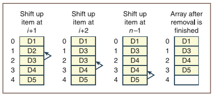
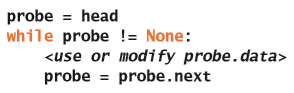
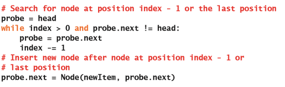
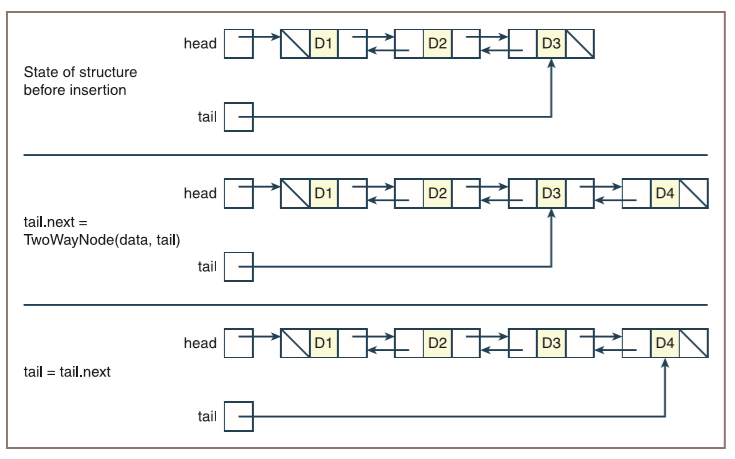

# 数组和链接结构

在完成这一章的学习之后，你就能够：

* 创建数组；
* 对数组执行各种操作；
* 确定数组的相关操作的运行时间和内存的使用情况；
* 基于数组在计算机内存里的不同存储方式，描述数组的相关操作的成本和收益；
* 使用单向链接节点来创建链接结构；
* 对由单向链接节点构成的链接结构执行各种操作；
* 基于链接结构在计算机内存里的不同存储方式，描述链接结构上的相关操作的成本和收益;
* 比较数组和链接结构在运行时间和内存使用上的权衡。

**数据结构**（**data structure**）或**具体数据类型**（**concrete data type**）是指：一组数据的内部存储方式。**数组**（**array**）和**链接结构**（**linked structure**）这两种数据结构是编程语言里多项集最常用的实现。在计算机的内存中，这两种结构类型采用了不同的方法来存储和访问数据，而这也导致了操纵多项集的算法会有不同的时间和空间的权衡。这一章将会研究数组和链接结构所特有的数据组织方式，以及对它们进行操作的具体细节。在后面的章节中，我们将会讨论它们在实现其它各种类型的多项集里的用法。

## 数组数据结构

数组是指：在给定索引位置，可以进行访问和替换的元素序列。你可能会觉得这个描述和Python的列表是一样的。这是因为，Python列表的底层数据结构正是一个数组。然而，尽管Python程序员通常会在需要使用数组的地方用列表来实现，但是Python和其它许多编程语言里在实现多项集的时候多半都使用的是数组。因此，你需要熟悉如何使用数组。

这一章里关于数组的很多内容也同样适用于Python的列表，但是数组的限制要多得多。程序员只能在指定位置访问和替换数组的元素、检查数组的长度、并获取它的字符串表达形式。程序员不能基于位置来添加或删除元素，也不能对数组的长度进行修改。通常来说，数组的长度也就是它的容量，在创建之后就是固定的了。

Python的`array`模块包含一个叫做`array`的类，它的行为非常像列表，但是它能能被用来存储数字。为了方便后面的讨论，你将会定义一个叫做`Array`的新类，这个类会满足前面提到的数组的那些限制，它可以容纳任何类型的元素。好玩的是，对于这个`Array`类，我们将会使用Python的列表来保存它里面的元素。这个类将会定义：允许客户端使用的下标运算符`[]`、`len`函数、`str`函数以及支持数组对象的`for`循环方法。表4-1列出了`Array`里这些操作所对应的方法，左边那一列里的变量`a`代表的是一个`Array`类的对象。

表4-1 数组的操作和`Array`类的方法

| 用户的数组操作 | `Array`类里的方法 |
| --- | --- |
| `a = Array(10)` | `__init__(capacity, fillValue = None)` |
| `len(a)` | `__len__()` |
| `str(a)` | `__str__()` |
| `for item in a:` | `__iter__()` |
| `a[index]` | `__getitem__(index)` |
| `a[index] = newitem` | `__setitem__(index, newItem)` |

当Python遇到了在表4-1左边那一列里的操作的时候，它将会自动调用右边那一列里`Array`对象里的相应方法。比如说，当在`for`循环里遍历`Array`对象的时候，Python就会自动调用`Array`对象里的`__iter__`方法。从表里我们也可以看到，程序员在创建数组的时候也必须对它的容量也就是物理尺寸进行指定。在需要的情况下，可以用`None`来对整个数组进行默认的填充覆盖。

这是`Array`类的代码（在**arrays.py**文件里）：

下面这个Shell的交互展示了数组的用法：

可以看出，数组是一个进行了严格限制的列表。

### 随机访问和连续内存

下标操作或索引操作会让程序员可以非常轻松地在指定位置对元素进行存储或检索。数组的索引操作是非常快的。通过索引对数组的访问是**随机访问**（**random access**）操作，而在随机访问的时候，计算机总会执行常数数量的步骤来获取第$i$个元素的位置。因此，不论数组有多大，访问第一个元素所需的时间和访问最后一个元素所需要的时间都是相同的。

计算机是通过分配一块**连续内存**（**contiguous memory**）单元来存储数组里的元素，从而对数组的随机访问进行支持的。图4-1就展示了这样一块连续内存。

虽然现实情况并不会这样完美，但是为了简便易懂，这个图假定了每个数据元素都只占用一个内存单元。机器地址是8位二进制数。

> 机器地址
>
> 数组的一块连续内存
>
> 数组索引

图4-1 一块连续内存

由于数组里的元素的地址都是按照数字顺序进行排列的，因此可以通过添加两个值来计算出数组元素的机器地址：数组的**基地址**（**base address**）以及元素的**偏移量**（**offset**）。其中，数组的基地址就是它的第一个元素的机器地址；而元素的偏移量就是它的索引值再乘上一个代表数组元素所需要的内存单元数的常量（在Python里，这个值始终是1）。简而言之，Python数组里的索引操作包括下面两个步骤：

1. 得到数组内存块的基地址。

2. 将索引值添加到这个地址并返回。

在这个例子里，数组内存块的基地址是100111012，并且每个元素都需要一个内存单元来存储。那么索引位置2处的数据元素的地址就是210 + 100111012，也就是100111112。

对于随机访问需要注意的非常重要的一点是：计算机不用在数组里去搜索给定的单元，也就是说并不用从数组的第一个单元开始向右逐一移动计数，直至到达第$i$个单元结束。虽然常数时间内可以完成的随机访问应该是数组里效率最高的功能了；但是，实现这个功能要求必须在连续内存块里来存储数组。稍后你就会看到，这样做会让数组在执行其它的一些操作的时候，产生一些额外的成本。

### 静态内存和动态内存

在像是FORTRAN或是Pascal这类比较老的编程语言里，数组是静态数据结构。这种情况下，数组的长度或容量是在编译时就确定了的，因此程序员需要通过一个常量来指定它的大小。而由于程序员在运行时不能改变数组的长度，因此他在编写代码的时候，就需要预测程序里所有的应用将会需要多长的数组内存。如果这个程序总是使用一个已知元素数量并且固定大小的数组的话，那么就没有任何问题。但是在其它情况下，数据元素的数量也会各有不同，那么程序员就只能申请足够多的内存来满足在数组里存储可能发生的最大数量的数据元素的情况。很明显，在程序里这样做会导致浪费大量的内存。而更糟糕的是：当数据元素的数量超过数组的长度时，程序仍然只能返回错误消息。

而像是诸如Java和C++这类的现代编程语言会允许程序员创建**动态数组**（**dynamic array**），从而为这个问题提供了一种补救方法。和静态数组相似的是，动态数组也会占用一块连续内存，并支持随机访问；但是，动态数组的长度只在运行时才会知道。因此，Java或C++程序员可以在动态数组实例化的时候指定它的长度。我们在Python里实现的`Array`类的行为也是这样的。

好在，程序员可以通过另一种方法在运行时根据应用程序的数据要求来调整数组的长度。这时，数组有三种不同形式：

* 在程序启动时创建一个具有合理的默认大小的数组。

* 当数组无法容纳更多数据时，创建一个更大的新数组，并把旧数组里的数据元素传输给它。

* 如果数组在浪费内存（应用程序删除掉了一些数据），用类似的方式减小数组的长度。

很明显，在我们的例子里，这些调整会由Python的列表自动进行。

### 物理尺寸和逻辑尺寸

使用数组时，程序员必须经常区分它的长度也就是物理尺寸以及它的逻辑尺寸。数组的**物理尺寸**（**physical size**）是指数组单元的总数，或者说是用来创建数组时指定它的容量的那个数字；而数组的**逻辑尺寸**（**logical size**）是指：当前应用程序里使用的元素数量。当数组被充满的时候，程序员并不需要担心它们的不同。但是，这种情况并不常见。图4-2展示了三个物理尺寸相同但逻辑尺寸不同的数组，在图里，当前已被数据占用的单元将会被加上阴影。

图4-2 具有不同逻辑尺寸的数组

可以看到，你是可以访问到左边两个数组里包含的**垃圾内容**（**garbage**）的。换句话说，这些内存单元里的数据对当前应用程序是没有用的。因此，程序员在大多数应用程序里都必须要注意对数组的物理尺寸和逻辑尺寸进行追踪。

通常来说，逻辑尺寸和物理尺寸会告诉你有关数组的状态的几个重要意义：

* 如果逻辑尺寸为0，那么数组就为空。也就是，这个数组不包含任何数据元素。

* 否则的话，在任何情况下，数组最后一个元素的索引都是它的逻辑尺寸减1的结果。

* 如果逻辑尺寸等于物理尺寸，那么代表着数组里没有更多的空间存储数据了。

### 练习题

1. 解释随机访问的工作原理，以及这个操作为什么这么快。

2. 数组和Python列表之间有什么区别？

3. 解释数组的物理尺寸和逻辑尺寸之间的差异。

## 数组上的操作

接下来，你将会学习如何实现数组的若干操作。我们的数组类型到目前为止还并没有提供这些操作；因此在程序员使用它之前就必须要先编写它们。在后面的例子里，可以先假定有下面这些数据配置：

可以看到，这个数组的初始逻辑尺寸会是0；而默认的物理尺寸也就是容量是5。对于每个用来操作这个数组的方法来说，你都会读到关于它的实现方式的说明以及相应的带有注释的Python代码片段。同样的，这些操作也会被用来定义那些包含数组的多项集的方法。

### 增加数组的尺寸

当数组的逻辑尺寸等于它的物理尺寸时，如果要插入新的元素，就需要增加数组的尺寸。如果需要为数组提供更多内存的话，Python的`list`类型会在调用`insert`或`append`方法时执行这个调整操作。调整数组尺寸的过程包含三个步骤：

1. 创建一个更大的新数组。

2. 将数据从旧数组复制到新数组。

3. 将指向旧数组的变量指向新数组对象。

下面是这个操作的代码：

可以看到，旧数组所使用的内存被留给了垃圾回收器，并且在这段逻辑里，你还会把数组的长度增加一个内存单元来容纳新元素。那么，请思考下这个逻辑对性能所产生的影响。在调整数组尺寸的时候，复制操作的数量是线性增长的。因此，将$n$个元素添加到数组里的总时间复杂度是$1 + 2 + 3 +...+ n$，也就是$n (n + 1 ) / 2$，因此是$O(n^2)$。

我们可以通过在每次增加数组尺寸的时候，都把数组的尺寸翻倍来得到一个更合理的时间复杂度，就像下面这样：

这个版本的操作的时间复杂度分析将会作为练习留给你。当然，这里对时间复杂度的提升是以耗费一些内存作为代价的。这样做了之后，就让这个操作的总体空间复杂度成为了线性。这是因为，无论你用哪一种策略增加数组尺寸的策略，总是会需要一个数组来存放数据。

### 减小数组的尺寸

当数组的逻辑尺寸减小之后，相应的内存单元就会被浪费着。因此，当删除了某一个元素，并且这时未使用的内存单元数达到或超过了某个阈值（如，数组物理尺寸的四分之三）时，就该减小物理尺寸了。

如果浪费的内存超过特定阈值的话，Python的`list`类型会在调用`pop`方法时执行减小数组物理尺寸的操作。减小数组尺寸的过程与增大数组的过程相反，步骤是这样的：

1. 创建一个新的更小的数组。

2. 将数据从旧数组复制到新数组。

3. 将指向旧数组的变量指向新数组对象。

当数组的逻辑尺寸小于或等于它的物理尺寸的四分之一，并且它的物理尺寸是这个数组建立时的默认容量的至少两倍时，将会启动这个过程的相应代码。这个算法将会把数组的物理尺寸减小到它的一半，并且也不会小于它的默认容量。下面是相应的代码：

可以看到，这个策略会允许缩小后的数组任然浪费一些内存。这样做是为了降低往任何一个方向上继续调整大小的可能性。对收缩操作的时间/空间复杂度的分析将会作为练习留给你。

### 将元素插入到会增长的数组里

把元素插入到数组和替换数组里的元素是不一样的。在执行替换的时候，元素已经在一个给定的索引位置了，因此对这个位置进行简单复制就行了；而且，在这个时候数组的逻辑尺寸并不会改变。但是，在执行插入的时候，程序员必须做这四件事：

1. 就像前面提到过的，在尝试插入元素之前先检查可以使用的空间，根据需要来增加数组的物理尺寸。

2. 将数组里从逻辑结尾到目标索引的所有元素都向后移动。这个过程会在目标索引位置为新元素留下了一个空格。

3. 将新元素分配到目标索引位置。

4. 将逻辑尺寸加一。

图4-3展示了将元素D5插入到一个包含四个元素的数组里位置1所需要的步骤。

>    | 在$n-1$处向后移动元素 | 在$n-2$处向后移动元素 | 在$i$处向后移动元素 | 覆盖位置$1$处的元素 | 插入操作之后的数组 |
>    | --- | --- | --- | --- | --- |

图4-3 将元素插入到数组

可以看到，元素的移动顺序非常重要。如果是从目标索引开始移动元素的话，那么就会丢失掉它后面的两个元素。因此，在把每个元素复制到它后面的内存单元的时候，你必须从数组的逻辑结尾开始再回溯到目标索引的位置。下面是Python的插入操作的代码：

平均情况下，插入操作时移动元素的时间复杂度是线性的，因此插入操作也是线性的。

### 从数组里删除元素

从数组里删除元素的步骤正好和将元素插入到数组相反。下面是它的步骤：

1. 将数组里从目标索引到逻辑结尾的所有元素都向前移动。这个过程会关掉删除目标索引位置的元素所留下的空格。

2. 将逻辑尺寸减一。

3. 检查是否存在内存空间的浪费，并根据需要来减少数组的物理尺寸。

图4-3展示了从一个包含五个元素的数组里将位于位置1的元素删除掉的步骤。

>    | 在$i+1$处向前移动元素 | 在$i+2$处向前移动元素 | 在$n-1$处向前移动元素 | 删除操作之后的数组 |
>    | --- | --- | --- | --- |

图4-4 从数组里删除元素

和插入操作一样，元素的移动顺序非常重要。对于删除操作来说，你会从目标位置后面的那个元素开始，朝向数组的逻辑结尾移动，并把每个元素都复制到它前面的那个内存单元里。下面是Python的删除操作的代码：

同样的，因为移动元素的时间复杂度平均是线性的，所以删除操作的时间复杂度也是线性的。

### 复杂度的权衡：时间、空间和数组

数组结构在运行时性能和内存使用上做出了十分有趣的取舍。表4-2列出了所有的数组操作的运行时间，以及两个额外的运行时间：在数组的逻辑结尾插入和删除元素。

表4-2 数组操作的运行时间

| 操作 | 运行时间 |
| --- | --- |
| 在位置$i$进行访问 | $O(1)$，最好和最坏情况下 |
| 在位置$i$进行更换 | $O(1)$，最好和最坏情况下 |
| 在逻辑结尾进行插入 | $O(1)$，平均情况下 |
| 在位置$i$进行插入 | $O(n)$，平均情况下 |
| 在位置$i$进行删除 | $O(n)$，平均情况下 |
| 增加容量 | $O(n)$，最好和最坏情况下 |
| 减少容量 | $O(n)$，最好和最坏情况下 |
| 从逻辑结尾进行删除 | $O(1)$，平均情况下 |

> 译者注：在原文表格里，最后4行和前面是重复的

可以看到，数组提供了对已经存在的元素进行快速访问的能力，以及可以在逻辑结尾处提供快速的插入和删除操作的能力。然而，对于在任意位置进行插入和删除操作的速度则会降低一个数量级。调整数组的尺寸也需要线性时间，但是由于这个操作会把数组尺寸进行加倍或减半，所以可以最大程度地减少需要执行的次数。

由于偶尔会调整数组的尺寸，因此插入和删除操作在使用内存的时候会是$O(n)$的复杂度。如果你用了前面讨论的方法，那么这就只是在最差情况下的复杂度；而在平均情况下，这些操作的内存使用情况仍然为$O(1)$。

使用数组的时候，内存里唯一真正被浪费掉的成本，是那些尚未被填充满的数组单元格。评估数组内存使用率的一个非常有用的概念是它的**负载因子**（**load factor**）。一个数组的负载因子等同于它所存储的元素数除以数组的容量。比如，当数组已满的时候，负载因子就是1；而当数组为空时，负载因子就是0；当有10个内存单元的数组占用了3个单元时，负载因子就是0.3。当数组的负载因子降到某个阈值（如0.25）以下的时候，就可以通过调整数组尺寸来将浪费掉的内存单元数保持在尽可能小的水平。

### 练习题

1. 说明为什么插入或删除给定元素的时候，必须要对数组里的某些元素进行移动。

2. 当在插入的过程中移动数组元素的时候，哪个元素要先移动？先移动插入位置，还是最后一个元素？为什么？

3. 当插入位置是数组逻辑尺寸时，说明这个操作的运行时复杂度。

4. 假设数组当前包含有14个元素，它的负载因子为0.70。那么它的物理容量是多少？

## 二维数组（网格）

到目前为止，我们讨论的数组只能用来存储简单的元素序列，可以称它为**一维数组**（**one-dimensional array**）。对于许多应用程序来说，**二维数组**（**two-dimensional array**）或者说叫做**网格**（**grid**）会非常有用。比如，一个包含数字的表格可以被实现为一个二维数组。图4-5就展示了具有四行五列的一个网格。

图4-5 具有四行五列的二维数组（网格）

假设这个网格叫做`grid`。要访问`grid`里的元素，可以通过两个下标来指定它的行和列的相应位置；并且这两个索引都是从0开始的：

在这一节里，你将会学习到如何创建和使用简单的二维数组（网格）。例子里的这些网格都会是矩形的，并且有固定的尺寸。

### 使用网格

除了用双下标之外，网格还必须要有两个分别用来返回行数和列数的方法。为了便于讨论，我们把这些方法分别命名为`getHeight`和`getWidth`。用来操作一维数组的方法可以很容易地扩展到网格里来使用。比如，下面这个代码片段会计算变量`grid`里所有数字的总和。外部循环会迭代四次并向下逐行移动；而在每次进入到外部循环里的时候，内部循环都会迭代五次，从而在不同的行里的列之间进行移动。

在这里，通过使用`getHeight`和`getWidth`方法而不是具体的数字4和5，所以这段代码可以被用在任何尺寸的网格上。

### 创建并初始化网格

假设存在一个叫做`Grid`的二维数组的类。要创建一个`Grid`对象，可以允许包含三个参数的`Grid`构造函数：它的高度、宽度以及初始的填充值。下面这个交互，实例化了一个具有4行5列并且填充值为0的`Grid`对象，然后将这个对象打印了出来：

在创建网格之后，可以把它的内存单元重新设置为任何的值。下面这个代码片段将会遍历这个网格，从而将它的内存单元设置成图4-5里的情况：

### 定义`Grid`类

`Grid`类有点像前面介绍过的`Array`类。用户还可以通过运行方法来得到它的行数和列数，并得到它的字符串表达形式。但是，它并不会提供迭代器。通过数组的数组可以很方便地用来存储网格：顶层数组的长度将会等于网格里的行数；而顶层数组里的每个内存单元也会是一个数组，这个数组的长度是网格里的列数。并且在这个子数组里将会包含给定的行里的相应的数据。为了支持客户端能够使用双下标，你只需要提供`__getitem__`方法就可以了。下面是`Grid`类的代码（在**grid.py**文件里）：

### 参差不齐的网格和多维数组

到目前为止，这一节里讨论的网格都是二维并且是矩形的。其实，你还可以把网格创建成参差不齐的样子，也可以创建高于两个维度的网格。

参差不齐的网格会有固定的行数，但是每一行里的数据列数会各有不同。列表或是数组的数组是合适的可以用来实现这种网格的结构。

如果需要的话，可以在定义一个网格的时候就把维度传递给它。这个时候，唯一的限制就只会是计算机的内存容量了。比如，你可以把一个三维数组当作一个盒子，它里面装满了整齐地排列在行和列里的更小的盒子。创建这个数组的时候会需要指定它的深度、高度以及宽度。因此我们可以给数组类型添加一个叫做`getDepth`的方法，从而可以像`getWidth`和`getHeight`方法一样再得到一个维度的相关数据。在这个实现里，每个元素都可以通过三个整数来作为索引从而被访问到，也可以通过有三层循环的控制语句结构来对它进行使用。

### 练习题

1. 什么是二维数组（网格）？

2. 描述一个可能会用到二维数组的应用程序。

3. 编写这样一段代码：这个代码片段可以在`Grid`对象里搜索一个负整数。循环体应该在遇到网格里的第一个负整数的地方终止，这时变量`row`和`column`应该被设置为这个负数的位置；并且在网格里如果找不到负数的话，那么变量`row`和`column`应该等于网格的行数和列数。

4. 说说运行下面这个代码片段之后，网格里的内容是什么：

    

5. 编写一段代码来创建出一个参差不齐的网格，它的行将分别用来存储三个、六个和九个元素。

6. 提供一个把`Grid`类用作数据结构来实现三维`array`类的策略。

7. 编写这样一段代码：这个代码片段会把三维数组里每个单元的值都初始化为它的三个索引值。例如，如果位置是（深度、行、列）的话，对于位置（2、3、3）来说，它的值就是233。

8. 编写这样一段代码：这个代码片段可以用来显示出三维数组里的所有元素。打印出的每一行数据都应该是代表给定的行和列里的所有元素，而深度将会从第一个位置向后递归到最后一个位置。遍历应该从第一行、第一列以及第一个深度的位置开始，依次遍历所有的深度、列和行。

## 链接结构

除了数组，链接结构也是一个在程序里常用的数据结构。和数组类似，链接结构也是一种具体的数据类型，它也可以用来实现若干种类型的多项集，其中也包括列表。本书稍后的部分将会对如何在多项集（如，列表和二叉树）里使用链接结构进行更深入的探讨。而在这一节里，我们将会了解到程序员在使用链接结构实现任何类型的多项集时，所必须要知道的几个特征。

### 单向链接结构和双向链接结构

顾名思义，链接结构会由可以链接到其它节点的节点组成。尽管节点之间可能会有许多链接，但是两个最简单的链接结构是：**单向链接结构**（**singly linked structure**）和**双向链接结构**（**doubly linked structure**）。

通过框和指针符号可以绘制出非常有用的链接结构的辅助图例。图4-6就用了这些符号来展示出上面提到的两种链接结构的例子。

> 一个单向链接结构
>
> 一个双向链接结构

图4-6 两种类型的链接结构

要使用单向链接结构的客户端会通过一个额外的**头部链接**（**head link**）来访问第一个节点。接下来，客户端就可以继续通过这个节点里发出的链接（由图里的箭头表示）来访问其它节点了。因此，在单向链接结构里，我们可以很容易地获得节点的后继，但不那么容易获得节点的前序。

双向链接结构会包含双向的链接。因此，客户端可以很轻松地移动到节点的后继或是它的前序。这个时候，会用到第二个额外的链接，它被称为**尾部链接**（**tail link**），它能够让双向链接结构的客户端直接访问到最后一个节点。

两种链接结构里的最后一个节点都没有指向到后续节点的链接。在图里，我们通过斜杠来代替箭头从而表示没有链接，我们把它叫做**空链接**（**empty link**）。还有一点需要注意，双向链接结构里第一个节点也是没有指向到前序节点的链接。

和数组一样，这些链接结构也可以被用来存储元素的线性序列。但是，使用链接结构的程序员是没法通过指定元素的索引位置来直接访问到这个元素的。在这种情况下，程序员必须从数据结构的一个顶端开始，然后按照链接进行访问，直至到达所需的位置（或找到期望的元素）为止。链接结构的这种性质对于不少操作都有显著的影响，这部分内容将在稍后讨论。

为链接结构分配内存的方式与为数组分配内存的方式是完全不同的，而且，对于插入和删除操作来说，有两个显著影响：

* 在找到插入或删除点之后，可以在不移动内存里的数据元素的情况下进行插入或删除操作。

* 可以在每次插入或删除期间自动调整链接结构的大小，而不需要再去花费额外的内存空间，也不需要去复制数据元素。

接下来你将会学习到：是什么样的底层内存，才能支持链接结构拥有这些优点。

### 非连续内存和节点

回想一下，数组里的元素必须要存储在一段连续的内存中。这也就意味着数组里的各个元素的逻辑顺序是和它们在内存单元的物理顺序是紧密耦合的。相比而言，链接结构会把结构里各个元素的逻辑顺序和它们在内存里顺序进行解耦。也就是说，要在内存的某个位置上找到链接结构里特定元素的内存单元，只需要满足让计算机能够跟随指向这个元素的地址或位置的链接就行了。这样一种使用内存来进行存储的方案被称为**非连续内存**（**noncontiguous memory**）。

链接结构里用来进行存储的基本单位是**节点**（**node**）。其中**单向链接节点**（**singly linked node**）会包含下面这些组件或字段：

* 数据元素

* 指向结构里下一个节点的链接

对于**双向链接节点**（**doubly linked node**）来说，除了这些组件之外，它还会包含一个用来指向结构里前一个节点的链接。

图4-7展示了内部链接为空的单向链接节点和双向链接节点。

图4-7 链接为空的两种节点类型

根据编程语言的不同，程序员可以通过下面几种方法来让节点利用上非连续内存：

* 像在FORTRAN这样的早期语言里，它们唯一的内置数据结构就是数组。在这种情况下，程序员可以通过用两个并排的数组，来为单向链接结构实现使用非连续内存的节点。这两个数组里的第一个数组会包含数据元素；第二个数组则会包含数据数组里当前节点所对应的后续节点的索引位置。因此，随着链接访问在这里也就代表着：用第一个数组里的数据元素的索引来访问第二个数组里的值，然后再把这个值作为第一个数组里的下一个数据元素的索引来使用。在这里，空链接会用值-1来表示。图4-8展示了一个链接结构以及它的数组存储方式。可以看到，这样做可以有效地将链接结构里的数据元素的逻辑位置和它在数组里的物理位置进行分离。

    

    图4-8 通过数组来表示链接结构
 
* 在更现代的语言里，比如说：Pascal和C++，程序员可以通过访问**指针**（**pointer**）来得到所需的数据地址。在这些更现代的语言里，单向链接结构里的节点会包含一个数据元素和一个指针值。对于空链接来说，它的指针值会用特殊值`null`（或`nil`）来表示。这样，程序员就不用通过数组来设置非连续内存了，而只需要向计算机请求一个，从被称为**对象堆**（**object heap**）的非连续内存的内置区域得到的新节点的指针就行了。然后，程序员可以把这个节点里的指针设置为指向另一个节点，从而建立到这个链接结构里其它数据的链接。通过显式地使用指针和内置堆，可以得到比FORTRAN这样的语言更好的解决方案，是因为程序员不再需要去为管理非连续内存的底层数组存储方式进行负责。（毕竟，任何计算机的内存（RAM）也就只是一个大数组而已。）但是，Pascal和C++还是需要程序员来管理堆，因此程序员必须要通过特殊的`dispose`或`delete`操作来把不再使用的节点返回给堆。

* Python程序员通过使用对对象的**引用**（**reference**）来设置节点和链接结构。在Python里，任何变量都是可以被用来引用为任何数据的。这也包括值`None`，它可以被用来代表空链接。因此，Python程序员会通过定义包含两个字段的对象来定义单向链接节点——对数据元素的引用和对另一个节点的引用。Python为每个新的节点对象提供了从非连续内存里获得的动态分配，并且当应用程序不再引用这个对象的时候，它会自动把这部分内存返回给系统（垃圾回收）。

在接下来的讨论里，术语：链接、指针和引用是可以相互替换的。

### 定义单向链接节点类

节点类非常的简单。因为节点对象的灵活性和易用性非常重要；因此通常会用实例变量而不是方法来对节点对象进行引用；并且构造函数也需要能够让用户在创建节点时可以设置节点的链接。前面提到过，单向链接节点只会包含数据元素和对下一个节点的引用，下面是简单的用来实现单向链接节点类的代码：

### 使用单向链接节点类

节点变量会被初始化为`None`或是一个新的`Node`对象。下面这个代码片段展示了这两者的不同：

图4-9展示了运行这个代码后，这三个变量的状态：

图4-9 三个外部链接

可以从图里看到下面几点：

* `node1`还没有指向任何节点对象（是`None`）。

* `node2`和`node3`都指向了链接的对象。

* `node2`指向了一个指针是`None`的对象。

接下来，假设你要运行下面这个语句来试图把第一个节点放置在已经包含了`node2`和`node3`的链接结构的开头：

这时，Python会引发`AttributeError`异常。这是因为，变量`node1`的值是`None`，所以它并不包含用来引用节点对象的`next`字段。而要创建所期望的链接，你可以运行：

或者：

通常来说，你可以在尝试访问它的字段之前，通过先检查给定的节点变量是不是`None`来避免这个异常的发生：

和数组一样，链接结构也可以通过循环来使用。你可以用循环来创建一个链接结构并访问它的每个节点。下面这个测试脚本将会使用`Node`类，来创建出一个单向链接结构并打印出它的内容：

从代码里，我们可以看到这个程序有：

* 一个叫做`head`的指针，它被用来生成整个链接结构。这个指针的用法是，所有新插入的元素都始终位于链接结构的开头。

* 在显示出数据的时候，它们会以和插入时相反的顺序出现。

* 同样的，当显示数据时，标头指针将会被重置到下一个节点，直到标头指针变为`None`为止。因此，在这个过程结束之后，就可以把链接结构里所有节点都删除掉了。这些节点在程序里不再可用，并且，它们会在下一次垃圾回收期间被回收。

### 练习题

1. 用方框和指针来绘制出测试程序里第一个循环所创建出的节点的图片。

2. 当节点变量引用的是`None`时，如果程序员尝试访问节点的数据字段会发生什么？你应该如何防范？

3. 编写这样一段代码：这个代码片段会把一个满数组里的元素都改为单向链接结构里的数据。这个操作应该要能够保留元素的顺序。

## 单向链接结构上的操作

数组上几乎所有的操作都是基于索引的，这是因为索引是数组结构的组成部分。而对于链接结构来说，程序员必须通过操纵结构里的链接来模拟这些基于索引的操作。这一节将会探讨如何在常见的操作（如：遍历、插入和删除）里执行这些对链接的修改。

### 遍历

在测试程序的第二个循环里，节点会在被打印之后从链接结构里删除掉。但是，对于许多的应用程序来说，会只需要访问每个节点而不用删除它们。这个操作就被称为**遍历**（**traversal**），它会使用一个叫做`probe`的临时指针变量。一开始的时候，这个变量将会被初始化为链接结构的`head`指针，然后通过循环来完成，就像下面这样：

图4-10展示了每次进行循环时，指针变量`probe`和`head`的位置。可以看到，在整个过程结束之后，`probe`指针会是`None`，但`head`指针仍然引用着第一个节点。

> 第一次循环开始的时候：会访问节点D1
>
> 第二次循环开始的时候：会访问节点D2
>
> 第三次循环开始的时候：会访问节点D3
>
> 第三次循环结束的时候：`probe`指针会是`None`，循环结束

图4-10 遍历链接结构

通常来说，单向链接结构的遍历会访问所有的节点，并且在到达空链接时终止遍历。因此，值`None`就相当于是停止进程的*哨兵*（*Sentinel*）。

遍历的时间复杂度是线性的，也不需要额外的内存。

### 搜索

第3章“搜索、排序以及复杂度分析”里讨论过了在列表里对指定元素进行的顺序搜索。对链接结构进行顺序搜索有点类似于遍历操作，因为你必须要从第一个节点开始并依照链接移动，直至找到对应的标记。然而，在这种情况下这个标记有两个可能性：

* 空链接，说明没有更多的需要被检查的数据元素；

* 等同于目标元素的数据元素，代表搜索成功。

下面是搜索给定元素的代码：

平均情况下，很明显顺序搜索在单向链接结构上是线性的。

遗憾的是，访问链接结构的第$i$个元素也是执行了顺序搜索的操作。这是因为你必须从第一个节点开始，统计链接的数量，直至到达第$i$个节点为止。假设有$0 <= i < n$，其中$n$是链接结构里的节点数，那么下面就是访问第$i$个元素的代码：

和数组不同的是，链接结构并不支持随机访问。因此，你不能像在有序数组里那样，对有序的单向链接结构进行高效地搜索。但是，就像你马上要在本书后面的部分所看到的那样，还是有一些方法可以通过在其它类型的链接结构里组织数据，来弥补这一缺陷的。

### 替换

单向链接结构里的替换操作也会采用遍历的模式，你将会在链接结构里搜索给定的元素或给定的位置，然后用一个新的元素来替换这个元素。在替换给定的元素的时候，并不需要假定目标元素已经存在于链接结构里。如果目标元素不存在的话，那么就不会发生任何替换操作，并且操作会返回`False`；如果目标存在的话，那么新的元素就会替换掉它，并且操作会返回`True`。下面是这个操作的代码：

假设有$0 <= i < n$，那么要替换第$i$个元素的操作的代码就是：

这两个替换操作在平均情况下都是线性的。

### 在开始处插入

现在，你可能会想要知道链接结构上有没有好于线性复杂度的操作。实际上，还真的有几种。在某些情况下，这些操作如果用在链接结构上的性能会好于数组。第一种情况就是在结构的开头插入元素。这也就是在上一节的测试程序里被反复执行的操作。它的代码是这样的：

图4-11展示了这个操作在两种不同情况下的状态。可以看到`head`指针在第一种情况下是`None`，因此这个操作会把第一个元素插入到结构里去；而在第二种情况下，第二个元素会被插入到这个结构的开头。

> 第一种情况：`head`指针是`None`
>
> 初始化`head`指针
>
> `head = Node(newItem, head)`
>
> 第二种情况：`head`指针不为`None`
>
> 初始化`head`指针
>
> `head = Node(newItem, head)`

图4-11 在链接结构的开头插入元素的两种情况

可以看到，在已经有数据的情况下，并不需要通过复制数据来让它们向后移动，也不会需要额外的内存。这也就意味着在链接结构的开头处插入数据只会用到常数时间和内存，这是和对数组的相同操作不一样的。

### 在结尾处插入

在数组的结尾处插入元素（通过Python列表的`append`操作实现）的时候，如果不用调整数组的尺寸的话，会需要常数时间和内存。而对于单向链接结构，这个过程需要考虑两种情况：

* 当`head`指针是`None`时，标头指针会被设置为新节点。

* 当`head`指针不是`None`时，这个代码将会找到最后一个节点，并把它指向后面的指针指向新节点。

因此在有数据的情况下，你会用到遍历模式。它的代码是这样的：

图4-12展示了在包含三个元素的链接结构的结尾处插入新元素的过程。这个操作的时间复杂度是线性的，而内存复杂度是常数。

> （移动`probe`到`probe.next`。）
>
> （移动`probe`到`probe.next`。）
>
> （停止循环。）
>
> （链接上新的节点。）

图4-12 在链接结构的末尾插入元素

### 在开始处删除

在上一节的测试程序里，你反复执行了从链接结构的开头处删除元素的操作。在执行这类操作的时候，通常都会假定结构里至少存在有一个节点。这个操作将会返回被删除的元素。它的代码是这样的：

图4-13展示了第一个节点是怎么被删除的。

> 初始化标头节点
>
> `head = head.next`
>
> （断开第一个节点）
>
> 垃圾回收会把这个节点返回给系统堆

图4-13 删除链接结构开头处的元素

可以看到，这个操作会用到常数时间和内存，这与在数组上执行相同的操作所不同的。

### 在结尾处删除

删除位于数组末尾的元素（通过Python列表的`pop`方法实现）的时候，除非要对数组尺寸进行调整，不然通常只会用到常数时间和内存。单向链接结构的这个操作会假定在结构里至少有一个节点，这样的话，有两种情况需要考虑：

* 只有一个节点。因此只需要把`head`指针设置为`None`。

* 最后一个节点之前有另一个节点。这时相应的代码将会找到这个倒数第二的节点，并把它指向后面的指针设置为`None`。

无论是哪种情况，代码都会返回这个被删除的节点里包含的数据元素。它的代码是这样的：

图4-14展示了在一个包含三个元素的链接结构里删除最后一个节点的过程。

> `probe.next.nect != None`
>
> （将`probe`指向`probe.next`）
>
> `probe.next.nect == None`
>
> （停止循环）
>
> `probe.next = None`
>
> （断开最后一个节点）
>
> 垃圾回收会把这个节点返回给系统堆

图4-14 删除链接结构结尾处的元素

这个操作会用到常数时间和内存。

### 在任意位置处插入

在数组的第$i$个位置插入元素，需要把从位置$i$到位置$n – 1$的元素都向后移动。因此，实际上你是把这个元素插入到了位置$i$的元素之前，从而让新的元素占据了位置$i$，之前的元素则会位于位置$i + 1$。而对于空数组或是索引值大于$n – 1$的情况下进行插入的话，会是什么样子呢？如果数组为空，那么新元素就会位于开头；而如果索引大于或等于$n$的话，则新元素会位于结尾。

在链接结构的第$i$个位置插入元素也需要处理相同的情况。在开头插入的话，可以用前面提到过的代码。但是，在其它的位置$i$要进行插入的话，插入操作必须要先找到位置$i – 1$（如果$i < n$）或$n – 1$（如果$i >= n$）处的节点。这样，就有两种情况需要考虑：

* 这个节点指向后面的指针是`None`。这也就意味着$i >= n$，因此你应该把新的元素放置在链接结构的末尾。

* 这个节点指向后面的指针不是`None`。这也就意味着$0 < i < n$，因此你应该把这个新元素放置在位置$i – 1$的节点和位置$i$的节点之间。

和搜索第$i$个元素一样，插入操作也必须对节点进行计数，从而找到所需到达的位置。但是，由于给定的目标索引可能会大于或等于总节点数，因此必须要设法避免在搜索的过程中超出了链接结构的末尾的情况发生。因此，这个循环还需要另一个条件，用来检测当前节点指向后面的指针，从而知道是不是已经到了末尾的节点。这段的代码是这样的：

图4-15展示了在包含三个元素的链接结构里，在位置2处插入元素的过程。

> `index > 1`且`probe.next != None`
>
> （将`probe`指向`probe.next`，并且将`index`自减）
>
> `index == 1`
>
> （停止循环）
>
> `probe.next = Node(newItem, probe.next)`
>
> （链接上新节点）

图4-15 在链接结构的两个元素之间插入一个元素

> 译者注：原文中`probe.next == Node(newItem, probe.next)`里的`==`符号是错误的，应该是`=`

和通过遍历来实现的其它单向链接结构操作一样，这个操作会用到线性时间。但是，它的内存使用量是常数的。

在链接结构里把指定元素插入到某个元素之前，也会用到这个逻辑。这个操作将会作为练习留给你。

### 在任意位置处删除

从链接结构里删除第$i$个元素有下面三种情况需要被考虑：

* $i < 0$——通过代码来删除第一个节点。

* $0 < i < n$——像插入操作那样，找到位置$i - 1$处的节点，然后删除它的后一个节点。

* $i >= n$——删除最后一个节点。

假设，在链接结构里至少有一个节点。这个操作的逻辑和插入操作的逻辑是类似的，因此你也必须要避免在搜索的过程中超出了链接结构的末尾。但是在这个过程中，你还是需要能够让`probe`指针可以访问到结构末尾前的倒数第二个节点处。它的代码是这样的：

图4-16展示了在包含四个元素的链接结构里删除位置2处的元素的过程。

> `index > 1`且`probe.next.next != None`
>
> （将`probe`指向`probe.next`，并且将`index`自减）
>
> `index == 1`
>
> （停止循环）
>
> `probe.next = probe.next.next`
>
> （断开这个节点）
>
> 垃圾回收会把这个节点返回给系统堆

图4-16 删除链接结构里两个元素之间的元素

### 复杂度的权衡：时间、空间和单向链接结构

单向链接结构和数组相比展现出了对空间/时间进行的不同的权衡。表4-3给出了它的各项操作的运行时间。

表4-3 单向链接结构的运行时间

| 操作 | 运行时间 |
| --- | --- |
| 在位置$i$进行访问 | $O(n)$，平均情况下 |
| 在位置$i$进行更换 | $O(n)$，平均情况下 |
| 在逻辑开头进行插入 | $O(1)$，最好和最坏情况下 |
| 在逻辑开头进行删除 | $O(1)$，最好和最坏情况下 |
| 在位置$i$进行插入 | $O(n)$，平均情况下 |
| 在位置$i$进行删除 | $O(n)$，平均情况下 |

我们可以从这个汇总里看到：只有在连接结构里插入第一个元素和删除第一个元素这两个操作在时间上不是线性的。你可能会想，如果这么多链接结构的操作都是线性的，那为什么还要使用链接结构而不直接使用数组呢？让我们先假设你要实现一个只会插入、访问以及删除第一个元素的多项集，这样的一个多项集你将会在第7章“堆栈”里看到。当然，你也可以通过在数组里插入或删除最后一个元素来实现，这样它也会有类似的时间复杂度。在第10章“树”里，你还会看到能够在对数时间里进行插入和搜索的链接结构。

与数组相比，单向链接结构的主要优势并不在于时间复杂度而在于内存性能。调整数组尺寸（在需要执行的时候执行）在时间和内存上都是线性的；而调整链接结构的大小（会在插入或删除时发生）在时间和内存上则都是常数复杂度。而且，在链接结构里，不会存在内存的浪费，因为这个结构的物理尺寸永远都不会超过逻辑尺寸。当然，链接结构也确实会产生一些额外的内存开销，这是因为单向链接结构必须要有额外的$n$个内存单元来存储指针。而对于双向链接结构来说，它的节点里包含有两个链接，因此内存的成本会更高一些。

程序员在了解了这个分析之后，就可以选择最适合需求的实现了。

### 练习题

1. 假设已经找到了将会从单向链接结构里删除元素的位置。尝试说明从这个时候开始完成删除操作的运行时复杂度。

2. 可不可以对单向链接结构里按顺序进行排列的元素执行二分搜索？如果不行，为什么？

3. 尝试说明为什么Python列表会通过数组而不是链接结构来保存它的元素。

## 链接上的变化

这一节将会介绍两种带有额外指针的链接结构，这些指针会被用来提高性能以及简化代码。

### 具有虚拟头节点的环形链接结构

在第一个节点位置处插入和删除是对单向链接结构在任意位置进行插入和删除操作的特殊情况，它之所以特殊，是因为这个时候必须要重置`head`指针。你可以通过**环状链接结构**（**circular linked structure**）和**虚拟头节点**（**dummy header node**）的使用来简化这两个操作。环状链接结构包含了从最后一个节点到第一个节点的链接，并且它的实现里至少会包含一个节点。这个节点（虚拟头节点）不包含任何数据，但会被用来作为链接结构的开始和结束的标记。在一开始的空链接结构里，`head`变量会指向虚拟头节点，而虚拟头节点指向后面的指针会指向虚拟头节点本身，就像图4-17这样。

图4-17 有虚拟头节点的空的环状链接结构

第一个包含数据的节点会处于虚拟头节点之后。并且这个节点指向后面的指针会像一个环一样，指向虚拟头节点，像图4-18这样。

图4-18 插入第一个节点后的环状链接结构

对第$i$个节点的查找会从虚拟头节点后的节点开始。假设空链接结构的初始化是这样的：

那么在这种新的连接结构里在第$i$个位置进行插入操作的代码是：

这个实现的优点是，插入和删除操作只需要考虑一种情况——新的会位于$i$位置的节点应该在它当前的第$i$个节点以及这个节点前面的节点之间。当这个第$i$个节点指的是第一个节点时，它前面的节点就应该是标头节点；而当$i >= n$时，最后一个节点会是它前面的节点，标头节点是它后面的节点。

### 双向链接结构

双向链接结构包含着单向链接结构的优点。并且还可以让用户执行这些操作：

* 从给定节点上向前移动到上一个节点。

* 直接移动到最后一个节点。

图4-19展示了包含三个节点的双向链接结构。可以看到，每个节点都包含有两个指针，通常被称为`next`和`previous`。同时，还可以从图里看到存在另一个额外的`tail`指针，它能够让用户直接访问到结构里的最后一个节点。

图4-19 具有三个节点的双向链接结构

要在Python里实现使用双向链接结构的节点类，只需要扩展前面讨论过的`Node`类添加一个新的叫做`previous`的指针字段就行了。下面是这两个类的代码：

下面这个测试程序，通过在结构末尾处添加元素来创建双向链接结构；然后，这个程序会显示出链接结构里从最后一个元素开始到第一个元素数据内容：

思考下在程序的第一个循环里的这两条语句：

这两条语句是为了在链接结构的末尾插入一个新元素。在假设链接结构里至少有一个节点，并且尾指针始终指向非空链接结构里的最后一个节点的话。你需要按照下面这个顺序来操作三个指针：

1. 新节点指向前面的指针应该指向当前的尾节点。我们通过把`tail`作为第二个参数传递给节点的构造函数来实现。

2. 当前尾节点指向后面的指针必须对准新节点。第一个赋值语句完成了这个步骤。

3. 尾指针指向新的节点。第二个赋值语句完成了这个步骤。

图4-20展示了在双向链接结构末尾插入新节点的过程。

> 插入操作之前的连接结构
>
> `tail.next = TwoWayNode(data, tail)`
>
> `tail = tail.next`

图4-20 在双向链接结构的末尾插入元素

可以看出来，要在双向链接结构的中间插入元素会需要改变更多的指针。但是，无论目标位置在哪里，需要被更新的指针数量始终都是常量。

和单向链接结构一样，双向链接结构的通用插入和删除操作也有两个特殊情况。你可以通过使用带有虚拟头节点的环状链接结构来简化这些操作。它会在之后作为练习留给你。

除了在结构的末尾进行插入和删除外，双向链接结构上的操作的运行时复杂度和单向链接结构上的相应操作是相同的。但是，双向链接结构的额外指针会需要额外的线性数量的内存来储存。

链接结构的另一个变体是将双向链接结构和虚拟头节点结合在一起。在第9章“列表”里通过这种方法实现了链表。

### 练习题

1. 包含虚拟头节点的环状链接结构对程序员而言有什么好处？

2. 和单向链接结构相比，描述双向链接结构所带来的一种好处和一个额外开销。

## 章节总结

* 数据结构是一个用来代表多项集里所包含的数据的对象。

* 数组是一种支持在常数时间内对位置逐项随机访问的数据结构。在创建数组时，会为它分配若干个用来存放数据的内存空间，并且数组的长度将会保持固定。插入和删除操作需要对数据元素进行移动，并且可能需要创建一个新的、更大或更小的数组。

* 二维数组里的每个数据值都位于矩形网格的行和列上。

* 链接结构是由零个或多个节点组成的数据结构。每个节点都包含一个数据元素和一个或多个指向其它节点的链接。

* 单向链接结构的节点包含数据元素和到下一个节点的链接。双向链接结构里的节点还会包含一个到它前面的节点的链接。

* 在链接结构里进行插入或删除操作不需要移动数据元素。每次最多只会创建一个节点。但是，链接结构里的插入、删除和访问操作都需要线性时间。

* 在链接结构里使用标头节点可以简化某些操作，如添加或删除元素。

## 复习题

1. 数组和链接结构都是：

    a) 抽象数据类型（ADT）

    b) 数据结构

2. 数组的长度：

    a) 在创建之后大小是固定的

    b) 在创建之后大小可以增加或减少

3. 在数组里进行随机访问能够在：

    a) 常数时间里访问到数据

    b) 线性时间里访问到数据

    > 译者注：这道题原文没有说是数组还是连接结构，因此没法做出合理的选择，在这里使用数组作为问题

4. 单向链接结构里的数据包含在什么里：

    a) 单元

    b) 节点

5. 对单向链接结构的大多数操作都需要：

    a) 常数时间

    b) 线性时间

6. 从什么类型的`a(n)`里删除第一个元素需要常数时间：

    a) 数组

    b) 单向链接结构

7. 在下面哪种情况下，数组里使用的内存会少于单向链接结构：

    a) 不到一半的位置被放置了数据

    b) 一半以上的位置被放置了数据

8. 当数组的内存不足以保存数据时，最好创建一个新的数组，这个新数组应该：

    a) 大小比旧数组多一

    b) 大小是旧数组的两倍

9. 对于单向链接结构，当你在什么地方进行插入操作是会得到最坏情况下的运行时间：

    a) 在结构的开头

    b) 在结构的末尾

10. 双向链接结构让程序员可以在节点移动：

    a) 到给定节点的后一个节点或前一个节点

    b) 只能到给定节点的后一个节点

## 编程项目

在前六个项目里，你将会修改在这一章里定义的`Array`类，从而让它更像Python的`list`类。对于这些项目的答案，请包含你对`Array`类所做修改的代码的测试。

1. 为`Array`类添加一个实例变量`logicalSize`。这个变量的初始值为`0`，它被用来追踪数组里当前已经包含了的元素数量。

    然后为`Array`类添加`size()`方法。这个方法被用来返回数组的逻辑尺寸。`__len__`方法依然会返回数组的容量，也就是它的物理尺寸。

2. 为`Array`类的`__getitem__`和`__setitem__`方法添加先验条件。它们的先验条件是$0 <= index < size()$。如果先验条件不被满足，就应该引发异常。

3. 将`grow`和`shrink`方法添加到`Array`类。它们能够基于在这一章里所讨论的策略来增加或减少数组里所包含的列表的长度。在实现的时候，要保证数组的物理尺寸不会被缩小到用户所指定的容量之下；并且在增加数组尺寸时，数组的内存单元将会被默认填充值填充。

4. 将方法`insert`和`pop`添加到`Array`类中。它们能够基于这一章里已经讨论过的策略，在需要的时候对数组的长度进行调整。`insert`方法会接收一个位置和一个元素值来作为参数，然后把这个元素插入到指定的位置。如果位置大于或等于数组的逻辑尺寸，那么这个方法会把元素插入到数组里当前包含的最后一个元素之后。`pop`方法会接受一个位置来作为参数，然后删除并返回这个位置的元素。`pop`方法的先验条件是$0 <= index < size()$。`pop`方法还应该把腾出来的数组内存单元重置为填充值。

    > 译者注：最后一句话，原文用的是`remove`方法，这个方法在这一章里没有出现过，且与上下文无关，故改为`pop`方法。

5. 将方法`__eq__`添加到`Array`类。当`Array`对象作为`==`运算符的左操作数时，Python会运行这个方法。如果这个方法的参数也是一个`Array`对象，并且它的逻辑尺寸和左操作数相同，并且两个数组里的每个*逻辑*位置的元素都相等，那么这个方法会返回`True`；不然的话，这个方法返回`False`。

6. Jill告诉Jack，为了让`Array`类和列表一样，他应该删除掉`__iter__`方法的当前实现。请解释这为什么是一个好建议。并说明在这个情况下应该对`__str__`方法进行怎样的修改。

7. `Matrix`类可以用来执行线性代数里的某些运算，比如矩阵算术。开发一个使用内置运算符进行算术运算的`Matrix`类。这个`Matrix`类应扩展自`Grid`类。

接下来的四个项目：要求你定义一些用来操作链接结构的函数。在解答的过程中，你应该继续使用这一章里定义的`Node`和`TwoWayNode`类。创建一个测试模块，来包含你的函数定义和用来测试它们的代码。

> 译者注：原文这一段的排版应该左对齐，不包含缩进。

8. 定义一个叫做`lenght`的函数（*不是*`len`）。这个函数会把一个单向链接结构作为参数，并能够返回出结构里的元素数量。

9. 定义一个叫做`insert`的函数，这个函数具有把元素插入到单向链接结构里的指定位置的功能。这个函数有三个参数：元素、位置以及一个链接结构（这个连接结构可能为空）。这个函数能够返回被修改之后的链接结构。如果传递的位置大于或等于链接结构的长度，那么这个函数会把元素插入到它的末端。这个函数的调用示例是`head = insert(1, data, head)`，其中`head`是一个变量，这个变量要么为空链接，要么指向链接结构的第一个节点。

10. 定义一个叫做`pop`的函数，这个函数能够在单向链接结构里的指定位置删除元素。这个函数的第一个参数是位置，它的先验条件是$0 <= position < 结构的长度$。它的第二个参数是一个链接结构，很明显它不应该为空。这个函数将会返回一个元组，它包含修改后的链接结构和那个被删除掉的元素。它的调用示例是`(head, item) = pop(1, head)`。

11. 定义一个函数`makeTwoWay`。这个函数会把一个单向链接结构作为参数，然后生成并返回一个包含单向链接结构里的元素的双向链接结构。（*注意*：这个函数不应该对作为参数的链接结构进行任何修改。）
