# 接口、实现和多态

在完成这一章的学习之后，你就能够：

* 为给定的多项集类型开发接口；
* 实现满足多项集类型接口的多个类；
* 评估给定的多项集类型在不同实现上对运行时间和内存使用情况的权衡；
* 实现一个简单的迭代器；
* 通过方法来对背包和集合进行操作；
* 判断背包或集合是否适合在给定的应用程序里使用；
* 将背包的实现转换成有序背包的实现。

为了让各种设备能够连接到计算机，于是我们有了通用串行总线（USB）这样一个标准**接口**（**interface**）。因此通过标准USB电缆，你就可以把计算机连接到数码相机、智能手机、打印机、扫描仪、外部存储磁盘以及许多其它设备上。通用闪存盘都带有集成的USB连接器。

接口在软件里和在硬件里一样，应用得非常广泛。被精心设计过的软件的标志之一就是：它的接口与实现有清晰的分离。当程序员使用软件资源时，他们只需要关心接口里提供的：方法、函数以及数据类型名称就行了。在理想情况下，如何去实现这些资源的详细信息（底层的算法代码和数据结构）都会被隐藏或封装在**抽象屏障**（**abstraction barrier**）内。这个将接口与实现分开的障碍可以：

* 拉平资源用户的学习曲线；
* 能够让用户以即插即用的方式，将资源快速地粘合在一起；
* 可以让用户有机会对同一个资源的不同实现进行选择；
* 允许实现者在不干扰用户代码的情况下去更改资源的实现。

这一章将会探讨如何通过分离软件的接口与实现来设计和实现软件资源。在这个过程中，我们还会探索软件设计里的另一个非常有用概念：**多态**（**polymorphism**）。在这里，多态是指：资源的多个符合相同的接口或方法集的实现。

## 开发一个接口

每次通过运行Python的`help`函数来获取有关模块、数据类型、方法或函数的信息时，你访问的都是关于这个资源的接口的文档。对于数据类型（或类）来说，你会看到一个包含全部方法定义的列表，里面有它们的名称、参数的类型、这些方法可以做什么的说明以及这个方法会返回的值（如果需要的话）。这个文档为你提供了足够多的信息来帮助你了解如何使用或调用这些方法；以及了解到你应该期望这个方法会完成并返回些什么。因此接口是非常简洁并且内容丰富的，你可以通过查看资源对外公开所暴露的“口”来了解资源的各项行为。

在这部分的内容里，你将会开发一个被称为**背包**（**bag**）的简单的多项集类型的接口。就像前面提到过的（第2章，“多项集的概述”）那样，背包是一种无序多项集。背包接口可以让客户端能够更容易地使用背包类型，并且可以让实现者通过实现这个接口来编写新类。

### 设计背包接口

资源接口里的方法代表着这个资源的行为，也就是它会执行的操作以及你可以对它进行的操作。对于像背包这样的新对象来说，你可以通过考虑它在现实世界里可以做什么而派生出一个接口。

让我们回到现实生活中使用背包的场景。很明显，现实生活里的背包里可以放下各种对象，比如网球、衣服、食品以及在办公用品店购买的商品。你需要随时掌握背包里有多少东西，以及如何在背包里添加或取出东西。与现实中的背包不一样的是，在软件里的背包可以随着元素的添加而增大；也可以随着元素的删除而缩小。

为了让背包使用起来更方便，下面这些操作会非常有用：知道一个背包是否为空；通过一个操作去清空背包；确定给定的一个元素是否在背包里；以及在不清空的情况下，查看背包里的每个元素。其中，最后，这个操作可以有两种形式：一种是可以让你访问背包里的内容，另一种是提供背包内容的“可打印”版本——也就是字符串形式。

还有一些其它有用的操作可以是：确定两个背包是否包含相同的元素；以及将两个背包里的元素合并到第三个背包里去的【**串联**（**concatenation**）】操作。除此之外，你还需要知道应该怎样去创建一个背包——一个最初为空的背包，或是一个装满了另一个多项集里的元素的背包。

接下来是获得一个能涵盖这些操作所描述的函数名称、方法名称以及运算符的列表。这些名称通常是所需要执行的动作或是需要被检查的属性的完整字词或相应缩写。在选择方法或函数名称时，你需要尽量地满足常见用法。比如，对于集合来说，`len`函数和`str`函数应该总是用来返回集合的长度以及返回它的字符串表达形式；运算符`+`、`==`和`in`也应该分别代表串联、相等以及元素是否存在的操作；` for`循环可以被用来访问多项集里的所有元素；`add`和`remove`方法除了显而易见的含义之外，也会被包含在其它多项集（如集合）的接口里。在缺乏惯例的地方，这些名称会按照常识来取名：`isEmpty`和`clear`方法的作用可以通过名字来轻松的了解。（后者会清空背包对象。）

通过在不同类型的多项集里的操作使用通用名称，你就已经看到了多态（源自希腊语，表示*许多实体*）的第一个示例。下面是背包接口里的函数名称、方法名称以及相应的运算符：

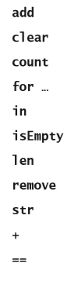

### 指定参数和返回值

接下来，要对背包接口进行的改进是把参数添加到接口里的操作中去，并且需要考虑这些操作需要返回什么值（如果需要的话）。可以看到，接口并不会公开这些操作是怎样去执行相应的任务的，这是因为怎么去执行是实现端的工作。

对于每个操作来说，让我们看看执行这个操作所需的对象（如果需要的话）以及完成任务之后会返回的对象（如果需要的话）。这些信息能够为你提供这个操作的参数和返回值（如果需要的话）。一个可以快速得到这些信息的方法是：想象你需要编写一个使用一背包数字的简单程序。下面这个代码片段就展示了这样一个程序，其中的变量`b`和`c`都是代表背包对象：

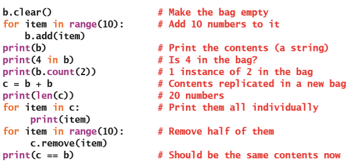

`isEmpty`、`len`和`clear`操作是这些操作里最简单的，因为它们都不需要我们提供任何信息来执行相应的工作。`len`会返回一个整数，而`str`则会返回一个字符串。

`add`和`remove`操作会需要知道将会被添加或删除的元素，因此这两个操作都会有一个参数来接收一个元素。接下里的问题是，当这个元素不存在的情况下，`remove`操作应该怎么做。对于Python的内置多项集来说，发生这种情况时，Python通常会引发一个异常。就目前而言，你可以先忽略这个问题，在后面的部分里，我们会再回来思考这个问题。

`in`、`+`和`==`运算符都会需要两个操作数，并且都会返回一个值。`in`运算符的两个操作数分别是一个任意的Python对象和一个背包，然后返回一个布尔值；`+`运算符期望的是有两个背包作为操作数，并且返回一个新的背包；`==`运算符会需要一个背包和一个任意的Python对象来作为操作数，并且会返回一个布尔值。

在多项集上执行`for`循环被程序员们称为“语法糖”，因为它其实是使用了**迭代器**（**iterator**）对象来执行的更复杂的循环。这一章的稍后将会详细讨论迭代器。现在，我们先只用假设背包接口的这部分操作依赖于一个名叫`__iter__`的方法就行了。

在这本书的前面部分提到过，若干个Python的函数和操作符其实都是实现类里的那些标准方法的简写。表5-1将这些方法添加到了上一节“设计背包接口”里的列表中，并且也为所有的操作都加上了相应的参数。可以看到，第一列里的`b`代表的是背包，第二列里的`self`则是运行这个方法的对象（背包）。我们还可以看到，如果已经包含了`__iter__`方法，那么`__contains__`方法是可以省略的。

表5-1 背包的操作和方法的参数

| 用户对背包的操作 | 背包类里的方法 |
| --- | --- |
| `b = <class name>(<optional collection>)` | `__init__(self, sourceCollection = None) `|
| `b.add(item)` | `add(self, item)` |
| `b.clear()` | `clear(self)` |
| `b.count(item)` | `count(self, item)` |
| `b.isEmpty()` | `isEmpty(self)` |
| `b.remove(item)` | `remove(self, item)` |
| `len(b)` | `__len__(self)` |
| `str(b)` | `__str__(self)` |
| `for item in b:` | `__iter__(self)` |
| `item in b` | `__contains__(self, item)` |
| | 如果已经包含了`__iter__`方法就不再需要 |
| `b1 + b2` | `__add__(self, other)` |
| `b == anyObject` | `__eq__(self, other)` |

## 构造函数和类的实现

表5-1里的第一行展示了一个没有名字也没有被包含在之前的列表里的操作，这个操作就是要创建的特定背包类型的**构造函数**（**constructor**）。对于背包的客户端来说，这个构造函数也就是实现的这个背包类的名称，再加上它所对应的参数（如果需要的话）。表5-1里通过语法`<class name>`来代表，这个构造函数的名称是相应的类名称。在右边的列里，构造函数所对应的方法是`__init__`。可以看到，这个方法有一个可选的源多项集来作为参数，如果用户不提供这个参数的话，那么默认值就是`None`。通过这个方法，客户端就可以创建一个空的背包，或是包含另一个多项集元素的背包。

假定程序员可以使用两个背包的实现类：`ArrayBag`和`LinkedBag`。那么下面这个代码片段就可以分别创建出一个空的链接背包和一个数组背包，其中这个数组背包会包含传递给它的列表里的数字：

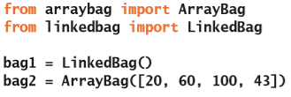

### 先验条件、后置条件、异常和文档

在用代码来编写接口之前，还有最后一步：能够清晰、简洁地描述各个方法会做什么。再调用方法时，这个描述不仅应该包含正常情况下会预期发生的情况，还应当包括发生异常情况（如出错）时会发生的情况。这样的描述应当是简短的，只用涉及到这一个方法会做什么，而不需要包含这个方法是怎么去做的。你马上就会看到，这些描述构成了使用文档字符串来介绍编码后的接口的基础。

就像在第1章“Python编程的基本知识”里提到过的，**文档字符串**（**docstring**）是通过三重引号括起来的字符串，当对某个资源运行Python的`help`函数时，这个字符串将会被显示出来。一个正确的方法文档字符串通常会包含说明这个方法的参数是什么、它的返回值是什么以及被用来做什么。有时候，一句话就足够表达这些信息了，例如：“返回列表里数字的总和”，或是“按升序排列列表里的元素”。

一个更详细的文档还可以包含先验条件和后置条件。

**先验条件**（**precondition**）是指：一个方法需要正确执行相应操作所必须满足的条件。通常来说，这些条件和运行这个方法的对象的状态有关。比如，某个元素必须在多项集里，然后才能被访问或删除。

**后置条件**（**postcondition**）则是：在假设方法的先验条件为真的情况下，它在完成了执行之后将会为真的情况。比如，清除多项集的后置条件是这个多项集为空。后置条件通常会被包含在变异器方法中，因为这些方法会修改对象的内部状态。

接口里的文档还应该包含对可能引发的任何异常的声明，这些异常通常是由于未能遵守方法的先验条件而导致的。比如，如果目标元素不在背包里，那么背包的`remove`方法就可能会引发`KeyError`异常。

接下来，你将会看到在正常或异常情况下，背包的`remove`方法会做什么。下面是这个操作的Python方法的定义，其中包括了详细的文档字符串，这个字符串描述了方法的参数、前置条件、后置条件以及可能的异常。可以看到，从方法的角度来看，`self`参数是用来指代背包对象的名称。

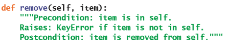

### 在Python里编写接口

某些语言（如Java）提供了用来对接口进行编程的特殊语法。Java的接口本身不能执行任何操作，但是为要实现的类提供了需要遵守的方法的模板。Python没有这样的语法，但是你可以模仿它来文档化以及指导实现类的开发。尽管你并不会在实际的应用程序里使用这个伪接口，但是它还是可以被用来作为蓝图，从而指定操作并确保它的不同实现都保留有统一性。

要创建一个接口，就需要列出它里面的每个方法的定义以及相应的文档，并用通过使用`pass`或`return`语句来完成各个方法。在不返回任何值的变异器方法里可以使用`pass`语句，而对于访问器方法则都应该返回一个简单的默认值，例如`False`、`0`或`None`。把这些方法都放在一个后缀为“Interface”（接口）的类中，从而来保证它们的定义可以被编译器进行检查。下面是在`BagInterface`类里定义的背包接口的方法列表：

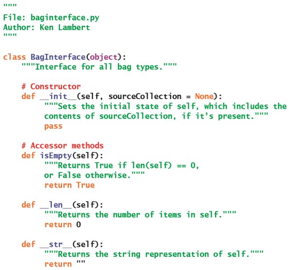

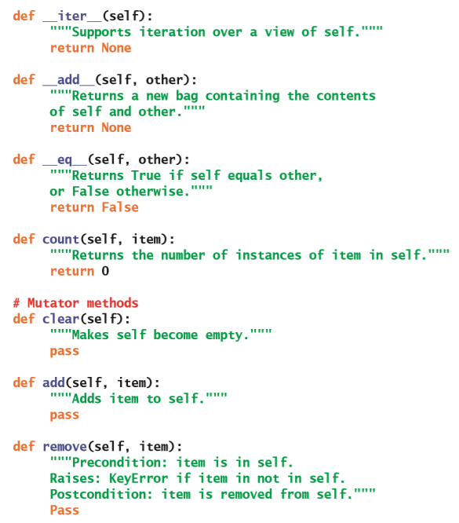

这样，你就有了一个可以被用在各种不同类型的背包上的蓝图了，接下来你就可以开始考虑背包的一些实现了。在接下来的两个章节里，你将会开发一个基于数组的背包多项集和一个基于链接的背包多项集。

### 练习题

1. 背包里的元素有没有特定的位置？还是说它们是无序的？

2. 哪些操作会出现在所有的多项集的接口里？

3. 哪个方法被用来创建多项集对象？

4. 给出接口与实现分离的三个原因。

## 开发基于数组的实现

在这一节里，你将开发出一个基于数组的背包接口实现，它被称为`ArrayBag`。

多项集类的设计者在得到接口之后，对这个类进行的设计和实现将包含两个步骤：

1. 选择一个适当的数据结构来存放多项集的元素，并且确定需要被用来表示多项集状态的任何其它数据。这些数据将会在`__init__`方法里被分配给实例变量。

2. 完成接口里所指定的方法的代码。

### 选择并初始化数据结构

因为现在要完成的是一个基于数组的实现，所以`ArrayBag`类型的所有元素都会被包含在背包里的一个数组里。这个数组可以是第4章“数组和链接结构”里讨论过的`Array`类的实例，也可以是其它基于数组的集合，例如：Python的`list`类型。在这个例子里，我们将会使用数组来进行实现，从而进一步继续说明数组的用法。于是，在名叫`arraybag`的模块里将会从`arrays`模块里导入`Array`类型。

前面提到过，`__init__`方法会被用来设置多项集的初始状态。因此，这个方法将会创建一个具有初始默认容量的数组，并且把这个数组分配给叫作`self.items`的实例变量。这个默认容量对于所有的`ArrayBag`的实例来说都是相同的，因此它将会被定义成类变量。基于节约的原则，默认容量将会是一个像是10这样的比较小的值。

由于背包的逻辑尺寸可能和数组的容量是不一样的，因此各个`ArrayBag`对象都必须在它自身的实例变量里对逻辑尺寸进行跟踪。因此，在`__init__`方法里，我们可以把这个被叫作`self.size`的变量设置为0。

在初始化了这两个实例变量之后，`__init__`方法还必须要处理它的调用者可能会提供的源多项集参数。在这种情况下，源多项集里的所有数据都需要被添加到新的`ArrayBag`对象中。这个过程听起来非常麻烦，但是如果你多想想应该怎么做，就可以发现其实只需要遍历这个源多项集，并且把它的每个元素都添加到`self`（新的`ArrayBag`对象）里就行了。而且，因为你可以在任何多项集上使用`for`循环，并且背包接口已经包含了`add`方法，所以整个代码并不复杂。

这部分设计好的代码非常很容易编写。首先你只需要复制背包接口文件`baginterface.py`，再把它重命名为`arraybag.py`；然后，添加一个`import`语句来导入数组类，并且把这个类重命名为`ArrayBag`；接着，添加一个类变量来存放默认容量；最后再完成`__init__`方法就行了。下面是做了这些修改之后的代码：

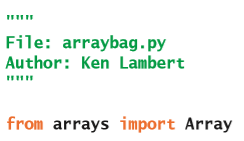

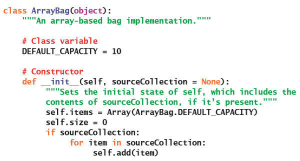

现在，你就可以加载这个模块并创建出`ArrayBag`的实例了。但是，在完成其它的一些方法之前，你并不能查看和修改它里面的内容。

### 先完成简单的方法

接下来，在`ArrayBag`类里还有九个方法需要完成。当面对很多需要被完成的事情时，可以尝试先完成那些简单的事情，把那些麻烦的事情稍微延后一点。这个策略在现实生活里可能效果并不显著，但是在编程的环境下，通常效果都不错。快速地完成一些简单的事情可以建立你的信心，从而帮助你节省下精力和智力，从而去解决其它的难题。

这个接口里，最简单的方法是`isEmpty`、`__len__`和`clear`。在忽略数组已满的情况下，`add`方法也非常简单。下面是这四个方法的代码：

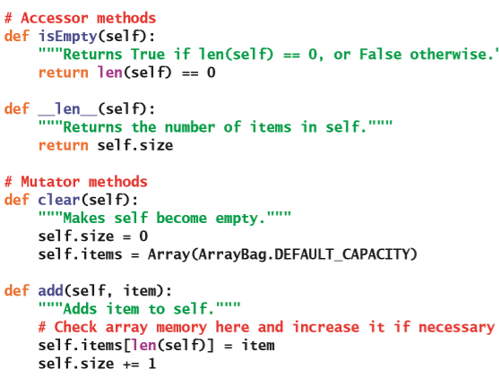

只要有可能，在类的定义里你应该通过调用方法或函数来完成各项工作。比如，当需要在类的定义里使用背包的逻辑尺寸时，就应该运行`len(self)`函数而不是直接使用实例变量`self.size`。然而，在`add`方法里因为只能通过变量对`size`进行增加，因此你就必须要用到它。

`add`方法会把新的元素放置在数组的逻辑结尾。这不只是因为简单，还因为这样做是最快的方法（常数时间操作）。当然，你稍后还得回来加上，在数组已满的情况下用来调整数组尺寸的代码。

现在，当你在Shell窗口里尝试`ArrayBag`类时，就可以使用`isEmpty`方法和`len`函数来查看背包长度的变化了，但是我们仍然还不能看到它的元素。

### 完成迭代器

方法`__str__`、`__add__`和`__eq__`都是在`self`上通过使用`for`循环来完成的。你可以先去完成这些方法，但是你更应该硬着头皮去完成`__iter__`方法，因为只有这样，才能让其它方法在运行时可以正常工作。

当Python看到一个基于可迭代对象的`for`循环时，它将会运行这个对象的`__iter__`方法。如果你回顾一下`Array`类里的`__iter__`方法（在第4章里）的话，你就会注意到这个方法遵循着调用一个函数来完成一个工作的经验法则。在那里，我们其实是调用了位于底层的列表对象上`iter`函数，并且返回相应的结果。在`ArrayBag`的`__iter__`方法里，你可能也会想要返回背包的底层数组对象上调用`iter`函数的结果；但是，这样做是错误的。这个数组可能并没有被填满，但它的迭代器始终都会访问它的所有位置，这样也就包括了那些包含垃圾值的位置，于是会得到很多`None`值。因此，很明显，你必须非常小心地控制需要被访问的数组里的位置，让这个值不要超过背包的逻辑尺寸。

为了解决这个问题，新的`__iter__`方法将会维护一个游标，从而让它可以在一系列对象之间进行移动。调用者的`for`循环会触发这个过程。在每次调用`for`循环时，游标所在的元素将会被返回给调用者，然后游标会前进到序列里的下一个对象。当游标到达背包的长度时，`__iter__`方法的`while`循环将会终止，继而也终止了`for`循环的调用。下面是`ArrayBag`里`__iter__`方法的代码，在后面我们对它会进行一些简单的说明：

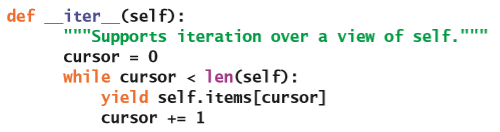

可以看到，这个方法实现了对底层数组对象基于索引的遍历，它会一直执行到但不包括背包的长度。通过使用`yield`语句，这个方法把每个元素都返回给调用的`for`循环。对于这本书里介绍的大多数迭代器来说，我们都会使用这种模式来编写代码。

### 完成使用迭代器的方法

`__eq__`方法遵循着第2章“多项集的概述”里讨论过的相等性测试的规则。`__add__`方法也遵循着第2章里讨论过的将两个多项集进行串联的规则。`__str__`方法会通过使用`map`和`join`操作来构建出一个字符串，它会包含背包里所有元素的字符串表达形式。下面是这些方法的代码，以及对它们进行的解释：

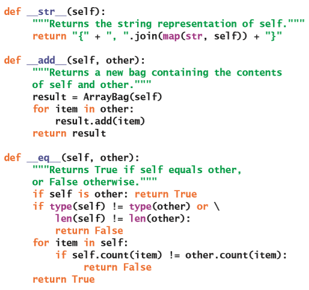

所有的这些方法都依赖于背包对象是可迭代的，或是支持`for`循环的事实。在`__add__`和`__eq__`方法里，背包对象可以被迭代是非常明显的，因为它们会在背包上显式地执行循环。除此之外，这些方法还会背包上隐式地运行一个循环：`__add__`方法会使用`ArrayBag`的构造函数中的`for`循环，来间接地创建一个对`self`的克隆；`__eq__`方法会对`self`和`other`（另一个背包）运行`count`方法，这个`count`方法的调用也必须在可迭代对象上才能正常工作。`__str__`方法通过用`map`函数来从背包里生成字符串序列，而这个映射函数也必须要假定`self`（当前背包）是可迭代的。

### `in`运算符和`__contains__`方法

当Python发现在多项集上使用的`in`运算符时，它实际上是在多项集的类里运行`__contains__`方法。但是，如果这个类的作者没有编写这个方法，Python就会自动生成一个默认方法。这个默认方法会在`self`上使用`for`循环，来对目标元素进行最简单的顺序搜索。而因为在平均情况下，对背包进行搜索不可能会比线性搜索更好，所以你可以使用`__contains__`的默认实现，从而不必在`ArrayBag`类里去实现它。之后的内容里，你将会有机会实现一个自己的`__contains__`方法，从而得到对元素进行更有效的搜索。

### 完成`remove`方法

`remove`方法在背包的实现里是最具有挑战性的方法。首先，你需要检查先验条件是否满足，并且在违反这个条件时引发异常；然后，你必须在底层数组里对目标元素进行搜索；最后，你还需要把数组里的元素向左移动，从而关上由于移除元素而留下空隙，并且把背包的尺寸减1，以及在需要的时候对数组的尺寸进行调整。下面是这个方法的代码，我们通过注释来标记了这五个步骤：

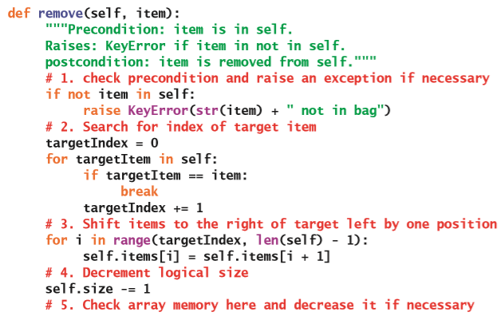

随着元素不断地被删除，底层数组的空间也越来越多地被浪费了。你可以通过添加调整数组的尺寸的相关代码来解决这个问题。就像第4章里提到过的那样，当数组的负载因子达到了不可接受的阈值时，对数组的尺寸进行调整。

### 练习题

1. 解释多项集类的`__init__`方法需要做什么。

2. 为什么调用方法比直接在类里引用实例变量要更好？

3. 展示在`ArrayBag`的`__init__`方法里，如何通过调用`clear`方法来简化代码。

4. 解释为什么`__iter__`方法可能会是多项集类里最有用的方法。

5. 解释为什么在`ArrayBag`类中不用包含`__contains__`方法。

## 开发基于链接的实现

要开发出基于链接的背包多项集的实现，你需要关注两件事：

* 你使用的接口和前面的实现是一样的——在文件`baginterface.py`里，所有的方法都被进行了定义。

* 你需要将思维方式从数组转换到通过链接结构来存储背包的数据。

你的第一个想法可能还是复制`baginterface`模块里的内容；并如同之前那样去修改它，从而得到一个叫做`linkedbag`的新模块。但是，如果再仔细看看`ArrayBag`类的话，你就会注意到，有些方法（如`isEmpty`、`__len__`、`__add__`、`__eq__`以及`__str__`）是不会直接访问到数组变量的。为了减少对变量的引用，我们曾经鼓励你尽可能多地调用其它方法。现在，这个策略的优越性就体现出来了：对于基于链接的实现来说，这些方法你都不需要进行任何修改！

如果一个方法不会访问到数组变量的话，那么它也不需要去访问到链接结构的变量。因此，你可以把若干个完整的方法在不进行任何修改的情况下，直接从`ArrayBag`类复制到`LinkedBag`类就好了。可以看到，，学习实现方法的时候的一个重要知识点是：始终尝试把实现的数据结构隐藏在被实现的对象的方法调用墙之后。

在`LinkedBag`类里，因为没法避免直接访问数据，这些方法会具有不同的实现，如：`__init__`、`__iter__`、`clear`、`add`以及`remove`。接下来，我们将会介绍它们。

### 初始化数据结构

和`ArrayBag`类一样，`LinkedBag`里的`__init__`方法会创建实例变量，并且为它们提供初始值。在这里，这两个数据不再是一个数组和相应的逻辑尺寸，而会是一个链接结构和它相应的逻辑尺寸。为了保持统一，我们将会使用和前面相同的变量名。但是这个时候，`self.items`就会是一个外部指针，而不再是数组了。这个指针一开始会被设置为`None`，也就是处于空链接结构的状态。而当结构不再为空时，`self.items`将会指向链接结构里的第一个节点。

把元素从源多项集复制到新背包里的代码和前面是一样的（因为，很明显你仍然会调用`for`循环以及相应的方法来完成它）。

`linkedbag`模块在这里会导入单向链接的`Node`类型来存放节点。类变量也不会再包含默认容量，这是因为链接的实现不再会用到它。下面是修改之后的代码：

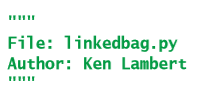

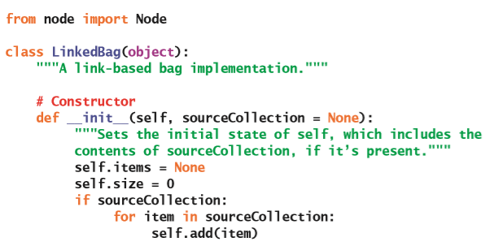

### 完成迭代器

`LinkedBag`里的`__iter__`方法支持和`ArrayBag`相同的遍历，因此这个方法的逻辑结构都非常相似：它们都会使用基于游标的循环来得到元素。在`LinkedBag`里的主要变化是：游标指向的是链接结构里节点的指针。游标最初会被设置为指向外部指针`self.items`，并且在它指向`None`时停止循环。在其它情况下，将会通过游标来从当前节点得到数据元素，并且把游标更新为指向下一个节点。下面是这个方法的新代码：

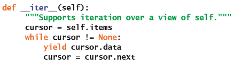

### 完成`clear`和`add`方法

`LinkedBag`里的`clear`方法和`ArrayBag`里的相应的方法也非常相似，因此我们会把它留给你作为练习。

除非要调整数组的尺寸，`ArrayBag`里的`add`方法会利用对数组的逻辑结尾访问而得到常数操作时间。而对于`LinkedBag`里的`add`方法来说，我们将会通过把新元素放在链接结构的顶部来得到常数操作时间。并且，由于每次只会分配一个新节点的相应内存，因此永远都不会出现在`ArrayBag`里为增加数组尺寸而引起的性能上的大量损耗。下面是`add`方法的新代码：

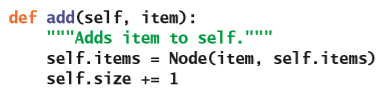

### 完成`remove`方法

与`ArrayBag`里的`remove`方法类似，`LinkedBag`里的`remove`方法也需要先处理先验条件，然后顺序搜索目标元素。找到包含目标元素的节点时，需要考虑下列两种情况：

1. 目标节点位于链接结构的开头。在这种情况下，你必须将变量`self.items`重置为这个节点的后面的链接。

2. 目标节点是第一个节点之后的某个节点。在这种情况下，必须将目标节点之前的那个节点指向后面的链接，并重置为目标节点的下一个链接。

这两种操作都会从链接结构里，断开指向目标元素的节点的链接，从而会被垃圾回收器释放掉。

类似于前面的部分，我们还是希望尽量从`ArrayBag`的实现里借用尽可能多的代码，从而只需要在必要的时候才使用链接结构里的指针。用来检查先验条件和搜索循环的代码和之前的逻辑结构是相同的。区别在于，在搜索的过程中，会跟踪两个指针，它们被称为`probe`和`trailer`。`probe`最初会被设置为标头节点，而`trailer`则被设置为`None`；当你在搜索循环里移动指针时，`probe`会比`trailer`指针领先一个节点；在循环结束时，如果找到了目标元素，`probe`将会指向这个元素的节点，而`trailer`则会指向这个元素之前的那个节点（如果有的话）。而如果`probe`指向的是链接结构的标头节点，那么`trailer`就一定会是`None`。因此，在循环结束时，你是能知道哪些指针需要被重置的。如果它是前一个节点指向后面的指针，你也可以访问到它。下面是新的`remove`方法的代码：

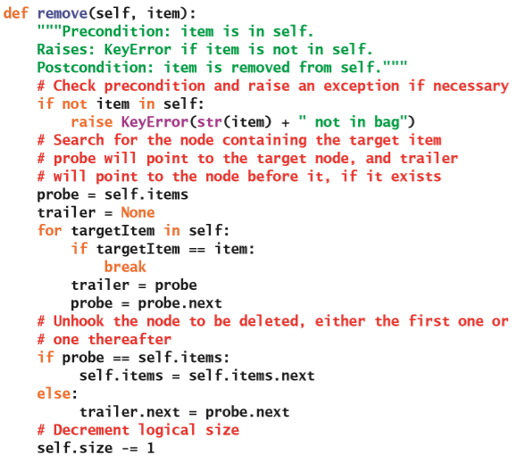

### 练习题

1. 假设`a`是一个数组背包，`b`是一个链接背包，它们都不包含任何元素。描述在这个情况下它们在内存使用上的差异。

2. 为什么链接背包仍然需要一个单独的实例变量来跟踪它的逻辑尺寸？

3. 为什么从链接背包里删除了元素之后，程序员不用担心会出现浪费内存的情况？

## 两种背包实现的运行时性能

神奇的是，背包的这两种实现方式的运行时间是非常相似的。

在这两种实现里，`in`和`remove`操作都会花费线性时间，这是因为它们都用了顺序搜索。`ArrayBag`的`remove`操作还需要对数组里的元素进行移动，但是这些其它工作所累积的时间并不会超过线性时间。对于所有的多项集而言`+`、`str`和`iter`操作也都是线性的。

`==`操作的运行时间会有不同的几种情况，将会留给你作为练习。

背包的其它操作就都是常数时间的操作了，唯一有点不同的是`ArrayBag`的`add`操作，它会偶尔由于需要调整数组尺寸而变成线性时间。

这两种实现在内存上会有一定的权衡。当`ArrayBag`里的数组没有用到一半时，它使用的内存会比有相同逻辑尺寸的`LinkedBag`少。在最差情况下，`LinkedBag`使用的内存是一个已经满了的`ArrayBag`的两倍。

由于存在这些对内存的权衡，因此在`ArrayBag`上进行删除操作的速度通常都会比在`LinkedBag`上慢。

## 对背包的两种实现进行测试

软件资源开发的其中一个关键步骤是测试。在这一章的开头，我们提到过你可以在学习各个部分的功能时运行这部分的代码。通过这种方式，可以大致的对资源进行梳理，并且改进它的实现。但是，当代码完成之后，就必须要运行全面的测试，来建立起对这个资源满足它的要求的信心。

通过使用像是`pyunit`这样的工具进行单元测试，就可以提供满足需求的保证。但是，这种类型的测试并不包含在本书范围之内。我们在这本书里使用的方法是：为你开发的每一个资源都包含一个测试函数。这个函数既可以用来保证，创建的新的多项集类是符合多项集接口的；还可以用来检查它们提供的操作是否能够完成预期的需求。

为了能够更好地说明怎么在背包类上使用测试函数，下面是可以用来和各种背包类一起运行的独立的应用程序的代码。`test`函数将会接受一个类型来作为参数，然后对这个类型的对象运行测试。

> 译者注：按照之后的章节的内容，原文所提的`main`函数的定义和使用应该是`test`函数

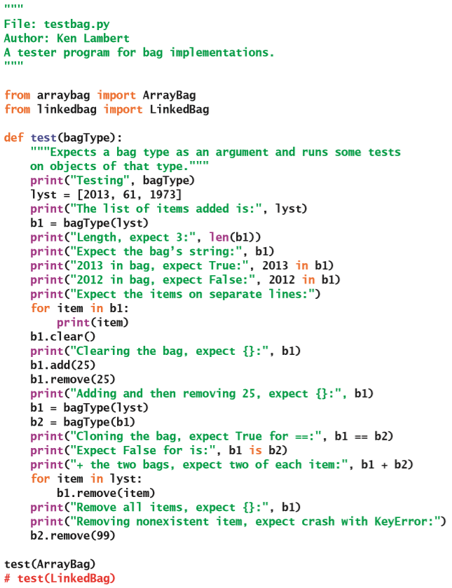

可以看到，在这个测试程序里，对所有的背包类型都会运行相同的（在背包接口里存在的）方法。这也就是使用接口的重点：在实现被修改的时候，接口永远都不变。

## 使用UML来绘制背包资源

当你的软件工具箱里添加了越来越多的资源时，可以通过被称为**类图**（**class diagrams**）来对它们进行可视化，从而帮助我们对它们进行分类。这些图的符号出自被称为统一建模语言（UML，Unified Modeling Language）的可视语言。类图会基于不同的细节来显示类之间的关系。在这一章里，我们关注的主要关系是类的实现以及接口的继承关系。就目前而言，你现在拥有的是两个基于同一个接口而实现的类，就像图5-1的类图显示的这样。

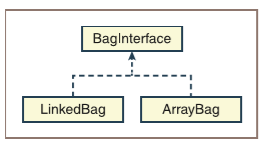

图5-1 具有一个接口和两个实现类的类图

类和类之间的另外两个重要关系是**聚合**（**aggregation**）和**组合**（**composition**）。对于`LinkedBag`对象来说，它会聚合零个或多个节点；而对于`ArrayBag`对象来说，它会和单个Array对象进行组合。图5-2展示的是将这些关系添加到了图5.1里的资源里之后的情况。其中，在图5-2里的`*`号被用来表示聚合里的零个或多个`Node`类的实例。

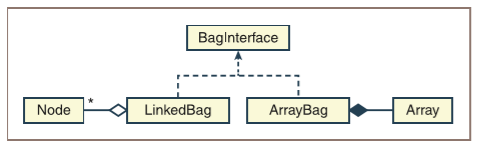

图5-2 具有聚合和组合关系的类图

简单来说，你可以把组合视为一个整体的关系，而聚合则是一种一对多的关系。在下一章里，我们将会介绍类和类之间的另一种重要的关系——继承。在继续学习之前，请确保对背包的相关知识已经足够理解了！

## 章节总结

* 接口是用户可以使用的一组包含操作的软件资源。

* 接口里的元素是函数和方法的定义以及它们的文档。

* 先验条件是指在函数或方法可以正确完成其任务之前必须要满足的条件。

* 后置条件是指在函数或方法正确完成了它的任务之后必须为真的情况。

* 精心设计的软件系统会把接口和它的实现分隔开。

* 实现是指满足接口的函数、方法或类。

* 多项集类型可以通过接口来进行指定。

* 多项集类型可以有若干个不同的实现类。

* 多态是指在两个或多个实现里使用相同的运算符、函数名称或方法名称。多态函数的示例是`str`和`len`；多态运算符的示例是`+`和`==`；多态方法的示例包括`add`和`isEmpty`。

* 背包多项集类型是无序的，并且支持添加、删除和访问它的元素的操作。

* 类图是一种用来描述类与类之间的关系的视觉符号。

* 组合是指把两个类作为整体的一部分。

* 聚合是指把一个类和另一个类按照一对多的方式进行关联。

* UML（统一建模语言）是一种用来描述软件资源之间的关系的图形符号。

## 复习题

1. 背包是：

    a) 一个线性多项集

    b) 一个无序多项集

2. 用来设置对象的实例变量的初始状态的方法是：

    a) `__init__`方法

    b) `__str__`方法

3. 让程序员可以访问多项集里的所有元素的方法是：

    a) `__init__`方法

    b) `__iter__`方法

4. 用来改变对象的内部状态的方法是：

    a) 访问器方法

    b) 变异器方法

5. 一组可以被类的客户端使用的方法集被称为：

    a) 实现

    b) 接口

6. 多态是用来代表什么的术语：

    a) 多个类里的相同的方法名称

    b) 一个用来存储另一个类里所包含的数据的类

7. 组合是指：

    a) 两个类之间的部分与整体关系

    b) 两个类之间的多对一关系

8. 背包的`add`方法的平均运行时间为：

    a) $O(n)$

    b) $O(k)$

9. 背包的`remove`方法的平均运行时间为：

    a) $O(n)$

    b) $O(k)$

10. 在什么情况下，背包的数组实现会比背包的链式实现使用更少的内存：

    a) 含有少于一半的数据

    b) 含有一半以上的数据

## 编程项目

1. 确定背包的两个实现的`==`操作的运行时间。可以预见到的，这里有几种情况需要被分析。

2. 确定背包的两个实现的`+`运算符的运行时间。

3. 完成`ArrayBag`里的`add`方法的代码，从而可以在需要的时候对数组的尺寸进行调整。

4. 完成`ArrayBag`里的`remove`方法的代码，从而可以在需要的时候对数组的尺寸进行调整。

5. 在`ArrayBag`和`LinkedBag`类里添加`clone`方法。这个方法在调用的时候，不会接收任何参数，并且会返回当前背包类型的一个完整副本。比如，在下面这个代码片段的最后，变量`bag2`将包含数字2、3和4：

    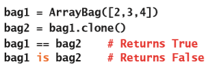

6. *集合*是一个无序多项集，并且也和背包具有相同的接口。但是，在集合里，元素都是唯一的，而背包里可以包含重复的物品。定义一个基于数组的叫做`ArraySet`的多项集新类。如果元素已经存在了，那么`add`方法将会忽略掉这个元素。

7. 定义一个使用链接的节点的叫做`LinkedSet`的多项集新类。如果元素已经存在了，那么`add`方法将会忽略掉这个元素。

8. 一个有序背包的行为和普通背包是一样的，但是它能够让用户在使用`for`循环时，按照升序来访问它里面的元素。因此，添加到这个类型的背包里的元素，都必须具有一定的顺序并且能够支持比较运算符。这种类型的元素的简单例子是：字符串和整数。

    定义一个支持这个功能的叫做`ArraySortedBag`的新类。和`ArrayBag`一样，这个新类会基于数组，但是它的`in`操作现在可以在对数时间里运行了。要完成这一点，`ArraySortedBag`必须将新添加的元素按照顺序放到数组里。最简单的办法是修改`add`方法，从而让新元素插入到适当的位置；然后，你还必须添加上`__contains__`方法来提供新的、更有效的搜索；最后，你还必须要把对`ArrayBag`的所有引用都替换为`ArraySortedBag`。（或者说，你可以：把代码从`ArrayBag`类复制到一个新文件里，然后在这个新文件里开始修改。）

9. 确定`ArraySortedBag`里的`add`方法的运行时间。

10. Python的`for`循环可以让程序员在循环迭代一个多项集的时候对它进行添加或删除元素的操作。一些设计人员担心在迭代的过程中，对多项集的结构进行修改可能会导致程序崩溃。有一种修改策略是通过禁止在迭代期间对多项集进行变异来让`for`循环成为***只读***。你可以通过对变异操作进行计数，并且判断这个计数有没有在多项集的`__iter__`方法里的任意节拍被增加来检测这种类型的变异。而当这种情况发生时，你就可以引发异常，从而避免计算的继续进行。把这个机制添加到`ArrayBag`类里去。你可以添加一个叫做`modCount`的新实例变量，这个实例变量会在`__init__`方法里被设置为0；然后，每个变异器方法的指向都会递增这个变量；最后，`__iter__`方法会有一个叫做`modCount`的临时变量，这个临时变量的初始值是实例变量`self.modCount`的值。在`__iter__`方法里返回了一个元素后，如果这两个修改计数器的值不相等了，就立即引发异常。用一个程序来测试你的修改，从而保证满足相应的需求。
