# 继承与抽象类

在完成这一章的学习之后，你就能够：

* 通过继承来在若干个类之间共享代码；
* 通过创建子类来定制类的行为；
* 将若干个类的冗余数据和方法提取为抽象类；
* 通过重新定义一个继承的方法来重写之前的行为；
* 确定应该把数据和方法放在类的层次结构里的什么位置。

工程师们在设计例如冰箱这样的产品线的时候，会从最基本的模型开始——最基础的冰箱会配有冷藏室和冷冻室；而在构建专用的模型时，比如像是有外部冷水过滤器和在冷冻室里有装有制冰机的冰箱，工程师们并不会从头开始创建一个全新的模型，而是会基于已经存在的模型进行定制再加上新的功能和行为。

软件设计人员也会以类似的做法：重用现有的模型，而不会从头开始构建全新的模型。比如说，那血带有参数的函数就满足了在不同情况下使用相同算法的想法。而把这个思想应用到类上，也就把它扩展到了一组方法和相关数据上。程序员重用现有模型来构建新模型的最强大方法，是一种被称为**继承**（**inheritance**）的面向对象语言的功能。当一个新的类是某个更通用的类的子类时，这个新类通过继承来得到了已经存在的类的所有功能和行为。就好像得到了大量的免费代码那样。对已有的代码的重用也消除了冗余，从而简化了软件系统的维护和验证。

这一章将会探讨在面向对象的软件设计中使用继承的策略，以及另一种重用代码的机制：抽象类。在这个过程中，第5章“接口、实现和多态”里的背包资源将会被放置在一个崭新的软件框架内，这个框架为本书后面的其它多项集类型的检验奠定了基础。

## 使用继承来定制已经存在的类

到目前为止，最简单、最直接的利用继承的方法是通过继承来定制已经存在的类。理想情况下，这两个类将会有相同的接口，因此客户端可以以相同的方式来使用它们。并且，这个新类还会为用户提供一些特殊的行为。

比如说，对于第5章的编程项目8里提到的有序背包类`ArraySortedBag`。有序背包的行为与普通背包是类似的，但是有三个显著的不同：

* 有序背包能够让客户端通过`for`循环按照顺序来访问它的元素。

* 有序背包的`in`操作会以对数时间运行。

* 添加到背包里的元素必须是可以进行比较的。这也就意味着它们可以支持比较运算符`<`、`<=`、`>`以及`>=`，并且它们都属于同一类型。

第5章的编程项目8要求你为有序背包编写一个全新的类，虽然，它只会有三个方法：`__init__`、`add`以及`__contains__`，但是它们与之前的背包类是不同的。

在这一节里，我们将会展示如何通过继承，以及这三个方法来创建有序背包类。

### 已经存在的类的子类

这一节里，我们通过让`ArraySortedBag`类成为`ArrayBag`类的**子类**（**subclass**）来探索继承的魔力。`ArrayBag`被称为`ArraySortedBag`的**父类**（**parent**）或**超类**（**superclass**）。图6-1的类图展示了子类和超类（继承）之间的关系。在图里，实线箭头代表的是子类和超类的关系，而虚线箭头则代表的是类和接口的关系。

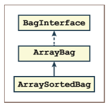

图6-1 在类图里展示子类和继承

可以看到，由于`ArrayBag`类实现了`BagInterface`，因此`ArraySortedBag`类也通过继承实现了这个接口。

在第5章的编程项目8里，对于`ArraySortedBag`类，你是把代码从`ArrayBag`（最相似的类）复制到了一个新文件里。然后，你在这个文件里更改了类的名称、修改了`add`方法、还添加了`__contains__`方法。

创建一个基于已经存在的类的子类的策略与之是截然不同的。你虽然还是会去处理父类文件的副本，但是现在你执行的是这些步骤：

1. 首先*删除掉*所有不需要修改的方法。它们将通过继承的收益而从父类自动地包含在类里。这里特别需要注意的是，新的类里仍然需要`__init__`方法。

2. 为了保证继承的发生，需要将父类的名称放在类的定义里的括号内。

3. 修改那些必须要更改的方法的代码（包括`__init__`）。

4. 添加那些需要的新方法。

### 修改`__init__`方法

`ArraySortedBag`类不会包含任何新的实例变量，因此看起来它的`__init__`方法好像没有任何作用。而且你可能会认为，`__init__`方法已经在父类`ArrayBag`里了，所以当程序员创建`ArraySortedBag`的实例时，这个方法将会被自动调用。然而这个情况继承不能自动完成。因此，`ArraySortedBag`里的`__init__`方法必须要去调用父类`ArrayBag`里的`__init__`方法，从而让它可以初始化它所包含的数据。调用父类里的这个方法的语法是：`ArrayBag.__init__(self, sourceCollection)`。

这种写法看起来会让人觉得非常麻烦，下面让我们来拆开这些步骤从而更好的理解：

1. 父类的名称`ArrayBag`能够让Python选择将要运行的`__init__`方法的版本。在这个例子里，当程序员运行`ArraySortedBag()`创建`ArraySortedBag`的新实例时，Python将会运行`ArraySortedBag`里的`__init__`方法。而这个`__init__`方法就必须要执行父类`ArrayBag`里的`__init__`方法，也就是通过调用`ArrayBag.__init__`来做到这一点。

2. 在`ArrayBag.__init__`的参数列表的开头，可以注意到一个额外的参数`self`。回想一下，在执行`ArrayBag`里的`__init__`方法时，它会把源多项集里的元素添加到`self`里去。为了让Python能够在这里正确地运行`add`方法，`self`必须要引用`ArraySortedBag`的实例，而不是`ArrayBag`的实例。而这就是为什么要把`self`作为附加参数传递给`ArrayBag.__init__`的原因。也就是，`ArraySortedBag`的实例会对`ArrayBag`里的`__init__`方法说：“我正在向你传递对我自己的引用，因此你将会使用我自己的`add`方法（而不是你自己的），从而把可选的源多项集里的元素添加到我自己这里。”

3. 可选的源多项集也会作为参数传递给父类的`__init__`方法。那么，如果存在源多项集，就会在这个地方发生一些很有趣的事情。源多项集会在的类层次结构里向上传递，从`ArraySortedBag`传递到它的父类`ArrayBag`（想让这个父类帮你做一些工作）。但是，当这个多项集到了在`ArrayBag`里的`__init__`方法的上下文里的时候，这个方法会把多项集里的所有元素都传递回`ArraySortedBag`里的`add`方法，从而以恰当的方式来添加它们。

由于用户会像对待普通背包那样来创建有序背包，因此有序背包的`__init__`方法定义必须要和它父类里的`__init__`方法具有相同的定义。

下面是到目前为止，我们所讨论的`ArraySortedBag`里所需要修改的代码：

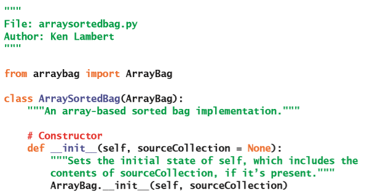

### 添加新的`__contains__`方法

`ArrayBag`里没有`__contains__`方法。因此当在背包上使用`in`运算符时，Python会通过`ArrayBag`的迭代器自动生成一个顺序搜索的操作。若要改写有序背包的这个行为，就需要在`ArraySortedBag`里包含`__contains__`方法。这样，当Python看到有序背包上使用了`in`运算符时，它就会看到这个背包的`__contains__`方法并调用它。

这个方法将会对存放有序背包的元素的数组进行二分搜索（请参见第3章，“搜索、排序以及复杂度分析”）。这个数组叫做`self.items`，位于`ArrayBag`类里，可以被它的任何子类进行访问。因此，你可以在搜索的过程中直接使用这个变量，就像下面这个代码片段这样。

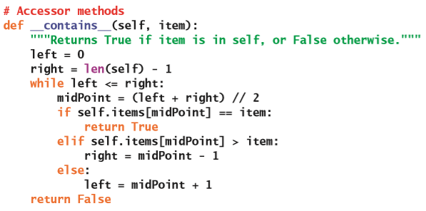

### 修改已经存在的`add`方法

`ArraySortedBag`里的`add`方法必须要把新的元素放在有序数组里的适当位置。在大多数情况下，你都需要通过搜索来找到这个位置。但是，有两种情况不需要去找到这个位置：当背包为空时，或是新的元素大于或等于最后一个元素时。这时，你只需要把新的元素传递给`ArrayBag`类里的`add`方法来添加它就好了。（要记住，只要有可能，就尽量去调用一个方法而不是自己去重头实现它，尤其是当父类可以帮你做相应的工作时。）

如果你不能把某个元素传递给`ArrayBag`里的`add`方法，那么就必须要在数组里找到大于或等于这个新元素的那个元素。然后在这个位置为新元素打开一个空隙、插入新元素、并且增加背包的尺寸。

下面是修改之后的在`ArraySortedBag`里的`add`的代码：

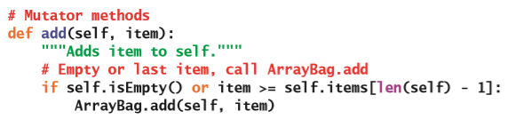

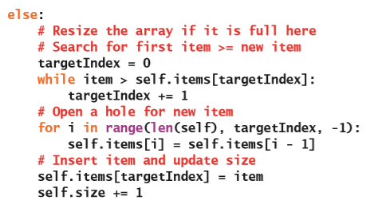

可以看到`ArrayBag.add`方法的调用和`self.items`变量的引用使用了不同的前缀。前者是类名，而后者是对类的实例的引用。就像你在前面的`__init__`方法的例子里看到的那样，你需要类名来区分`ArrayBag`里的`add`和`ArraySortedBag`里的`add`（也就是`self.add`）这两个版本。由于`ArraySortedBag`不会引入新的实例变量，因此在这里对`self.items`的引用将会直接定位到`ArrayBag`类里的变量。

尽管调用在父类里的方法的语法有些复杂，但是调用本身也再次彰显了代码重用的智慧。而且，你现在又有了另一个背包资源，也就是用了很少的成本给多项集框架增加了巨大的价值。

### 修改已经存在的`__add__`方法

当Python发现是两个背包在使用`+`运算符时，会运行的`__add__`方法实际上在`ArrayBag`类和`LinkedBag`类里是相同的代码。它们唯一的区别是用来创建新的结果实例的类名。对于`ArraySortedBag`来说，你只需要对它的`__add__`也这样做就行了，就像下面这样：

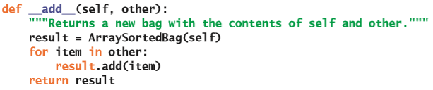

很快你将会看到如何通过一个方法来统一这种重复了三次的模式，从而让三个不同的类共享一份代码。

### `ArraySortedBag`的运行时性能

在`ArraySortedBag`上使用`in`运算符，会用到它的`__contains__`方法。因此，在最差情况下，这个运算的运行时间为$O(\log n)$。这和在普通的背包上使用`in`运算符的线性运行时间相比，有了非常大的改进。

这种对搜索时间的改进，也对用上了新的`in`运算符的方法有影响，那怕这些方法是在`ArrayBag`里定义的。比如说，`remove`方法会先检查它的先验条件。尽管用上了改进的搜索算法，在平均情况下，这个方法虽然还是需要以线性运行时间来执行删除，但是在先验条件的检测上它花费的时间会更少。

即使没有用到`in`运算符，`__eq__`方法的性能也会随着改进有显着提高。当这个方法在两个相同长度的普通背包上运行时，它的平均运行时间为$O(n^2)$。而如果你在`ArraySortedBag`里重新定义了`__eq__`方法，那么可以把它的平均运行时间减少到$O(n)$。这个实现用了这样一个规则：在两个有序背包里进行比较的元素，能够在你遍历它们时以相同的顺序出现。这个新版本的`__eq__`方法将会留给你作为练习。

### 关于Python里类的层次结构的解释

在Python里所有的数据类型都是一个类，并且所有的内置类都处在同一个层次结构里。这个层次结构的最顶层或者说根类是`object`。图6-2展示了Python类的层次结构的一部分，其中包含了内置的`dict`、`list`、`str`以及`tuple`类。

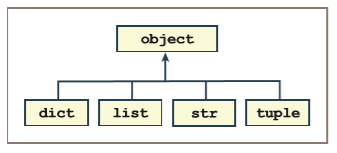

图6-2 Python类的层次结构的一部分

当你定义了一个新类并且在语法里省略了父类时，Python会自动把这个类基于`object`类。

当你在设计一组新的多项集类时，通常最好不要让它基于内置的Python集合类（如`str`或`list`）中。你应该像本书一样，先开发出自己的符合接口的类，然后让在层次结构最顶层的类基于`object`类。

Python支持有多个父类的子类和相应的继承，这个功能在某些高级应用程序里会非常有用。在本书的后面，将会探讨多个父类的用法。

### 练习题

1. 以`ArrayBag`和`ArraySortedBag`类为例，说明类的继承是如何帮助消除冗余代码的。

2. 解释为什么`ArraySortedBag`类仍然需要包含`__init__`方法。

3. 程序员在`ArrayBag`的子类`ArraySortedBag`类的对象上调用`remove`方法。说明在这种情况下Python是怎样找到需要被运行的正确的方法实现。

4. 说明为什么在`ArraySortedBag`里的`add`方法的代码里会调用`ArrayBag`里的`add`方法。

## 使用抽象类来消除冗余代码

在学习了子类和继承之后，可以让你在新的类里减少部分代码而不用一直留着它们。像在第5章里的有序背包项目里那样如果保留了这些代码，也就是容忍了并不需要的冗余。

另一个在背包多项集里可以查看到有冗余代码的地方是：在`ArrayBag`和`LinkedBag`类里。回想一下，在第5章里，我们通过对`ArrayBag`里的代码进行复制而创建出`LinkedBag`时，很多方法都不需要有任何修改。这些方法在两个类里看起来都是一样的，因此，根据定义，它们是冗余的。

你刚刚学习了，通过把冗余的方法保留在父类里并通过继承与其它类共享这些的方式来避免有序背包出现这类冗余问题。

在这一节里，你将学习如何把一组已经存在的类的代码，分解为一个公用的超类，来消除它们之间冗余的方法和数据。这样的类被称为**抽象类**（**abstract class**），用来表示它包含了一组相关类的共同特征和行为。客户端程序里通常不会去实例化抽象类。它的子类被称为**实体类**，用来表示它们是在客户端应用程序里会创建出的对象的类。这两种类又和*接口*（请参见第5章，“接口、实现和多态”）有所区别，接口仅仅是指给定的类或一组类的方法，而不用有任何实现的代码。

### 设计`AbstractBag`类

程序员通常在开发了若干个类，并且看到有一些冗余的方法和变量的时候，就会发现对抽象类的需求了。对于背包的各个类来说，最明显的冗余方法是那些只会调用其它方法而不会直接访问到实例变量的方法，它们有：`isEmpty`、`__str__`、`__add__`、`count`以及`__eq__`方法。

冗余的实例变量会有点麻烦。你的背包类会用到两个实例变量：`self.items`和`self.size`。要找到什么是冗余的，就必须要查看变​​量所引用的数据类型。在各个不同的类里，`self.items`指的是不同类型的数据结构。（这也就是为什么它们被称为不同的实现的原因。）相比而言，`self.size`则是各个背包类里的一个整数值。因此，只有`self.size`是冗余的实例变量，也就是说它是可以被安全地移动到抽象类的一员。

由于`__len__`方法会访问`self.size`而不是`self.items`，因此它也可以被当作冗余方法。通常来说，直接访问或修改了`self.items`的方法都必须要保留在实体类里。

你可以从背包类里删除掉冗余的方法，然后把它们放在一个叫做`AbstractBag`的新类里。再把背包类设置为`AbstractBag`的子类，于是也就可以通过继承来访问这些方法。各个背包类在修改之后的框架就是图6-3的类图这样。

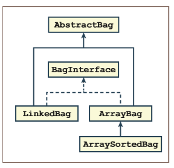

图6-3 将抽象背包类添加到多项集框架

可以看到，`AbstractBag`类并没有实现背包接口。这是因为`AbstractBag`只包含了一部分背包的方法。而其它三个背包类仍然会通过其它的代码去支持背包接口。

还要注意的是，你现在有了一个更明显的类的层次结构，它有两个继承级别。`ArraySortedBag`类现在会直接从它的父类`ArrayBag`继承到一些方法和数据，并从其祖父类`AbstractBag`间接地继承一部分其它的方法和数据。通常来说，类的方法和变量可以被它的任何后代类使用。

要创建`AbstractBag`类，首先需要把它的子类之一的内容复制到新的文件里，然后将这个文件另存为`abstractbag.py`。接下来再执行下面这些步骤：

1. 删​​除所有不相关的模块导入，并将类重命名为`AbstractBag`。

2. 删除除了`__init__`方法外的所有会直接访问实例变量`self.items`的方法。下一部分的内容将会详细地说明如何对`__init__`方法进行修改。

### 重新编写`AbstractBag`类的`__init__`方法

`AbstractBag`里的`__init__`方法将会负责执行两个步骤：

1. 引入变量`self.size`并把它初始化为0。

2. 将源多项集（如果存在的话）里的元素添加到自身。

因此，你只需要删除掉用来初始化`self.items`变量的代码。这部分代码将会是子类里`__init__`方法的职责。

下面是`AbstractBag`里的`__init__`方法的代码：

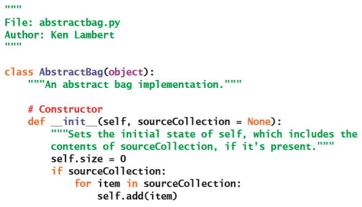

因此`AbstractBag`类里的其余代码将会包括：`isEmpty`、`__len__`、`__str__`、`__add__`、`count`以及`__eq__`方法，它们和在`ArrayBag`或`LinkedBag`里的实现是一样的

### 修改`AbstractBag`的子类

接下来，`AbstractBag`的所有子类都必须要导入这个类，并且把它的名称放在类的定义的括号里，去掉前面提到的冗余方法，然后再添加经过修改的`__init__`方法。

思考一下，需要对`ArrayBag`里的`__init__`方法进行什么样的修改。这个方法仍然需要负责把`self.items`设置为一个新数组，而这也就是这个方法里会被保留的唯一一行代码。运行这行代码之后，还需要运行在`AbstractBag`里的`__init__`方法，这个方法将会初始化背包的尺寸，并在需要的时候添加来自源多项集里的元素。下面是对`ArrayBag`里的`__init__`方法进行这些修改之后的代码：

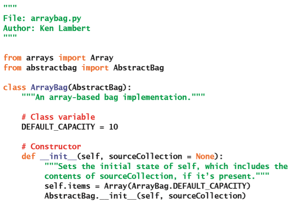

注意这两个语句在`__init__`方法里的顺序。在运行超类里的构造函数之前，把`self.items`初始化为一个新数组是非常重要的，只有这样做才能把任何需要被添加到新背包里的元素添加进去。

对`LinkedBag`类的修改是类似的，将会留给你作为练习。

### 在`AbstractBag`里模板化`__add__`方法

如果在这个时候执行测试函数来测试背包类的话，那么在测试`+`运算符（会使用在`AbstractBag`里的`__add__`方法）的时候就会引发异常。这个异常会指出`AbstractBag`并不知道`ArrayBag`（如果你是从其它类复制出的这个方法的话，就会显示出不知道`LinkedBag`或是`ArraySortedBag`）。很明显`AbstractBag`并不会知道它的任何子类，而这也就是导致这个错误的原因：`__add__`方法会尝试创建一个`ArrayBag`的实例来保存结果，就像下面这个代码片段这样：

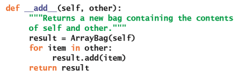

其实，在这个地方，你真正想要的是`self`类型的实例，而并不是特定的某个类的实例，而无论它是哪种类型。

要解决这个问题，你可以用Python的`type`函数来得到`self`的类型；然后以通常的方式，通过这个类型来创建一个self的克隆。下面是适用于所有背包类型的`__add__`方法的代码：

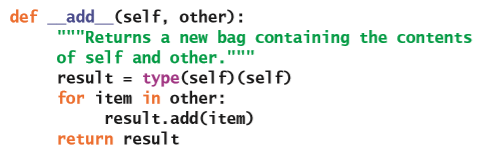

表达式`type(self)(self)`的用法非常强大。它仿佛是在说：“无论当前类型是什么，都给我`self`的类型（某个多项集）；然后把它作为构造函数，在同一个多项集上运行从而得到一个副本。”你很快就会看到，这个策略不仅仅适用于背包，而且适用于所有类型的多项集。

## 所有多项集的抽象类

如果再去分析`AbstractBag`类的代码，可能会注意到一些有趣的东西。它的所有方法（包括`__init__`）都只是运行了其它方法或函数，或者只访问了`self.size`变量。这些方法并没有用到背包类。除了用来创建带有花括号的字符串的`__str__`方法，以及除了不会比较特定位置上的元素对的`__eq__`方法之外，`AbstractBag`的其它方法都是可以被用在任何其它类型的多项集（如列表、堆栈和队列）上的方法。除此之外，实例变量`self.size`也可以被用在任何多项集的实现里。

于是我们发现，你可以把这些方法和数据分解出一个甚至更通用的抽象类。在这个类里，这些方法和数据都可以被用在还没有开发出的其它类型的多项集上。这个叫做`AbstractCollection`的类将会作为整个多项集的层次结构的基础类。

### 把`AbstractCollection`添加到多项集的层次结构里

`AbstractCollection`类将会负责引入和初始化`self.size`变量。这个变量将会被层次结构里的所有多项集类使用。

如果需要的话，`AbstractCollection`里的`__init__`方法还应该把源多项集里的元素添加到`self`里去。

这个类还会涵盖有所有多项集里可以用到的最通用的方法：`isEmpty`、`__len__`、`count`以及`__add__`。在这里，“最通用”的说法也就意味着它们的实现都不需要再被子类进行任何的修改。

最后，`AbstractCollection`还包含有`__str__`和`__eq__`方法的默认实现。它们在`AbstractBag`里的代码适用于无序多项集。但是大多数多项集类可能会是有序的，而不是无序的；因此，这两种方法都将会继续保留在`AbstractBag`里，而在`AbstractCollection`里将会提供新的实现。新的`__str__`方法将会使用方括号来把字符串抱起来，新的`__eq__`方法将会比较各个位置的元素对。新的`AbstractCollection`子类仍然可以自由定制`__str__`和`__eq__`来满足它的需求。

图6-4展示了新的`AbstractCollection`类添加到多项集框架里之后的情况。

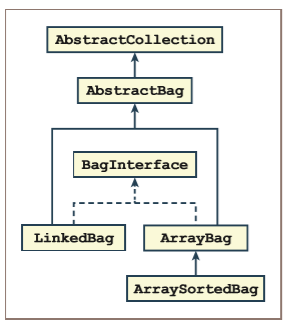

图6-4 在多项集框架里添加了抽象多项集类的情况

可以看到，随着在层次结构里从上向下移动，这些类的特征将从更通用的角色转换为更具体的角色。现在，当出现一个新的多项集类型（如`ListInterface`）时，你就可以为它创建一个基于`AbstractCollection`的抽象类，然后开始准备一些需要被处理的数据和方法。列表的具体实现将会被放在抽象列表类下面。

要创建`AbstractCollection`类，你还是需要从另一个模块（在本例中为`AbstractBag`）里复制相应的代码。然后执行这些步骤：

1. 将类重命名为`AbstractCollection`。

2. 修改`__str__`和`__eq__`方法来让它们提供更合理的默认行为。

接下来，在`AbstractBag`里删除`isEmpty`、`__len__`、`count`以及`__add__`方法。`AbstractCollection`的实现和`AbstractBag`的修改将会作为练习留给你。

### 在`__eq__`方法里使用两个迭代器

`AbstractCollection`类里的`__eq__`方法的实现，会比较两个多项集里的元素对。而这是通过同时迭代两个多项集里的元素序列来实现的。那么如果`for`循环只能在一个多项集上运行的话，这个步骤应该怎么实现呢？

这个问题的答案在于：显式地操作第二个多项集的迭代器对象。当程序员在多项集上调用`iter`函数时，将会得到这个多项集的迭代器对象。当程序员在迭代器对象上调用`next`函数时，这个函数将会返回迭代器序列里的当前元素，并前进到下一个元素（如果有的话）。如果序列里没有元素了，那么这个函数就会引发`StopIteration`异常。

比如说，下面这两个代码片段会执行相同的任务，但是第一个使用的是Python的`for`循环，而第二个则直接操作了多项集的迭代器对象：

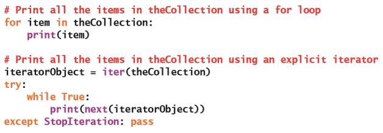

在`AbstractCollection`里的`__eq__`方法里显式地使用迭代器时，不用去捕获`StopIteration`异常。这是因为进行判定的两个多项集的长度应该是相同的，所以当第二个多项集的迭代器到达它的元素序列的末尾时，第一个多项集的`for`循环已经停止了。下面是这个`__eq__`方法的修改之后的代码：

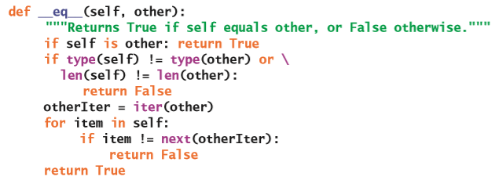

### 练习题

1. 以`AbstractBag`类为例，描述抽象类的用途，并解释为什么不能创建抽象类的实例。

2. 对于在`AbstractCollection`类里定义的：`__init__`、`isEmpty`、`__len__`、`__str__`、`__eq__`、`count`以及`__add__`方法，哪些方法可以在子类中被重新定义，为什么？

3. `AbstractCollection`类里有两个没有定义，但是必须在子类里定义才能让其它方法正常运行的方法。它们是什么方法？

4. 在`AbstractCollection`类里编写一个叫做`clone`的新方法。这个方法不包含任何参数，执行后会返回运行它的对象的完整副本。它的用法的例子是：`aCopy = someCollection.clone()`。

5. 方法`add`会被`AbstractBag`类里的`__init__`和`__add__`方法调用，但是它并没有在这个类里进行定义。这个方法会存在于哪个类，Python是如何定位它的实现的？

## 多项集的专家级框架

在这一章里，你用到了第5章（“接口、实现和多态”）里开发的三个背包类的实现，并且把它们放到了类的层次结构里。尽管这些类仍然实现了相同的背包接口，但它们现在共享了大量的被提取到抽象类的代码。这一章的主要学习目标是能够通过类的层次结构里的继承机制来重用代码并消除冗余代码。

在这个过程中，你还开发出了一个核心框架，来与其它还没有被开发的资源（如列表、字典、堆栈、队列、树和图多项集的各种实现）共享代码。图6-5展示了一个几乎完整的多项集框架。

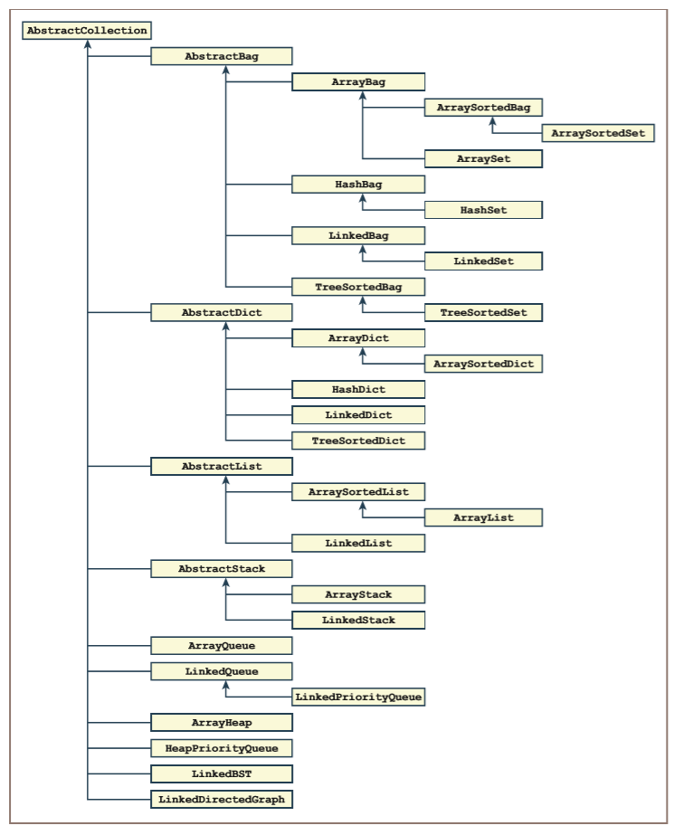

图6-5 多项集的专家级框架

其它的编程语言（例如Java）也包含着一个类似这样的多项集框架，虽然它们并不会像图里这个多项集框架那样完整，但是也还是会比Python的多项集框架更庞大。在后面的各个章节里，你将会探索到线性、分层、无序以及图多项集，你将会有机会开发出图6-5里这个框架的各种资源。

## 章节总结

* 可以将两个类关联为子类和超类。子类通常是超类的一个更具体的版本。超类也被称为其子类的父类。

* 子类会继承它的父类以及任何祖先类里的所有方法和变量。继承允许两个类（子类和超类）共享数据和方法，从而消除了潜在的冗余。

* 子类通过修改它的方法或添加新方法来特殊化超类里的行为。

* 子类可以通过把超类的名称作为方法的前缀来调用超类里的方法。

    > 译者注：只有子类可以调用超类里的方法，原文并没有做出区分。

* 抽象类是一组会被其它类所共享的数据和方法的存储库。而不是抽象类的其它的类，则被称为实体类。

* 抽象类不能实例化。

* Python会把所有的类都包含在层次结构里，其中`object`类是最顶层的父类。

* 具有更通用的行为的方法通常会位于类的层次结构的更上方。

## 复习题

1. 一个类会从它继承的什么地方得到所有的方法和实例变量：

    a) 后代

    b) 祖先类

2. 一个类里可用的方法通常会：

    a) 小于或等于它的父类里可用的方法的数量

    b) 大于或等于它的父类里可用的方法的数量

3. 一个类里的方法可以通过什么方法来调用祖先类里的相同方法：

    a) 将前缀`self`和方法名称一起使用

    b) 使用祖先类的名称作为方法名称的前缀

4. `self`总是用来表示：

    a) 一个类在被实例化之后所得的对象

    b) 一个在类的定义里包含对`self`的使用的对象

5. 理想情况下，抽象类里的方法：

    a) 通过`self`来调用其它方法从而完成工作

    b) 会包含大量的对实例变量的引用和分配

6. 在`AbstractCollection`类里最应该被实现的方法是：

    a) `__iter__`、`add`和`remove`

    b) `isEmpty`、`__len__`和`__add__`

7. 返回对象的类型的函数是：

    a) `type`

    b) `GetType`

8. 应该在哪里定义`clone`方法，这个方法用来创建并返回一个特定多项集的完整副本：

    a) 这个多项集的类

    b) 在`AbstractCollection`类里

9. 创建新的多项集时会自动从源多项集复制元素的方法是：

    a) `__init__`

    b) `__add__`

10. 在`AbstractCollection`里定义的`__eq__`方法：

    a) 会比较两个多项集里的元素对，在平均情况下运行时间复杂度是线性的

    b) 查看一个多项集里的每个元素是否也同时在另一个多项集中，在平均情况下运行时间复杂度是二次方的

> 译者注：原文此处排版有问题

## 编程项目

在后面的这些项目里创建或修改类时，请确保通过运行适当的测试程序来测试你的修改式正确的。

1. 将`__eq__`方法添加到这一章里讨论过的`ArraySortedBag`类中。这个方法的运行时间不应该比线性时间更差。

2. 修改第5章里讨论过的`LinkedBag`类，让它成为`AbstractBag`的子类。你应该把那些不能被移动到`AbstractBag`里的方法保留在`LinkedBag`里。

3. 完成这一章讨论过的`AbstractCollection`类。然后修改`AbstractBag`类，让它成为`AbstractCollection`的子类。

4. 在第5章的编程项目6和7里你已经了解到了集合的行为和背包一样，只是集合不能包含重复的元素。一些可能的实现是`ArraySet`和`LinkedSet`。绘制一个类图来展示出把它们放置在图6-4多项集框架里的位置。

5. 完成`ArraySet`和`LinkedSet`的类，从而让它们可以通过继承来发挥出最大的优势。

6. 有序集合和集合的行为相似，但是它能够让用户在使用`for`循环的时候以升序来访问它的元素，并且支持对元素在对数时间里进行搜索。绘制出一个类图来展示出把它们放置在图6-4多项集框架里的位置。

7. 完成有序集合的新类。

8. 有人可能会注意到`remove`操作对背包执行了两次搜索：第一次是在测试方法的先验条件时（使用`in`运算符）；第二次是定位需要被删除的目标元素的位置。消除冗余搜索的一种方法是：通过一个实例变量来跟踪目标元素的位置。对于基于数组的背包来说，在初始化以及没有找到目标元素时，这个位置信息将为–1。如果`in`运算符找到了目标元素，那么就把这个位置变量设置为这个元素在数组里的索引；否则，它将会被重置为–1。这样，在`remove`方法检查完了它的先验条件之后，就不再需要进行另一次循环来搜索了；它只需要使用位置变量来直接关闭掉数组里的空隙就行了。修改`ArrayBag`类来支持这个功能。可以看到，你现在就必须向需要执行这个自定义搜索的`ArrayBag`添加`__contains__`方法了。

9. 在实现了编程项目8的修改后的`remove`方法，将不再适用于有序背包。原因是`ArraySortedBag`里的`__contains__`方法，不会更新`ArrayBag`里的那个新的位置变量。修改`ArraySortedBag.__contains__`方法，来让`remove`方法可以在有序背包里正确工作。

10. `LinkedBag`类里的`remove`方法也有编程项目8里所描述的冗余搜索。修改这个类，从而避免这个冗余。
