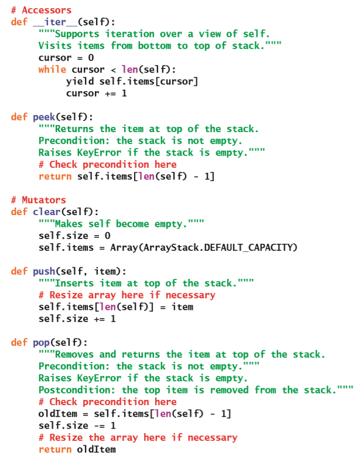
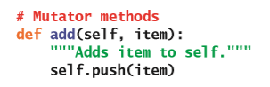

# 堆栈

在完成这一章的学习之后，你就能够：

* 描述堆栈的功能和行为；
* 根据性能特点来选择堆栈的实现；
* 知道堆栈应该被用于哪些应用程序；
* 解释系统调用堆栈是如何为递归子程序提供运行时支持的；
* 通过堆栈来设计并实现回溯算法。

这一章将介绍**堆栈**（**stack**），它是一种在计算机科学里广泛使用的多项集。堆栈是可以被描述和实现的最简单的多项集。它的应用非常广泛，在这一章里我们将会讨论其中的三个应用场景。这一章我们还会介绍它基于数组和基于链接结构的两种标准实现。这一章将会以一个案例研究（算术表达式的解释和计算）作为结尾，在这个案例里堆栈起着核心作用。

## 堆栈的概述

堆栈是一种特殊的线性多项集，它的访问被完全限制在一端（被称为**堆栈顶端**（**top**））。一个现实生活中非常典型的例子是：在每个自助餐厅里都可以找到的干净托盘堆栈。每当需要一个托盘时，就把它从堆栈的顶端移开；而当干净的托盘从厨房返回时，它们都会被重新垒放在顶端。一般不会有人直接从堆栈的中间去取出托盘，而且在最下面的托盘可能永远都不会被使用上。堆栈会遵循**后进先出**（LIFO，**last in, first out**）协议。就像从洗碗机里拿出来的最后一个托盘会是刚才放进去的第一个托盘那样。

> 译者注：后进先出的英文应该是：“last in, first out”，而不是原文里的“last-in first-out”。在词汇表里也是错误的写法。

把元素从放到堆栈上的操作分别被称为**推入**（**push**），从堆栈里删除元素的操作被称为**弹出**（**pop**）。图7-1展示了堆栈可能会出现的各个情况，其中堆栈的顶端元素加上了阴影。

> 空    在`push(a)`之后    在`push(b)`、`push(c)`、`push(d)`之后    在`pop()`之后    在`push(e)`、`push(f)`之后    在`pop()`之后

图7-1 堆栈生命周期里的一些状态

在这个图里，一开始堆栈为空，然后把元素`a`推入；接着我们再推入了三个元素：`b`、`c`和`d`；然后又从堆栈里弹出了一个元素，依此类推。

堆栈的一些其它例子可以是：厨房碗柜里的盘子和碗或是CD架里的光盘。但对于一张一张不断地向桌面上堆起一摞纸这个例子来说，它并不是不是一个堆栈的例子，这是因为你可以十分方便地从这堆纸的中间位置取走一些纸张。对于真正的堆栈来说，你能得到的元素只能是刚刚添加的那个元素。

堆栈在计算机科学里的应用非常多。这里列出了非常少的部分，其中的前三个将会在这一章的稍后部分进行更详细地讨论：

* 将中缀形式的表达式转换为后缀形式并计算后缀形式的表达式。中缀表达式（如$3 + 4$）里的运算符会出现在它的两个操作数之间，而后缀表达式（如$3 4 +$）里的运算符则是在它的两个操作数之后。

* 回溯算法（在自动定理证明和玩游戏时会遇到的问题）。

* 管理计算机内存来支持函数和方法调用。

* 在文本编辑器、文字处理器、电子表格程序、绘图程序和类似的应用程序里支持撤消功能。

* 维护网络浏览器访问链接的历史记录。

## 使用堆栈

堆栈类型没有被内置到Python里。如果需要的话，Python程序员可以通过Python的列表来模拟基于数组的堆栈。如果把列表的末尾视为堆栈顶端的话，则`list`的`append`方法会把元素推入这个堆栈，而`list`的`pop`方法则会删除并返回它的顶端的元素。这个用法的主要缺点是：其它的列表操作也可以对这个堆栈进行操纵，而这些操作包含了在任何位置插入、替换和移除元素的能力。这些额外的操作违反了堆栈作为抽象数据类型的精神。这一节将会为堆栈的实现，定义一个更为严格的接口，并通过一个简短的例子来展示如何使用这些操作。

### 堆栈接口

除了推入和弹出操作外，堆栈接口还会提供一个叫做`peek`的操作，它可以用来查看堆栈顶端的元素。和其它多项集一样，堆栈类型也会包含`clear`、`isEmpty`、`len`、`str`、`in`以及`+`操作，以及一个迭代器。这些操作所对应的Python方法被列在了表7-1中，其中变量`s`代表堆栈。

表7-1 堆栈接口里的方法

| 堆栈方法 | 它会做什么 |
| --- | --- |
| `s.isEmpty()` | 当`s`为空时返回`True`，不然返回`False`。 |
| `s.__len__()` | 相当于`len(s)`，返回`s`里的元素数。 |
| `s.__str__()` | 相当于`str(s)`，返回`s`的字符串表达形式。 |
| `s.__iter__()` | 相当于`iter(s)`或`for item in s:`，自底向顶访问`s`里的每一个元素。 |
| `s.__contains__(item)` | 相当于`item in s`。当`item`在`s`里时返回`True`，不然返回`False`。 |
| `s1.__add__(s2)` | 相当于`s1 + s2`，返回一个包含`s1`和`s2`里的元素的新堆栈。 |
| `s.__eq__(anyObject)` | 相当于`s == anyObject`，当`s`等于`anyObject`的时候返回`True`，不然返回`False`。当两个堆栈里的元素都一一对应的时候它们就是相等的。 |
| `s.clear()` | 把`s`清空。 |
| `s.peek()` | 返回在`s`顶端的元素。*先验条件*：`s`必须不为空，不然会引发`KeyError`异常。 |
| `s.push(item)` | 把`item`添加到`s`的顶端。 |
| `s.pop()` | 删除并返回在`s`顶端的元素。*先验条件*：`s`必须不为空，不然会引发`KeyError`异常。 |

> 译者注：原文`pop`和`peek`方法的异常为小写`keyerror`，应该是`KeyError`。

可以看到，`pop`和`peek`方法都有一个非常重要的先验条件，如果堆栈的用户不满足这个先验条件，就会引发异常。使用这个接口的优点是，无论选择的是哪种堆栈的实现，用户都会知道可以使用哪些方法以及对它们分别会做什么。

现在我们已经定义了堆栈接口，你将会学习如何去使用它。表7-2展示了前面列出的这些操作是如何影响堆栈`s`的，其中变量`a`、`b`和`c`代表的是堆栈里的元素。语法`<Stack Type>`代表堆栈的任何实现类。

表7-2 堆栈操作的状态

| 操作 | 操作后堆栈的状态 | 返回值 | 注释 |
| --- | --- | --- | --- |
| `s = <Stack Type>()` | | | 初始化，堆栈为空。 |
| `s.push(a)` | `a` | | 堆栈里有一个元素`a`。 |
| `s.push(b)` | `a` `b` | |`b`是顶端元素。 |
| `s.push(c)` | `a` `b` `c` | |`c`是顶端元素。 |
| `s.isEmpty()` | `a` `b` `c` | `False` | 堆栈不为空。 |
| `len(s)` | `a` `b` `c` | `3` | 堆栈包含三个元素。 |
| `s.peek()` | `a` `b` `c` | `c` | 在不删除的情况下返回顶端元素。 |
| `s.pop()` | `a` `b` | `c` | 删除并返回顶端元素。现在`b`是顶端元素。 |
| `s.pop()` | `a` | `b` | 删除并返回顶端元素。现在`a`是顶端元素。 |
| `s.pop()` | | `a` | 删除并返回顶端元素。 |
| `s.isEmpty()` | | `True` | 堆栈为空。 |
| `s.peek()` | | `KeyError` | 在空堆栈进行查看操作会引发异常。 |
| `s.pop()` | | `KeyError` | 在空堆栈进行弹出操作会引发异常。 |
| `s.push(d)` | `d` | |`d`是顶端元素。 |

> 译者注：原文最后一行的操作后堆栈的状态是大写的`D`，根据上下文应该是小写`d`。

### 堆栈的实例化

你可以假定实现这个接口的任何堆栈类，也都包含一个能够让用户创建新的堆栈实例的构造函数。在这一章的后面我们会讨论两个不同的实现，分别叫做`ArrayStack`和`LinkedStack`。现在，先假设实现它们的代码已经被编写完成，那么你就可以直接使用它们了。下面这个代码片段展示了如何去实例化这两个类：

虽然不用可以把这两种实现的具体代码透露给用户，但就此推测用户不知道这些实现也显得过于天真。就像在第5章“接口、实现和多态”里提到过的那样，同一接口的不同实现会有不同的性能上的权衡，而对这些权衡的了解对于用户来说非常重要。用户将根据它的应用程序所要求的性能特征，来选择某一种合适的实现方式。这些特性通常会由类的名称（数组或链接）来进行暗示，并且也可能会在实现的文档中提到。接下来在介绍后面这个示例应用程序时，我们预先假设你已经了解了堆栈的各种实现的知识。

### 示例应用程序：括号匹配

编译器需要确定表达式里的括号符号是不是平衡的。比如说，在每个左括号“`[`”后面都应该有一个右括号“`]`”，每个“`(`”后面也应该跟这一个“`)`”。表7-3里包含了一些例子。

表7-3 表达式里平衡和不平衡的括号

| 表达式例子 | 状态 | 原因 |
| --- | --- | --- |
| `(…)…(…)` | 平衡 | |
| `(…)…(…` | 不平衡 | 在结尾缺少右括号“`)`”。 |
| `)…(…(…)` | 不平衡 | 在开头的右括号“`)`”没有对应的左括号“`(`”；并且后面的一个左括号没有对应的右括号。 |
| `[…(…)…]` | 平衡 | |
| `[…(…]…)` | 不平衡 | 括号的嵌套不正确。 |

在这些例子里，三个点被用来代表不包含括号符号的任意字符串。

要解决括号是否平衡的问题，我们可以先简单地计算左括号和右括号的数量。如果表达式平衡，这两个计数肯定会相等。但是，如果计数相等，括号也不一定是平衡的，第三个例子就说明了这一点。

而一个相对更复杂的、通过使用堆栈来解决的办法能够让我们快速并且准确地得到正确结果。要通过这个房发来检查表达式，就需要执行下面这些步骤：

1. 扫描表达式，当遇到左括号时，将它推入到堆栈上。

2. 当遇到右括号时，如果堆栈为空，或者如果堆栈的顶端元素不是同一类型的右括号，则说明括号不平衡，因此退出整个过程并返回出表示整个表达式格式不正确的信号。

3. 否则，将顶端元素从堆栈弹出，然后继续扫描表达式。

4. 到达表达式的末尾时，堆栈应该为空；不然的话，表明括号并不平衡。

下面是一个Python脚本，它实现了能够处理上面提到的两种类型的括号的这个策略。你可以假设在模块`linkedstack`里包含有`LinkedStack`类。

### 练习题

1. 基于下面这些对堆栈进行操作的序列，完成一个像表7-2格式的表格。

    | 操作 |
    | --- |
    | `s = <Stack Type>()` |
    | `s.push(a)` |
    | `s.push(b)` |
    | `s.push(c)` |
    | `s.pop()` |
    | `s.pop()` |
    | `s.peek()` |
    | `s.push(x)` |
    | `s.pop()` |
    | `s.pop()` |
    | `s.pop()` |

    其它的列应该分别是：**操作后堆栈的状态**、**返回值**和**注释**。

2. 修改`bracketsBalance`函数，从而可以让调用者通过参数来提供需要匹配的括号对。它的第二个参数应该是一个包含左括号的列表，第三个参数应该是一个包含右括号的列表。两个列表里相应位置的括号就是需要匹配的括号对，也就是，在两个列表里位置0的地方可能分别是“`[`”和“`]`”。修改这个函数的代码，从而让它可以不使用文字版本的括号符号，而直接使用列表参数。（*提示*：方法`index`会返回元素在列表里的位置。）

3. 有人建议说，你并不需要通过堆栈来匹配表达式里的括号。你可以有一个初始值为0的计数器，在遇到左括号时把它递增，在遇到右括号时把它递减。如果计数器低于0或在处理结束时仍然为正，那么就表明存在错误；如果计数器在结尾的时候是0，并且从来没有编程为负数，那么括号的匹配就是全部正确的。这个策略在遇到什么的时候会出现问题？（*提示*：圆括号和方括号也有可能成对出现。）

## 堆栈的三个应用程序

接下来，你将会学习到堆栈的其它三个应用程序。首先，你将会看到用来计算算术表达式的算法，这个算法还会被用来解决在编译器设计里出现的问题，你将在这一章的案例研究里了解到这部分内容；之后，你将学习通过使用堆栈来解决回溯问题，编程项目里会有很多关于这个技术的应用；最后，你将了解到堆栈在计算机内存管理里的作用，这个主题不仅本身非常有趣，而且为理解递归提供了基础。

### 算术表达式的求值

在日常生活中，人们对于计算简单的算术表达式已经非常熟悉了，以至于很少会去考虑计算所涉及到的规则。因此，当你知道计算算术表达式的算法是非常困难的时候，肯定会感到非常惊讶。事实证明，通过间接方法来解决这个问题的效果最好。首先，把表达式从大家熟悉的**中缀形式**（**infix form**）转换为**后缀形式**（**postfix form**），然后对后缀形式的表达式进行计算。在中缀形式里，每个运算符都会在它的操作数之间；而在后缀形式中，运算符会在它的操作数之后。表7-4给出了几个简单的示例。

表7-4 一些中缀和后缀表达式

| 中缀形式 | 后缀形式 | 值 |
| --- | --- | --- |
| 34 | 34 | 34 |
| 34 + 22 | 34 22 + | 56 |
| 34 + 22 * 2 | 34 22 2 * + | 78 |
| 34 * 22 + 2 | 34 22 * 2 + | 750 |
| (34 + 22) * 2 | 34 22 + 2 * | 112 |

这两种形式之间存在着异同。在这两种情况下，操作数都是按照相同的顺序出现的，但是运算符并没有；中缀形式在有些时候，表达式的一部分需要用括号括起来，而后缀形式永远都不会用到括号；中缀表达式会涉及到优先级规则，而后缀表达式会在遇到运算符后立即对它进行应用。比如，在计算中缀表达式34 + 22 * 2和等效的后缀表达式34 22 2 * +时的步骤是：

中缀计算：34 + 22 * 2 → 34 + 44 → 78

后缀计算：34 22 2 * + → 34 44 + → 78

在中缀表达式里使用括号和运算符优先级，是为了方便人们对它进行阅读和编写。通过消除掉这些括号，等效的后缀表达式为计算机提供了一种更方便计算且更有效的形式。

接下来，你将会看到基于堆栈的算法是如何把中缀表达式转换为后缀，并对生成出的后缀表达式进行计算的。通过使用这些算法，计算机就可以计算中缀表达式了。实际上，转换的步骤通常都发生在编译时，而计算步骤则是在运行时发生。在介绍算法时，你可以先忽略这一点，也可以先忽略掉语法错误的影响，但是在案例研究和练习里你将需要处理这些问题。让我们先来看看如何计算后缀表达式，这个算法会比将中缀表达式转换为后缀表达式更简单。

### 计算后缀表达式

计算后缀表达式有三个步骤：

1. 从左到右扫描表达式。

2. 当遇到运算符时，把它应用于它前面的两个操作数，并用计算结果替换掉这三个符号。

3. 继续扫描，直至到达表达式的结尾为止，这个时候应该只剩下了表达式的值。

要把这个过程表示为计算机算法，你需要使用一个堆栈来存放操作数。在算法里，术语**标记**（**token**）是指操作数或运算符：

这个算法的时间复杂度是$O(n)$，其中$n$是表达式里标记的数量（请参见练习）。表7-5展示了这个算法在处理表达式4 5 6 * + 3 -是的步骤。

表7-5 对后缀表达式进行求值的步骤

| 后缀表达式：4 5 6 * + 3 2 | 结果：31 |
| --- | --- |

| 已经扫描过的部分后缀表达式 | 操作数堆栈 | 注释 |
| --- | --- | --- |
| | | 还没有标记被扫描到。堆栈为空。 |
| 4 | 4 | 推入操作数4。 |
| 4 5 | 4 5 | 推入操作数5。 |
| 4 5 6 | 4 5 6 | 推入操作数6。 |
| 4 5 6 * | 4 30 | 对顶端的两个操作数执行乘法。 |
| 4 5 6 * + | 34 | 对顶端的两个操作数执行加法。 |
| 4 5 6 * + 3 | 34 3 | 推入操作数3。 |
| 4 5 6 * + 3 - | 31 | 对顶端的两个操作数执行减法。 |
| | | 弹出最终结果 |

### 练习题

1. 手动计算下面这些后缀表达式：

    a) 10 5 4 + *

    b) 10 5 * 6 -

    C) 22 2 4 * /

    d) 33 6 + 3 4 / +

2. 对计算后缀表达式算法进行复杂度分析。

### 把中缀表达式转换为后缀表达式

接下来，你将会学习如何把表达式从中缀转换为后缀。为了简单起见，现在你可以先把注意力集中在涉及这些运算符：*、/、+和-的表达式上。（这一章结尾部分的练习将会对运算符多项集进行扩充。）与正常情况一样，乘法和除法的优先级会高于加法和减法，而括号会高于默认的优先级去进行求值。

简单来说，这个算法是从左到右扫描中缀表达式的序列，同时构建出等效的后缀表达式的序列。当遇到操作数的时候，会从中缀序列复制到后缀序列。但是，运算符将会一直被保留在堆栈上，直到优先级更高的运算符被复制到了后缀字符串里。下面是更详细的过程说明：

1. 一开始的时候会有一个空的后缀表达式和一个空的堆栈，这个堆栈将会用来包含运算符和左括号。

2. 从左到右扫描中缀表达式。

3. 遇到操作数时，把它添加到后缀表达式中。

4. 遇到左括号时，把它推入堆栈。

5. 遇到运算符时，将优先级相同或更高的所有运算符都弹出堆栈，并将它们添加到后缀表达式中，然后将扫描到的运算符推入堆栈。

6. 遇到右括号时，在堆栈里遇到匹配的左括号之前，将运算符从堆栈里逐个弹出并添加到后缀表达式，然后忽略掉这个右括号。

7. 到达中缀表达式的末尾时，把剩下的运算符从堆栈里逐个弹出并添加到后缀表达式。

表7-6和表7-7里的例子说明了这个过程。

表7-6 从中缀表达式转换为后缀表达式的步骤

| 中缀表达式：4 + 5 * 6 - 3 | 后缀表达式：4 5 6 * + 3 - |
| --- | --- |

| 已经处理过的中缀表达式 | 运算符堆栈 | 后缀表达式 | 注释 |
| --- | --- | --- | --- |
| | | | 还没有标记被扫描到。堆栈和后缀表达式都为空。 |
| 4 | | 4 | 把4添加到后缀表达式。 |
| 4 + | + | 4 | 把“+”推入堆栈。 |
| 4 + 5 | + | 4 5 | 把5添加到后缀表达式。 |
| 4 + 5 * | + * | 4 5 | 把“*”推入堆栈。 | |
| 4 + 5 * 6 | + * | 4 5 6 | 把6添加到后缀表达式。 |
| 4 + 5 * 6 - | - | 4 5 6 * + | 从堆栈里弹出“*”和“+”，把它们添加到后缀表达式，并且把“-”推入堆栈。 |
| 4 + 5 * 6 - 3 | - | 4 5 6 * + 3 | 将3添加到后缀表达式。 |
| 4 + 5 * 6 - 3 | | 4 5 6 * + 3 - | 从堆栈里弹出剩下的运算符并把它们添加到后缀表达式。 |

> 译者注：第三行的后缀表达式应该为4，原文为空；第7行的注释第一个加号没有意义。

表7-7 从中缀表达式转换为后缀表达式的步骤

| 中缀表达式：(4 + 5) * (6 - 3) | 后缀表达式：4 5 + 6 3 - * |
| --- | --- |

| 已经处理过的中缀表达式 | 运算符堆栈 | 后缀表达式 | 注释 |
| --- | --- | --- | --- |
| | | | 还没有标记被扫描到。堆栈和后缀表达式都为空。 |
| ( | ( | | 把“(”推入堆栈。 |
| (4 | ( | 4 | 把4添加到后缀表达式。 |
| (4 + | ( + | 4 | 把“+"推入堆栈。 |
| (4 + 5 | ( + | 4 5 | 把5添加到后缀表达式。 |
| (4 + 5) | | 4 5 + | 在遇到“(”之前把堆栈里的运算符逐个弹出并把这些运算符添加到后缀表达式。 |
| (4 + 5) * | * | 4 5 + | 把“*”推入堆栈。 |
| (4 + 5) * ( | * ( | 4 5 + | 把“(”推入堆栈。 |
| (4 + 5) * (6 | * ( | 4 5 + 6 | 把6添加到后缀表达式。 |
| (4 + 5) * (6 - | * ( - | 4 5 + 6 | 把“-”推入堆栈。 |
| (4 + 5) * (6 - 3 | * ( - | 4 5 + 6 3 | 把3添加到后缀表达式。 |
| (4 + 5) * (6 - 3) | * | 4 5 + 6 3 - | 在遇到“(”之前把堆栈里的运算符逐个弹出并把这些运算符添加到后缀表达式。 |
| (4 + 5) * (6 - 3) | | 4 5 + 6 3 - * | 从堆栈里弹出剩下的运算符并把它们添加到后缀表达式。 |

> 译者注：第三行的运算符堆栈应为“(”，原文为空；第四行的后缀表达式应为4，原文为空。

你将会对这个过程的时间复杂度进行分析。在这一章的案例研究中，你还会看到从中缀表达式转换为后缀表达式的另一个示例；在这一章最后的编程项目里，你将会有机会把这个流程用在案例研究的扩展编程项目里。

### 练习题

1. 手动把下面这些中缀表达式转换为后缀形式：

    a) 33 - 15 * 6

    b) 11 *（6 + 2）

    c) 17 + 3 - 5

    d) 22 - 6 + 33 / 4

2. 对把中缀表达式转换为后缀表达式的算法进行复杂度分析。

### 回溯算法

**回溯算法**（**backtracking algorithm**）会从一个预定义的开始状态开始，然后在各个状态之间进行移动，从而找到所需要的结束状态。在这个过程中的任何时候，当存在多个可替换的状态需要进行选择时，算法可能会随机选择一个状态，然后继续。如果算法到达了代表错误结果的状态，那么就会退回到刚才还存在的没有探索的替代方案的那个位置，然后再继续进行尝试。于是，这个算法要么穷举搜索了所有的状态，要么最终会到达所需的结束状态。

比如，假设你正在树林里徒步旅行。在岔路口，道路被分成了两条。你选择沿着右边的路继续走，最终走到了一个死胡同。于是为了能够继续徒步，在这里你必须回到刚才那个岔路口，然后走左边这条没有走过的路。这样做的计算机模型会跟踪所有的分支，并且能够让你直接返回到岔路口去尝试其它路径。实现回溯算法的主要技术有两种：一种是使用堆栈，另一种是使用递归。接下来将会探讨使用堆栈的情况。

堆栈在这个过程中的作用是记住每个连接点处所发生的可替代状态。更确切地来说，它是这样被使用的：

这种通用的回溯算法会被用在许多游戏和解谜程序里。比如说，可以用来解决在迷宫里找到路径的问题。对于这个问题，可以是一个徒步旅行者需要找到一条通往山顶的路径。假设他离开了被标记为P的停车场，然后开始探索这个迷宫，直至到达标被标记为T的山顶。图7-2展示了一个可能的迷宫的样子。

图7-2 迷宫问题

现在让我们来了解一下解决这个问题的程序。在启动的时候，程序的数据模型首先会导入文本文件里的以字符网格形式存储的迷宫。字符“**\***”代表障碍物，“**P**”和“**T**”分别代表停车场和山顶；空格则代表可以走的路。从文件里加载了迷宫之后，程序会在终端窗口里显示出这个迷宫。然后，程序会要求用户通过回车键或返回键来一步一步的查看程序是如何解决这个迷宫问题的。这个模型将会尝试找到是否存在一条能够通过迷宫的路径，并根据结果返回`True`或`False`。在模型里，迷宫被表示为字符网格（`'P'`、`'T'`、`'*'`或空格）。在搜索的过程中，每个被拜访的内存单元都会被显示为一个点。在程序结束时，会重新显示这个网格，不过这次会包含着路径上的点。下面是解决这个问题的核心部分的回溯算法：

计算这个算法的时间复杂度有着非常重要的意义。但是，我们还缺少两个关键信息来进行这个计算：

* 确定是否已访问的状态的复杂度

* 列出与给定状态相邻的其它状态的复杂度

如果出于论证的目的，假设这两个过程都是$O(1)$，那么整个算法就是$O(n)$的，其中$n$表示总的状态数。

这里的讨论虽然有点抽象，但是在这一章的最后有一个编程项目，它会把基于堆栈的回溯算法应用到迷宫问题上。

### 内存管理

在程序执行期间，程序里的代码和数据都会占用计算机内存。计算机的运行时系统必须要能够跟踪程序的作者看不到的各种细节。其中包括：

* 将变量和存储在内存里的数据对象相关联，从而在引用这些变量时可以找到它们。

* 记住在程序里调用的方法或函数的指令地址，因此当这个函数或方法完成执行之后，就能够控制权返回给调用之前的下一条指令。

* 为函数或方法的参数和临时变量分配内存，这些内存和变量只会在执行这个函数或方法期间存在。

尽管计算机管理内存的实际方式取决于所用到的编程语言和操作系统，但在这里，我们仍然提供一个简化且合理的概述。并且，这部分的重点将会放在*简化*这个词上，因为对计算机内存管理的详细讨论超出了本书的范围。

你可能已经知道，Python编译器会把Python程序转换为字节码。然后，被称为Python虚拟机（PVM，Python Virtual Machine）的复杂程序将会执行这些字节码。由PVM控制的内存或**运行时环境**（**run-time environment**）分为六个区域，像图7-3左侧的这部分这样。

图7-3 运行时环境的架构

>         所有内存
>
>          对象堆                                          活动记录
>                           调用堆栈
>            ↓                                         /  临时变量
>       未使用的内存    /  方法n的活动记录              /
>            ↑        /                 ←- basePtr  /       参数
>                    /        ...                  /
>         调用堆栈                                 /       返回地址
>                    \    方法2的活动记录
>        模块和类变量  \                           \     之前的basePtr
>                      \  方法1的活动记录           \
>           程序                                    \       返回值
>     （所有方法的字节码） ←-- locationCounter
>
>        Python虚拟机

在后面的内容里，术语**子例程**（**subroutine**）将会被用来代表Python函数或Python方法。**活动记录**（**activation record**）一词是指代一块内存，其中会包含每个函数或方法调用的参数、临时变量、返回值以及返回地址。从下往上，这些区域会包含下面这些内容：

* Python虚拟机（PVM），它会执行Python程序。PVM内部有两个变量，分别被称为`locationCounter`和`basePtr`。`locationCounter`会指向PVM接下来将要执行的指令。`basePtr`则会指向顶部的活动记录的基础地址。后面将会有更多关于这些变量的信息。

* 程序所有子例程的字节码。

* 程序的模块和类变量。

* **调用堆栈**（**call stack**）。每次调用子例程时，都会创建一个活动记录并把它推入到调用堆栈里。当子例程完成执行并将控制权返回给调用它的子例程时，活动记录就会从堆栈里弹出。堆栈上的活动记录总数等于当前在各个执行阶段的子例程的调用数。稍后将会对活动记录进行更多地介绍。

* 未使用的内存。在这个区域的内存的大小会随着调用堆栈的使用而增大和缩小，也会随着对象堆的需求而增大和缩小。

* 对象堆。Python里，所有的对象都存在于被称为堆的内存区域里。在实例化对象的时候，PVM必须在堆上为这个对象找到合适的空间，而当不再需要这个对象的时候，PVM的垃圾回收器将会回收这部分空间以备将来重新使用。当空间不足时，堆会不断地扩展到被标记为“未使用的内存”的区域。

图里所展示的活动记录包含有两种类型的信息。标记为临时变量和参数的两个内存区域，将会保存正在执行的子例程所需要的数据。其余区域所存放的数，据能够让PVM可以将控制权从当前正在执行的子例程传递回调用它的子例程。

调用子例程时，PVM会执行下面这些步骤：

1. 创建子例程的活动记录并把它推入到调用堆栈（活动记录底部的三个区域的大小是固定的，而顶部两个区域的大小取决于子例程使用的参数和局部变量的数量）。

2. 将`basePtr`的当前值保存在被标记为**之前的`basePtr`**的区域里，并将`basePtr`设置为新的活动记录的基础地址。

3. 将`locationCounter`的当前值保存在标记为**返回地址**（**Return Address**）的区域里，并将`locationCounter`设置为被调用子例程的第一条指令。

4. 将调用的参数复制到标记为**参数**（**Parameters**）的区域里。

5. 在`locationCounter`所指向的位置开始执行被调用的子例程。

在执行子例程时，向`basePtr`添加偏移量来得到活动记录中的临时变量和参数。因此，只要已经正确地初始化了`basePtr`，无论活动记录在内存里的位置在哪里，你都可以正确地访问本地变量和参数。

在返回之前，子例程会把它的返回值存放在标记为**返回值**（**return value**）的位置。而因为返回值始终位于活动记录的底部，所以调用子例程总是可以知道在哪里可以找到这个值。

子例程完成执行后，PVM将执行下面这些步骤：

1. 通过在活动记录里存储的值还原`locationCounter`和`basePtr`的值，重新建立调用子例程所需的设置。

2. 从调用堆栈里弹出活动记录。

3. 在`locationCounter`指示的位置继续执行调用子例程。

要查看实际的调用堆栈，让我们考虑下面这个递归`factorial`函数执行的情况：

顶层调用`factorial(4)`会导致这个函数进行三个递归调用，并且分别带有参数3、2和1。当到达最后一次递归调用时，调用堆栈的状态的简化视图如图7-4所示。

图7-4 执行`factorial(4)`所需的调用堆栈

可以看到，堆栈上的每个活动记录都有包含参数的内存单元和函数调用的返回值。在每个调用返回之前，它的返回值都将被放置到那个空内存单元中，从而可以让调用者访问它。可以看到，运行这个函数所需的内存会随着问题的规模呈线性增长。

## 堆栈的实现

由于堆栈有简单的行为以及线性的结构，因此可以使用数组或链接结构来很简单地实现它。堆栈的两种不同实现方式也非常好地说明了使用这两种方法所需要的权衡。

### 测试驱动开发

你的两个堆栈实现分别是`ArrayStack`和`LinkedStack`类。在开发它们之前，可以先编写一个简短的测试程序，来表明是如何对它们进行测试的。这个程序里的代码将可以对任意堆栈的实现里的所有方法都进行测试，并且可以让你了解到它们的功能是否符合预期。下面是这个程序的代码：

这是这个程序的输出结果：

可以看到，堆栈里的元素在堆栈的字符串表达形式里是从底部到顶部依次打印出来的。而当它们被弹出时，它们会按照从顶部到底部的顺序被依次打印出来。你可以通过更多的测试来检验`pop`和`peek`方法的先验条件。

### 将堆栈添加到多项集的层次结构

就像你在第6章“继承与抽象类”里看到的那样，多项集的实现可以通过成为多项集层次结构的一部分来得到一些功能。比如，背包的三个实现（`LinkedBag`、`ArrayBag`和`ArraySortedBag`）都是两个抽象类`AbstractBag`和`AbstractCollection`的后代，这两个抽象类定义了所有背包类型都会用到的某些数据和方法。

`ArrayStack`和`LinkedStack`这两个堆栈的实现也是这样的，因此我们可以用类似的方式来对它们进行处理。它们将会实现相同的接口，被称为`StackInterface`，这个接口的方法在表7-1里已经列出过了。这两个实现也是`AbstractStack`类的子类，而`AbstractStack`类又是`AbstractCollection`的子类。它们会从`AbstractStack`类里继承`add`方法，并从`AbstractCollection`继承`size`变量和`isEmpty`、`__len__`、`__str__`、`__add__`以及`__eq__`方法。因此，唯一需要在`ArrayStack`和`LinkedStack`里实现的方法是`__init__`、`peek`、`push`、`pop`、`clear`以及`__iter__`。假设`AbstractStack`类已经实现了，那么你就可以直接开始实现基于数组和链接的堆栈了。

堆栈资源的层次结构如图7-5所示。

图7-5 多项集层次结构里的堆栈资源

### 堆栈的数组实现

我们对堆栈的第一个实现将会用一个叫做`self.items`的数组和一个叫做`self.size`的整数来完成。在一开始的时候，这个数组的默认容量是10个空格，而`self.size`等于0。顶端元素（如果存在的话）将会始终位于`self.size – 1`处。要把元素推入堆栈，可以把它存储在`self.items[len(self)]`的位置并递增`self.size`。而要从堆栈弹出元素，就需要返回`self.items[len(self) - 1]`并递减`self.size`。图7-6展示了当堆栈里有四个元素时`self.items`和`self.size`的情况。

图7-6 包含四个元素的堆栈的数组存储情况

如图所示，这个数组的当前容量为10个空格。要怎样去避免堆栈溢出的问题呢？在第4章“数组和链接结构”里我们提到，当现有的数组即将溢出或没有被充分利用时，你将会创建一个新数组来替换现有数组。根据第4章的分析，我们可以在`push`操作填满数组之后把它容量增加一倍，也可以在`pop`操作导致四分之三的空间为空的情况时把它的容量减半。

堆栈基于数组的实现会用到第4章里开发的`Array`类，并且和第6章里开发的`ArrayBag`类会非常相似。和`ArrayBag`一样，`ArrayStack`也是一个抽象类的子类。在这里，它的父类是`AbstractStack`。前面提到过，在`ArrayStack`类里只需要提供`__init__`、`clear`、`push`、`pop`、`peek`以及`__iter__`这些操作。

下面是`ArrayStack`的代码，其中一些部分将会作为练习留给你：

可以看到，`peek`和`pop`方法我们并没有加上先验条件。一个安全的实现将会通过引发异常来强制执行这些先验条件。这部分实现将会作为练习留给你。同样留作练习的还有，在`push`和`pop`操作里用来调整数组尺寸的代码。

### 堆栈的链式实现

就像第6章里实现链接背包那样，堆栈的链式实现也会使用单向链接序列的节点来完成。一个有效的推入和弹出操作会在链接序列的开头添加或删除节点。在这个实现里，实例变量`self.items`会指向这个序列开头的节点（如果存在的话）。而当堆栈为空时，`self.items`会是`None`。图7-7展示了一个包含三个元素的链接堆栈。

图7-7 包含三个元素的堆栈的链接表示

堆栈的链式实现会用到两类：`LinkedStack`和`Node`。在第4章就定义过了，`Node`类会包含两个字段：

* `data`——堆栈里的元素

* `next`——指向下一个节点的指针

由于新的元素只会在链接结构的一端进行添加和删除操作，因此`pop`和`push`方法非常好实现，就像后面这两个图里展示的那样。图7-8展示了将元素推入链接堆栈所需要的步骤顺序。也就是你需要将当前的`self.items`指针传递给`Node`类的构造函数，并将这个新节点设置给`self.items`；这和`LinkedBag`的`add`方法是一样的。

> 第一步：将`newNode`设置为`Node(d, self.items)`
>
> 第二部：将`self.items`设置为`newNode`

图7-8 将元素推入链接的堆栈

图7-9展示了从链接堆栈弹出元素所需要进行的步骤。

> 将`self.items`设置为`self.items.next`

图7-9 从链接堆栈弹出元素

尽管链接结构可以让`push`和`pop`操作更简单，但是`__iter__`方法的实现会变得更复杂，这是因为必须要从链接结构的尾部到它的头部来访问这些元素。然而遗憾的是，要在单链接结构里进行遍历，你只能从堆栈的顶端开始，并依靠链接到下一个元素的指针而逐步访问到它的尾部。

好在，我们可以用递归来简化这个步骤。在`__iter__`方法里，你将会创建一个临时列表并定义一个递归辅助函数，而这个函数会接收一个节点作为参数。在这个函数的首次调用时，参数节点会是堆栈的链接结构（变量`self.items`）的头部。如果这个节点不为`None`，那么就会使用这个节点的`next`字段来递归调用这个函数，从而向链接结构的尾部前进。当调用返回时，你会把节点的数据添加到临时列表里。当这个辅助函数的顶层调用返回之后，你就可以返回一个基于这个临时列表的迭代器。

下面是`LinkedStack`的相关代码：

### 抽象堆栈类的作用

堆栈接口里的方法会被实现在实体类（`ArrayStack`或`LinkedStack`）和抽象类`AbstractCollection`里。而这应该会让你想要知道在它们之间的`AbstractStack`类有什么作用。

如果我们回过头去观察前面列出的堆栈接口，就会发现我们缺少了一个关键方法——`add`。尽管堆栈的接口已经包含了与`add`方法具有相同功能的`push`方法，但是可能还是会有很多客户端（包括多项集框架本身里的重要客户端）更愿意使用`add`方法。

比如说，在第6章里我们曾提到，`AbstractCollection`里的`__init__`方法会使用`add`方法来把源多项集里的元素添加到`self`里。如果这个`self`是堆栈，那么Python就会引发异常，指出对于堆栈来说`add`方法没有被定义。

要解决这个问题并保持和其它多项集的接口的统一，你需要在堆栈类型里包括`add`方法。我们可以将它放置在一个逻辑上可以让所有堆栈类型都可以使用的位置，而这个位置正是在`AbstractStack`类里。因为`self`在这里的上下文中始终都会是堆栈，所以`add`方法可以通过简单地调用`self.push`来执行所需的任务。

下面是`AbstractStack`的相关代码：

### 两种实现的时间和空间复杂度分析

除了`__iter__`方法外，堆栈的所有方法都很简单；而且最大运行时间都是$O(1)$，也就是常数时间。在数组实现里，分析会变得稍微复杂一些。当数组容量翻倍时，`push`方法的运行时间会升至$O(n)$也就是线性时间，但其余时候的复杂度任然保持在$O(1)$。`pop`方法也可以得到类似的结论。因此，就像在第4章提到的，平均情况下这两个操作仍然都是$O(1)$的。当然，程序员也必须要确定它们的可变的响应时间能不能被接受，才能选择合适的实现。

在两种实现里，`__iter__`方法都需要线性运行时间；但是，因为在链式实现里会用到递归函数，从而影像到系统的调用堆栈而导致内存线性增长。你可以通过使用双向链接结构来避免这个问题。这样的话，迭代器可以从最后一个节点开始，并顺着指向前面节点的链接来到达第一个节点。第9章“列表”会详细地讨论这种结构。

包含$n$个对象的多项集需要足够多的空间来保存这$n$个对象的引用。现在让我们分析一下这两个堆栈的实现需要多少的内存。一个$n$个元素的链接堆栈需要$n$个节点，而每个节点里包含有两个引用：一个指向元素、一个指向下一个节点。除此之外，还必须要有一个指向顶端节点的变量和一个用来存放大小的变量，这样总空间的需求为$2n + 2$。

对于数组实现来说，实例化堆栈时，堆栈的总空间是固定的。这个空间由一个初始容量为10的引用和一个指向数组的变量构成，这些变量将会用来跟踪堆栈的大小，并且引用这个数组本身。假设整数和引用占用相同的空间量，那么总空间的需求也就是数组的容量+2。就像在第4章提到过的那样，只要负载因子大于$1/2$，数组实现会比链式实现更节省空间。数组实现的负载因子虽然有可能会降到0，但是通常来说会在$1/4$到$1$之间变化。

### 练习题

1. 讨论使用数组和使用Python列表来实现`ArrayStack`类之间的区别。都有些什么权衡？

2. 添加代码到`ArrayStack`里的`peek`和`pop`方法，从而在违反先验条件时引发异常。

3. 修改`ArrayStack`里的`pop`方法，从而在没有充分利用数组的时候，减少它的容量。

## 案例研究：计算后缀表达式

这个案例研究将会提供一个用来计算后缀表达式的程序。这个程序能够让用户输入任意的后缀表达式，然后显示出这个表达式的值，而如果这个表达式无效则会显示一条错误消息。这个程序的核心是基于堆栈来计算后缀表达式的算法。

### 案例需求

编写一个用来计算后缀表达式的交互式程序。

### 案例分析

用户的交互接口应该有广泛的普适性。为了应付教育背景层次不齐的人，用户的交互接口应该可以接受各种不同的表达式，并且最终得到一个用来代表结果的成绩单。表达式里的错误不应该让程序停止运行，而只需要产生消息，从而可以让我们了解到计算过程是在哪里崩溃的。考虑到这些要求，像下面这样的用户交互接口将会是很好的交互模式（用户输入为黑色）：

> 译者注：第四行后面的部分：“10 2 300 *+ 20/”应该是黑色，因为是用户输入的内容

用户在提示符下输入表达式，程序就会显示出相应的结果。输入的表达式只能有一行文本，在标记之间可以包含任意个空格，只要相邻的操作数之间有一定的空格就行了。用户按下回车键或返回键之后，将会显示一个按照每个标记之间恰好只有一个空格的格式化之后的表达式，然后在下一行输出这个表达式的值或是相应的错误消息。最后显示出要求用户输入另一个表达式的提示。这时，用户可以通过在不输入任何值的情况下，按回车键或返回键退出程序。

程序需要检测并报告所有的无论是有意还是无意的输入错误。一些常见的错误有：

* 表达式包含太多操作数；换句话说，当遇到表达式末尾时，堆栈上还有其它没处理的操作数的情况。

* 表达式包含的操作数太少；换句话说，当遇到运算符时，堆栈上的操作数少于两个的情况。

* 表达式包含无法识别的标记。这个程序期望表达式由整数，四个算术运算符（+，-，*，/）和空白（空格或制表符）组成。任何其它的字符都会被视为无法识别的标记。

* 表达式里有除以0的情况。

下面这个例子展示了每种类型的错误以及相应的错误消息：

与通常一样，我们会假定已经存在了视图和数据模型。在后面的内容里，前缀*PF*是单词*后缀*（*postfix*）的缩写。图7-10是一个用来展示各个类之间的关系类图。可以看到，数据模型和计算器都会用到扫描器。在前面的内容里，你已经知道了为什么计算器需要用到扫描器。而数据模型则会通过扫描器来格式化表达式字符串。尽管你可以通过直接操作表达式字符串来完成此任务，但是使用扫描器会让整个程序更简单，而且这里产生的性能损失几乎可以忽略不计。

图7-10 表达式计算器的类图

视图的类叫做`PFView`。当用户按下回车键或返回键键时，视图类将会运行数据模型里定义好了的三种方法：

1. 视图类要求数据模型去格式化表达式字符串，从而让每个标记之间只有一个空格，然后显示出已被格式化的字符串。

2. 视图类要求数据模型对表达式进行求值，然后显示返回的值。

3. 视图类能够捕获的数据模型所引发的各种异常，也可以向数据模型询问检测到错误时相关的各种条件，并显示出适当的错误消息。

数据模型类叫做`PFEvaluatorModel`。它用来格式化和计算表达式字符串；当字符串里存在语法错误时引发异常，并报告出它当前的内部状态。为了能够完成这些任务，数据模型类可以把它的工作划分为下面两个主要过程：

1. 扫描字符串并提取标记。

2. 计算标记序列。

第一个过程的输出将会被用来作为第二个过程的输入。这两个过程都很复杂，并且还会出现一些其它问题。基于这两个原因，我们而可以把它们分别单独封装在被称为`Scanner`（扫描器）和`PFEvaluator`的类里。

基于它会被用到的方式，`scanner`会把字符串作为输入，并且返回一系列标记作为输出。并且，这个扫描器并不是一次性全部返回这些标记，而是通过对`hasNext`和`next`方法进行响应的方式来返回这些标记。

计算器会把扫描器作为输入，通过遍历扫描器里的标记，来得到并返回表达式的值或是引发异常。在这个过程中，计算器会用到这一章前面介绍过的基于堆栈的算法。计算器可以随时提供有关它内部状态的信息。

如果扫描器要返回标记，那么就需要一个`Token`类。`Token`类的实例包含了值和类型两部分内容。可能的类型可以是由任意整数常量来代表的`PLUS`、`MINUS`、`MUL`、`DIV`以及`INT`。前四个整数常量的值代表的是相应的字符+，-，*和/。而`INT`类型的值则是从子字符串（如`"534"`）里转换出的数字。标记可以通过把它的值转换为字符串来提供它自身的字符串表达形式。

### 案例设计

接下来，你将会更详细地了解各个类的内部运作方式。图7-11是一个总结了在各个类之间运行的方法交互图：

图7-11 表达式计算器的交互图

下面是每个类的实例变量和方法的列表。

#### `PFEvaluatorView`类的实例变量和方法

它的属性会包含一个数据模型。它的方法有：

#### `PFEvaluatorModel`类的实例变量和方法

这个数据模型会和扫描器以及计算器进行通信，因此需要对它们进行引用。计算器将会是它的一个实例变量，这是因为计算器将会被多个方法用到；与此对应的是，扫描器可以只是`format`方法的本地临时变量。它所包含的公共方法有：

#### `PFEvaluator`类的实例变量和方法

计算器的属性里包含有堆栈、扫描器和一个叫做`expressionSoFar`的字符串变量，这个变量用来保存到目前为止已经处理了的那部分表达式字符串。这里用到的堆栈是`ArrayStack`。它的公共方法有：

#### 扫描器类的实例变量和方法

假设已经有第三方提供了扫描器。因此，你不用再去考虑它的内部工作原理，而且它的公共方法只有：`next()`和`hasNext()`。如果你对这部分内容感兴趣，可以从你的老师那里或是在本书的配套网站[*www.cengageptr.com/downloads*](https://www.cengageptr.com/downloads)上获得完整的源代码。

#### 标记类的实例变量和方法

标记的属性有`type`和`value`。它们两个都是整数变量。`type`属性可以是下面这些`Token`的类变量之一：

对于这些常数值来说，它们可以是任意值。标记里的`value`是：

* 整数操作数的数字形式。

* 操作符的字符代码；比如，`'*'`就对应着乘法运算符。

它的公共方法有：

### 案例实现

视图类里的代码除了使用了`try-except`语句会稍微显得有点复杂之外，都是普通代码。扫描器的内部工作原理并没有在这里显示出，但你可以在你的老师提供的代码文件里或是在书的配套网站[*www.cengageptr.com/downloads*](https://www.cengageptr.com/downloads)上找到它。这就只剩下标记类和计算器类，它们是这样的：

## 章节总结

* 堆栈是一个线性多项集，它只允许在被称为顶端的那一边进行访问。元素可以被推入到顶端或是从顶端弹出。

* 堆栈上的其它操作包括查看顶端元素、确定元素数量、确定堆栈是否为空以及返回它的字符串表达形式。

* 堆栈在程序里是以后进先出的方式来管理数据元素。会用到它的应用程序包括：在表达式里匹配括号符号、计算后缀表达式、回溯算法以及为虚拟机上的子例程调用管理内存。

* 数组和单向链接结构都可以简单地实现堆栈。

## 复习题

1. 堆栈例子可以是：

    a) 在结账台排队的顾客

    b) 一副扑克牌

    c) 文件目录系统

    d) 收费站排队的一排汽车

    e) 洗衣篮

2. 对堆栈进行修改的操作是：

    a) 添加和删​​除

    b) 推入和弹出

3. 堆栈也被称为：

    a) 先进先出的数据结构

    b) 后进先出的数据结构

4. 表达式3 + 4 * 7的等效后缀表达式是：

    a) 3 4 + 7 *

    b) 3 4 7 *

5. 后缀表达式22 45 11 * -的等效中缀表达式是：

    a) 22 - 45 * 11

    b) 45 * 11 - 22

6. 后缀表达式5 6 + 2 *的值是：

    a) 40

    b) 22

7. 函数或方法的参数所用到的内存会被分配在什么位置：

    a) 对象堆

    b) 调用堆栈

8. 堆栈的两个变异器操作的运行时间是：

    a) 线性的

    b) 常数的

9. 堆栈的链式实现用到的节点有什么特点：

    a) 包含指向下一个节点的链接

    b) 包含指向下一个和上一个节点的链接

10. 堆栈的数组实现会把顶端元素放置在：

    a) 数组的第一个位置

    b) 最后插入的那个元素之后的位置

## 编程项目

1. 完成并测试在这一章里讨论的堆栈多项集类型的链式实现和数组实现。验证在违反先验条件时会不会引发异常，以及基于数组的实现能不能根据需要来添加上或删除掉额外的存储空间。

2. 编写一个程序，这个程序使用堆栈来检测输入的字符串是不是回文。回文是一种正序和反序都相同的字符序列，如*noon*。

3. 完成案例研究里讨论的表达式计算器所需要的类。

4. 将^运算符添加到案例研究的表达式计算器的表达式处理的语言里。这个运算符的语义和Python的幂运算符相同。因此，表达式2 2 3 ^ ^的计算结果是256。

5. 编写一个将中缀表达式转换为后缀表达式的程序。这个程序应该用到案例研究里开发出的`Token`类和`Scanner`类。这个程序应该包含执行输入和输出的主要功能，以及一个叫做`IFToPFConverter`的类。程序的`main`函数会接收一个输入字符串，并通过它来创建一个扫描器；然后将扫描器作为参数传递给转换器对象的构造函数；接下来，运行转换器对象的`convert`方法，通过这一章里介绍的算法来转换中缀表达式，这个方法将会返回后缀表达式的字符串形式的标记列表；最后，`main`函数显示这个字符串。在这期间，你还应该在`Token`类里定义一个新方法`getPrecedence()`来返回用来表示操作符优先级的整数。（注意：对于这个项目来说，你可以假设用户输入的中缀表达式语法始终是正确的。）

6. 将^运算符添加到编程项目5里开发的中缀到后缀转换器的表达式处理的语言里。这个运算符的优先级应该要高于*或/。并且这个运算符是向右关联的，也就是说这个运算符的连续应用是从右到左而不是从左到右进行计算的。因此，表达式2 ^ 2 ^ 3的值等于2 ^（2 ^ 3）也就是256，而不是（2 ^ 2）^ 3也就是64。你必须修改中缀到后缀转换的算法来把操作数和运算符放置在后缀字符串里恰当位置。

7. 修改编程项目6的程序，从而在转换为后缀表达式时检查中缀字符串里是否存在语法错误。错误检测和恢复的策略可以和案例研究里使用的策略类似。在`IFToPFConverter`类里，你可以添加一个叫做`conversionStatus`的方法。于是当转换器检测到语法错误时，就会引发异常，`main`函数在`try-except`语句里捕获这个异常；然后，主函数就可以调用`conversionStatus`方法来获取发生错误时需要打印的信息了。这些信息应该包括那些在检测到错误位置时，已被扫描的表达式部分，错误消息也需要尽可能的具体。

8. 把前面完成的中缀到后缀转换器集成到案例研究的后缀表达式计算器里去。这样，程序的输入将会是一个中缀表达式，而输出则会是它的值或是错误消息。这个程序的主要组件是转换器和计算器。如果转换器检测到语法错误，那么就不会运行计算器。因此，计算器可以假定它的输入都是语法正确的后缀表达式（但是这个表达式仍然可能会包含有语义错误，如尝试除以0）。

9. 编写一个用来解决这一章里讨论的迷宫问题的程序。在这个问题中，你可以使用第4章里开发的`Grid`类。程序应在启动时从文本文件里输入迷宫的描述；然后，程序显示这个迷宫、尝试找到迷宫的解、显示结果、最后再显示出包含解的迷宫。

10. 在第3章里，你通过计数器对象来得到了在排序算法里执行的指令数。在编程项目9的迷宫程序里添加一个计数器，从而得到这个程序解决迷宫时会访问的单元数量。在程序终止时显示这个计数。
