# 队列

在完成这一章的学习之后，你就能够：

* 描述队列的功能以及它所包含的操作；
* 根据性能特点来选择队列的实现；
* 知道队列应该被用于哪些应用程序；
* 解释队列和优先队列之间的区别；
* 知道优先队列应该被用于哪些应用程序。

这一章将探讨队列，这是在计算机科学里广泛使用的另一个线性多项集。队列有若干种不同的实现策略——有些是基于数组的、有些则是基于链接结构的。为了说明队列的应用，这一章将会开发一个模拟超市收银排队的案例研究。这一章的结尾则会介绍一种被称为优先队列特殊的队列，然后在另一个案例研究里去介绍如何使用它。

## 队列的概述

和堆栈一样，队列也是线性多项集。但是，对于队列来说，插入被限制于被称为**后端**（**rear**）的一端，而移除则被限制于被称为**前端**（**front**）的另一端。因此队列支持的是**先进先出**（FIFO，**First in, first out**）协议。队列在日常生活中无处不在，只要有任何人或事是按照先到先得的原则进行排队处理或服务的情况下，就都是队列的使用。比如说：商店里结账的队伍、高速公路收费站的等待以及机场更换登机牌的排队都是常见的队列的例子。

> 译者注：先进先出的英文应该是：“First in, first out”，而不是原文里的“first-in first-out”。在词汇表里是正确的用法。

队列有两个基本操作：`add`，它用来把元素添加到队列的后端；`pop`，它用来把队列里的元素从前端移除。图8-1展示了一个队列在它的不同阶段的生命周期的情况。在图里，队列的前端在左侧，而队列的后端在右侧。

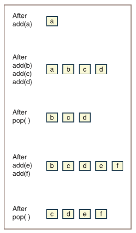

> 在`add(a)`之后
>
> 在`add(b)`、`add(c)`、`add(d)`之后
>
> 在`pop()`之后
>
> 在`add(e)`、`add(f)`之后
>
> 在`pop()`之后

图8-1 队列生命周期里的各种状态

一开始的时候队列为空；然后添加了一个被称为`a`的元素；接下来，添加了另外三个被称为`b`、`c`和`d`的元素；再之后弹出了一个元素，如此往复。

和队列相关的一个多项集被称为**优先队列**（**priority queue**）。在队列里，弹出或下一个需要服务的元素总是等待时间最长的那个元素。但是在某些情况下，这个限制过于严格了，因此可以把等待时间和优先级的概念相互结合起来。在优先队列里，优先级较高的元素将会先于优先级较低的元素被弹出，而优先级相同的元素则会按照FIFO的顺序被弹出。比如说，在飞机场乘客登机的情况，头等舱乘客会先排队并登机，接下来才是低优先级的经济舱乘客排队并登机。但是，这并不是真正的优先队列。因为在这里，头等舱队列里的乘客都已登机，并且经济舱队列开始登机之后，迟到的头等舱乘客就只能在第二个队列（经济舱队列）的末尾排队等候了。而在真正的优先队列里，这些头等舱乘客会立即跳过所有经济舱的乘客直接登机。

计算机科学里的大多数队列都涉及到调度来对共享资源进行访问。下面列出了一些例子：

* **CPU访问**——进程将会排队等待访问共享的CPU资源。

* **磁盘访问**——进程将会排队来访问共享的辅助存储设备。

* **打印机访问权限**——打印作业会排队等待访问共享终端的激光打印机。

进程的调度可以用到简单队列或是优先队列。比如，通常需要键盘输入和屏幕输出的进程会比那些只有庞大计算量的进程具有更高的优先级。由于人类用户一般会根据计算机的响应时间来判断计算机的速度，因此这样做的结果会给人以计算机速度很快的印象。

等待共享资源的进程也可以基于它们的预期使用时间而进行优先级排序，需要更短时间的进程的优先级将会高于需要更长时间进程，这也是为了缩短系统的响应时间。想象一下，如果有20个打印作业正在排队等待访问打印机，假设其中19个作业都只有1页长，而剩下那一个作业是200页长，那么如果把更短的作业给予更高的优先级并且首先打印，则会让更多的用户感到满意。

## 队列接口及其使用

如果很着急的话，Python程序员也可以用Python的列表来模拟队列。虽然把列表的哪一端视为队列的前端和后端都没有关系，但是最简单的策略就是用`list`的`append`方法将元素添加到这个队列的后端，然后通过`list`的`pop(0)`方法来删除并返回队列前端的元素。就像用这种方法实现的堆栈一样，这个选择的主要缺点是所有其它的列表操作（如：在任何位置插入、替换和删除元素）也可以操纵队列。这些额外的操作违反了队列作为抽象数据类型的意义。除此之外，在Python列表对象的开头删除元素是线性时间的操作。在这一节里，我们为队列的各种实现定义了一个更严格的接口，也就是一组特定的操作；并说明了如何使用这些操作。

除了`add`和`pop`操作，`peek`操作也会非常有用，这个操作会在队列的开头进行查看并返回相应的元素。队列接口里的其它操作都是多项集的标准操作。表8-1列出了所有的操作。

表8-1 队列接口里的方法

| 队列方法 | 它的功能 |
| --- | --- |
| `q.isEmpty()` | 当`q`为空时返回`True`；不然返回`False`。 |
| `__len__(q)` | 相当于`len(q)`，返回`q`里的元素数量。 |
| `__str__(q)` | 相当于`str(q)`，返回`q`的字符串表达形式。 |
| `q.__iter__()` | 相当于`iter(q)`或是`for item in q:`，自头向尾访问`q`里的每一个元素。 |
| `q.__contains__(item)` | 相当于`item in q`。当`item`在`q`里时返回`True`；不然返回`False`。 |
| `q1__add__(q2)` | 相当于`q1 + q2`，返回一个新队列，里面先包含`q1`里的元素，然后包含`q2`里的元素。 |
| `q.__eq__(anyObject)` | 相当于`q == anyObject`，如果当`q`等于`anyObject`时返回`True`，不然返回`False`。当两个队列里的元素都一一对应的时候它们就是相等的。 |
| `q.clear()` | 把`q`清空。 |
| `q.peek()` | 返回在`q`前端的元素。*先验条件*：`q`必须不为空，不然会引发`KeyError`异常。 |
| `q.add(item)` | 把`item`添加到`q`的后端。 |
| `q.pop()` | 删除并返回在`q`前端的元素。*先验条件*：`q`必须不为空，不然会引发`KeyError`异常。 |

可以看到，`pop`和`peek`方法都有一个非常重要的先验条件，如果队列的用户不满足这个先验条件，就会引发异常。

现在我们已经定义了队列接口，你将会学习如何去使用它。表8-2展示了前面列出的这些操作是如何影响队列`q`的。

表8-2 队列操作的状态

| 操作 | 操作后队列的状态 | 返回值 | 注释 |
| --- | --- | --- | --- |
| `q = <Queue Type>()` | | | 初始化，队列为空。 |
| `q.add(a)` | `a` | | 队列里有一个元素`a`。 |
| `q.add(b)` | `a` `b` | | `a`在队列的前端，`b`在后端。 |
| `q.add(c)` | `a` `b` `c` | `c`在队列的后端。 |
| `q.isEmpty()` | `a` `b` `c` | `False` | 队列不为空。 |
| `len(q)` | `a` `b` `c` | `3` | 队列包含三个元素。 |
| `q.peek()` | `a` `b` `c` | `a` | 在不删除的情况下返回队列前端的元素。 |
| `q.pop()` | `b` `c` | `a` | 删除并返回前端元素。现在`b`是位于队列前端的元素。 |
| `q.pop()` | `c` | `b` | 删除并返回`b`。 |
| `q.pop()` | | `c` | 删除并返回`c`。 |
| `q.isEmpty()` | | `True` | 队列为空。 |
| `q.peek()` | | `KeyError` | 在空队列进行查看操作会引发异常。 |
| `q.pop()` | | `KeyError` | 在空队列进行弹出操作会引发异常。 |
| `q.add(d)` | `d` | | `d`在队列的前端。 |

> 译者注：原文倒数第二、第三行的第三列的值是小写的`exception`和首字母大写的`Exception`，根据上下文和第7章里的内容，这里应该是`KeyError`。

你可以假定实现这个接口的任何队列类也都包含一个能够让用户创建新的堆栈实例的构造函数。在这一章的后面我们会讨论两个不同的实现，分别是`ArrayQueue`和`LinkedQueue`。现在，先假设实现它们的代码已经被编写完成，那么你就可以直接使用它们了。下面这个代码片段展示了如何去实例化这两个类：

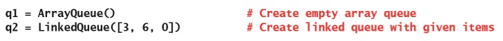

### 练习题

1. 基于下面这些对队列进行操作的序列，完成一个像表8-2格式的表格。

    | 操作 | 操作后堆栈的状态 | 返回值 |
    | --- | --- | --- |
    | `q = <Queue Type>()` | | |
    | `q.add(a)` | | |
    | `q.add(b)` | | |
    | `q.add(c)` | | |
    | `q.pop()` | | |
    | `q.pop()` | | |
    | `q.peek()` | | |
    | `q.add(x)` | | |
    | `q.pop()` | | |
    | `q.pop()` | | |
    | `q.pop()` | | |

    > 译者注：第一行第一列的值原文为`Create q`，根据上下文和第7章的内容应该是`q = <Queue Type>()`。

2. 定义一个叫做`stackToQueue`的函数。这个函数会接收一个堆栈作为参数，然后生成并返回一个`LinkedQueue`实例，这个实例会包含堆栈里的所有元素。这个函数所接收的堆栈实现了第7章“堆栈”里描述的接口。这个函数的后置条件是，堆栈会和调用这个函数之前的状态相同，并且队列里的前端的元素是位于堆栈的顶端的元素。

## 队列的两个应用程序

接下来，你将会学习到队列的两个应用程序：第一个是计算机模拟，而另一个则是CPU的轮询调度。

### 模拟

计算机**模拟**（**simulation**）可以用来研究现实世界系统的行为，尤其对于那些直接使用系统进行实验会非常危险或不可能完成的场景。比如说，计算机模拟可以用来模拟繁忙的高速公路上的交通流量，从而让城市规划人员可以通过它来试验影响交通流量的各种因素，像是高速公路上车辆的数量和类型、不同类型车辆的速度限制、高速公路上的车道数以及收费站的频率等等。这种模拟的输出能够得出在指定时间段内在指定点之间移动的车辆总数和平均行驶时间等等数据。通过使用各种不同的输入组合来运行模拟，规划人员就可以在不受时间、空间和金钱的约束下确定如何最好地对高速公路的路段进行升级。

第二个关于模拟的例子可以是：一家超市的经理会面临的需要确定一天里不同时间安排的收银员数量的问题。关于这个问题，应该有下面这些重要因素：

* 新顾客到达的频率

* 可用的收银员数量

* 顾客购物车里的商品数量

* 可以接受的等待时间

把这些因素输入到模拟程序里去，然后就可以得到能够处理的顾客总数、每个顾客等待服务的平均时间以及在模拟结束时仍在排队的顾客数量。通过不同的输入情况（特别是顾客到达的频率和可用的结账收银员的数量），模拟程序可以帮助经理为一天中繁忙和闲暇的时段做出更有效的人员配备的决策。如果添加一个用来量化不同结账设备效率的输入，经理甚至可以决定是需要增加更多收银员还是购买更好、更高效的设备会带来更大的成本效益。

这两个例子和通常的模拟问题的一个共同特征是基本要素的瞬时变化。比如说顾客到达收银台的频率，如果顾客会以精确的间隔抵达商店的话，并且每位顾客都有相同数量的商品在购物车里，那么就可以很容易地确定需要几名收银员值班。但是，这种规律性并不能反映出超市的真实情况。因为有时候可能会同时出现若干个顾客，而在其它时候可能会有几分钟都没有新的顾客来店里。除此之外，购物车里的商品数量也会因顾客而异。因此，每个顾客结账所需的服务量也会不同。所有这些可变性使得很难设计一个公式来回答系统里哪怕是非常简单的问题，例如，顾客的等待时间是如何随值班收银员的数量而变化的。另外，模拟程序通常会通过模仿实际情况并且收集相关的统计信息，从而避免了对公式的需求。

模拟程序会使用一种简单的技术来模拟可变性。对于前面的例子，假设平均每4分钟会到达一个新顾客。那么对于模拟时间里每一分钟，程序都会生成一个介于0和1之间的随机数。如果这个随机产生的数字小于1/4时，这个程序就会会把一个新顾客添加到结账的队伍里；不然的话就什么都不做。如果采纳的是基于概率分布函数的更复杂的方案的话，就可以产生更加切合实际的结果。而且很明显，程序每次运行的时候结果都会稍有不同，但是这并不是什么问题，反而增加了模拟的真实感。

通过这些例子，接下来你将会学习到队列所扮演的常见角色。这两个示例里都涉及到了服务提供商和服务使用者。在第一个例子里，服务提供商包括了收费站和行车道，服务使用者则是在收费站等待并在车道上行驶的车辆。在第二个例子里，收银员会提供等待的顾客所需要的服务。要在程序里模拟这些条件，可以把每个服务提供者和服务使用者通过队列关联起来。

模拟就是通过操作这些队列来进行的。在虚拟时钟的每一个节拍中，模拟器都会将不同数量的使用者添加到队列里，并为位于各个队列前端的使用者提供一个单位的服务。使用者在得到所需数量的服务后就会离开队列，后面的使用者将会得到服务。在模拟的过程中，程序会统计各种信息，例如每个使用者在队列里等待了多少个虚拟时钟以及每个提供商忙碌时间的百分比。时钟的长短会根据需要匹配的模拟问题来进行选择，它可能代表一毫秒、一分钟或者可能是十年。对于程序本身来说，时钟对应的会是这个程序的需要处理的主循环里的一次。

你可以使用面向对象的方法来实现模拟程序。比如，对于模拟超市收银来说，每个顾客都是一个`Customer`类的实例。顾客对象会跟踪顾客是什么时候开始排队、什么时候开始获得服务以及需要多少服务。同样的，收银员是`Cashier`类的实例，每个收银员对象都有一个用来存放顾客对象的队列。模拟器类将会负责协调顾客和收银员的活动。在每一个时钟里，模拟器对象都会执行下面这些操作：

* 适当地生成新的顾客对象；

* 将顾客分配到收银员；

* 告诉每个收银员为队列最前面的顾客提供一个单位的服务

你可以基于这一章的第一个案例研究的思路来开发出一个程序。然后在练习里对这个程序进行扩展。

### CPU的轮询调度

大多数现代计算机都允许多个进程共享一个CPU。有很多种不同的技术可以用来对这些过程进行调度。最常见一种被称为**轮询调度**（**round-robin scheduling**），它会把新的进程添加到**就绪队列**（**ready queue**）的末尾，这个队列由等待使用CPU的进程组成。就绪队列里的每个进程将会依次弹出，并分配到一定的CPU时间。时间片用完后，进程将会返回到队列的后端，就像图8-2这样。

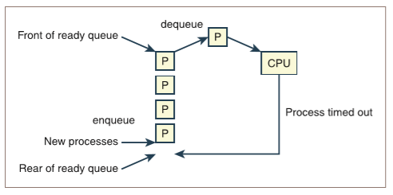

> Front of ready queue -> 就绪队列的前端
>
> enqueue -> 入队
>
> New processes -> 新进程
>
> Rear of ready queue -> 就绪队列的后端
>
> Process timed out -> 进程使用完时间
>
> dequeue -> 出队

图8-2 进程的CPU调度

通常来说，并不是所有的进程都非常迫切的需要使用CPU。比如，用户对计算机的主观满意度，很大程度上取决于计算机对键盘和鼠标输入的响应时间。因此，优先处理这些输入的进程不言而喻会显得非常有意义。轮询调度可以通过使用优先队列，进而为每个进程分配适当的优先级来满足这个要求。这部分讨论的后续内容，将会在这一章的第二个案例研究里展开，这个案例研究将会分析如何使用优先队列，在急诊室里安排不同的患者。

### 练习题

1. 假设一家24小时营业的超市里的顾客会以每两分钟一名的准确频率结账。再假定一位收银员处理一位顾客正好需要五分钟。为了满足需求，需要多少个收银员值班？顾客需要排队吗？每个收银员每小时将会有多少空闲时间？

2. 现在假设频率（每2分钟有一位顾客，每位顾客结账需要5分钟）代表的是平均值。定性描述这将会如何影响顾客等待的时间。这种变化会影响到每个收银员的平均空闲时间吗？描述在这两种情况下，如果收银员数量减少或增加分别会发生什么情况。

## 队列的实现

这一章介绍的队列实现方法和堆栈使用的方法是类似的。队列的结构可以通过数组实现或是通过链式实现。为了直接获得一些默认行为，可以把这些队列的实现作为多项集框架里`AbstractCollection`类（请参见第6章，“继承与抽象类”）的子类。我们将会先讨论链式实现，因为它更直观一些。

### 队列的链式实现

堆栈和队列的链式实现有很多共同点：`LinkedStack`和`LinkedQueue`这两个类都使用了支持单向链接的`Node`类来实现节点；`pop`操作在两个多项集里都删除掉序列里的第一个节点。但是，`LinkedQueue.add`和`LinkedStack.push`是不一样的。操作`push`会在序列的开头添加一个节点，而`add`则是在末尾添加一个节点。为了提供对队列链接结构两端的快速访问，我们会为两端都加上外部指针。图8-3展示了包含四个元素的链接队列。

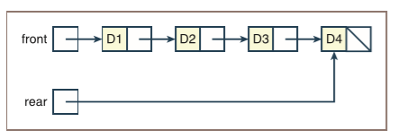

图8-3 包含四个元素的链接队列

`LinkedQueue`类的实例变量`front`和`rear`的初始值都是`None`。在多项集框架里，已经定义了的叫做`size`的变量，则会被用来跟踪队列中当前的元素数量。

在`add`操作的过程中，会创建一个新节点，然后把最后一个节点指向下一个的指针设置为这个新节点，并且把变量`rear`也指向新节点，就像图8-4这样。

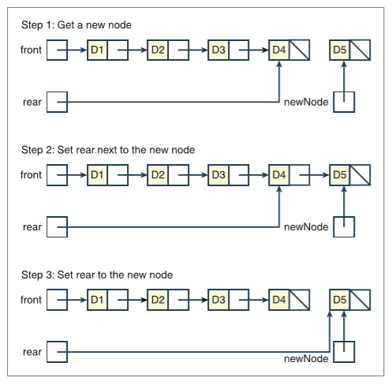

> 第一步：创建一个新节点
>
> 第二步：把`rear.next`指向新节点
>
> 第三步：把`rear`指向新节点

图8-4 将元素添加到链接队列的后面

这是`add`方法的代码：

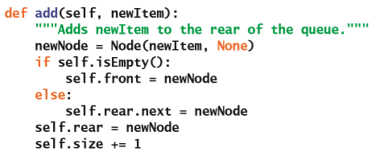

前面提到了`LinekdQueue.pop`方法和`LinkedStack.pop`方法是类似的。不同的点在于，如果在`pop`操作之后队列为空，那么`front`和`rear`指针都必须要被设置为`None`。下面是它的代码：

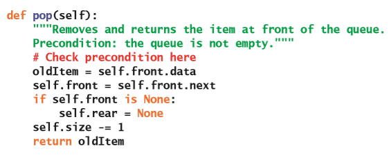

关于完成所有`LinkedQueue`类的功能，包括对`pop`和`peek`方法的先验条件的验证，将会作为练习留给你。

### 队列的数组实现

堆栈的数组实现和队列的数组实现相比，不像与链式实现相比那样有很多共同点。堆栈的数组实现只需要在数组的逻辑结尾访问元素就行了；但是，队列的数组实现必须访问到逻辑起点和逻辑终点的元素。若要以计算有效的方式来执行这个操作会很复杂；因此我们将会不断演进我们的实现，最终在第三次尝试的时候得到一个很好的解。

#### 第一次尝试

在实现队列的第一次尝试里，我们会把队列的前端固定在索引位置0处，并维护一个叫做`rear`的索引变量来指向位置$n - 1$处的最后那个元素，其中$n$是队列里的元素数量。这样就实现了一个在有六个内存单位的数组里包含四个数据元素的队列，如图8-5所示。

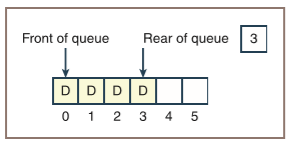

图8-5 包含四个元素的数组实现的队列

对于这个实现来说，`add`操作非常有效。但是，弹出操作需要把数组里除第一个元素以外的所有元素都向左移动，因此是一个$O(n)$的过程。

#### 第二次尝试

你可以通过在每次应用`pop`操作时不用向左移动元素来避免它的线性行为。修改后的实现将会维护另一个被称为`front`的索引，这个索引会指向队列里最前面的元素。`front`索引在开始的时候是0，然后会在弹出元素时进行自增来通过数组。图8-6展示了一个经历了五次`add`和两次`pop`操作之后的队列。

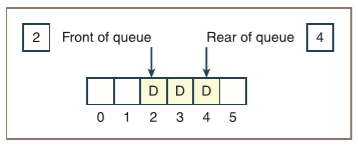

图8-6 包含`front`索引的数组实现的队列

可以看到，在这个方案里，队列的`front`索引左边的内存单位不会被再次使用，除非你把所有的元素都向左移动，这个操作可以在`rear`索引要到达结尾的时候执行。这样，`pop`操作的最大运行时间就是$O(1)$了，但这是以`add`操作的最大运行时间从$O(1)$增长到$O(n)$为代价的。除此之外还有一个遗憾，队列的`front`索引左侧的数组内存一直被浪费着。

#### 第三次尝试

通过使用**环形数组**（**circular array**）来实现，你可以同时让`add`和`pop`操作都拥有良好的运行时间。这个实现有点类似于前面的实现：`front`和`rear`索引在开始的时候都指向数组的开头。

但是，在这个实现里，`front`索引会在数组里“追逐”`rear`索引。在`add`操作执行的过程中，`rear`索引将向后移动从而远离`front`索引；而在`pop`操作时，`front`索引将会追回一个位置。当这两个索引里的任何一个到达了数组结尾时，这个索引将会被重置为0。这样做就相当于把队列绕成了一个环回到了数组的开头，并且不需要移动任何元素。

比如，假设有一个数组实现的队列包含六个内存单位，并且已经添加了六个元素，然后弹出了两个元素。根据这个实现方案，下一次的`add`操作会把`rear`索引重置为0。图8-7展示了这一次`add`操作将`rear`索引重置为0之前和之后的数组状态。

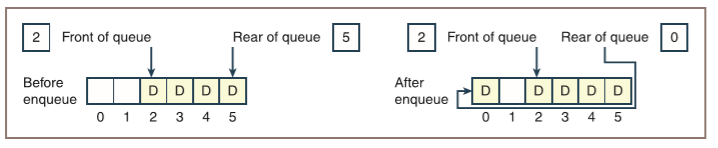

> 入队之前
>
> 入队之后

图8-7 将数据放在队列的环形数组里

接下来好像变成了`rear`索引在追逐`front`索引，直到`front`索引到达数组的末尾然后被重置为0。可以看到，`add`和`pop`操作的最大运行时间现在都是$O(1)$了。

顺着这个思路，你应该思考当队列已满时会发生什么，以及在这种实现下如何检测到这种情况。通过维护队列里的元素计数，可以确定队列是满还是空。当这个计数等于数组的尺寸时，你就该调整数组的大小了。

调整大小后，你应该让队列里的数据占据新数组的前半段，并且把`front`索引设置为0。要实现这个操作，需要执行下面这些步骤：

1. 创建一个新数组，它的大小是当前数组的两倍。

2. 使用`for`循环来遍历队列，从而把元素复制到新数组去，并且是从这个新数组的位置0开始进行复制。

3. 将`items`变量指向新数组。

4. 将`front`索引设置为0，`rear`索引设置为队列的长度减1。

基于数组的队列的具体尺寸调节代码取决于队列的迭代器。因为这个迭代器可能需要在环形数组里环绕，所以它的代码将比本书前面开发的基于数组的多项集的迭代器的代码更加复杂。`ArrayQueue`类的环形数组实现的其它部分，将留给你作为练习。

### 两种实现的时间和空间复杂度分析

这两个队列类的时间和空间分析和相应的堆栈类的时间和空间分析是相同的，因此我们不再对细节进行挖掘。首先来考虑队列的链式实现：`__str__`、`__add__`和`__eq__`方法的运行时间为$O(n)$；其它所有的方法的最大运行时间为$O(1)$。特别要注意的是，由于在队列的链接结构里同时存在指向标头节点和尾节点的外部链接，因此你可以在常数时间内访问到这些节点。而总共的空间需求会是$2n + 3$，其中$n$是队列的大小；并且因为这$n$个节点里的所有节点都会有一个数据的引用和一个指向下一个节点的指针；除此之外，还有额外的三个用来存放队列的逻辑尺寸和首尾指针的内存单位。

对于队列的环形数组实现，如果数组是静态的，那么`__str__`、`__add__`和`__eq__`以外的其它所有方法的最大运行时间都是$O(1)$。特别需要指出的是，在`add`或`pop`操作的过程中，数组里的任何元素都不会有移位。如果数组是动态的，那么只有在调整数组尺寸的时候`add`和`pop`操作的最大运行时间会达到$O(n)$；但平均运行时间仍然为$O(1)$。就像在第4章“数组和链接结构”里提到的那样，数组实现的空间利用率还是取决于负载因子。对于大于$1/2$的负载因子的情况下，数组实现相比链式实现能够更有效地使用内存，对于负载因子低于$1/2$的情况下，内存使用效率会更差。

### 练习题

1. 编写这样一段代码：这个代码片段在`add`操作的过程中使用`if`语句来调整环形数组实现的`ArrayQueue`的后端索引。你可以假设队列的实现里使用了变量`self.rear`和`self.items`来分别引用后端索引和数组。

2. 编写这样一段代码：这个代码片段在`add`操作的过程中使用`%`操作符而不是`if`语句来调整环形数组实现的`ArrayQueue`的后端索引。你可以假设队列的实现里使用了变量`self.rear`和`self.items`来分别引用后端索引和数组。

## 案例研究：超市收银排队的模拟

在这个案例研究里，你将会通过开发一个程序来模拟超市的收银台。为了简化程序，我们省略了在实际超市里可能会出现的一些重要因素。这些因素留给你作为练习的一部分。

### 案例需求

编写一个程序，使用户可以预测在各种条件下超市收银排队的行为。

### 案例分析

为了简单起见，我们对这个案例加上了下面这些限制：

* 只有一个收银台，也只有一名收银员。

* 每个顾客需要购买的商品数量是相同的，而且需要相同的处理时间。

* 新顾客到达收银台的概率不会随时间变化

这个模拟程序的输入有：

* 模拟器应该运行的总时间（以抽象分钟为单位）。

* 服务单个顾客所需的分钟数。

* 新顾客在下一分钟到达收银台的概率。这个概率应该是一个大于0且小于或等于1的浮点数。

这个程序的输出包含了已被处理的顾客总数、时间用完后还在排队的顾客数量以及顾客的平均等待时间。表8-3对输入和输出进行了总结。

表8-3 超市收银模拟的输入和输出

| 输入 | 输入值的范围 | 输出 |
| --- | --- | --- |
| 总时间 | 0 <= 总时间 <= 1000 | 已被处理的顾客总数 |
| 单个顾客所需的平均分钟数 | 0 < 平均时间 <= 总时间 | 还在排队的顾客数量 |
| 下一分钟新顾客到达的概率 | 0 < 概率 <= 1 | 平均等待时间 |

### 用户交互接口

下面将会是这个系统和用户的交互接口：

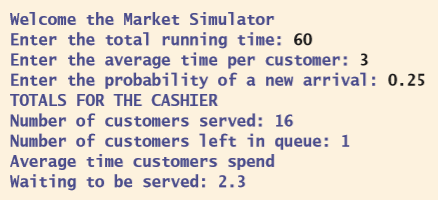

### 类和它们的职责

对于类和它们所承担的职责而言，这个系统将会被分为一个`main`函数和若干个模型类。`main`函数负责与用户进行交互，验证输入的三个值以及与模型进行通信。这个函数的设计和实现不需要注释，当然我们也无需在这里显示它的代码。表8-4里列出了模型里需要的类。

表8-4 模型里的类

| 类 | 职责 |
| --- | --- |
| `MarketModel` | 超市模型会做下面这些事情： |
| | 1. 执行模拟。 |
| | 2. 创建收银员对象。 |
| | 3. 把新的顾客对象交给收银员。 |
| | 4. 维护一个抽象时钟。 |
| | 5. 在时钟的每一个节拍，告诉收银员为顾客提供另一个单位的服务。 |
| `Cashier` | 收银员对象的行为： |
| | 1. 包含一个存放顾客对象的队列 |
| | 2. 按照指示将新顾客对象添加到自己的队列里。 |
| | 3. 依次从队列里删除顾客。 |
| | 4. 根据指示为当前顾客提供一个单位的服务，并在服务完成后释放顾客。 |
| `Customer` | 顾客对象的行为： |
| | 1. 获取顾客的到达时间以及需要多少服务量。 |
| | 2. 知道收银员在什么时候提供了足够的服务。当满足新顾客到达的概率时，基于这个类产生新的顾客对象。 |
| `LinkedQueue` | 收银员对象会用它来存放排队的顾客对象。 |

这些类之间的关系如图8-8所示。

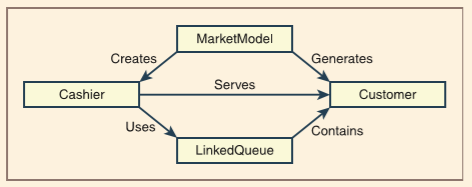

图8-8 超市结账模拟器的类图

系统的总体设计思路被反映在下面图8-9所展示的协作图里。

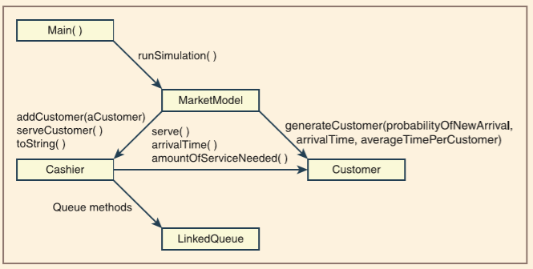

图8-9 超市结账模拟器的协作图

接下来，你就可以逐个设计和实现这些类了。

由于我们对结账的情况进行了限制，因此`MarketModel`类的设计会非常简单。它的构造函数会执行下面这些操作：

1. 保存输入数据——新到顾客的概率、模拟的时间以及每位顾客所需的平均时间。

2. 创建一个收银员对象。

> 译者注：原文这里的序号有问题

除此之外，这个类还需要唯一一个方法是`runSimulation`。这个方法用来运行模拟结账过程的抽象时钟。在时钟的每一个节拍中，这个方法会执行三件事：

1. 让`Customer`类基于新到顾客的概率和随机数生成器的输出来生成一个新顾客。

2. 如果生成了新顾客，把这个新顾客发送给收银员。

3. 让收银员向当前的顾客提供一个单位的服务。

模拟结束后，`runSimulation`方法会把收银员的结果返回到视图里去。下面是这个方法的伪代码：

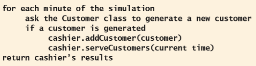

可以看到，这个伪代码算法会让`Customer`类生成一个它自身的实例。由于顾客很可能会在给定的任何时间内到达，但是有时也并不会生成顾客；于是你可以把这部分逻辑隐藏在`Customer`类的**类方法**（**class method**）里去，而不需要在这个函数里实现这部分逻辑。在这个模型里，`Customer`类的`generateCustomer`方法会接收新顾客到达的概率、当前时间以及每个顾客所需的平均时间。接着这个方法再使用这些信息来确定要不要创建一个新的顾客，以及如果创建了新的顾客，应该如何去初始化这个对象。这个方法将会返回一个新的`Customer`对象或是`None`值。运行类方法的语法和运行实例方法的语法是一样的，只是点的左侧所使用的名称是这个类的名称。

下面是`MarketModel`类的完整代码：

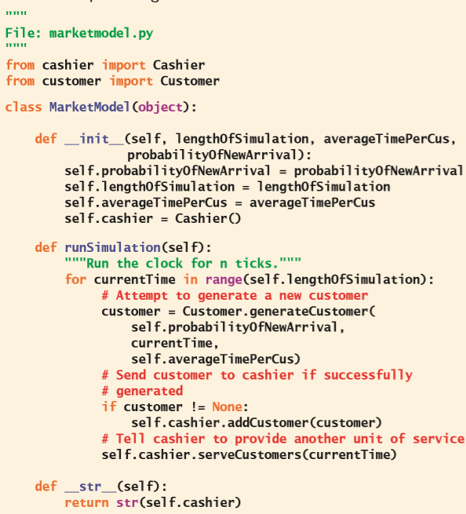

收银员负责为排队的顾客进行服务。在这个过程中，收银员会统计服务了的顾客数量以及他们排队等候的时间。在模拟结束时，这个类的`__str__`方法会返回这些数据以及队列里还剩下的顾客数量。这个类包含下面这些实例变量：

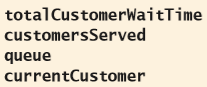

最后这个变量被用来保存当前正在处理的顾客。

为了允许超市模型将新顾客发送给收银员，这个类实现了`addCustomer`方法。这个方法会以顾客为参数，并将顾客添加到收银员里的队列里去。

`serveCustomers`方法会处理在一个时钟节拍中收银员的活动。这个方法能够以当前时间为参数，并且按照几种不同的方式进行响应，像表8-5这样。

表8-5 时钟节拍中收银员的职责

| 条件| 什么意思 | 执行动作 |
| --- | --- | --- |
| 当前顾客是`None`，并且队列为空。 | 没有可以服务的顾客。 | 什么都不做；直接返回。 |
| 当前顾客是`None`，并且队列不为空。 | 队列的前端存在一个顾客在等待。 | 1. 弹出一个顾客对象，使这个对象成为当前被服务的顾客。 |
| | | 2. 得到顾客对象实例化的时间，确定他等待了多长时间，并把这个时间添加到所有顾客等待的总时间里去。 |
| | | 3. 增加已经服务过了的顾客数量。 |
| | | 4. 为顾客提供一个单位的服务，如果顾客所需的服务完成了的话，就释放顾客对象。 |
| 当前顾客不是`None` | 服务当前顾客。 | 为顾客提供一个单位的服务，并如果顾客所需的服务完成了的话，就释放顾客对象。 |

下面是`serveCustomers`方法的伪代码：

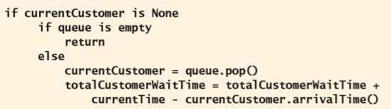

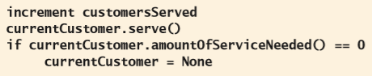

这是收银员类的代码：

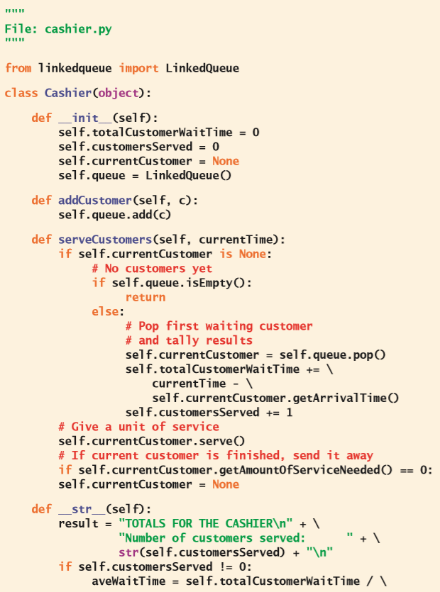

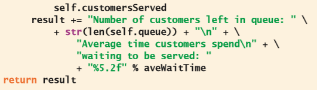

`Customer`类会维护顾客的到达时间和所需的服务量。它的构造函数会使用超市模型里提供的数据来进行初始化。这个类包含下面这些实例方法：

* `getArrivalTime()`——返回顾客到达收银员队列的时间。

* `getAmountOfServiceNeeded()`——返回剩余的服务单位数。

* `serve()`——将服务单位的数量减一。

除此之外，还有一个叫做`generateCustomer`的*类方法*。类方法和实例方法的不同在于，类方法是在类上进行调用的而不是在这个类的实例或对象上调用的。`generateCustomer`方法会接收新顾客到达的概率、当前时间以及每个顾客所需的服务单位数量作为参数。当这个概率大于或等于一个0到1之间的随机数时，这个方法会返回一个包含给定时间和服务单位的新的`Customer`实例。不然的话，这个方法会返回`None`，表示没有生成任何顾客实例。下面展示了这个方法是如何使用的：

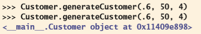

可以看到，这个方法的第一次调用看起来没有返回任何内容，这是因为这个函数实际上返回了`None`，而在IDLE里，这个值不会被打印出来。第二次调用返回了一个新的`Customer`对象。

在Python里定义类方法的语法是：

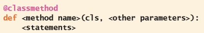

这是`Customer`类的代码：

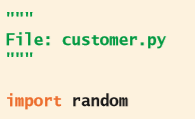

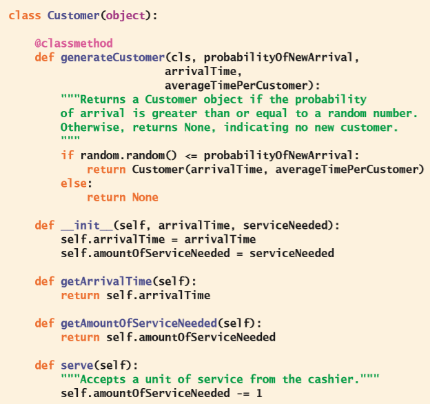

## 优先队列

前面提到过，优先队列是一种特殊的队列。当把元素添加到优先队列时，它会为这些元素分配相应的优先级顺序。在删除元素时，优先级较高的元素会在优先级较低的元素之前被删除。而具有相同优先级的元素通常是按照FIFO的顺序被删除。如果A < B，就代表元素A的优先级高于元素B。也就是说，可以在优先队列里对整数、字符串或者任何其它支持比较运算符的对象进行排序。如果某个对象不支持比较运算符，那么可以把它们和优先级包装或捆绑在另一个支持这些运算符的对象里。于是，优先队列就可以让相同类型的不同对象进行比较了。

由于优先队列与队列非常相似，因此它们都包含有相同的接口，也就是一组操作（参见表8-1）。表8-6展示了优先队列在生命周期里的各种状态。可以看到，在这个例子里，数据元素都是整数，因此越小的整数的优先级越高。

表8-6 优先队列生命周期里的各种状态

| 操作 | 操作后队列的状态 | 返回值 | 注释 |
| --- | --- | --- | --- |
| `q = <Priority queue type>()` | | | 初始化，队列为空。 |
| `q.add(3)` | 3 | | 队列里有一个元素`3`。 |
| `q.add(1)` | 1 3 | | 因为1有更高的优先级，所以1在队列的前端，3在后端。 |
| `q.add(2)` | 1 2 3 | 1比3有更高的优先级，因此2在3前面。 |
| `q.pop()` | 2 3 | 1 | 删除并返回前端元素。现在2是位于队列前端的元素。 |
| `q.add(3)` | 2 3 3 | 新插入的3按照FIFO的顺序在老的3后面。 |
| `q.add(5)` | 2 3 3 5 | 5的优先级最低，所以它在最后。 |

前面提到过，当一个对象本身并不支持可比性时，可以把它和优先级包装在另一个可以进行比较的对象里。因此你可以定义一个**包装器类**（**wrapper class**）来为不支持可比性的元素构建出可比性元素。这个新类被称为`Comparable`。它包含一个接收数据元素和这个元素的优先级作为参数的构造函数。优先级必须是整数、字符串或其它支持比较运算符的对象。当使用比较运算符时，Python会查找对象的比较方法。创建好包装器对象后，就可以通过使用`getItem`、`getPriority`、`__str__`、`__eq__`、`__le__`以及`__lt__`方法来提取出元素和它的优先级、返回它的字符串表达形式以及根据优先级来进行比较。下面是`Comparable`类的代码：

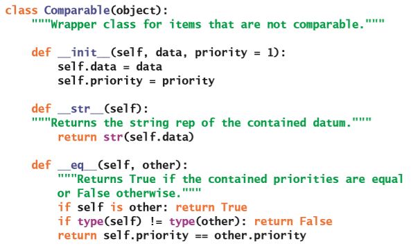

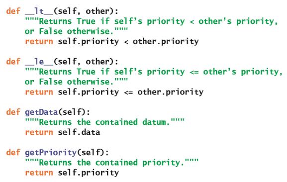

可以看到，`__str__`方法也被包含在了`Comparable`类里，因此队列的`__str__`方法对于这些元素的行为会有一定的预期。

在插入操作的过程中，优先队列并不知道它比较的是包装器里的元素还是直接对元素进行的比较。因此在使用`peek`方法、`pop`方法或是在`for`循环里访问包装之后的元素时，必须在处理之前使用`getItem`方法把它从包装里取出来。比如说，假设被标记为`a`、`b`和`c`的元素之间不能进行比较，但是它们在队列里的优先级分别是1、2和3。那么，把它们添加到叫做`queue`的优先队列里并且从队列里取出它们的代码是这样的：

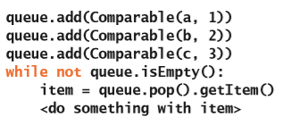

这本书会讨论优先队列的两种实现。在这一章里，我们讨论的是它的有序列表的实现，也就是会扩展前面介绍的`LinkedQueue`类。在后面的第10章“树”里，我们将会介绍优先队列的另一个实现方式——使用被称为堆的数据结构来。

有序列表是指按自然顺序维护的可以进行比较的元素的列表。优先队列里的列表应当始终能够在列表的一端得到或删除最小的元素；并且元素可以按顺序插入到正确的位置。

如果始终需要从结构的开头删除最小的元素，那么单向链接结构是存放这种类型的列表的最佳选项。如果这个结构是从`LinkedQueue`类里使用的单向链接结构继承的，那么就可以通过运行这个类的`pop`方法来删除这个元素。在新的子类`LinkedPriorityQueue`里，只有`add`方法需要被修改，它的定义会被覆盖。

新的`add`方法的实现会在列表里搜索新的元素的位置。它将会考虑下面这些情况：

1. 如果队列为空或者新的元素大于或等于后端的元素，像之前一样添加它。（将元素放置在后端。）

2. 不然的话，从头开始并向右移动，直至找到新的元素小于当前节点里的元素的位置。这个时候，就需要在当前节点和它的上一个节点（如果存在的话）之间插入一个包含这个新元素的新节点。为了完成插入操作，搜索会使用两个指针，分别被称为`probe`和`trailer`。当搜索停止时，`probe`将会指向新的元素位置*之后*的那个节点。如果这个节点不是第一个节点的话，这时`trailer`指向的就是新的元素位置*之前*的那个节点；因此，我们可以把新节点指向下一个节点的指针设置为`probe`指针。如果`probe`指针不是指向第一个节点的话，那么把它的上一个节点指向下一个的指针设置为新节点就行了。不然的话，把队列的`front`指针设置为新节点。

为了说明在第二种情况下的过程，图8-10描绘了在一个包含三个整数1、3和4的优先队列里为2执行`add`操作的过程。在这个过程中`probe`和`trailer`指针的调整需要特别注意。

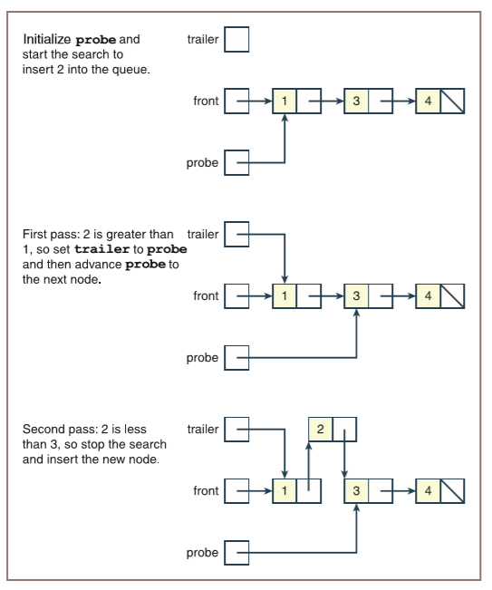

> 初始化`probe`指针并且在队列里搜索插入2的位置
>
> 遍历的第一回合：2大于1，因此设置`trailer`指向`probe`，然后把`probe`指向它的下一个节点
>
> 遍历的第二回合：2小于3，停止搜索，并插入新的节点

图8-10 将元素插入优先队列

虽然`add`方法的代码很复杂，但好在你不用在新类里编写其它的方法。除此之外，我们可以在第一种情况的时候通过使用`LinkedQueue`的`add`方法来重用部分逻辑。

这是`LinkedPriorityQueue`类的代码：

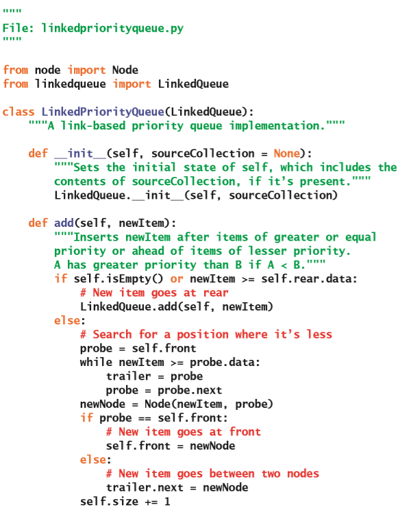

除了`add`方法外，`LinkedPriorityQueue`的时间和空间分析和`LinkedQueue`的时间和空间分析是一样的。在这里，`add`方法必须要搜索需要插入元素的正确位置。只要找到了这个位置，重新组合链接只是一个常数时间的操作，但是搜索本身是线性的，因此`add`方法的时间复杂度现在是$O(n)$。

### 练习题

提出一种基于数组来实现优先队列的策略。它的空间/时间复杂度会和链接的实现方式有所不同吗？这里需要处理的权衡是什么？

## 案例研究：急诊室调度程序

去过繁忙的医院急诊室的人都知道，人们必须要排队就医。虽然大家都在同一个地点等待，但实际上他们并不是排在同一组里，医导会根据病情的急迫程度来安排谁先就诊。这个案例研究将会开发一个通过使用优先队列来执行这样的调度的程序。

### 案例需求

编写一个程序，让医导可以为进入医院急诊室的患者安排治疗顺序。假设，由于某些患者的病情会比其他患者更为紧急危重，所以不会严格按照先到先得的原则对患者进行治疗，而是在他们入院时就根据病情相应地分配了优先级。高优先级的患者会比低优先级的患者得到更及时的诊疗。

### 案例分析

患者进入急诊室时会属于下面三种状况之一。按照优先级，他们的排名如下：

1. 致命

2. 严重

3. 一般

当程序的使用者（医导）选择“预约”的选项之后，这个程序能够让用户输入患者的姓名和病情，并根据患者病情的严重性让他排队候诊。当用户选择“治疗下一个病人”的选项时，程序会在队列里找到病情最严重、并且最先到的那名患者，从队列里移除掉这名患者并在屏幕上显示他的信息。当用户选择“治疗所有病人”的选项时，程序将从列表里删除并显示出所有的排好序的患者。

每个命令按钮都会在输出区域里产生相应的消息。表8-7列出了接口对命令的响应。

表8-7 急诊室程序的命令

| 用户命令 | 程序响应 |
| --- | --- |
| 预约 | 让用户输入患者的姓名和病情，然后输出：`<patient name> is added to the <condition> list.`。 |
| 治疗下一个病人 | 输出：`<patient name> is being treated.`。 |
| 治疗所有病人 | 输出：`<patient name> is being treated.`。 |

下面是和基于终端的接口进行交互的结果：

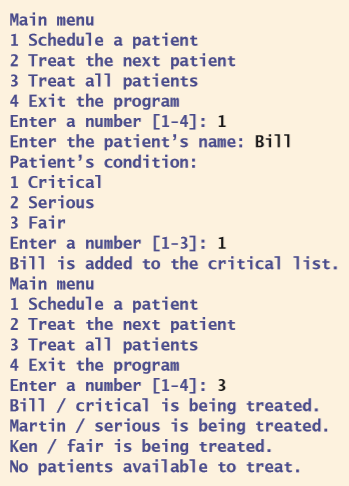

### 类

这个应用程序由一个被称为`ERView`的视图类和若干模型类组成。视图类会和用户进行交互并在数据模型上运行方法。`ERModel`类会维护患者的优先队列。`Patient`类代表患者，`Condition`类代表三种病情的状况。类与类之间的关系如图8-11所示。

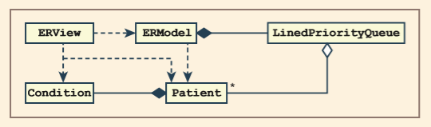

图8-11 ER调度系统里的类

### 案例设计与实现

`Patient`类和`Condition`类会被用来维护患者的姓名和病情。这两个类都可以进行比较（根据病人的病情），也可以通过字符串形式来查看它们。下面是这两个类的代码：

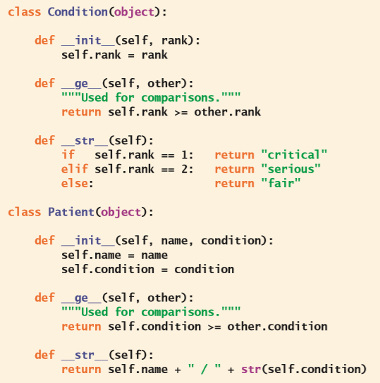

`ERView`类使用典型的菜单驱动循环来完成。你可以使用几个辅助方法来构造代码。这是它的代码：

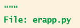

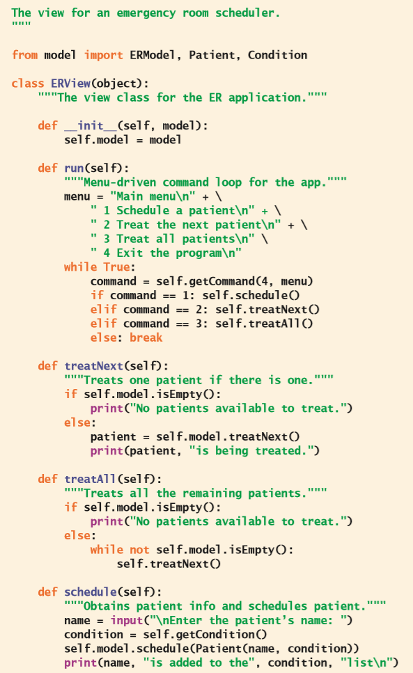

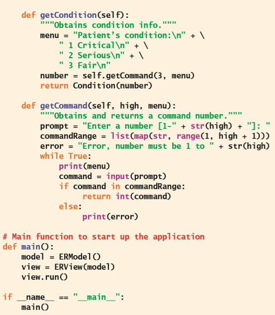

`ERModel`类会使用优先队列来安排患者。它的实现将留给你作为编程项目。

## 章节总结

* 队列是一个线性多项集，它会让元素在一端（被称为后端）进行添加，然后从另一端（被称为前端）删除元素。因此，它将会按照先进先出（FIFO）的顺序对元素进行访问。

* 对队列的其它操作包括：查看前端的元素、确定元素的数量、确定队列是否为空以及返回队列的字符串表达形式。

* 队列被用在需要按照FIFO顺序管理数据元素的应用程序里。这些应用程序包括调度元素从而对资源进行处理或访问。

* 数组和单向链接结构可以简单地实现队列。

* 优先队列同时使用了优先级方案和FIFO顺序来调度它里面的元素。如果两个元素具有相同的优先级，那么就以FIFO的顺序对它们进行调度。不然的话会根据某些属性（例如数字或字母内容），将元素从最小到最大进行排序。通常来说，在任何情况下，在优先队列里插入的优先级的值更小的元素，都会被首先删除。

## 复习题

1. 队列的例子有（选择所有满足的选项）：

    a) 在结账台排队的顾客

    b) 一副扑克牌

    c) 文件目录系统

    d) 收费站排队的一排汽车

    e) 洗衣篮

2. 对队列进行修改的操作是：

    a) 添加和删​​除

    b) 添加和弹出

3. 队列也被称为：

    a) 先进先出的数据结构

    b) 后进先出的数据结构

4. 包含元素`a` `b` `c`的队列的前端在左侧。经过两次弹出操作之后，队列还包含：

    a) `a`

    b) `c`

5. 包含元素`a` `b` `c`的队列的前端在左侧。在执行`add(d)`操作之后，队列会包含：

    a) `a` `b` `c` `d`

    b) `d` `a` `b` `c`

6. 对于链接结构里的节点之类的对象的内存分配在：

    a) 对象堆

    b) 调用堆栈

7. 三个队列变异器操作的运行时间是：

    a) 线性的

    b) 常数的

8. 队列的链式实现用到了：

    a) 包含指向下一个节点链接的节点

    b) 包含指向下一个和上一个节点链接的节点

    c) 包含指向下一个节点链接的节点以及指向第一个节点和最后一个节点的外部指针

9. 在队列的环形数组实现里：

    a) 前索引在数组里追逐后索引

    b) 前索引总是小于或等于后索引

10. 优先队列里的元素排列的顺序是：

    a) 最小（最高优先级）到最大（最低优先级）

    b) 最大（最高优先级）到最小（最低优先级）

## 编程项目

1. 完成这一章讨论的队列多项集的链式实现。当没有满足先验条件时，验证是否引发了异常。

2. 完成并测试这一章里讨论的队列多项集的环形数组实现。验证当没有满足先验条件时是否引发了异常，并验证实现有没有根据需要对存储空间进行增加和缩小。

3. 在把文件发送到共享打印机上打印时，这个文件将会和其它作业一起被放进打印队列。在打印这个作业之前，你都可以通过访问队列来删除它。也就是说，队列可以支持`remove`操作。把这个方法添加到队列的实现里。这个方法应该接收一个元素为参数。它可以删除队列里给定的元素，如果没有找到这个元素，就会引发异常。

4. 修改超市结账模拟器，从而让它能够模拟有多个收银台的商店。添加收银员的数量作为新的用户输入。实例化时，模型需要创建一个包含这些收银员的列表。在生成顾客时，把它发送给收银员列表里随机选择的收银员。在抽象时钟的每个节拍，现在需要让每个收银员都为顾客提供服务。在模拟结束时，显示所有收银员的结果。

5. 在现实生活中，顾客结账时不会随机选择收银员。通常来说，他们的选择至少会基于这两个因素：

   a. 结账顾客队伍的等待时间。

   b. 和收银员的物理距离。

   修改编程项目4的模拟程序，从而让顾客考虑第一个因素。

   > 译者注：原文是修改编程项目5，根据上下文，应该是编程项目4

6. 修改编程项目5的模拟程序，让它同时考虑那两个因素。你可以假定顾客一开始是随机接近一个收银员的收银台，然后会选择离这个收银台较近的左右两行队伍里的一行。这个模拟里应该至少有四个收银员。

7. 模拟器的接口要求用户输入处理顾客所需的平均分钟数。但是，这样做会在模拟里为每个顾客分配相同的处理时间。在现实生活中，处理时间会在平均值的附近波动。修改编程项目6的模拟程序的`Customer`类的构造函数，让它随机生成1到x（$x = (平均时间 * 2 + 1)$）之间的需要服务的时间。

8. 基于案例研究，完成急诊室调度程序。

9. 修改第7章里的迷宫应用程序，让它使用队列而不是堆栈来找到解。在同一个迷宫上运行这个两个不同版本的应用程序，并统计它们分别所需要选择的点数。你可以从这些结果的差异里得出什么结论吗？

10. 描述使用队列进行回溯来搜索目标会比使用堆栈更有效的情况。
