# 列表

在完成这一章的学习之后，你就能够：

* 描述列表的功能以及它所包含的操作；
* 根据性能特点来选择列表的实现；
* 知道列表应该被用于哪些应用程序；
* 描述列表迭代器的功能以及它所包含的操作；
* 知道列表迭代器应该被用于哪些应用程序；
* 开发递归列表的一些处理功能。

这一章将探讨列表，这是本书讨论的三个主要线性多项集的最后一个（另外两个是堆栈和队列）。列表所支持的操作范围比堆栈和队列都宽得多，因此列表使用的范围更广，实现起来也更加困难。尽管Python包含了内置的列表类型，但是列表也会有若干种不同的实现方式，Python使用的只是其中之一。这一章会讨论两个最常见的列表实现：基于数组和基于链接结构的实现。为了能够更好地理解列表里的大量的基本操作，我们将会把这些操作分为三类：基于索引的操作、基于内容的操作以及基于位置的操作。你将会开发一种被称为列表迭代器的特殊对象，用来支持基于位置的操作。这一章的案例研究将会展示如何开发一种被称为有序列表的特殊类型列表。

## 列表的概述

列表支持对线性多项集里的任意一点的元素进行操作。列表的一些常见例子有：

* 食谱——这是说明列表

* 字符串——这是字符列表

* 文档——这是单词列表

* 文件——这是磁盘上数据块的列表

在所有的这些示例中，顺序非常重要，对元素进行打乱操作会让多项集里的数据变得毫无意义。但是，列表里的元素并不一定是要有顺序的。字典里的单词和电话簿里的名称都是有序列表的例子，但是这一句话里的一连串单词同样构成了列表，而它并不是按照字母顺序排序的。尽管列表里的元素在逻辑上始终都是连续的，但它们在内存里并不需要必须是物理连续的。列表的数组实现会使用物理位置表示逻辑顺序，但链式实现则不需要。

列表里的第一个元素位于它的**头部**（**head**），而列表里的最后一个元素位于它的**尾部**（**tail**）。列表里的元素不会随着时间的变化而改变相互之间的相对位置，而且添加和删除也只会影响到修改位置的前后的关系。计算机科学家通常用0到长度减1来表示列表里的位置。每个数字位置也被称为**索引**（**index**）。如果把列表可视化，索引从左到右逐渐增加。图9-1展示了列表是如何响应一系列操作而变化的。表9-1里对这些操作进行了描述，它们只是列表所提供的操作的一小部分。

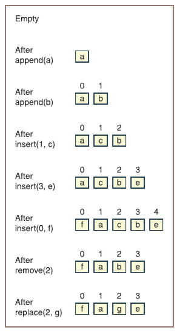

> 空
>
> 在`add(a)`之后
>
> 在`add(b)`之后
>
> 在`insert(1, c)`之后
>
> 在`insert(3, e)`之后
>
> 在`insert(0, f)`之后
>
> 在`pop(2)`之后
>
> 在`replace(2, g)`之后

> 译者注：原图第二、三行是：在`append(a)`之后，根据上下文和列表所提供的功能，应该是`add`；原图倒数第二行是：在`remove(2)`之后，根据上下文和列表所提供的功能，`remove`方法的参数是元素而不是索引，所以应该改为`pop`。

图9-1 列表生命周期里的各种状态

表9-1 图9-1里使用的操作

| 操作 | 它的功能 |
| --- | --- |
| `add(item)` | 把`item`添加到列表的尾部。 |
| `insert(index, item)` | 在索引`index`处插入`item`，在需要的时候把其它元素向右移动。 |
| `replace(index, item)` | 把索引`index`处的元素替换为`item`。 |
| `pop(index)` | 在索引`index`处删除元素，在需要的时候把其它元素向左移动。 |

## 使用列表

如果你看过不同的有关数据结构的书本以及Python提供的`list`类的话，可以发现它提供了两大类操作，分别是：基于索引的操作和基于内容的操作。除此之外，你还可以添加第三类基于位置的操作。在学习列表的用法之前，你将会先了解这些操作的类别。

### 基于索引的操作

**基于索引的操作**（**Index-based operation**）可以操作列表里指定索引处的元素。在基于数组的实现方式里，这些操作也提供了方便进行随机访问的功能。假设一个列表包含$n$个元素。由于列表是线性排列的，因此可以通过从列表头到列表的相对位置的距离（$0$到$n − 1$）来明确地引用列表里的某个元素。于是我们可以有，列表的头部位于索引0，而尾部则位于索引$n − 1$处。表9-2列出了一些基于列表`L`的基本的基于索引的操作。

表9-2 列表的基于索引的操作

| 列表方法 | 它的功能 |
| --- | --- |
| `L.insert(i, item)` | 在索引`i`处插入`item`，在需要的时候把其它元素向右移动。 |
| `L.pop(i = None)` | 在索引`i`处删除并返回元素，如果没有传递`i`那么就删除并返回最后一个元素。 |
| | *先验条件*：`0 <= i <= len(L)` |
| `L[i]` | 返回在索引`i`处的元素。 |
| | *先验条件*：`0 <= i <= len(L)` |
| `L[i] = item` | 用`item`来替换在索引`i`处的元素。 |
| | *先验条件*：`0 <= i <= len(L)` |

从这个角度来进行观察，列表有时候也会被称为**向量**（**vector**）或是**序列**（**sequence**），而且在使用下标时，也很容易让人联想到数组。但是，数组是一种具体的数据结构，它是基于单个物理内存块的特定且不变的实现。而列表则是一种抽象数据类型，可以有多种不同的方式来存储数据，这些方式里的一种会使用数组来实现。除此之外，虽然可以通过一系列数组操作序列来模拟各种列表的操作，列表的基本操作会比数组多得多。

### 基于内容的操作

**基于内容的操作**（**Content-based operation**）不会基于索引，而是基于列表的内容。这些操作通常会接收一个元素来作为参数，然后对这个元素和列表进行相应的处理。有些操作会先搜索和指定元素相等的元素，然后再去进行下一步操作。表9-3列出了三个基于列表`L`的基本的基于内容的操作。可以看到，我们使用的是`add`而不是`append`方法来和其它多项集保持一致。

表9-3 列表的基于内容的操作

| 列表方法 | 它的功能 |
| --- | --- |
| `L.add(item)` | 把`item`添加到列表的尾部。 |
| `L.remove(item)` | 把`item`从列表里删除。 |
| | *先验条件*：`item`在里列表里。 |
| `L.index(item)` | 返回`item`在列表里第一次出现的位置。 |
| | *先验条件*：`item`在里列表里。 |

### 基于位置的操作

**基于位置的操作**（**Position-based operation**）是基于被称为**游标**（**cursor**）的当前建立的位置执行的操作。这些操作让程序员能够通过移动这个游标来访问整个列表。在某些编程语言里，另一个被称为**列表迭代器**（**list iterator**）的对象可以提供这些操作。在这里，我们也会采用同样的策略。尽管列表已经支持了迭代器（让程序员可以通过`for`循环来访问列表里的元素），但列表迭代器的功能更为强大。和简单的迭代器不同，列表迭代器支持移动到前面一个位置、直接移动到第一个位置以及直接移动到最后一个位置。除了这些游标的导航操作之外，列表迭代器还支持在游标位置插入、替换和删除元素。列表迭代器的实现将在这一章的后面进行介绍，在这里，你可以先来看看它的逻辑结构和支持的行为。

程序员通过在列表上运行`listIterator`方法来创建列表迭代器对象，就像下面这样：

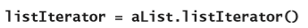

这个列表可以为空或是已经包含了元素。在这段代码里，我们通过列表接口连接了两个对象（列表迭代器和列表），就像图9-2这样。这个列表可以被称为列表迭代器的**后备存储**（**backing store**）。

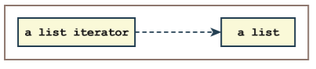

图9-2 列表迭代器关联到它的后备存储（列表）

对于后备存储里的元素，列表迭代器的游标总会处于这三个位置：

* 在第一个元素之前

* 两个相邻元素之间

* 最后一个元素之后

一开始，在非空列表上创建列表迭代器时，游标的位置会在第一个元素之前。但如果列表为空，游标的位置是不存在的。在任何浏览非空列表的时候，用户都可以通过把游标移动到列表的开头或结尾来重置游标的位置。用户可以从这些任意的位置，以某种方式导航到另一个位置。表9-4列出了一些基于列表迭代器`LI`的导航操作。

表9-4 列表迭代器的导航操作

| 操作 | 它的功能 |
| --- | --- |
| `LI.hasNext()` | 如果游标后面存在元素，则返回`True`。如果游标不存在或位于最后一个元素之后，则返回`False`。 |
| `LI.next()` | 返回下一个元素并将游标向右移动一个位置。 |
| | *先验条件*：`hasNext`返回`True`。并且在最后一次执行`next`或`previous`操作之后，列表没有进行过任何变异操作。 |
| `LI.hasPrevious()` | 如果游标前面存在元素，则返回`True`。如果游标不存在或位于第一个元素之前，则返回`False`。 |
| `LI.previous()` | 返回上一个元素并将游标向左移动一个位置。 |
| | *先验条件*：`hasPrevious`返回`True`。并且在最后一次执行`next`或`previous`操作之后，列表没有进行过任何变异操作。 |
| `LI.first()` | 如果有元素的话，将游标移动到第一个元素之前。 |
| `LI.last()` | 如果有元素的话，将游标移动到最后一个元素之后。 |

其它基于位置的操作用来对列表进行修改。表9-5列出了基于列表迭代器`LI`的在游标处可以执行的变异器操作。

表9-5 列表迭代器的变异器操作

| 操作 | 它的功能 |
| --- | --- |
| `LI.insert(item)` | 如果存在游标的话，在它的后面插入`item`；否则，在列表的尾部插入`item`。 |
| `LI.remove()` | 删除最后一次执行`next`或`previous`操作时所返回的元素。 |
| | *先验条件*：在最后一次执行`next`或`previous`操作之后，列表没有进行过任何变异操作。 |
| `LI.replace(item)` | 替代最后一次执行`next`或`previous`操作时所返回的元素。 |
| | *先验条件*：在最后一次执行`next`或`previous`操作之后，列表没有进行过任何变异操作。 |

表9-6列出了列表迭代器上的一系列操作，并且给出了每个操作之后它所关联的列表的状态。你可以假定在创建列表迭代器时，这个列表为空。

表9-6 列表迭代器操作对列表的影响

| 操作 | 操作后的位置 | 操作后的列表 | 返回值 | 注释 |
| --- | --- | --- | --- | --- |
| 实例化 | 不存在 | 空 | | 一个新的列表迭代器。 |
| `insert(a)` | 不存在 | a | | 如果游标不存在的话, 在列表的尾部插入元素。 |
| `insert(b)` | 不存在 | a b | | |
| `hasNext()` | 不存在 | a b | `False` | 如果游标不存在的话，没有前一个和后一个元素。 |
| `first()` | 0 | , a b | | 如果有元素的话，将游标移动到第一个元素之前。 |
| `hasNext()` | 0 | , a b | `True` | 在游标右面存在元素，因此存在下一个元素。 |
| `next()` | 1 | **a** , b | | 返回`a`并将游标向右移动一个位置。 |
| `replace(c)` | 1 | c , b | | 用`c`替换掉最近在`next`返回的`a`。 |
| `next()` | 2 | c **b** , | b | 返回`b`并将游标向右移动一个位置。 |
| `next()` | 2 | c b , | `Exception` | 游标已经在列表的尾部，不能再移动到下一个元素。 |
| `hasNext()` | 2 | c b , | `False` | 游标已经在列表的尾部，因此没有下一个元素。 |
| `hasPrevious()` | 2 | c b , | `True` | 在游标左边存在元素，因此存在前一个元素。 |
| `previous()` | 1 | c , **b** | b | 返回`b`并将游标向左移动一个位置。 |
| `insert(e)` | 1 | c , e b | | 把`e`插入到当前游标右边。 |
| `remove()` | 1 | c , e b | `Exception` | 在最后一次执行`next`或`previous`操作之后有一次`insert`操作。 |
| `previous()` | 0 | , **c** e b | c | 返回`c`并将游标向左移动一个位置。 |
| `remove()` | 0 | , e b | | 删除掉最近在`previous`返回的`c`。 |

> 译者注：原文表格第四、六行第三列根据上下文应该有值；原文表格第十三行第三列的值`c b ,`有错误，应为`c , b`；原文表格第十三，十六行第三列的值格式有错，没有着重表示返回元素。

请记住，列表迭代器的游标在建立了之后它的位置只会位于第一个元素之前、最后一个元素之后或是两个元素之间。在上面这个表格里，我们用逗号来代表游标；以及一个用来存放**当前位置**（**current position**）的整数变量。如果列表包含$n$个元素，那么就有：

* 当前位置 = i（如果游标位于索引$i$的元素之前，其中$i = 0, 1, 2, ..., n - 1$）。

* 当前位置 = n（如果游标位于最后一个元素之后）。

可以看到，在表9-6里，只有当列表里至少有一个元素并且运行了`first`或`last`方法之后，当前位置才会存在。在此之前，方法`hasNext`和`hasPrevious`都只会返回`False`，并且不能运行`next`、`previous`、`remove`以及`replace`方法。但是，在这个时候你可以在列表迭代器上运行`insert`操作，来把元素不断添加到列表的尾部。

从操作规范里可以知道，只有当期间没有执行`insert`或`remove`操作的时候，才能成功的对`next`或`previous`操作返回的那个元素进行`remove`和`replace`操作。这个表格对最新返回的元素进行了加粗提示。如果没有突出显示任何元素，那么是不能执行`remove`或`replace`操作的。高亮显示的元素（如果存在的话）可以位于游标的任何一边，也就是在`next`操作后的左侧或是在`previous`操作后的右侧。

当列表再次为空时，它的游标会重新处于不存在的状态。

下面这个代码片段也说明了列表迭代器的用法。你可以先假设有人已经在`ArrayList`类里定义并支持了前面提到的那些操作。

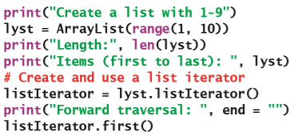

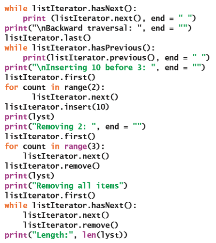

这是这个代码片段的输出：

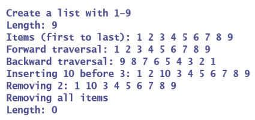

可以看到，使用列表迭代器进行遍历是通过将游标移到第一个位置或最后一个位置开始的。请记住，某些操作还会有其它的一些限制。比如，`replace`和`remove`操作要求紧跟`next`或`previous`操作来建立当前位置。而`next`和`previous`这两个操作分别会假定`hasNext`或`hasPrevious`返回`True`。这些操作将在这一章的后面进行详细讨论。

### 列表接口

虽然列表有很多操作，但是我们可以通过分类来减少混淆。表9-7对这些操作进行了总结。在表格里，`L`代表列表，`LI`代表在列表上创建的列表迭代器。

表9-7 基本列表操作的摘要

| 基于索引的操作 | 基于内容的操作 | 基于位置的操作 |
| --- | --- | --- |
| `L.insert(i, item)` | `L.add(item)` | `LI.hasNext()` |
| `L.pop(i)` | `L.remove(item)` | `LI.next()` |
| `L[i]` | `L.index(item)` | `LI.hasPrevious()` |
| `L[i] = item` | | `LI.first()` |
| | | `LI.last()` |
| | | `LI.insert(item)` |
| | | `LI.remove(item)` |
| | | `LI.replace(item)` |

根据前面对这些列表操作的讨论，我们建议你把这些操作分到两个接口里去。就像在第5章里提到过的那样，Python里的接口不会包含任何功能代码，而只会充当包含这些代码的实现的组织原则。这两个接口里的第一个可以用来包含那些像是在Python的`list`类包含的：基于索引的操作和基于内容的操作。在这一章的后面，你将会基于这个接口开发出两个分别叫做`ArrayList`和`LinkedList`的实现。第二个接口用来包含列表迭代器的操作。列表迭代器的各个实现都和给定的列表实现有关。各定义了一组操作的这两个接口，将会分别被叫做`ListInterface`和`ListIteratorInterface`。

图9-3里的UML图展示了实现类是如何与这两个接口相关的。在列表接口里，我们还添加了所有多项集都通用的那些基本方法，也就是`isEmpty`、`__len__`、`__str__`、`__iter__`、`__add__`、`__eq__`、`count`和`clear`以及`listIterator`方法。从列表迭代器类到列表类的箭头表示依赖关系。

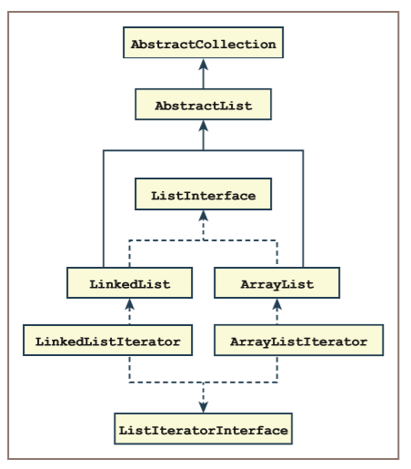

图9-3 列表和列表迭代器的接口和实现类

### 练习题

1. 列表的基于索引的操作的先验条件是什么？

2. 基于位置的操作的`insert`方法和基于索引的操作的`insert`方法有什么不同？

## 列表的应用

列表可能是计算机科学里使用最为广泛的多项集了。这一节将会研究三个使用了列表的重要应用程序：堆存储管理、磁盘文件管理以及其它多项集的实现。

### 堆存储管理

在第7章“堆栈”里，你学习了Python的内存管理里的一部分：调用堆栈。接下来，你将会了解另一部分——对象堆（第7章里也介绍过）里是如何通过链表来管理可用空间的。前面提到过，对象堆是Python虚拟机用来为所有新的数据对象分配的各种大小内存片段的内存区域。当某个对象不再被程序引用时，Python虚拟机（PVM）会把这个对象的内存片段返回给堆来让其它对象使用。堆管理方案会对应用程序的整体性能产生重大影响，尤其是当应用程序在执行的过程中创建并废弃掉许多对象的情况下。因此，PVM的实现者会花费大量的精力来以最有效的方式组织堆。他们精心设计的解决方案超出了本书的范围，因此我们只会在这里提供一个简化的方案。

在这个简化方案里，堆上连续的可用空间块将会被链接在一个空闲列表中。当应用程序实例化新对象的时候，PVM会在空闲列表里搜索足够容纳这个对象的第一个内存块。当不再需要这个对象的时候，垃圾收集器会把这个对象的内存空间返回到空闲列表。

这个方案有两个缺陷。首先，随着时间的流逝，空闲列表里的大块空间将会被分割成许多较小的块；除此之外，在空闲列表里搜索到一个足够大的块会需要$O(n)$运行时间，其中$n$是列表里的块数。为了防止碎片化，垃圾回收器会定期通过合并相邻的内存块来重新组织空闲列表。而为了减少搜索时间，你也可以使用多个空闲列表。比如说，如果一个对象引用需要4个字节，那么列表1可以包含大小为4的内存块；列表2可以包含大小为8的内存块；列表3包含大小为16的内存块；列表4包含大小为32的内存块；以此类推。最后一个列表用来包含其它所有大于某些指定大小的块。

在这种方案里，总是以4个字节为单位来分配空间；并且从包含有足够大的内存块的第一个非空列表的开头，来取得用于新对象的空间。因为从链表的开头进行访问和删除的操作是$O(1)$的复杂度，因此现在为新对象分配空间只需要$O(1)$的时间了；除非这个对象所需要的空间，比最后一个列表里的第一个内存块里的可用空间更大。在这种情况下，就必须要对最后一个列表进行搜索；而这个操作的最大运行时间为$O(n)$，其中$n$是最后一个列表的大小。

刚才为了简化对这部分内容的讨论，有两个难题被我们忽略掉了。第一个问题是如何去确定应该在什么时候运行垃圾收集器。运行垃圾收集器会从应用程序上耗费时间，但如果不运行它的话，也就意味着永远都不去补充空闲列表。第二个问题涉及到垃圾收集器如何去标识不再被引用的对象，也就是那些不再被需要的对象。（这些问题的解决方案不在本书的讨论范围之内。）

### 磁盘上文件的组织

计算机的文件系统有三个主要的组成部分：文件目录、文件本身以及可用空间。要了解它们是如何共同创建文件系统的，应该先了解下磁盘的物理格式。图9-4展示了磁盘的物理格式的标准排列。磁盘的表面被分为同心的磁道，每个磁道又被细分为扇区。这些磁道的数量取决于磁盘的容量以及它的物理尺寸。但是，所有磁道都会包含相同数量的扇区，并且所有的扇区都包含有相同数量的字节。为了便于讨论，假设一个扇区包含8 KB的数据以及为指针保留的一些其它字节。扇区是在磁盘里进行位移的最小信息单位，无论它的实际大小如何，我们可以用一对数字（`t, s`）来指定磁盘上一个扇区的位置，其中`t`是磁道号，而`s`是扇区号。图9-4展示了有$n$个磁道的磁盘，其中磁道0里的$k$个扇区分别被标记为$0$到$k – 1$。

> 译者注：原文里描述的是旧式的非分区记录方式的磁盘记录方式，因此不同磁道的扇区数都是一样的；而在新式的分区记录方式的磁盘记录方式里，不同磁道的扇区数是不同的。

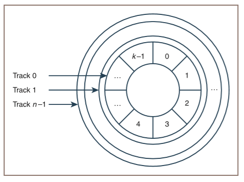

图9-4 磁盘表面上的轨道和扇区

文件系统的目录可以组织成一个分层多项集。在这里我们并不需要详细地去介绍这个结构。我们可以假设目录占据了磁盘上的前几个磁道，并且在目录里的每一个条目都代表一个文件。这些条目会包含文件的名称、创建日期、大小等等。此外，它还会存放包含文件里第一个字节的扇区的地址。根据文件的大小，文件可能会被完全包含在一个扇区里，也可能会跨越多个扇区。通常来说，文件内容的最后一个扇区只会被部分填充，而且不会再尝试去使用这个扇区里还没有被使用的空间。组成文件的扇区不需要在物理上相邻，这是因为除了最后一个扇区之外，其它的每个扇区都会以指向包含文件下一部分的扇区的指针作为结尾。那些没有被使用的扇区会在空闲列表里被链接在一起。创建新文件时，将会从这个列表里分配相应的空间，而删除旧文件时​​，它们的空间将会返回到列表里去。

由于所有的扇区的大小是相同的，而且由于在扇区里分配了空间，因此文件系统不会遇到Python对象堆遇到的碎片化问题。尽管如此，这里仍然还是存在一些困难。为了向磁盘传输数据或是从磁盘读取数据，都必须要先把读/写磁头放置在正确的磁道上，然后磁盘必须要进行旋转从而让所需的扇区位于磁头之下，最后才能进行数据传输。而在这三个步骤中，数据传输花费的时间最少。好在地盘可以在单次旋转时，就直接把数据写入到多个相邻的扇区或是从多个相邻的扇区读取数据，而不用再去重新定位磁头。因此，当一个多扇区文件没有被分散在磁盘上时，磁盘系统的性能将会得到优化。但是，随着时间的流逝，随着不同大小的文件的创建和销毁，这种多扇区文件被分散化的现象会变得越来越频繁，因此文件系统的性能也会逐渐下降。为了对付这个问题，文件系统会包括一个辅助程序，这个辅助程序可以自动运行，也可以根据用户的需求来直接运行，它会重新组织文件系统，从而让每个文件里的扇区都相互连续，并且让物理和逻辑的顺序相同。

### 其它多项集的实现

列表经常用来实现其它的一些多项集，例如堆栈和队列。通常有两种方法可以实现新的多项集：

* 扩展列表类，使得新类成为列表类的子类。

* 在新类里包含一个列表类的实例，并让这个列表包含数据元素。

比如说，你可以通过扩展列表类来实现堆栈类。但是，在一些情况下，扩展列表类并不是非常好的选择，因为这样实现的堆栈会继承列表里的方法，而这些方法可以让用户访问顶端以外的其它位置的元素，从而违反了堆栈抽象数据类型的规则。对于堆栈和队列来说，更好的设计思路是把列表包含在堆栈或队列里。这样的话，列表里所有的操作都可以被堆栈或队列的实现者使用；但是对它的用户来说，可见的应该只有基本的堆栈或队列操作。

使用列表的多项集也继承了它的性能特征。比如说，使用基于数组的列表的堆栈会有基于数组的列表的性能特征，而使用基于链接的列表的堆栈则会具有基于链接的列表的特征。

使用列表来实现另一个多项集的主要优点是：编码变得更加容易。堆栈的实现者不用再去调用具体的数组或链接结构，而只需要调用适当的列表方法就行了。

第10章“树”和第11章“集合和字典”将会介绍了通过使用列表来实现多项集的其它情况。

## 列表的实现

在这一章的前面，我们提到了实现列表的两种常见数据结构：数组和链接结构。这一节我们将会开发列表基于数组的实现和基于链接的实现。

### `AbstractList`类的作用

关于列表的实现我们还是遵循第6到第8章里讨论的背包、堆栈和队列类那样的模式，不是从头开始，而是每个具体的列表类都会出自一个抽象类——被称为`AbstractList`。而因为这个类是`AbstractCollection`的子类，所以列表类也继承了常用的多项集方法以及变量`self.size`。那么你能在`AbstractList`里包含一些列表自身的方法，从而减少在实体类里需要定义的方法的数量吗？

答案是“当然可以”。回想一下，基于内容的操作的`index`方法是对指定元素的位置进行的搜索。由于搜索可以使用简单的`for`循环来完成，因此可以在`AbstractList`里定义这个方法。而且，基于内容的操作的`remove`和`add`方法，在调用`index`方法得到定位元素的位置之后，就可以分别调用基于索引的操作里的`pop`或`insert`方法来删除或添加元素。因此，你也可以在`AbstractList`里定义这两个基于内容的操作。

除了这些方法之外，`AbstractList`类还会维护一个被称为`self.modCount`的新的实例变量。列表迭代器通过使用这个变量来对某些方法的先验条件进行验证，这部分内容将会在这一章稍后讨论。下面是`AbstractList`类的代码：

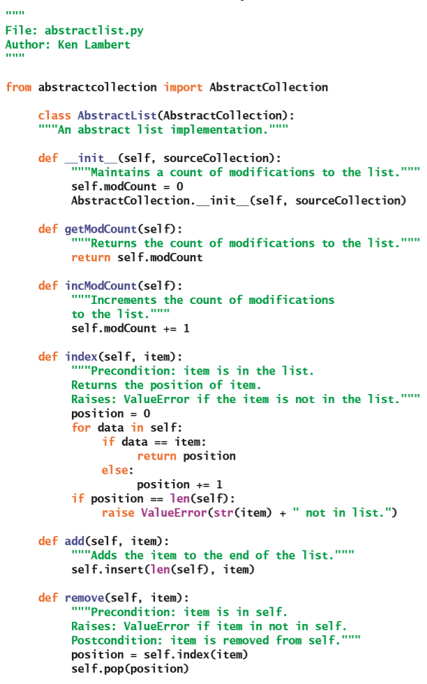

### 列表的数组实现

列表接口的基于数组的实现是一个叫做`ArrayList`的类。`ArrayList`通过在第4章“数组和链接结构”里介绍的`Array`类的实例来维护它的数据元素。`ArrayList`里有初始的默认容量，这个容量会在需要的时候自动增加。

因为`ArrayList`类是`AbstractList`的子类，所以在这个类里只定义了基于索引的操作、`__iter__`方法和`listIterator`方法。

基于索引的操作里的`__getitem__`和`__setitem__`方法只需要在数组变量`self.items`上使用下标运算符就可以完成。`insert`和`pop`方法会用第4章里介绍的方式来移动数组里的元素。有关`ArrayListIterator`类的讨论会在这一章的后面进行。下面是`ArrayList`类的代码：

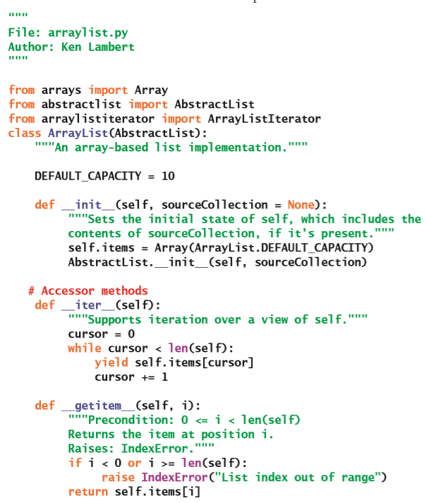

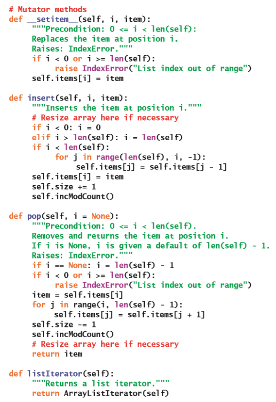

### 列表的链式实现

在这本书前面的章节里，你使用链接结构实现了背包、堆栈和队列。用来实现链接堆栈的单向链接结构（请参见第7章）里只包含指向它头部但不指向其尾部的指针。但是对于链表而言，这不是一个很好的选择：因为在这种实现里，列表的`add`方法必须遍历整个节点序列才能找到列表的尾部。

用来实现链接队列的单向链接结构（请参见第8章“队列”）在这里能够更好地工作。因为在这个结构里，会有另一个指针指向结构的尾部。因此，列表的`add`方法可以把新元素直接放在链接结构的末尾，并在需要的时候对头指针进行调整。

但是，要删除单向链接结构里最后一个位置的元素，仍然需要从结构的头部遍历到最后一个节点之前的那个节点。因此，要弹出最后一个元素的操作虽然在基于数组的列表里是常数时间的操作，但是在链表里是线性时间的操作。而且，单向链接结构并不是一个能够很好支持列表迭代器的理想结构。列表迭代器允许游标往任意一个方向移动，但是单向链接结构只能支持移动到下一个节点。这时你可以通过使用双向链接结构来解决这些问题，在双向链接结构里，每个节点都有一个指向上一个节点的指针以及一个指向下一个节点的指针。

就像第4章里提到过的那样，如果在结构的开头添加一个额外的节点，就可以简化操作双向链接结构所需要的代码。这个节点被称为**哨兵节点**（**sentinel node**）或者是虚拟头节点，它用来向后指向第一个数据节点，并且反向指向最后一个数据节点。那个额外的头指针将会指向这个哨兵节点。最终生成的结构类似于第4章里介绍的环状链接结构。哨兵节点不包含列表元素，并且当列表为空时，哨兵节点仍然存在。图9-5展示了一个空的环状链接结构和一个包含一个数据元素的环状链接结构。

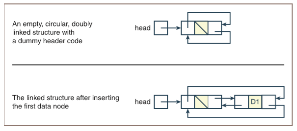

> 一个空的环状双向连接结构和一个虚拟头节点
>
> 在插入了第一个数据结点之后的连接结构

图9-5 两个带有哨兵节点的环状双向链接结构

从图里可以看出，哨兵节点指向下一个节点的指针指向了第一个数据节点，而它指向前一个节点的指针指向了最后一个数据节点。因此，在实现里不再需要一个额外的尾指针。除此之外，你很快将会看到，在执行插入或删除第一个或最后一个数据节点的操作时，不用对实现里的头指针进行设置。

双向链接结构的基本构建块是一个具有两个指针的节点：`next`（指向右边）以及`previous`（指向左边）。这种类型的节点被称为`TwoWayNode`，它是第4章里定义的`Node`类的子类。

下面这个代码片段显示了`LinkedList`类的初始化代码以及它的`__iter__`方法：

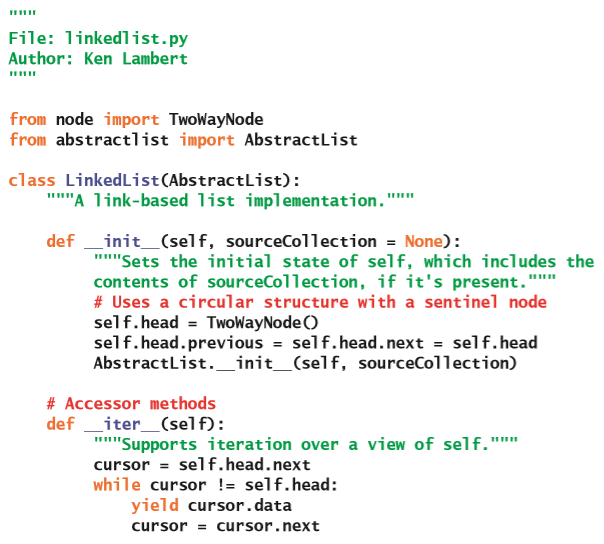

可以看到，`__init__`方法将会创建一个没有数据的节点——这就是哨兵节点。但是`__iter__`方法会把游标设置为标头节点的下一个节点（也就是包含数据的第一个节点（如果存在的话）），而不是哨兵节点。当游标循环往复到标头节点时，迭代器的循环将会终止。

剩下还没有开发的是一些基于索引的操作：`__getitem__`、`__setitem__`、`insert`以及`pop`。所有的这些方法都必须从标头节点之后的节点开始，在链接结构里不断递归，直至到达第$i$个节点为止。这个时候，就可以返回或修改（`__getitem__`或`__setitem__`）包含在这个节点里的数据，或是把这个节点删除（`pop`）掉，或者在这个节点之前插入（`insert`）一个新的节点。因为搜索第$i$个节点是所有四个方法都必须要执行的操作，所以你可以有一个叫做`getNode`的辅助方法。这个方法将会以目标节点的索引位置作为参数，返回指向第$i$个节点的指针。然后，这四个方法就可以通过使用这个指针来相应地操纵链接结构了。

下面是`getNode`、`__setitem__`和`insert`方法的代码。其它方法将会作为练习留给你。

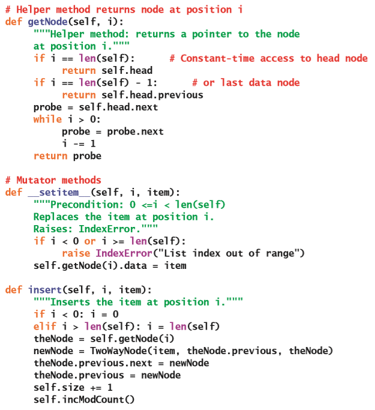

可以看到，在`__setitem__`和`insert`方法里都使用了`getNode`方法。所有的这些方法都需要在调用`getNode`定位节点之前，保证这个索引值是在范围之内。除此之外，由于链接结构里包含了一个哨兵节点，因此`insert`方法不用再去处理在结构的开始和结尾进行插入的特殊情况。

### 两种实现的时间和空间复杂度分析

对列表方法的运行时间进行分析和在第4章里对数组和链接结构进行的分析是类似的。这些方法里，不同的实现所带来的性能差异最为明显的方法是：访问和替换方法——`__getitem__`和`__setitem__`。在`ArrayList`里，这两个方法只需要通过数组的下标操就可以在常数时间内运行；而在`LinkedList`里，它们必须要通过在链接结构里进行线性搜索来找到第$i$个节点。

对于另外两个基于索引的操作——`insert`和`pop`方法，虽然在不同的实现里运行时间都是线性的，但是它们却表现出了不同的对时间和空间的权衡。`ArrayList`方法只需要常数时间来定位到目标元素的位置，但需要线性时间来移动元素从而完成这两个过程；和它相反，`LinkedList`里的方法需要线性时间来定位目标元素，但只需要常数时间就能够插入或删除节点。

基于内容的操作`index`方法在两种实现里，都是$O(n)$的时间复杂度。基于内容的操作`remove`方法会先运行`index`方法，然后再执行`pop`方法。因此，在两种实现方式里，这个方法都不会比线性时间更差。但是，在`LinkedList.pop`里会再次搜索元素的位置。你可以通过在`LinkedList`里直接实现搜索过程，并使用`remove`方法来避免这种浪费。

`add`方法（也被称为`insert`方法）看起来是线性时间的。但是，当位置在列表的末尾或超出列表的末尾时，两种实现方式里的`insert`方法都能够以常数时间运行。因此，`add`也是$O(1)$的复杂度。

表9-8列出了列表方法的运行时复杂度。

表9-8 列表方法的平均运行时间

| 列表方法 | `ArrayList` | `LinkedList` |
| --- | --- | --- |
| `__getitem__(i)` | $O(1)$ | $O(n)$ |
| `__setitem__(i, item)` | $O(1)$ | $O(n)$ |
| `insert(i, item)` | $O(n)$ | $O(n)$ |
| `pop(i)` | $O(n)$ | $O(n)$ |
| `add(item)` | $O(1)$ | $O(1)$ |
| `remove(item)` | $O(n)$ | $O(n)$ |
| `index(item)` | $O(n)$ | $O(n)$ |

列表实现的空间分析过程和之前分析过的堆栈以及队列类似。通过数组来实现至少需要包含下面这些元素：

* 可以容纳`capacity`大小的数组，其中$capacity > = n$；

* 对数组的引用；

* 用来存放元素数量和修改次数的变量

因此，数组实现需要的总内存至少为$capacity + 3$。

通过链接来实现至少需要包含下面这些元素：

* $n + 1$个节点，其中每个节点包含三个引用

* 对标头节点的引用

* 用来存放元素数量和修改次数的变量

因此，链式实现的总内存需求为$3n + 6$。

在比较两个实现的内存需求时，必须要记住的一点是，数组实现的空间利用率取决于负载因子。对于高于$1/3$的负载因子的情况，数组实现会比链式实现更为有效地使用内存；在低于$1/3$的负载因子的情况下，数组对内存的使用效率更低。

### 练习题

1. 在实现背包、堆栈和队列时，列表的哪种实现更好？

2. 有人建议`ArrayList`应该是`ArrayBag`的子类，而`LinkedList`应该是`LinkedBag`的子类。讨论这个建议的优缺点。

## 实现列表迭代器

前面提到过，列表迭代器是附加在列表上的对象，它提供了对这个列表的基于位置进行操作的能力。表9-4和表9-5里列出的这些操作能够让程序员通过移动游标来查看和修改列表。在这一节里，你将为基于数组的列表开发一个列表迭代器。为基于链接的列表开发列表迭代器的任务将会留给你作为练习。

### 列表迭代器的角色和职责

当程序员在列表上运行`listIterator`方法时，这个方法会返回列表迭代器类的一个新的实例。列表迭代器对象会基于它关联的列表，这是因为它需要访问列表来对元素进行查找、替换、插入以及删除操作。因此，列表迭代器在创建的时候会维护一个对创建它的列表也就是后备存储的引用。

除了支持其基本的操作之外，列表迭代器还必须要对先验条件进行验证。这些先验条件有三个：

* 如果`hasNext`或`hasPrevious`操作返回`False`的话，那么程序员不能运行执行`next`或`previous`操作。

* 程序员不能在列表迭代器上连续地运行的变异器方法。在每次变异操作之前，都需要执行`next`或`previous`操作来建立游标的位置。

* 程序员在使用列表的列表迭代器时，不能使用列表的变异器方法对列表自身进行变异操作。

为了能够更好地对这些先验条件进行验证，列表迭代器里维护了两个额外的变量。第一个变量是用来记录它自己的修改计数的。创建列表迭代器时，这个变量将会被设置为列表里的修改计数的值。因此，列表和列表迭代器就都能够知道了自己进行了多少次修改。当运行列表自身的变异器时，它都会增加列表的修改计数变量，从而对列表的修改次数进行记录。当在列表迭代器上运行某些方法（如`next`或`previous`）时，列表迭代器会把它自身的修改计数与列表的修改计数进行比较。如果两个值不同，那么就有人在上下文里错误地运行了列表的变异器；因此这时就会引发异常。在通过列表迭代器的方法改变列表时，列表迭代器也会对自身的修改计数进行增加，从而让这两个修改计数的值保持一致。

第二个辅助变量用来追踪列表迭代器在列表上可以执行变异的位置。在基于数组的实现里，在还没有建立位置时，这个变量的值是–1。当程序员在列表迭代器上成功执行了`next`或`previous`操作时，这个变量的值就会成为列表的索引。因此，在列表迭代器里执行`insert`和`remoe`这样的变异器方法时，可以通过检查这个变量来验证先验条件，并且在操作成功修改了列表之后，把这个变量重置为–1。

### 设置和实例化列表迭代器类

基于数组的列表的列表迭代器类被称为`ArrayListIterator`。这个类会包含下面这些实例变量：

* `self.backingStore`——创建这个迭代器的列表。

* `self.modCount`——迭代器的修改计数变量。

* `self.cursor`——迭代器的导航方法里（`first`、`last`、`hasNext`、`next`、`hasPrevious`以及`Previous`）进行操纵的游标位置。

* `self.lastItemPos`——用在迭代器的`insert`、`remove`和`replace`这些变异器方法里的游标位置。这个位置是通过执行`next`或`previous`方法而建立的，在运行`insert`或是`remove`操作后这个变量将会被重置为未定义。

回想一下，`ArrayList`里的`listIterator`方法会在列表迭代器的实例化的过程中把后备存储（`self`）传递给它。这样做之后，列表迭代器就可以在这个对象上运行列表里的方法并对它进行修改了。下面是`ArrayListIterator`类里的关于这部分的代码。

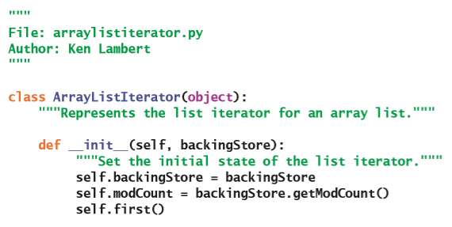

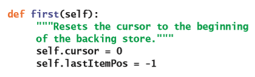

### 列表迭代器里的导航方法

在基于数组的列表里，导航方法`hasNext`和`next`可以在游标从前往后的情况下使用。这个游标在的初始值是0，并且当程序员在列表迭代器上运行了`first`方法后会被重置为0。只要游标小于后备存储的长度，`hasNext`方法将总是返回`True`。

`next`方法必须要先验证两个先验条件，然后才能将游标向前移动，再从后备存储里返回元素。第一个先验条件是，方法`hasNext`必须返回`True`。另一个是，两个修改计数（一个属于列表迭代器，另一个属于后备存储）必须是相等的。如果它们不相等，就意味着有人使用了列表操作或是连续使用了列表迭代器里的变异器方法来修改了后备存储。如果一切顺利，那么这个方法就会把`self.lastItemPos`设置为和`self.cursor`相同的值，将后者加1，然后返回在后备存储里的`self.lastItemPos`这个位置的元素。下面是这两个方法的代码：

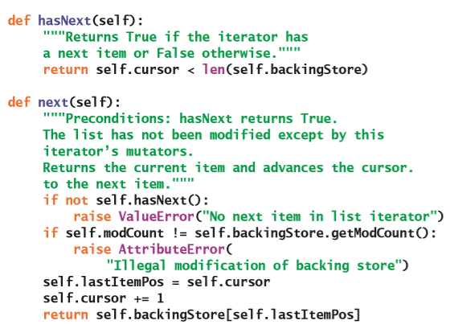

在基于数组的列表里，`last`、`hasPrevious`和`previous`可以在游标从后往前的情况下使用。`last`方法会把游标的位置设置到列表里最后一个元素的右侧。这个位置也就等于列表的长度。如果游标大于位置0的话，那么`hasPrevious`方法将会返回`True`。`previous`方法将会查看和`next`方法类似的两个先验条件。不同的是，它会把`self.lastItemPos`设置为和`self.cursor`相同的值，然后把游标减1，然后返回在后备存储里的`self.lastItemPos`这个位置的元素。下面是这三个方法的代码：

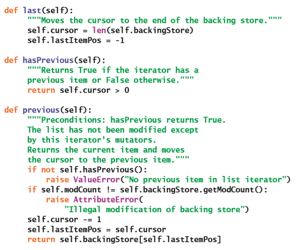

### 列表迭代器里的变异器方法

变异器方法`remove`和`replace`必须要验证两个先验条件。第一个是，必须已经建立了游标，这也就意味着变量`self.lastItemPos`的值不能是–1。另一个是，两个修改计数必须相等。`insert`方法只会查看修改计数相等这个先验条件。这些方法会被用来完成下面这些任务：

* `replace`方法最为简单：它会替换掉在后备存储里的当前位置的元素，并把`self.lastItemPos`重置为–1。在替换操作期间，列表迭代器的修改计数不会增加。

* 如果游标已经被定义了，那么`insert`方法就可以把元素插入到后备存储里的当前位置，并把`self.lastItemPos`重置为–1。不然都话，这个元素将会被添加到后备存储的末尾。无论是哪种情况，列表迭代器的修改计数都会增加。

* `remove`方法能够在后备存储的当前位置处弹出元素，并把列表迭代器的修改计数加1。如果`self.lastItemPos`小于`self.cursor`，那么就意味着`remove`是在`next`操作之后运行的，因此还需要把游标减1。最后，`self.lastItemPos`将会被重置为–1。

下面是这三个变异器方法的代码：

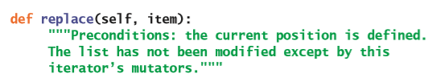

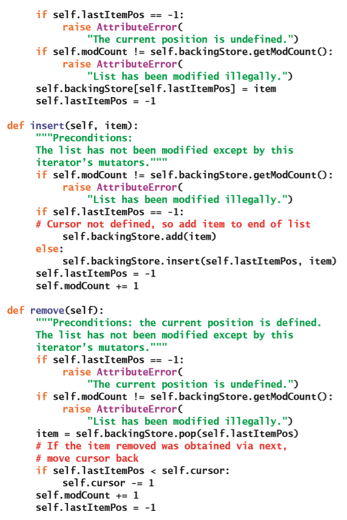

### 设计链表的列表迭代器

对于链表来说，也还是可以用刚刚描述了的`ArrayListIterator`类。但是，由于列表迭代器的这个实现会在后备存储上运行基于索引的操作`__getitem__`和`__setitem__`方法，因此当这个后备存储为链表时，`next`、`previous`和`replace`操作的运行时间将会是线性的。和基于数组的列表在这些操作里是常数时间的复杂度相比，这种性能损失是不可接受的。

另一种实现方式里，可以通过游标来跟踪后备存储里链接结构的节点。导航方法通过把游标设置到下一个或上一个节点来调整游标。而由于这些操作都是常数时间的操作，因此在链表里通过位置进行导航操作的效率，并不会比在基于数组的列表里进行导航操作的效率更低。并且，直接访问后备存储的链接结构还可以在常数时间内进行插入、删除和替换元素的操作。链表的列表迭代器的实现将会作为练习留给你。

### 列表迭代器的实现的时间和空间复杂度分析

列表迭代器的链式实现里所有方法的运行时间都是$O(1)$的。这一点就能够让它非常明显地胜过了基于数组的实现，因为后者的`insert`和`remove`方法都是$O(n)$的。

## 案例研究：开发有序列表

这个案例研究探讨了如何去开发一个非常有用的多项集类型：有序列表。

### 案例需求

开发一个有序列表多项集。

### 案例分析

当你在第6章“继承与抽象类”里开发有序背包类时，你把有序背包类作为了背包类的子类，这是因为这两个类有相同的接口。那么有序列表和普通列表是不是也拥有相同的接口呢？如果答案是“是”的话，那么设计和实现的过程就会和你开发有序背包所采用的方法类似。

遗憾的是，这个答案应该是“不是”。有序列表的确包含了普通列表里的大多数方法，但是有两个不同。`insert`和`__setitem__`方法会把元素放置在列表里的指定位置。但是，你不能让程序员把元素放在有序列表里的任意位置。如果允许这样的操作的话，程序员就可以把较大的元素放在较小的元素之前，反之也亦然。因此，你必须在有序列表的接口里移除掉这两个方法。

对在列表里放置元素的这种限制，同样会影响到列表迭代器在有序列表上的接口。程序员应该能够像以前一样访问和删除元素，但是不能使用有序列表上的列表迭代器进行插入或替换操作。

有序列表里的两个方法：`add`和`index`的行为方式会和普通列表不一样。在这里，`add`方法将会先搜索适当的位置，再把这个元素插入到列表里去。而`index`操作由于现在列表是有序的，因此可以通过对指定元素进行二分搜索来找到它。

除此之外，你可以假设我们会使用标准比较运算符来对元素进行比较。因此，任何可以被插入到有序列表里的类都应该包括`__le__`和`__gt__`方法。

表9-9里汇总了被称为`ListedListInterface`的有序列表的接口里的各项操作。

> 译者注：原文是`SortedList Interface`，根据上下文，这里应该是`ListedListInterface`。

表9-9 有序列表的操作

| 有序列表的操作 | 它的功能 |
| --- | --- |
| `L.add(item)` | 把`item`插入到`L`的合适位置。 |
| `L.remove(item)` | 把`item`从`L`里删除。 |
| | *先验条件*：`item`要在`L`里。 |
| `L.index(item)` | 返回在`L`里第一个`item`实例的位置。 |
| | *先验条件*：`item`要在`L`里。 |
| `L.__getitem__(i)` | 从`L`的位置`i`处返回元素。 |
| | *先验条件*：`0 <= i < len(L)`。 |
| `L.pop(i = None)` | 如果没有传递`i`，那么删除并返回`L`的最后一个元素。 |
| | 不然的话，删除并返回在`L`的位置`i`处的元素。 |
| | *先验条件*：`0 <= i < len(L)`。 |

### 案例设计

因为想要能够支持二分搜索，所以只能开发基于数组的实现，叫做`ArraySortedList`。

`ArraySortedList`类不能是`ArrayList`类的子类，不然的话`ArraySortedList`将会继承到前面提到的两个不能被包含在内的方法（请参见图9-6）。

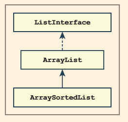

图9-6 不应该被使用的基于数组的有序列表的实现策略

当面对这些情况时，大多数程序设计的教科书都会建议你使用这个父类的实例来作为元素的容器。这种策略也就是让`ArrayList`成为一个用来存放数据的，保存在`ArraySortedList`对象内部的多项集类型（请参见图9-7）。

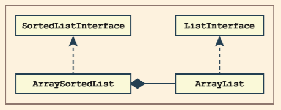

图9-7 一个较好的基于数组的有序列表的实现策略

遗憾的是，这个策略并没有像之前那样用到对代码的重用。这个实现必须要在`ArraySortedList`里重新实现`ArrayList`里的每个方法，而且两个类里因为都包含`size`变量，所以这两个变量之一会被浪费掉。

另一个更好的设计是基于这样的思考：列表实际上是一个包含两个额外方法（`insert`和`__setitem__`）的有序列表。换句话说，列表接口是有序列表接口的扩展；因此，基于数组的列表类可以扩展自基于数组的有序列表类。于是稍微花点时间，你就可以把`ArrayList`变成`ArraySortedList`的子类来重构列表层次结构，就像图9-8的类图这样。

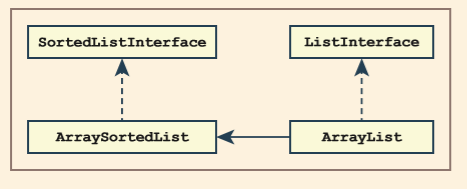

图9-8 另一个更好的基于数组的有序列表的实现策略

在这种新的策略里，会在`ArraySortedList`类里通过对`self.items`变量的引用来维护数组。这个类还实现了基于索引的操作`pop`和`__getitem__`，并且它也包含了从`AbstractList`类继承到的`add`和`index`方法。`ArrayList`类将会重写从`ArraySortedList`类继承到的`add`和`index`方法；并且包含了另外两个基于索引的操作：`insert`和`__setitem__`，还会包含从它的祖先那里继承来的其它方法。

`ArraySortedList`类中还包含看另一个额外的方法。在这里，这个类会包含`__contains__`方法。回想一下，当Python看到`in`运算符时，它将会在第二个操作数的类里去寻找`__contains__`方法。如果这个方法不存在，那么Python就会自动地使用操作数的`for`循环来执行线性搜索。而由于你现在希望Python通过给定多项集的`index`方法来执行搜索，因此你必须要显式地包含`__contains__`方法的实现。当目标元素不在列表里时，这个方法可以轻松地捕获由`index`方法引发的异常。表9-10展示了列表的方法都是在哪些类里。

> 译者注：原文里最后一句提到，在表格9-10里，“会以阴影来显示只被定义在某个类里的方法，以及`ArrayList`里的`index`和`add`方法会直接调用在`AbstractList`类里定义的逻辑”。但是表格里并没有任何阴影，也没有任何`index`和`add`方法的特殊存在。因此这句话的翻译没有被包含在正文里

表9-10 列表方法在各个列表类里的分布

| `AbstractList` | `ArraySortedList` | `ArrayList` |
| --- | --- | --- |
| `getModCount` | `__iter__` | `__setitem__` |
| `incModCount` | `__getitem__` | `insert` |
| `remove` | `__contains__` | `index` |
| `index` | `clear` | `add` |
| `add` | `pop` | `listIterator` |
| | `index` | |
| | `add` | |
| | `listIterator` | |

你可以使用类似的策略来为基于数组的列表和基于数组的有序列表设计列表迭代器类。基于数组的列表的列表迭代器类是基于数组的有序列表的列表迭代器类的子类。`ArraySortedListIterator`类将会包含所有的导航方法和`remove`方法。而它的子类`ArrayListIterator`类则会包含`insert`和`replace`方法。这两个类之间的关系如图9-9所示。

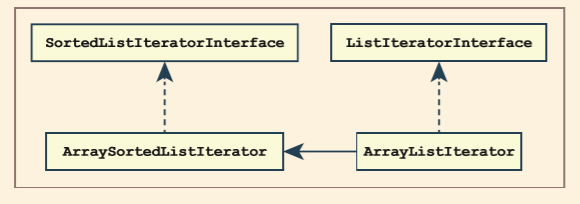

图9-9 基于数组的列表迭代器的实现策略

### 案例实现（编码）

下面是重构之后的`ArrayList`类的代码。可以看到，它的`add`和`index`方法调用了`AbstractList`里的相同方法，从而可以继续使用已经实现了的行为。除此之外，这个类包括了`insert`、`__setitem__`和`listIterator`方法。

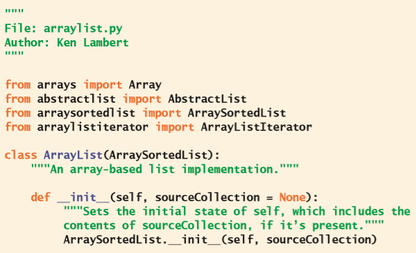

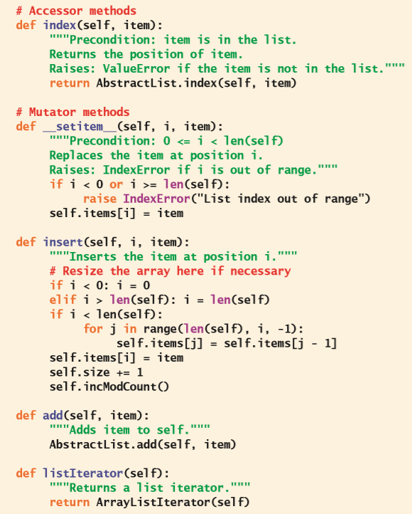

`ArraySortedList`类的代码将会留给你作为练习。

## 递归列表的处理

1950年代后期，计算机科学家约翰·麦卡锡（John McCarthy）开发出了一个被称为Lisp的编程语言，这是一种通用的符号信息处理语言。`Lisp`这个称呼本身出自于*列表处理器*（*list processor*）。在Lisp里，列表是基本的数据结构。Lisp的列表是一种递归数据结构，Lisp程序通常会包含一组用来处理列表的递归函数。递归列表的处理，后来成为了软件开发的重要组成部分之一，被称为**函数式编程**（**functional programming**）。在这一节里，我们将通过在Python里开发一个Lisp列表的变体来探索递归列表的处理。在这个过程中，你将会学习到一些递归设计模式和一些函数式编程的基本概念。

> 译者注：根据[*维基百科*](https://zh.wikipedia.org/wiki/LISP)，`Lisp`这个名字其实出自于列表处理器（**LIS**t **P**rocessor）的缩写，而不是原文里写的：列表处理（list processing）。

### 类Lisp列表的基本操作

类Lisp列表会包含这样一个递归定义：列表为空或是由两部分组成（一个数据元素，后面跟着另一个列表）。这个递归定义的基本情况是空列表，而递归情况是包含另一个列表的结构。

我们可以根据这个递归定义来描述任何的类Lisp列表。比如，一个只包含一个数据元素的列表包含一个数据元素，后跟一个空列表。包含两个数据元素的列表有一个数据元素，其后是另一个只包含一个数据元素的列表，依此类推。用这种方式来描述列表的优势在于，它会非常自然地引导出一些用于递归列表的处理算法的设计模式。

类Lisp列表的用户会有三个基本的函数来检查列表。第一个函数叫做`isEmpty`，如果它的参数为空列表，那么这个函数会返回`True`，不然返回`False`。另外两个函数分别叫做`first`和`rest`，它们被用来访问非空列表的组成部分。`first`函数会返回列表前端的数据元素。`rest`函数则会返回一个列表，这个列表里包含除了第一个元素之外的其它数据元素。

让我们想一想使用这些操作的一些例子。假设有`lyst`指向一个包含元素34、22和16的列表，那么表9-11就展示了将这三个基本函数应用于`lyst`的结果：

表9-11 将列表的基本函数应用于包含34、22和16的列表

| 函数程序 | 结果 |
| --- | --- |
| `isEmpty(lyst)` | 返回`False`。 |
| `first(lyst)` | 返回34。 |
| `rest(lyst)` | 返回一个包含22和16的列表。 |
| `first(rest(lyst))` | 返回22。 |
| `first(rest(rest(lyst)))` | 返回16。 |
| `isEmpty(rest(rest(rest(lyst))))` | 返回`True`。 |
| `first(rest(rest(rest(lyst))))` | 引发错误（因为空列表里没有数据）。 |

可以看到，只要`rest`的列表参数不是一个空列表，那么这个函数的嵌套调用就可以依次访问列表，从而得到给定的数据元素。表9-11里的最后一个程序展示了把函数`first`应用在空列表时会发生的情况。函数`first`和`rest`对于空列表来说是没有定义的，因此在使用的时候会引发错误。

图9-10里的线框图描述了一个包含34、22和16的类Lisp列表的结构。第一个图例显示出了这个列表的结构和在第4章里介绍的单向链接结构有点类似。第二个图例展示了表9-11里三个连续调用`rest`函数所返回的列表。可以看到，随着在列表上不断地调用，框起来的区域也会越来越小。但是，在这个递归结构里的每个区域都包含着一个列表，即使它是空列表。

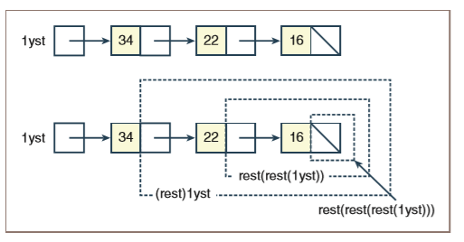

图9-10 包含34、22和16的类Lisp列表

### 类Lisp列表的递归遍历

基于类Lisp列表的递归定义以及它的基本访问器操作，我们现在可以定义一些递归函数来遍历列表了。函数`contains`将会在列表里搜索指定的元素。这个函数会接收的参数包含一个目标元素和一个列表，并且会返回`True`或`False`。如果列表为空，那么说明你已经用完了所有的元素，因此这个函数会返回`False`。不然的话，如果目标元素等于列表里的第一个元素，那么这个函数会返回`True`；否则，你可以通过继续使用contains来递归地搜索列表的其余部分直至找到给定的元素为止。下面是这个函数的代码：

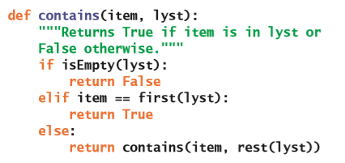

基于索引的函数`get`将会返回给定列表的第$i$个元素。假设`index`参数的范围是从0到`lyst`参数的长度减1。这个函数其实会在列表里不断前进，并且对给定的索引不断递减直到为0。当`index`是0的时候，这个函数将会返回目前列表里的第一个元素。这个函数的每次递归调用不光会减少索引，还会前进到列表的其余部分。`get`函数的定义如下：

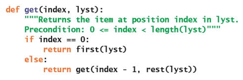

虽然`get`函数的先验条件需要知道列表的长度，但是你还不知道它的值。类Lisp列表的长度的定义可以递归地声明。如果列表为空，那么它的长度为0。否则，列表的长度是第一个元素之后的列表的长度的加1。下面是递归函数`length`的代码：

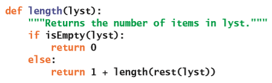

这些遍历里最重要的一点是它们都遵循列表的递归结构。更多的递归列表处理函数可以很简单地根据基本的列表访问函数`isEmpty`、`first`和`rest`来定义。

### 创建类Lisp列表

接下来，你将会学习如何创建一个类Lisp列表。类Lisp列表会包含一个叫做`cons`的基本构造函数。这个函数需要两个参数：一个数据元素和另一个列表。这个函数将会生成并返回一个新列表，其中这个新列表的第一个元素是这个函数的第一个参数；新列表里的其它元素将会被包含在这个函数的第二个参数里。函数`cons`、`first`和`rest`之间的关系可以用下面这对方程来表示：

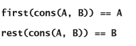

如果`cons`函数通过一个数据元素和另一个列表来构建出了一个新列表，那么我们是如何来得到这个参数里的另一个列表呢？在一开始的时候，这个列表很明显是一个空列表。类Lisp列表资源通常会包含一个代表列表的这种特殊情况的常量。在后面的例子里，符号`THE_EMPTY_LIST`会用来引用这个常量。表9-12给出了一些列表的示例以及它们的构造方式。

表9-12 通过`cons`来创建列表

| 函数程序或变量引用 | 结果列表 |
| --- | --- |
| `THE_EMPTY_LIST` | 一个空列表。 |
| `cons(22, THE_EMPTY_LIST)` | 一个包含22的列表。 |
| `cons(11, cons(22, THE_EMPTY_LIST))` | 一个包含11和22的列表。 |

可以看到，包含多个数据元素的列表是由`cons`函数的不断调用而构建的。

让我们利用这个信息来定义一个叫做`buildRange`的新递归函数，这个函数将会返回一个包含一系列连续数字的列表。这些连续数字的范围会由函数的参数来决定。比如，调用`buildRange(1，5)`将会返回一个包含1、2、3、4和5的列表，而`buildRange(10，10)`则会返回一个只包含10的列表。也就是说，当范围的两端相等的时候，`buildRange`返回只包含这个范围值的列表；否则，`buildRange`将会返回这样一个列表——它的第一个元素是范围的下限，而它的其它元素则会被包含在一个包括从下限加1到上限的列表里。下面是`buildRange`的代码，它的解释在后面：

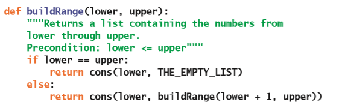

这个功能实际上会从`lower`到`upper`进行计数。在这种情况下，这个函数将会返回一个包含`upper`的列表。而返回的这个列表则会成为第二次调用`cons`函数时的第二个参数，并且第二次调用`cons`函数时的第一个参数会比返回列表里的第一个元素要小。随着递归的结束，连续的`cons`调用会以适当的顺序把其它的数字依次添加到列表的开头。图9-11展示了调用`buildRange`函数构建包含四个数字的列表。上面四行里的数字对代表着新调用`buildRange`的参数。每次调用所返回的列表在下面四行里。

> 译者注：在原文里，第二句话是“在这种情况下，这个函数将会返回一个包含`lower`的列表。”。根据上下文，应该是“返回一个包含`upper`的列表”

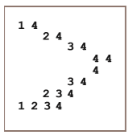

图9-11 使用`buildRange`来递归构建一个列表的步骤

刚刚讨论的这个函数里的递归模式可以在许多其它的列表处理函数里找到。比如说，要删除列表里第$i$个位置的元素的问题。如果这个位置是在开头（0），那么就返回列表的其余部分。否则，我们将会返回一个用第一个元素以及它的其余部分的列表构建出的列表，其中它的其余部分的列表将会删除当前位置减1处的元素。就像前面讨论过的`get`函数那样，`remove`也会对索引进行递减，并且在每次递归调用时访问列表的其余部分。下面是它的代码：

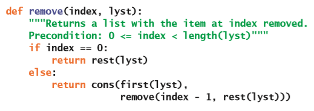

### 类Lisp列表的内部结构

就像图9-10展示的那样，类Lisp列表的内部结构类似于第4章介绍的单向链接结构。这个结构是由一系列的节点组成的，其中每个节点都包含一个叫做`data`的数据元素以及一个指向下一个节点的叫做`next`的链接。最后一个节点里的`next`链接是`None`。如果我们把符号`THE_EMPTY_LIST`定义为`None`，那么就可以直接使用第4章里的`Node`类来表示类Lisp列表里的节点。四个基本的列表函数的定义非常简单，就像下面这个代码片段这样：

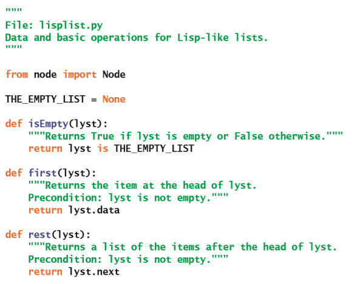

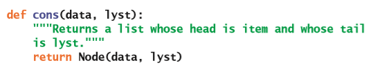

这里最重要一点是，类Lisp列表是一种抽象数据类型（ADT），其中包含了以上四个基本函数以及空列表的常量。这个ADT的用户在使用时，并不需要了解节点、链接或指针的任何知识。

### 使用`__repr__`在IDLE里输出类Lisp列表

Lisp列表在Lisp解释器里被输出时，会以文字的方式展现。这个显示方式和Python的列表类似，但是使用的是圆括号而不是方括号，并且省略了元素之间的逗号。空列表将会被打印为像是`nil`这样的特殊符号。程序员可以很方便地在IDLE的Shell程序里看到以这种格式输出的类Lisp列表，就像下面这样：

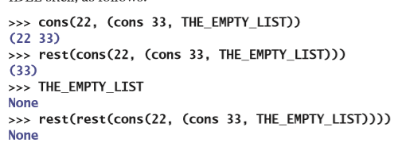

为了能够完成这样的操作，你可以在`Node`类里添加一个叫做`__repr__`的方法。当Python发现需要在IDLE的Shell窗口显示出相应的值时，它将会在值的类里寻找这个方法。如果在`Node`类里包含了这个方法，那么就可以构建并返回一个字符串，这个字符串将会包含用括号括起来的整个节点序列的数据。下面是包含了这个方法的`Node`类的代码：

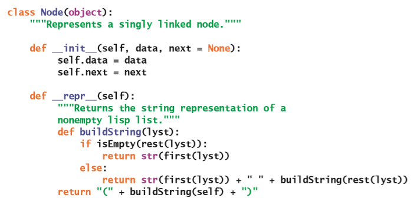

可以看到，`__repr__`方法里使用了一个叫做`buildSting`的内嵌函数来遍历链接结构。由于递归策略里包含了`isEmpty`、`first`和`rest`函数，因此你现在需要在`lisplist`模块里包含`Node`类的定义。

### 列表和函数式编程

在我们定义的类Lisp列表里，一个有趣的状况是它没有包含变异器操作。哪怕是刚开始新开发的`remove`函数也不会改变列表参数的结构，它只是返回了一个没有第$i$个元素的新列表。下面这段代码通过删除列表`A`的第一个元素，并把结果分配给列表`B`来说明这一点：

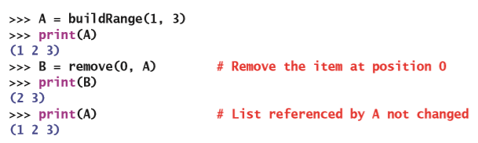

可以看到这种行为并不像Python列表的`pop`方法那样会改变调用它的列表对象。

实际上，两个列表`A`和`B`也共享着数据结构，如图9-12所示。

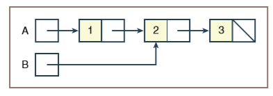

图9-12 两个列表`A`和`B`所共享的结构

如果这些列表上有变异器操作的话，那么这种对结构的共享将会产生一些不可控的现象，因为对列表`A`的结构的任何修改都会导致对列表`B`的结构的更改。但是，在不能进行变异器操作时，共享结构却是一个非常好的主意，因为它可以节省内存。

没有变异器的类Lisp列表非常适合被称为**函数式编程**（**functional programming**）的软件开发风格。用这种风格编写的程序会由一组协作函数组成，这些协作函数会把数据值转换为其它数据值。因此，当需要更改数据结构时，并不需要对它进行变异器操作，而是把它作为参数传递给函数。这个函数将构建并返回一个包含所需更改的数据结构。

这种编程风格的好处是可以很容易地验证函数是否能正常工作，这是因为它们对数据的影响都是透明的（没有隐藏的副作用）。

但是，禁止变异器操作在运行时的成本可能会更高。比如，这一章前面讨论的基于索引的`remove`方法并不需要额外的内存就可以从列表里删除元素。然而，要从类Lisp列表里删除位置$i$处的元素就需要额外的$i – 1$个节点。

在这些方面的权衡衍生出了一个老笑话：一个Lisp程序员知道程序里所有东西的值，但是不知道这些东西的代价（Lisp programmers know the value of everything and the cost of nothing，艾伦·佩利（Alan Perlis））。很明显，对于会有频繁插入和删除操作的大型数据库的应用程序而言，支持变异器操的基于对象的数据结构会是一个更好的选择。但是，对于处理相对较短的符号信息列表来说，很少有像递归的类Lisp列表这样简单明了的数据结构。

## 章节总结

* 列表是一个线性多项集，它能够让用户在任何位置插入、删除、访问和替换元素。

* 列表上的操作分为基于索引、基于内容或基于位置三种。基于索引的操作允许访问指定的整数索引处的元素；基于位置的操作允许用户可以通过移动游标来访问列表。

* 列表的实现可以基于数组或是链接结构。与列表迭代器一起使用时，双向链接结构会比单向链接结构更方便、更快捷。

* 有序列表是一个元素始终按升序或降序排列的列表。

* 列表可以具有递归定义：它可以为空，或是由一个数据元素和另一个列表组成。这样的列表的递归结构支持各种各样的递归列表的处理功能。

## 复习题

1. 列表的例子有（选择所有满足的选项）：

    a) 在结账台排队的顾客

    b) 一副扑克牌

    c) 文件目录系统

    d) 收费站排队的一排汽车

    e) 一支足球队的花名册

2. 访问列表在整数位置的元素的操作被称为：

    a) 基于内容的操作

    b) 基于索引的操作

    c) 基于位置的操作

3. 通过移动游标来访问列表元素的操作被称为：

    a) 基于内容的操作

    b) 基于索引的操作

    c) 基于位置的操作

4. 对列表的链式实现的基于索引的操作的运行时间是：

    a) 常数的

    b) 线性的

5. 在列表尾部之后插入元素的操作是：

    a) `pop`

    b) `add`

6. 关联到链表的列表迭代器上的大多数操作的运行时间是：

    a) 常数的

    b) 线性的

7. 基于数组的列表的`insert`和`remove`操作的运行时间是：

    a) 常数的

    b) 线性的

8. 列表基于位置的操作`next`是：

    a) 没有先验条件的

    b) 有一个先验条件——`hasNext`必须返回`True`

9. 最好使用下面哪一个方法来实现链表：

    a) 单向链接结构

    b) 双向链接结构

10. 对基于数组的有序列表的索引操作应该用：

    a) 二分搜索

    b) 顺序搜索

## 编程项目

1. 完成这一章里提到的列表的链式实现所对应的列表迭代器。验证在违反先验条件时是否会引发异常。

2. 完成案例研究里讨论的基于数组的有序列表的实现。你可以把有序列表的列表迭代器的完成推迟到编程项目3里完成。

3. 使用案例研究里讨论的设计策略，完成基于数组的列表和基于数组的有序列表的这两个列表迭代器。

4. 编写一个程序，将文件里的文本行插入到列表中，并能够让用户查看文件里的任何文本行。这个程序应该显示一个选项菜单，让用户输入文件名并导航到第一行、最后一行、下一行以及上一行。

5. 为编程项目4的程序添加更多的命令，从而可以让用户删除当前选择的行、把它替换为新行、或是在当前游标位置处插入一行。除此之外，用户还应该能够保存当前文件。

6. 大多数文字处理器都有一个叫做自动换行的功能，当达到合适的边距时，这个功能会自动将用户的下一个单词移动到下一行。为了了解这个功能的工作原理，请编写一个程序，这个程序能够让用户重新格式化文件里的文本。用户会输入字符宽度，并输入要执行操作的输入和输出文件的名称。接下来，程序会把文件里的单词都输入到一个列表的列表里。每个子列表都代表着需要被输出到文件的一行文本。在把单词输入到各个子列表的过程中，程序会跟踪这一行的长度，从而保证这个长度小于或等于用户的指定的行的边距。当所有的单词都输入到子列表之后，程序就会遍历这些列表，从而把它们的内容写入到输出文件里去。

7. 定义一个叫做`insert`的递归函数，这个函数接收一个索引、一个元素以及一个类Lisp列表作为参数。这个函数会返回一个在给定列表里将元素插入到指定的索引位置的新列表。下面是它的用法的一个例子：

    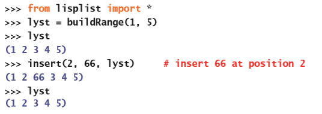

8. 定义一个用来比较两个类Lisp列表的叫做`equals`的递归布尔函数。如果两个列表都为空；或是两个列表的长度相同，并且它们的第一个元素相等，而其余的元素也相等，那么这两个列表就是相等的。

    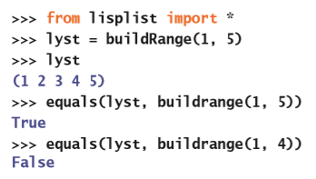

9. 定义一个叫做`removeAll`的递归函数，这个函数接收一个元素和一个类Lisp列表作为参数。这个函数会返回一个删除了这个元素的所有实例的类Lisp列表。（*提示*：如果这个元素等于列表的第一个元素，需要继续执行删除操作。）

    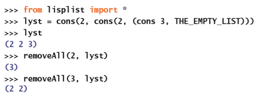

10. 为类Lisp列表定义`lispMap`和`lispFilter`递归函数。它们的行为类似于Python的`map`和`filter`函数的行为，但是它们会返回一个列表作为结果。

    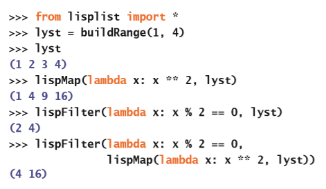
